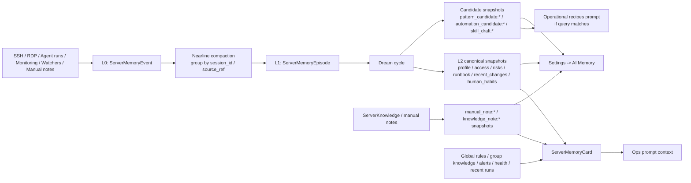
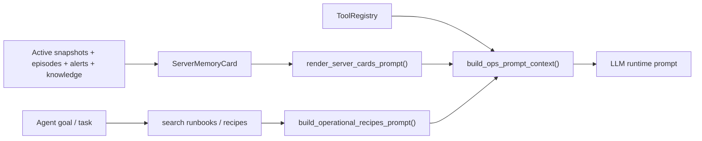

# mini_prod Unified Working Context

Репозиторий: `C:\Users\German.Keller\Desktop\db\mini\WEU-AI\mini_prod`
WSL-путь: `/mnt/c/Users/German.Keller/Desktop/db/mini/WEU-AI/mini_prod`

Этот файл - единый Markdown-источник правды для проекта. Он заменяет удаленные `README_MINI.md`, `CLAUDE.md`, `docs/FRONTEND_SPEC_LAVAB.md` и `ai-server-terminal-main/README.md`.

## Что это за проект

- Это локально-обрезанная сборка WEU AI Platform внутри папки `mini_prod`.
- По факту проект уже не "servers only": сейчас активны `core_ui`, `servers`, `studio`, плюс общие модули в `app/`.
- Основной UI - внешний React/Vite SPA в `ai-server-terminal-main/`, а Django в основном отдает API, WebSocket и редиректы в SPA.
- Старые описания про `views_mini.py` и "только servers" устарели.

## Правила работы с репозиторием

- Новую логику класть в ближайшее существующее Django-приложение; не создавать новые top-level пакеты без явной необходимости.
- Python: 3.10+, 4 пробела, двойные кавычки.

Именование:
- `snake_case` для модулей, файлов, функций.
- `PascalCase` для классов.
- `UPPER_SNAKE_CASE` для констант и env-переменных.

Инструменты качества:
- `ruff check .`
- `ruff format .`
- Тесты: `pytest`, `pytest-django`, `pytest-asyncio`.
- Тестовые файлы: `test_*.py` или `*_test.py`.
- Не коммитить секреты из `.env`.
- Для опасных серверных действий сохранять и расширять проверки в `app/tools/safety.py`.

## Быстрый запуск

Backend:

```bash
python -m venv venv
source venv/bin/activate
pip install -r requirements-mini.txt
python manage.py migrate
python manage.py createsuperuser
python manage.py runserver
```

Frontend:

```bash
cd ai-server-terminal-main
npm install
npm run dev
```

Проверки:

```bash
pytest
ruff check .
ruff format .
```

## Важная оговорка по портам

- `manage.py` автоматически подставляет порт `9000`, если запустить `python manage.py runserver` без явного порта.
- `FRONTEND_APP_URL` по умолчанию: `http://127.0.0.1:8080`.
- Vite proxy в `ai-server-terminal-main/vite.config.ts` тоже по умолчанию смотрит на `http://127.0.0.1:9000`.
- Старые упоминания `8000` в удаленных markdown-файлах были частично устаревшими.

## Актуальная карта верхнего уровня

- `manage.py` - основной вход в Django CLI; подставляет порт `9000`.
- `web_ui/` - Django settings, root URLs, ASGI/WSGI, сборка WebSocket routing.
- `core_ui/` - auth/session API, redirects в SPA, settings/access/admin endpoints, middleware.
- `servers/` - серверы, группы, SSH/RDP терминал, мониторинг, layered AI memory, знания по серверам, server agents.
- `studio/` - pipelines, runs, MCP, triggers, notifications, live updates по pipeline runs.
- `app/` - общие LLM, `agent_kernel` runtime/memory/permissions, safety, SSH/server tools.
- `ai-server-terminal-main/` - React/Vite SPA.
- `passwords/` - остался как кодовый модуль, но не подключен в `INSTALLED_APPS`.
- `docker/` - Dockerfile и сопутствующие runtime-артефакты.
- `agent_projects/` - runtime-папка для агентных проектов.
- `media/` - загрузки и медиа.
- `docs/` - после чистки пустая папка; отдельного Markdown там больше нет.
- `venv/` - локальное окружение, не использовать как источник контекста.

Шум и генерируемые артефакты, которые обычно не стоит трогать:

- `venv/`
- `ai-server-terminal-main/node_modules/`
- `db.sqlite3`, `db.sqlite3-shm`, `db.sqlite3-wal`
- `media/`
- `agent_projects/`

## Backend: реальная архитектура

### `web_ui/`

`web_ui/settings.py`:

- активные Django apps: `daphne`, `channels`, `core_ui`, `servers`, `studio`.
- база выбирается автоматически: PostgreSQL при наличии `POSTGRES_HOST` или `POSTGRES_DB`, иначе SQLite.
- channels layer: Redis при наличии `CHANNEL_REDIS_URL`, иначе `InMemoryChannelLayer`.
- `FRONTEND_APP_URL` по умолчанию `http://127.0.0.1:8080`.
- включает Domain SSO и email/notification config.

`web_ui/urls.py`:

- `/admin/`
- `'' -> core_ui.urls`
- `'api/desktop/v1/' -> core_ui.desktop_api.urls`
- `'servers/' -> servers.urls`
- `'api/studio/' -> studio.urls`
- `web_ui/asgi.py` поднимает HTTP + WebSocket через `ProtocolTypeRouter`.
- `web_ui/routing.py` агрегирует WS-маршруты `servers` и `studio`.

### `core_ui/`

Назначение:

- логин/логаут и auth session API;
- редиректы из Django URL в React SPA;
- settings, access, admin dashboard API;
- middleware и доменная авторизация.

Ключевые файлы:

- `core_ui/urls.py` - основные frontend redirects и API auth/settings/access.
- `core_ui/views.py` - фактическая реализация всех этих endpoints.
- `core_ui/middleware.py` - `CsrfTrustNgrokMiddleware`, `AdminRussianMiddleware`, `MobileDetectionMiddleware`.
- `core_ui/domain_auth.py` - `DomainAutoLoginMiddleware`.
- `core_ui/templates/` - остались базовые Django templates и admin override.

Важно:

- В `core_ui/views.py` все еще много legacy/full-platform кода и API, часть которого не подключена в `core_ui/urls.py`.
- Документы, ссылавшиеся на `core_ui/views_mini.py`, были устаревшими; файла сейчас нет.

### `servers/`

Назначение:

- CRUD серверов и групп;
- SSH/RDP terminal;
- group subscriptions и shares;
- server knowledge/context;
- мониторинг и alerts;
- server agents и live runs.

Ключевые файлы:

- `servers/models.py`
- `ServerGroup`
- `ServerGroupTag`
- `ServerGroupMember`
- `ServerGroupSubscription`
- `ServerGroupPermission`
- `Server`
- `ServerShare`
- `ServerConnection`
- `ServerCommandHistory`
- `GlobalServerRules`
- `ServerKnowledge`
- `ServerMemoryPolicy`
- `BackgroundWorkerState`
- `ServerHealthCheck`
- `ServerAlert`
- `ServerGroupKnowledge`
- `ServerAgent`
- `AgentRun`
- `ServerMemoryEvent`
- `ServerMemoryEpisode`
- `ServerMemorySnapshot`
- `ServerMemoryRevalidation`
- `servers/views.py` - HTTP API и редиректы/страницы.
- `servers/consumers.py` - `SSHTerminalConsumer`.
- `servers/rdp_consumer.py` - `RDPTerminalConsumer`.
- `servers/agent_consumer.py` - `AgentLiveConsumer`.
- `servers/signals.py` - ingestion memory-событий из command history, health checks, alerts, agent events, watcher drafts.
- `servers/memory_heuristics.py` - фильтрация шумных команд перед записью в память.
- `servers/worker_state.py` - lease/heartbeat состояние фоновых workers.
- `servers/routing.py` - WebSocket routes.
- `servers/templates/servers/` - legacy/SSR templates для terminal/list/RDP.

### `studio/`

Назначение:

- pipeline editor/runtime;
- agent configs;
- MCP pool и tool discovery;
- cron/webhook triggers;
- notification settings;
- live updates по pipeline run.

Ключевые файлы:

- `studio/models.py`
- `MCPServerPool`
- `AgentConfig`
- `Pipeline`
- `PipelineTrigger`
- `PipelineRun`
- `PipelineTemplate`
- `studio/views.py` - REST API для pipelines, runs, MCP, triggers, templates, notifications.
- `studio/pipeline_executor.py` - `PipelineExecutor`.
- `studio/mcp_client.py` - stdio/http MCP клиенты.
- `studio/routing.py` - WebSocket live updates по pipeline runs.
- `studio/management/commands/`
- `load_pipeline_templates.py`
- `run_scheduled_pipelines.py`
- `setup_keycloak_ops_pipelines.py`
- `setup_keycloak_provisioning_pipeline.py`
- `setup_mcp_showcase_pipeline.py`
- `setup_server_update_pipeline.py`

### `app/`

Общие сервисы, которые используют backend-модули:

- `app/agent_kernel/domain/specs.py` - типы `MemoryRecord`, `ServerMemoryCard`, runtime state.
- `app/agent_kernel/runtime/context.py` - сборка ops prompt context с memory/recipes/tools.
- `app/agent_kernel/memory/store.py` - главный memory store: ingestion, compaction, dreams, repair, overview, promote/archive.
- `app/agent_kernel/memory/server_cards.py` - сборка prompt-ready карточек памяти сервера.
- `app/agent_kernel/memory/compaction.py` - выжимка run results и canonical note candidates.
- `app/agent_kernel/memory/redaction.py` - redaction секретов и prompt-injection-подобных строк.
- `app/agent_kernel/memory/repair.py` - freshness/confidence decay и conflict/revalidation heuristics.
- `app/core/llm.py` - провайдеры LLM и логирование использования.
- `app/tools/safety.py` - `is_dangerous_command`.
- `app/tools/ssh_tools.py` - SSH connection/execute/disconnect tools.
- `app/tools/server_tools.py` - list/execute tools поверх серверов.

### `passwords/`

- Папка есть в проекте.
- В `INSTALLED_APPS` не подключена.
- В старых текстах упоминалось, что она оставлена как кодовая зависимость; это соответствует текущей структуре.

## AI memory: реальная логика

Важно: в проекте сейчас есть **две разные memory-системы**, и их нельзя смешивать.

### 1. Что именно считается "памятью"

1. `Terminal AI session memory`:
- живет внутри `SSHTerminalConsumer` в `servers/consumers.py`;
- это краткоживущая история текущего AI-чата в терминале: `_ai_history`;
- TTL считается не по времени, а по числу запросов: `memory_ttl_requests`, затем история режется по `max_entries = ttl * 6`;
- очищается действием `ai_clear_memory`;
- не является общей памятью проекта и не хранится в отдельных Django-моделях.

2. `Layered server memory`:
- это основная долговременная память по серверу;
- хранится в БД через модели `ServerMemoryEvent`, `ServerMemoryEpisode`, `ServerMemorySnapshot`, `ServerMemoryRevalidation`;
- используется в prompt для `servers/agent_engine.py`, `servers/multi_agent_engine.py` и в Settings -> `AI Memory`;
- умеет строить canonical memory, pattern candidates, automation candidates и skill drafts.

Связь между ними есть:
- terminal AI после выполнения команд может извлечь durable факты/риски;
- затем `servers/consumers.py::_save_ai_server_profile()` сохраняет их в `ServerKnowledge`;
- дальше `DjangoServerMemoryStore._sync_manual_knowledge_snapshot_sync()` мостит эти записи в layered memory через `manual_note:*` / `knowledge_note:*` snapshots.

### 2. Слои хранения

1. `L0 -> ServerMemoryEvent`
- сырые, но уже отредактированные события памяти;
- поля: `source_kind`, `actor_kind`, `event_type`, `raw_text_redacted`, `structured_payload`, `importance_hint`;
- это входной inbox для всей памяти.

2. `L1 -> ServerMemoryEpisode`
- nearline-компакция группы событий;
- собирается из нескольких `ServerMemoryEvent`;
- типизируется как `terminal_session`, `agent_investigation`, `deploy_operation`, `incident`, `rdp_session`, `pipeline_operation` и т.д.

3. `L2 -> ServerMemorySnapshot`
- уже сжатая "рабочая память", которую можно отдавать в prompt и UI;
- бывают `canonical` и `archive`;
- canonical keys сейчас: `profile`, `access`, `risks`, `runbook`, `recent_changes`, `human_habits`.

4. `Revalidation -> ServerMemoryRevalidation`
- очередь элементов, которые пора перепроверить;
- создается при старении памяти и при конфликтах фактов.

5. `Policy -> ServerMemoryPolicy`
- включает/выключает pipeline памяти;
- определяет dream mode, thresholds, retention, sleep window;
- **это policy уровня пользователя**, а не конкретного сервера, хотя API висит под `/servers/api/<server_id>/memory/...`.

6. `Worker state -> BackgroundWorkerState`
- heartbeat/lease состояние `memory_dreams`, `agent_execution`, `watchers`;
- нужно и для backend orchestration, и для Settings UI.

### 3. Откуда поступают данные в память

Прямые ingress-точки в `ServerMemoryEvent`:

1. SSH terminal open/close:
- `servers/consumers.py::_register_server_connection()`
- `servers/consumers.py::_mark_server_connection_closed()`
- source = `terminal`.

2. История выполненных команд:
- `servers/signals.py::ingest_command_history()`;
- триггерится по `post_save(ServerCommandHistory)`;
- перед записью фильтруется через `servers/memory_heuristics.py::should_capture_command_history_memory()`;
- trivial команды вроде `clear`, `pwd`, `cd`, `ls`, `echo` отбрасываются.

3. RDP:
- `servers/rdp_consumer.py::_ingest_memory_event()`;
- source = `rdp`.

4. Agent live events:
- `servers/signals.py::ingest_agent_run_event()`;
- source = `agent_event`.

5. Финальный результат agent run:
- `servers/agent_engine.py::_persist_ops_summary()`
- `servers/multi_agent_engine.py::_persist_ops_summary()`
- дальше вызывается `DjangoServerMemoryStore.append_run_summary()`;
- source = `agent_run`.

6. Monitoring:
- `servers/signals.py::ingest_health_check()`
- `servers/signals.py::ingest_alert()`
- sources = `monitoring`.

7. Watchers:
- `servers/signals.py::ingest_watcher_draft()`;
- source = `watcher`.

8. Manual/server knowledge:
- `servers/knowledge_service.py::save_ai_knowledge()`;
- create/update `ServerKnowledge`, затем sync в snapshots;
- source = `manual_knowledge`.

9. Terminal AI durable extraction:
- `servers/consumers.py::_ai_extract_server_memory()` делает LLM-выжимку из выполненных команд;
- `servers/consumers.py::_save_ai_server_profile()` сохраняет `Профиль сервера (авто)` и `Текущие риски (авто)` в `ServerKnowledge`;
- после этого knowledge bridge поднимает эти записи в layered memory.

Дополнительные контекстные источники, которые входят в prompt, но не являются `ServerMemoryEvent`:

1. `GlobalServerRules`
2. `ServerGroupKnowledge`
3. `server.notes`
4. `server.corporate_context`
5. active `ServerAlert`
6. latest `ServerHealthCheck`
7. recent `AgentRun`

### 4. Главный pipeline: от сигнала до prompt



Как это работает по шагам:

1. Любой значимый сигнал попадает в `_ingest_event_sync()`.
2. Перед сохранением выполняется `redact_for_storage()`:
- вырезаются secrets, connection strings, bearer tokens, private keys;
- отдельно нейтрализуются instructional/prompt-injection-подобные строки.
3. Событие пишется в `ServerMemoryEvent`.
4. Затем `_maybe_compact_event_group_sync()` решает, пора ли схлопывать группу событий в episode.
5. Группа определяется так:
- сначала `session_id`;
- если его нет, то `source_ref`;
- если и его нет, окно последних 6 часов.
6. Компакция создает или обновляет `ServerMemoryEpisode`.
7. Dream cycle берет active episodes + existing snapshots + health/alerts + revalidation + manual notes и пересобирает canonical memory.
8. Из `ServerMemorySnapshot` потом собирается `ServerMemoryCard`, который уходит в prompt.

### 5. Nearline compaction и episodes

`_compact_group_sync()`:

1. читает до 120 событий в группе;
2. определяет `episode_kind`;
3. строит summary из:
- важных строк `raw_text_redacted`,
- payload preview,
- session open/close markers;
4. создает или обновляет `ServerMemoryEpisode`.

Компакция запускается когда:
- число событий в группе достигло `nearline_event_threshold`;
- либо пришел `session_closed`, `rdp_session_closed`, `run_completed`, `run_failed`, `run_stopped`;
- либо вызван `force_compact=True`.

### 6. Dreams: как строится долговременная память

`_run_dream_cycle_sync()` всегда делает три шага:

1. `_compact_open_groups_sync()`
2. `_dream_server_memory_sync()`
3. `_repair_server_memory_sync()`

`_dream_server_memory_sync()`:

1. берет active episodes, active canonical snapshots, latest health, active alerts, open revalidation;
2. извлекает operational patterns из `ServerMemoryEvent(event_type="command_executed")` за 30 дней;
3. пересобирает canonical snapshot candidates:
- `profile`
- `access`
- `risks`
- `runbook`
- `recent_changes`
- `human_habits`
4. если `dream_mode` допускает LLM и `job_kind` = `nightly|hybrid`, запускает:
- `_distill_with_llm_sync()` для canonical sections;
- `_llm_enhance_patterns_sync()` для playbook/pattern metadata.
5. делает upsert snapshots через `_upsert_snapshot_sync()`.

### 7. Canonical snapshots: версия и rewrite-логика

`_upsert_snapshot_sync()`:

1. находит active snapshot по `memory_key`;
2. считает `delta` по строкам старого и нового контента;
3. если изменение небольшое:
- обновляет запись in-place;
4. если изменение существенное:
- создает новую version;
- старую переводит в `archive`;
- пишет `rewrite_reason`, `prior_snapshot_id`, `prior_version`.

Новая версия создается когда:
- `force_version=True`;
- либо `delta >= 0.2`;
- либо сдвиг confidence >= `0.15`.

Отдельный нюанс:
- sync manual notes (`_sync_manual_knowledge_snapshot_sync`) всегда идет с `force_version=True`, поэтому каждое заметное редактирование `ServerKnowledge` дает новую версию snapshot.

### 8. Pattern / automation / skill draft слой

Из history команд система строит `_OperationalPattern`:

1. command patterns:
- повторяющиеся отдельные команды;
2. sequence patterns:
- повторяющиеся окна из 2-3 команд в рамках одной session/source group.

Дальше `_promote_pattern_candidates_sync()` создает:

1. `pattern_candidate:*`
- просто зафиксированный operational pattern.

2. `automation_candidate:*`
- pattern, который уже похож на полу-автоматизируемый workflow.

3. `skill_draft:*`
- pattern с высоким качеством, который можно превратить в Studio skill.

Важно:
- candidate snapshots **не входят** в `ServerMemoryCard`, то есть напрямую не попадают в секцию `## Server memory`;
- но они **могут попасть** в отдельную секцию `Operational recipes`, если query к runbook search совпадет с их title/content/metadata.

### 9. Repair / revalidation

`_repair_server_memory_sync()` делает maintenance:

1. считает freshness через `compute_freshness_score()`;
2. снижает confidence через `decay_confidence()`;
3. уменьшает `stability_score`;
4. если snapshot устарел, создает `ServerMemoryRevalidation`;
5. архивирует старые raw events и episodes по retention policy.

Revalidation также создается при конфликте фактов:
- `_upsert_server_fact_sync()` вызывает `_detect_conflicts_sync()`;
- если новый факт противоречит active memory, создается запись в `ServerMemoryRevalidation`.

### 10. Prompt path: как память попадает в агента

Сборка prompt идет в `servers/agent_engine.py` и `servers/multi_agent_engine.py`.

Шаги:

1. для первых максимум 3 серверов вызывается `memory_store.get_server_card()`;
2. `render_server_cards_prompt()` собирает компактный memory block;
3. отдельно `build_operational_recipes_prompt()` ищет релевантные recipes по goal + focus areas;
4. `build_ops_prompt_context()` склеивает:
- role instructions;
- verification rules;
- operational recipes;
- tool registry slice;
- server memory.



Важные нюансы prompt-сборки:

1. `ServerMemoryCard` исключает:
- `pattern_candidate:*`
- `automation_candidate:*`
- `skill_draft:*`

2. manual operational notes не теряются:
- если их контент похож на playbook/skill note, они сворачиваются в `Operational playbooks`.

3. все memory/recipe/tool slices дополнительно проходят `sanitize_prompt_context_text()`.

### 11. Agent run -> memory pipeline

Финал single/multi agent run идет одинаково:

1. `build_run_summary_payload()` строит compact digest из:
- `final_report`
- `iterations_log`
- `tool_calls`
- `verification_summary`
2. `append_run_summary()`:
- пишет итоговое `agent_run` событие;
- пишет отдельные `fact_discovered`, `server_change`, `incident`;
- запускает nearline dream cycle.

Важно:
- `build_run_summary_payload()` также готовит `canonical_notes` как промежуточный artifact;
- текущий `append_run_summary()` не пишет эти notes напрямую в snapshots;
- вместо этого canonical память потом пересобирается на dream phase из events/episodes/manual notes.

### 12. Manual notes и promotions

Manual bridge:

1. `ServerKnowledge` -> `_sync_manual_knowledge_snapshot_sync()`
2. активная заметка становится `manual_note:*` или `knowledge_note:*`
3. деактивация knowledge archive-ит соответствующий snapshot.

Promotions:

1. `promote-note`
- candidate snapshot -> `ServerKnowledge`;
- snapshot архивируется;
- UI получает refreshed overview.

2. `promote-skill`
- `skill_draft:*` -> scaffold Studio skill + validation;
- параллельно создается/обновляется `ServerKnowledge` с operational note;
- исходный skill draft snapshot архивируется.

### 13. Policy, scheduler и workers

Поля `ServerMemoryPolicy`:

1. `dream_mode`
- `heuristic`
- `nightly_llm`
- `hybrid`

2. `nearline_event_threshold`
- сколько L0 событий набрать до compaction.

3. `sleep_start_hour` / `sleep_end_hour`
- sleep window для scheduled dreams.

4. `raw_event_retention_days`
5. `episode_retention_days`
6. `human_habits_capture_enabled`
7. `rdp_semantic_capture_enabled`
8. `is_enabled`

Нюансы scheduler:

1. `run_memory_dreams` с `respect_schedule=True`:
- `nearline` не ждет sleep window;
- `nightly|hybrid` пропускаются, если сервер недавно был активен;
- `weekly` зависит от sleep window, но не от recent activity.

2. `server_memory_run_dreams` API вызывает cycle с `force=True`:
- ручной запуск обходит schedule guard.

3. worker heartbeat лежит в `BackgroundWorkerState` и отображается в Settings.

### 14. HTTP/API и UI

Backend endpoints:

1. `GET /servers/api/<server_id>/memory/overview/`
2. `POST /servers/api/<server_id>/memory/run-dreams/`
3. `POST /servers/api/<server_id>/memory/policy/`
4. `POST /servers/api/<server_id>/memory/snapshots/<snapshot_id>/archive/`
5. `POST /servers/api/<server_id>/memory/snapshots/<snapshot_id>/promote-note/`
6. `POST /servers/api/<server_id>/memory/snapshots/<snapshot_id>/promote-skill/`

Frontend:

1. `ai-server-terminal-main/src/pages/SettingsPage.tsx`
- вкладка `AI Memory`;
- overview, workers, canonical snapshots, candidates, archive, policy.

2. `ai-server-terminal-main/src/lib/api.ts`
- типы `ServerMemoryOverviewResponse`;
- клиентские вызовы overview/run-dreams/policy/promote/archive.

3. `ai-server-terminal-main/src/pages/TerminalPage.tsx`
- настройки ephemeral terminal AI memory;
- не то же самое, что layered server memory.

### 15. Текущее поведение и ограничения

1. Memory policy user-level:
- API визуально выглядит server-level;
- по факту `ServerMemoryPolicy` одна на `User`.

2. `is_enabled = false`:
- останавливает новую ingestion/dream pipeline;
- старые active snapshots не удаляются автоматически и все еще могут попасть в prompt/UI.

3. `rdp_semantic_capture_enabled`:
- поле и UI уже есть;
- в текущем коде оно пока не используется как hard gate для `servers/rdp_consumer.py`;
- это значит, что флаг уже хранится, но логика применения еще не доведена до конца.

4. `allow_sensitive_raw`:
- поле есть в модели;
- влияет на размер сохраняемого `raw_text_redacted` (`4000` vs `8000` chars);
- текущий staff API/UI его не редактирует.

5. Candidate snapshots:
- не идут в main memory block напрямую;
- но могут попасть в `Operational recipes`.

6. Settings memory APIs:
- сейчас staff-only.

### 16. Где смотреть код при любых изменениях памяти

- `servers/models.py`
- `servers/signals.py`
- `servers/memory_heuristics.py`
- `servers/consumers.py`
- `servers/rdp_consumer.py`
- `servers/views.py`
- `servers/agent_engine.py`
- `servers/multi_agent_engine.py`
- `servers/management/commands/run_memory_dreams.py`
- `servers/management/commands/repair_server_memory.py`
- `servers/worker_state.py`
- `servers/knowledge_service.py`
- `app/agent_kernel/memory/store.py`
- `app/agent_kernel/memory/server_cards.py`
- `app/agent_kernel/memory/compaction.py`
- `app/agent_kernel/memory/redaction.py`
- `app/agent_kernel/memory/repair.py`
- `app/agent_kernel/runtime/context.py`
- `ai-server-terminal-main/src/pages/SettingsPage.tsx`
- `ai-server-terminal-main/src/lib/api.ts`
- `ai-server-terminal-main/src/pages/TerminalPage.tsx`
- `ai-server-terminal-main/src/components/terminal/AiPanel.tsx`
- `ai-server-terminal-main/src/components/terminal/XTerminal.tsx`

## Frontend: `ai-server-terminal-main/`

Стек:

- React 18
- TypeScript
- Vite
- React Router
- TanStack Query
- xterm.js
- Radix UI
- Tailwind
- Vitest

Ключевые пути:

- `ai-server-terminal-main/src/App.tsx` - основной роутер SPA.
- `ai-server-terminal-main/src/lib/api.ts` - frontend API и WebSocket helper-слой.
- `ai-server-terminal-main/src/pages/` - страницы.
- `ai-server-terminal-main/src/pages/SettingsPage.tsx` - staff UI для `AI Memory`, workers и memory policy.
- `ai-server-terminal-main/src/pages/TerminalPage.tsx` - terminal AI panel и ephemeral memory settings.
- `ai-server-terminal-main/src/components/terminal/` - терминальные компоненты.
- `ai-server-terminal-main/src/components/terminal/AiPanel.tsx` - UI настроек session memory / TTL / clear memory.
- `ai-server-terminal-main/src/components/terminal/XTerminal.tsx` - отправка `memory_enabled`, `memory_ttl_requests`, `ai_clear_memory`.
- `ai-server-terminal-main/src/components/pipeline/` - pipeline UI.
- `ai-server-terminal-main/vite.config.ts` - proxy на Django и WS.

Актуальные frontend routes:

- `/login`
- `/`
- `/dashboard`
- `/servers`
- `/servers/hub`
- `/servers/:id/terminal`
- `/servers/:id/rdp`
- `/agents`
- `/agents/run/:runId`
- `/studio`
- `/studio/pipeline/:id`
- `/studio/pipeline/new`
- `/studio/runs`
- `/studio/agents`
- `/studio/skills`
- `/studio/mcp`
- `/studio/notifications`
- `/settings`
- `/settings/users`
- `/settings/groups`
- `/settings/permissions`

## HTTP маршруты backend

### Root / `core_ui.urls`

- `/login/` - редирект на frontend login flow.
- `/logout/`
- `/`
- `/dashboard/`
- `/settings/`
- `/settings/access/`
- `/settings/users/`
- `/settings/groups/`
- `/settings/permissions/`
- `/api/health/`
- `/api/admin/dashboard/`
- `/api/admin/users/activity/`
- `/api/admin/users/sessions/`
- `/api/auth/session/`
- `/api/auth/ws-token/`
- `/api/auth/login/`
- `/api/auth/logout/`
- `/api/settings/`
- `/api/settings/check/`
- `/api/models/`
- `/api/models/refresh/`
- `/api/settings/activity/`
- `/api/access/users/`
- `/api/access/users/<user_id>/`
- `/api/access/users/<user_id>/password/`
- `/api/access/users/<user_id>/profile/`
- `/api/access/groups/`
- `/api/access/groups/<group_id>/`
- `/api/access/groups/<group_id>/members/`
- `/api/access/permissions/`
- `/api/access/permissions/<perm_id>/`

### `servers.urls`

UI/pages:

- `/servers/`
- `/servers/api/frontend/bootstrap/`
- `/servers/hub/`
- `/servers/<server_id>/terminal/`
- `/servers/<server_id>/terminal/minimal/`

Server CRUD / shares / knowledge / context:

- `/servers/api/create/`
- `/servers/api/<server_id>/update/`
- `/servers/api/<server_id>/test/`
- `/servers/api/<server_id>/execute/`
- `/servers/api/<server_id>/delete/`
- `/servers/api/<server_id>/get/`
- `/servers/api/<server_id>/reveal-password/`
- `/servers/api/<server_id>/shares/`
- `/servers/api/<server_id>/share/`
- `/servers/api/<server_id>/shares/<share_id>/revoke/`
- `/servers/api/<server_id>/knowledge/`
- `/servers/api/<server_id>/knowledge/create/`
- `/servers/api/<server_id>/knowledge/<knowledge_id>/update/`
- `/servers/api/<server_id>/knowledge/<knowledge_id>/delete/`
- `/servers/api/global-context/`
- `/servers/api/global-context/save/`
- `/servers/api/groups/<group_id>/context/`
- `/servers/api/groups/<group_id>/context/save/`

AI memory:

- `/servers/api/<server_id>/memory/overview/`
- `/servers/api/<server_id>/memory/run-dreams/`
- `/servers/api/<server_id>/memory/policy/`
- `/servers/api/<server_id>/memory/snapshots/<snapshot_id>/archive/`
- `/servers/api/<server_id>/memory/snapshots/<snapshot_id>/promote-note/`
- `/servers/api/<server_id>/memory/snapshots/<snapshot_id>/promote-skill/`

Groups:

- `/servers/api/groups/create/`
- `/servers/api/groups/<group_id>/update/`
- `/servers/api/groups/<group_id>/delete/`
- `/servers/api/groups/<group_id>/add-member/`
- `/servers/api/groups/<group_id>/remove-member/`
- `/servers/api/groups/<group_id>/subscribe/`
- `/servers/api/bulk-update/`

Master password:

- `/servers/api/master-password/set/`
- `/servers/api/master-password/check/`
- `/servers/api/master-password/clear/`

Monitoring:

- `/servers/api/monitoring/dashboard/`
- `/servers/api/<server_id>/health/`
- `/servers/api/<server_id>/health/check/`
- `/servers/api/alerts/`
- `/servers/api/alerts/<alert_id>/resolve/`
- `/servers/api/monitoring/config/`
- `/servers/api/<server_id>/ai-analyze/`

Server agents:

- `/servers/api/agents/`
- `/servers/api/agents/templates/`
- `/servers/api/agents/create/`
- `/servers/api/agents/<agent_id>/update/`
- `/servers/api/agents/<agent_id>/delete/`
- `/servers/api/agents/<agent_id>/run/`
- `/servers/api/agents/<agent_id>/stop/`
- `/servers/api/agents/<agent_id>/runs/`
- `/servers/api/agents/runs/<run_id>/`
- `/servers/api/agents/runs/<run_id>/log/`
- `/servers/api/agents/runs/<run_id>/reply/`
- `/servers/api/agents/dashboard/`
- `/servers/api/agents/runs/<run_id>/approve-plan/`
- `/servers/api/agents/runs/<run_id>/tasks/<task_id>/update/`
- `/servers/api/agents/runs/<run_id>/tasks/<task_id>/ai-refine/`

### `studio.urls` под префиксом `/api/studio/`

- `/api/studio/pipelines/`
- `/api/studio/pipelines/assistant/`
- `/api/studio/pipelines/<pipeline_id>/`
- `/api/studio/pipelines/<pipeline_id>/run/`
- `/api/studio/pipelines/<pipeline_id>/clone/`
- `/api/studio/pipelines/<pipeline_id>/runs/`
- `/api/studio/runs/`
- `/api/studio/runs/<run_id>/`
- `/api/studio/runs/<run_id>/stop/`
- `/api/studio/runs/<run_id>/approve/<node_id>/`
- `/api/studio/agents/`
- `/api/studio/agents/<agent_id>/`
- `/api/studio/skills/`
- `/api/studio/skills/templates/`
- `/api/studio/skills/scaffold/`
- `/api/studio/skills/validate/`
- `/api/studio/skills/<slug>/workspace/`
- `/api/studio/skills/<slug>/workspace/file/`
- `/api/studio/skills/<slug>/`
- `/api/studio/mcp/`
- `/api/studio/mcp/templates/`
- `/api/studio/mcp/<mcp_id>/`
- `/api/studio/mcp/<mcp_id>/test/`
- `/api/studio/mcp/<mcp_id>/tools/`
- `/api/studio/triggers/`
- `/api/studio/triggers/<trigger_id>/`
- `/api/studio/triggers/<token>/receive/`
- `/api/studio/templates/`
- `/api/studio/templates/<slug>/use/`
- `/api/studio/servers/`
- `/api/studio/notifications/`
- `/api/studio/notifications/test-telegram/`
- `/api/studio/notifications/test-email/`

## WebSocket маршруты

- `/ws/servers/<server_id>/terminal/` -> `servers.consumers.SSHTerminalConsumer`
- `/ws/servers/<server_id>/rdp/` -> `servers.rdp_consumer.RDPTerminalConsumer`
- `/ws/agents/<run_id>/live/` -> `servers.agent_consumer.AgentLiveConsumer`
- `/ws/studio/pipeline-runs/<run_id>/live/` -> `studio.consumers.PipelineRunConsumer`

## Переменные окружения и конфиг

Минимально важные:

- `POSTGRES_HOST`
- `POSTGRES_PORT`
- `POSTGRES_DB`
- `POSTGRES_USER`
- `POSTGRES_PASSWORD`
- `GEMINI_API_KEY`
- `OLLAMA_BASE_URL`
- `OLLAMA_API_KEY`
- `OLLAMA_CLOUD_BASE_URL`
- `CHANNEL_REDIS_URL`
- `FRONTEND_APP_URL`
- `ALLOWED_HOSTS`
- `CSRF_TRUSTED_ORIGINS`
- `SITE_URL`
- `EMAIL_HOST`
- `EMAIL_PORT`
- `EMAIL_USE_TLS`
- `EMAIL_HOST_USER`
- `EMAIL_HOST_PASSWORD`
- `DEFAULT_FROM_EMAIL`
- `PIPELINE_NOTIFY_EMAIL`
- `TELEGRAM_BOT_TOKEN`
- `TELEGRAM_CHAT_ID`
- `DOMAIN_AUTH_ENABLED`
- `DOMAIN_AUTH_HEADER`
- `DOMAIN_AUTH_AUTO_CREATE`
- `DOMAIN_AUTH_LOWERCASE_USERNAMES`
- `DOMAIN_AUTH_DEFAULT_PROFILE`
- `DJANGO_PORT`
- `CLI_RUNTIME_TIMEOUT_SECONDS`
- `CLI_FIRST_OUTPUT_TIMEOUT_SECONDS`
- `ANALYZE_TASK_BEFORE_RUN`
- `CURSOR_CLI_HTTP_1`
- `CURSOR_CLI_EXTRA_ENV`
- `KEYCLOAK_*`

Файлы конфигурации:

- `.env` - локальные реальные значения, не переносить секреты в git.
- `.env.example` - безопасный шаблон.
- `requirements-mini.txt` - минимальные runtime dependencies.
- `requirements.txt`, `requirements-full.txt` - более широкие наборы зависимостей.
- `pyproject.toml` - Ruff, pytest, coverage.

## Docker и служебные утилиты

`docker-compose.yml`:

- PostgreSQL
- `mcp-demo` на `8765`
- `mcp-keycloak` на `8766`
- `docker-compose.postgres-mcp.yml` - альтернативный локальный стек Studio: PostgreSQL + MCP сервисы.
- `docker/keycloak-mcp.Dockerfile` - сборка Keycloak MCP-контейнера.
- `key_mcp.py` - standalone MCP server для Keycloak.
- `keycloak_profiles.json` - профили окружений Keycloak.
- `create_mega_pipeline.py` - одноразовый Python-скрипт создания большого DevOps autopilot pipeline.
- `create_pipeline.sql` - SQL-вставка похожего pipeline напрямую в БД.

Management commands:

- `servers/management/commands/run_monitor.py`
- `servers/management/commands/run_memory_dreams.py`
- `servers/management/commands/repair_server_memory.py`
- `servers/management/commands/run_ops_supervisor.py`
- `servers/management/commands/run_agent_execution_plane.py`
- `servers/management/commands/run_watchers.py`
- `servers/management/commands/seed_servers_for_frontend.py`
- `studio/management/commands/load_pipeline_templates.py`
- `studio/management/commands/run_scheduled_pipelines.py`
- `studio/management/commands/setup_keycloak_ops_pipelines.py`
- `studio/management/commands/setup_keycloak_provisioning_pipeline.py`
- `studio/management/commands/setup_mcp_showcase_pipeline.py`
- `studio/management/commands/setup_server_update_pipeline.py`

## Тесты и качество

- `pytest` использует `DJANGO_SETTINGS_MODULE = web_ui.settings`.
- В `pyproject.toml` до сих пор есть ссылки на `agent_hub` и `tasks` в `testpaths` и coverage source.
- Эти директории в текущем `mini_prod` отсутствуют, поэтому часть конфигурации историческая.
- В `pyproject.toml` `known-first-party` Ruff тоже содержит исторические пакеты.

## Состояние UI и ожидания по фронтенду

Из старого frontend spec оставлено только то, что реально полезно для работы:

- продукт строится вокруг серверов, SSH/RDP терминала, AI-панели, мониторинга, pipelines и studio/MCP tooling;
- backend API и WebSocket URLs менять осторожно, frontend на них уже завязан;
- терминальная часть использует `xterm.js`;
- нужен рабочий mobile layout, sidebar, notifications, auth flow и SPA routing;
- RDP, SSH terminal, settings, agents и studio - активные пользовательские сценарии.

## Что помнить перед изменениями

- Главный источник правды по поведению - текущий код, а не старые README.
- Если есть конфликт между этим файлом и кодом, верить коду и обновлять этот файл.
При работе почти всегда проверять:
- `web_ui/settings.py`
- `web_ui/urls.py`
- `core_ui/urls.py`
- `servers/urls.py`
- `servers/models.py`
- `servers/signals.py`
- `servers/consumers.py`
- `servers/views.py`
- `servers/knowledge_service.py`
- `app/agent_kernel/memory/store.py`
- `app/agent_kernel/runtime/context.py`
- `studio/urls.py`
- `ai-server-terminal-main/src/App.tsx`
- `ai-server-terminal-main/src/lib/api.ts`

## Итог после чистки Markdown

После консолидации в папке `mini_prod` должен оставаться один рабочий Markdown-файл: этот `AGENTS.md`.


## Последние архитектурные улучшения (Agent Kernel Memory)

Были внедрены механизмы автономной работы с памятью и разрешения конфликтов (по мотивам Claude Code KAIROS):

1. **Auto Conflict Resolution (`repair.py`)**: `resolve_winning_fact()` автоматически разрешает конфликты фактов на основе свежести и уверенности (freshness * confidence). Зависшие конфликты старше 60 дней закрываются в конце dream cycle.
2. **Delta-based LLM Distillation (`store.py`)**: дистилляция через LLM запускается только если открытая дельта между старым и новым контентом > 0.15. Это экономит LLM-токены.
3. **Temporal Decay в паттернах (`store.py`)**: при вычислении операционных паттернов недавние события имеют больший вес (>0.8), а старые затухают (до 0.1). Это очищает память от старой рутины.
4. **Lifecycle Hooks (`manager.py`)**: добавлены 5 хуков в ReAct-цикл (`on_agent_start`, `on_iteration_complete`, `on_run_budget_warning`, `on_skill_triggered`, `on_memory_loaded`) для checkpointing и адаптивного контроля бюджета.
5. **Memory Warmup Prompt (`context.py`)**: в prompt-контекст агента добавляется выжимка из 3 последних AgentRun сервера. Помогает агенту не совершать ошибки прошлых запусков.
6. **Skill Draft Hinting (`compaction.py`)**: успешный veriefied run через SSH автоматически формирует skill draft hint для быстрой промоции навыка.
7. **Per-agent Policy Override (`models.py`)**: `memory_policy_override` позволяет `ServerAgent` переопределить memory retention thresholds на уровне конкретного агента, а не пользователя.
8. **Audit Trail Persistence (`engine.py`)**: каждое отклонение команд в PermissionEngine логируется в `UserActivityLog` со статусом error и сохранением причины блокировки для полного security-аудита.
