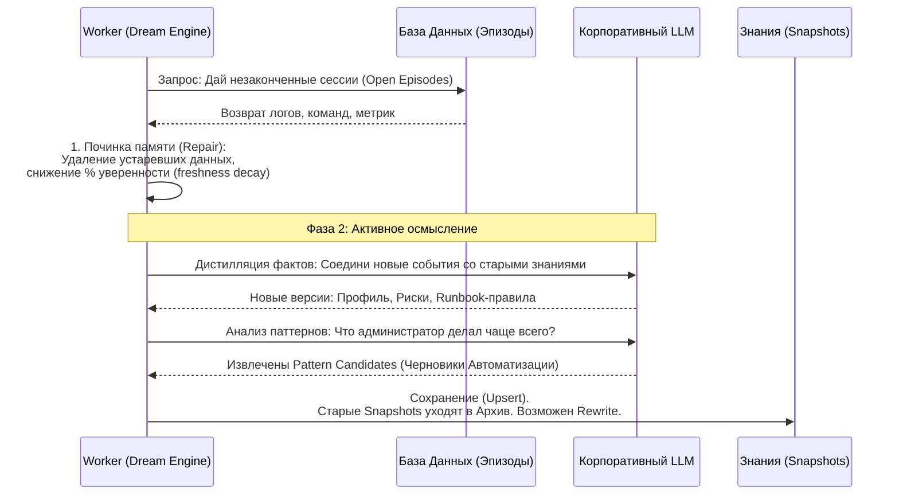

# Архитектура ИИ-Памяти и Снов (AI Memory & Dreams)

Этот документ предназначен для презентаций. Здесь описано, как система WebTerm AI автоматически учится на действиях пользователей и формирует базу знаний для каждого сервера.

## Общая Схема Работы (Pipeline Памяти)

```mermaid
flowchart LR
    %% Стилизация блоков
    classDef ingress fill:#e0f2fe,stroke:#0284c7,stroke-width:2px,color:#0f172a
    classDef l0 fill:#fef3c7,stroke:#d97706,stroke-width:2px,color:#0f172a
    classDef l1 fill:#fef08a,stroke:#b45309,stroke-width:2px,color:#0f172a
    classDef dreams fill:#fce7f3,stroke:#db2777,stroke-width:2px,color:#0f172a
    classDef l2 fill:#dcfce7,stroke:#16a34a,stroke-width:2px,color:#0f172a
    classDef output fill:#f3e8ff,stroke:#7e22ce,stroke-width:2px,color:#0f172a

    %% Входящие сигналы (Ingress)
    subgraph ИсточникиДанных["1. Источники Сигналов"]
        SSH["SSH терминал\n(история команд)"]:::ingress
        RDP["RDP\n(семантика)"]:::ingress
        Agents["AI Агенты\n(действия)"]:::ingress
        Watchers["Скрипты\n(метрики)"]:::ingress
    end

    %% L0 - Raw Events
    L0["L0: Сырые События\n(Event Store)"]:::l0
    ИсточникиДанных --> |"Парсинг + Фильтрация шума \n(удаление паролей и кэшей)"| L0

    %% L1 - Episodes
    L1["L1: Эпизоды\n(Сжатие сессий)"]:::l1
    L0 --> |"Консолидация \nкаждые 6 часов"| L1

    %% Dream Cycle
    DreamEngine(("Dream Cycle\n(Фаза Сна ИИ)")):::dreams
    L1 -.-> |Очередь на\nосмысление| DreamEngine

    %% L2 - Snapshots
    subgraph ДолговременнаяПамять["2. Долговременная Память (Снимки)"]
        Snap_Profile["Профиль Сервера"]:::l2
        Snap_Risks["Риски и Проблемы"]:::l2
        Snap_Access["Доступы и Секреты"]:::l2
        Snap_Patterns["Найденные Паттерны"]:::l2
    end

    DreamEngine ==> |"Дистилляция через LLM\nВыявление закономерностей"| ДолговременнаяПамять

    %% Output - Prompts & Tools
    Prompt["Контекст (Prompt)\nдля новых AI-задач"]:::output
    UI["Пользовательский Интерфейс\n(Вкладка Knowledge)"]:::output

    ДолговременнаяПамять ==> Prompt
    ДолговременнаяПамять ==> UI
```

---

## Как проходит "Сон Сервера" (Dream Cycle)

Dream Cycle — это фоновый `cron`-процесс, который обычно запускается ночью (или по гибридному расписанию). ИИ "размышляет" над тем, что происходило на сервере.

---

## Тезисы для Презентации (Простыми словами)

1. **Что такое Сны ИИ?** 
   Каждый сервер в нашей платформе накапливает историю через SSH/RDP и действия скриптов (L0). Это шумная информация, которую нельзя целиком подавать нейросети. Поэтому периодически запускается "Сон" (Dream Cycle).

2. **Как работает сжатие:**
   - **Эпизоды (L1):** Если разработчик сидел в терминале 2 часа настраивая nginx, система объединяет все его `apt install`, `nano` и `systemctl daemon-reload` в единый технический эпизод.
   - **Снимки Памяти (L2):** Ночью фоновый ИИ-аналитик просыпается, читает все эпизоды за месяц и обновляет "Карточку профиля" сервера по кусочкам. 

3. **Что получается на выходе?**
   - **Профили и Риски:** ИИ сам понимает: *"Это сервер баз данных PostgreSQL, но на нем зачем-то запущен Redis, а еще админ недавно забыл закрыть 5432 порт"*.
   - **Паттерны (Patterns):** ИИ подмечает рутинные действия: *"Я заметил, что последние 4 пятницы DevOps-инженер делал бэкап папки /var/log. Давайте я создам из этого навык (Skill Draft) и сам буду это делать?"*

4. **Что происходит при конфликтах?**
   Если вчера ИИ думал, что сервер работает на Ubuntu 20.04, а сегодня увидел команду `cat /etc/os-release`, которая показывает Ubuntu 22.04 — запускается процесс **Revalidation** (перепроверка). Устаревший факт отбрасывается, старые снимки архивируются, и контекст агента (Prompt) становится чище и актуальнее.
