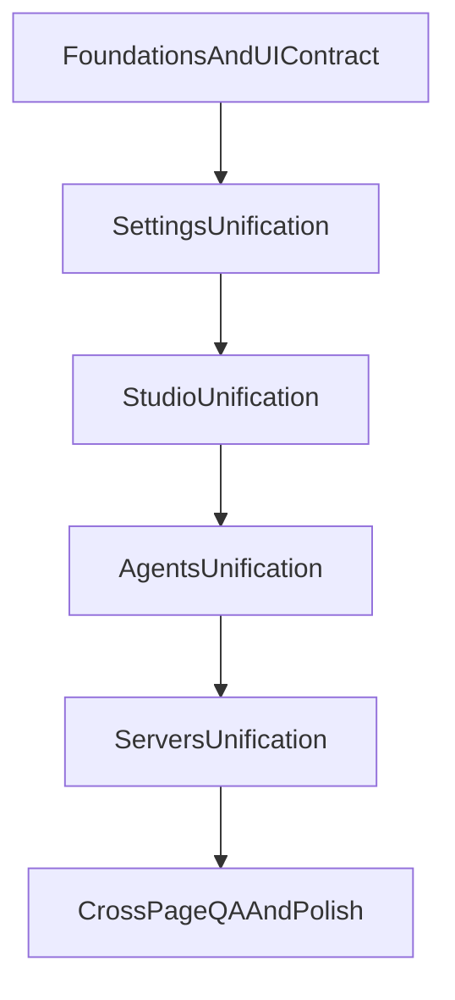

# UI/UX Plan
---
name: frontend-page-structure-plan
overview: Унифицировать структуру всех frontend-страниц вокруг единого UX-каркаса, чтобы CTA, состояния и навигация были предсказуемыми во всех доменах (Settings, Studio, Agents, Servers). План учитывает текущую архитектуру роутов и существующие дубли layout-компонентов.
todos:
  - id: audit-foundations
    content: Зафиксировать единый UI contract страницы на базе page-shell и определить обязательные состояния/CTA-паттерны
    status: pending
  - id: settings-first-wave
    content: Унифицировать Settings-домен и удалить дубли SectionCard/навигации как первый этап
    status: pending
  - id: studio-unify
    content: Выровнять Studio-страницы под единый frame и общий паттерн состояния данных
    status: pending
  - id: agents-servers-pass
    content: Применить те же структурные правила к Agents и Servers с отдельными исключениями для immersive-экранов
    status: pending
  - id: cross-domain-qa
    content: Провести кросс-доменную проверку консистентности, доступности и мобильной эргономики
    status: pending
isProject: false
---

# План структуризации фронтенда на всех страницах

## Цель

Привести все страницы к единому структурному паттерну по принципам frontend-design skill: приоритет usability, явный primary action, предсказуемое размещение действий, единые loading/error/empty состояния, консистентность между экранами.

## Базовый целевой каркас страницы

Для всех не-immersive экранов зафиксировать единый шаблон:

- `PageShell` как контейнер страницы
- `PageHero` для заголовка/контекста/основного CTA
- `SectionCard` для контентных блоков
- единый `QueryState`-паттерн для `loading / error / empty / success`

Опора в коде:

- [C:/WebTrerm/ai-server-terminal-main/src/components/ui/page-shell.tsx](C:/WebTrerm/ai-server-terminal-main/src/components/ui/page-shell.tsx)
- [C:/WebTrerm/ai-server-terminal-main/src/App.tsx](C:/WebTrerm/ai-server-terminal-main/src/App.tsx)

## Этап 1 — Нормализация foundations (общие примитивы)

1. Закрепить `page-shell` как единственный источник page-примитивов.
2. Убрать локальные дубли `SectionCard` в страницах настроек.
3. Ввести общий компонент состояния запросов (`PageQueryState`/`QueryStateBlock`) для единообразных `loading/error/empty`.
4. Зафиксировать единый порядок действий: primary CTA визуально доминирует, secondary рядом и слабее, destructive отдельно.

Ключевые файлы:

- [C:/WebTrerm/ai-server-terminal-main/src/components/ui/page-shell.tsx](C:/WebTrerm/ai-server-terminal-main/src/components/ui/page-shell.tsx)
- [C:/WebTrerm/ai-server-terminal-main/src/pages/settings/SettingsAIPage.tsx](C:/WebTrerm/ai-server-terminal-main/src/pages/settings/SettingsAIPage.tsx)
- [C:/WebTrerm/ai-server-terminal-main/src/pages/settings/SettingsMemoryPage.tsx](C:/WebTrerm/ai-server-terminal-main/src/pages/settings/SettingsMemoryPage.tsx)
- [C:/WebTrerm/ai-server-terminal-main/src/pages/settings/SettingsAuditPage.tsx](C:/WebTrerm/ai-server-terminal-main/src/pages/settings/SettingsAuditPage.tsx)

## Этап 2 — Унификация домена Settings (самый быстрый UX-эффект)

1. Свести настройки к одной системе навигации через `settings-nav-items`.
2. Привести все `/settings/*` страницы к одному ритму: `hero -> key actions -> sections -> empty/help`.
3. Оставить только одну актуальную архитектуру settings-layout, убрать конкурирующие legacy-паттерны.

Ключевые файлы:

- [C:/WebTrerm/ai-server-terminal-main/src/components/settings/SettingsLayout.tsx](C:/WebTrerm/ai-server-terminal-main/src/components/settings/SettingsLayout.tsx)
- [C:/WebTrerm/ai-server-terminal-main/src/components/settings/settings-nav-items.ts](C:/WebTrerm/ai-server-terminal-main/src/components/settings/settings-nav-items.ts)
- [C:/WebTrerm/ai-server-terminal-main/src/components/settings/SettingsWorkspace.tsx](C:/WebTrerm/ai-server-terminal-main/src/components/settings/SettingsWorkspace.tsx)
- [C:/WebTrerm/ai-server-terminal-main/src/pages/settings/SettingsAccessPage.tsx](C:/WebTrerm/ai-server-terminal-main/src/pages/settings/SettingsAccessPage.tsx)
- [C:/WebTrerm/ai-server-terminal-main/src/pages/SettingsUsersPage.tsx](C:/WebTrerm/ai-server-terminal-main/src/pages/SettingsUsersPage.tsx)
- [C:/WebTrerm/ai-server-terminal-main/src/pages/SettingsGroupsPage.tsx](C:/WebTrerm/ai-server-terminal-main/src/pages/SettingsGroupsPage.tsx)
- [C:/WebTrerm/ai-server-terminal-main/src/pages/SettingsPermissionsPage.tsx](C:/WebTrerm/ai-server-terminal-main/src/pages/SettingsPermissionsPage.tsx)

## Этап 3 — Унификация домена Studio

1. Определить один общий frame для всех non-immersive studio-страниц (с учетом `StudioNav`).
2. Выровнять хедеры, action-bar и структуру секций в `StudioPage`, `AgentConfigPage`, `PipelineRunsPage`, `StudioSkillsPage`.
3. Согласовать состояния списков и пустых экранов с общим `page-shell`.

Ключевые файлы:

- [C:/WebTrerm/ai-server-terminal-main/src/pages/StudioPage.tsx](C:/WebTrerm/ai-server-terminal-main/src/pages/StudioPage.tsx)
- [C:/WebTrerm/ai-server-terminal-main/src/pages/AgentConfigPage.tsx](C:/WebTrerm/ai-server-terminal-main/src/pages/AgentConfigPage.tsx)
- [C:/WebTrerm/ai-server-terminal-main/src/pages/PipelineRunsPage.tsx](C:/WebTrerm/ai-server-terminal-main/src/pages/PipelineRunsPage.tsx)
- [C:/WebTrerm/ai-server-terminal-main/src/pages/StudioSkillsPage.tsx](C:/WebTrerm/ai-server-terminal-main/src/pages/StudioSkillsPage.tsx)
- [C:/WebTrerm/ai-server-terminal-main/src/pages/MCPHubPage.tsx](C:/WebTrerm/ai-server-terminal-main/src/pages/MCPHubPage.tsx)
- [C:/WebTrerm/ai-server-terminal-main/src/pages/NotificationsSettingsPage.tsx](C:/WebTrerm/ai-server-terminal-main/src/pages/NotificationsSettingsPage.tsx)

## Этап 4 — Унификация доменов Agents и Servers

1. Для `AgentsPage` и `AgentRunPage` выровнять паттерн заголовка/CTA/секций, сохранив immersive-сценарии.
2. Для `Servers.tsx` выделить стабильные секции и уменьшить визуальную/логическую перегрузку.
3. Зафиксировать правила для immersive-страниц (`TerminalPage`, `RdpPage`, `PipelineEditorPage`): когда скрываем общий shell, как показываем ключевые действия и навигационный выход.

Ключевые файлы:

- [C:/WebTrerm/ai-server-terminal-main/src/pages/AgentsPage.tsx](C:/WebTrerm/ai-server-terminal-main/src/pages/AgentsPage.tsx)
- [C:/WebTrerm/ai-server-terminal-main/src/pages/AgentRunPage.tsx](C:/WebTrerm/ai-server-terminal-main/src/pages/AgentRunPage.tsx)
- [C:/WebTrerm/ai-server-terminal-main/src/pages/Servers.tsx](C:/WebTrerm/ai-server-terminal-main/src/pages/Servers.tsx)
- [C:/WebTrerm/ai-server-terminal-main/src/pages/TerminalPage.tsx](C:/WebTrerm/ai-server-terminal-main/src/pages/TerminalPage.tsx)
- [C:/WebTrerm/ai-server-terminal-main/src/pages/RdpPage.tsx](C:/WebTrerm/ai-server-terminal-main/src/pages/RdpPage.tsx)
- [C:/WebTrerm/ai-server-terminal-main/src/pages/PipelineEditorPage.tsx](C:/WebTrerm/ai-server-terminal-main/src/pages/PipelineEditorPage.tsx)
- [C:/WebTrerm/ai-server-terminal-main/src/components/AppLayout.tsx](C:/WebTrerm/ai-server-terminal-main/src/components/AppLayout.tsx)

## Поток работ по доменам

## Критерии готовности

- На каждой странице есть очевидный primary CTA и не конкурирующие secondary/destructive действия.
- Все страницы используют единый набор page-примитивов (или документированное исключение для immersive).
- Состояния `loading/error/empty` оформлены единообразно и с понятным next-step.
- Внутри каждого домена одинаковый порядок блоков и предсказуемая навигация.
- Мобильная версия не ломает основные действия: CTA доступны, плотность контролируема, нет мискликов.

## Риски и как их снять

- Риск регрессий при массовой унификации: внедрять доменами и через общие примитивы, а не большим переписыванием.
- Риск двойной архитектуры Settings: сначала убрать конкурирующие навигационные источники, потом унифицировать визуал.
- Риск «красиво, но неудобно»: на каждом этапе проверять UX-чеклист skill (главная цель, заметность CTA, когнитивная нагрузка, мобильный сценарий).

