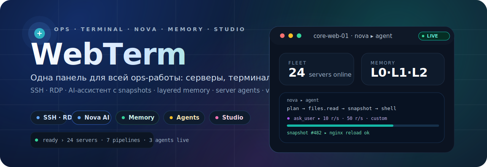
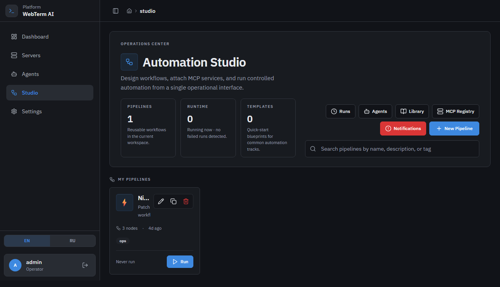
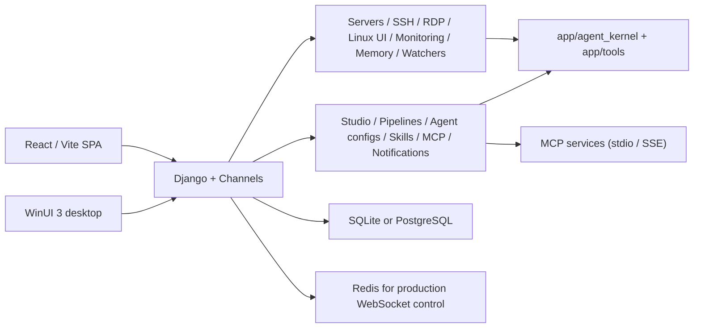

<p align="center">
  
</p>

<h1 align="center">WebTerm</h1>

<p align="center">
  Операционная панель для серверов, терминалов и автоматизации: SSH/RDP, Nova-ассистент с snapshots,
  layered AI memory, server agents, Studio pipelines, MCP и отдельный Windows desktop-клиент.
</p>

<p align="center">
  
  
  
  
  
  
</p>

> Если по-простому: WebTerm собирает в одном месте то, что в реальной работе обычно размазано по разным вкладкам и блокнотам. Здесь рядом живут список серверов, SSH/RDP-доступ, общий контекст по инфраструктуре, Nova-ассистент в терминале с snapshots перед опасными командами, долговременная layered-память по серверам, server agents и Studio для визуальных pipelines, skills и MCP. Django держит API и WebSocket, React/Vite отвечает за SPA, а WinUI-клиент закрывает desktop-сценарий.

## Как это выглядит

<table>
  <tr>
    <td width="50%">
      
      <p><strong>Servers</strong><br />Инвентарь, группы, быстрые действия, доступы и точка входа в терминал.</p>
    </td>
    <td width="50%">
      
      <p><strong>Studio</strong><br />Пайплайны, агенты, библиотека, MCP registry и уведомления в одном разделе.</p>
    </td>
  </tr>
</table>

## Что внутри

| Блок | Что есть на практике |
| --- | --- |
| Servers | Инвентарь серверов, группы, shares, быстрый execute, global/group/server knowledge, шифрование паролей через master password, bulk update, playbook builder и Ansible import. |
| Terminal | SSH и RDP через WebSocket, multi-tab hub, xterm.js, drag-and-drop файлов, SFTP-панель с встроенным редактором. |
| Nova AI | Terminal-ассистент с agent loop, tools (`shell`, `files`, `search`, `meta`), `ask_user` с кликабельными вариантами, command snapshots, прогресс/отчеты и read-only режим для критичных серверов. |
| Linux UI | Оконный workspace по Linux-серверу: сервисы, процессы, логи, диски, сеть, пакеты, docker containers. |
| Monitoring | Auto health-check при заходе на `/servers`, живые CPU/RAM/Disk/Traffic метрики, alerts, watchers с draft-инцидентами и dashboard по флоту. |
| Memory | Многослойная память по серверам (L0 events → L1 episodes → L2 snapshots), dream/repair pipeline, canonical sections и automation/skill candidates. |
| Agents | Server-bound агенты (mini/full/multi), live-логи через WebSocket, approve-plan flow, редактирование и AI-refine задач по ходу run, scheduled dispatch. |
| Studio | Visual pipeline editor, triggers (manual/webhook/schedule/monitoring), 15+ node types, pipeline assistant с graph patch, reusable agent configs, filesystem-backed skills, MCP pool и notifications. |
| Access | Per-user и per-group feature permissions, 5 отдельных settings-страниц (AI, Memory, SSO, Audit, Access), domain auto-login, desktop API и audit log. |
| Desktop | WinUI 3 клиент с WebView2 и отдельным backend API под `/api/desktop/v1/`. |

## Основные сценарии

- Держать парк серверов в одном месте: группы, доступы, общий контекст, заметки и быстрые действия без прыжков между разными тулзами.
- Открывать SSH/RDP из веб-интерфейса и сразу работать с тем же сервером в мониторинге, Linux UI, SFTP-файлах и запусках агентов.
- Просить Nova в терминале выполнить задачу: он сам соберет план, спросит чем нужна помощь (clickable choices), возьмет snapshot перед рискованной командой и сможет откатить ее.
- Копить долговременный операционный контекст по серверу: чему доверять, какие процедуры уже прижились, что пора проверить — layered memory + dreams делают это автоматически из реальных сессий.
- Запускать server agents, смотреть live-лог, подтверждать план и дорабатывать шаги без ручной возни.
- Собирать automation pipelines в Studio, привязывать MCP-сервисы, делать webhook/schedule/monitoring trigger и слать уведомления в Telegram или email.
- Использовать тот же backend из desktop-клиента на Windows, если браузерный сценарий неудобен.

## Архитектура в двух словах



Границы между контекстами описаны в [`ARCHITECTURE_CONTRACT.md`](./ARCHITECTURE_CONTRACT.md) и проверяются `lint-imports` через [`.importlinter`](./.importlinter).

## Nova: AI-ассистент в терминале

Nova — это встроенный в SSH-терминал ассистент. Живет рядом с xterm, понимает текущий сервер и сессию, умеет говорить в двух режимах:

- `ask` — просто отвечает и предлагает команды без исполнения.
- `agent` — собственный цикл с инструментами: `shell`, `files` (`read`, `write`, `append`, `grep`), `search`, `meta` (`ask_user`, `report`, `finish`).

Что важно знать:

- **Session context** — Nova знает `cwd`, `user@host`, shell, активный venv/conda и недавнюю историю команд; это явно показывается в UI через карточку контекста.
- **ask_user с кликабельными вариантами** — агент может прислать IDE-стайл выбор (`options`, `allow_multiple`, `free_text_allowed`), оператор нажимает и работа продолжается.
- **Command snapshots** — перед потенциально разрушающей командой Nova делает снимок состояния (файлов/конфигов) через `snapshot_service`, а после — позволяет откатить.
- **Dangerous command guard** — все risky шаги прогоняются через `app/tools/safety.is_dangerous_command()` и ждут подтверждения.
- **Read-only режим** — для серверов, помеченных `ai_read_only=true`, Nova может только читать, но не исполнять.
- **Egress redaction** — потенциальные секреты и prompt-injection-подобные строки вычищаются из логов и истории до записи в память.
- **LLM budget** — на уровне пользователя работает `core_ui.services.llm_budget` с лимитами запросов/токенов.
- **Session memory** — эфемерная история AI внутри вкладки терминала; очищается по `ai_clear_memory` и не путается с долговременной памятью по серверу.

## Layered memory по серверам

Это долговременный слой памяти, который копится сам из реальной эксплуатации и потом кормит prompt-ы агентов и Nova.

Уровни:

- **L0 `ServerMemoryEvent`** — raw inbox (SSH/RDP сессии, команды, health, alerts, agent events, Nova durable facts, watcher drafts, manual knowledge).
- **L1 `ServerMemoryEpisode`** — compaction по сессиям/окнам.
- **L2 `ServerMemorySnapshot`** — canonical секции: `profile`, `access`, `risks`, `runbook`, `recent_changes`, `human_habits` + pattern/automation/skill candidates.
- **`ServerMemoryRevalidation`** — очередь устаревших/конфликтующих фактов.
- **`ServerMemoryPolicy`** — пользовательская политика.
- **`BackgroundWorkerState`** — heartbeat/lease фоновых воркеров.

Фоновый dream/repair pipeline умеет:

- nearline compaction и canonical rebuild;
- pattern mining → `pattern_candidate:*`;
- `automation_candidate:*` и `skill_draft:*` как операционные подсказки;
- confidence decay и freshness/revalidation;
- archive старых events/episodes и detect fact conflicts.

Запустить вручную или из management-команд:

```bash
python manage.py run_memory_dreams
python manage.py repair_server_memory
```

Все записи проходят через `app/agent_kernel/memory/redaction.py`, одновременные записи защищены row-level lock. В UI это разрулено через `SettingsPage` → раздел `Memory` и `SettingsMemoryPage`.

## Быстрый старт

### Что понадобится

- Python 3.10+
- Node.js 20+ и `npm`
- Docker Desktop, если хотите поднять полный стек через compose
- WebView2 Runtime и Windows App SDK, если нужен desktop-клиент

### Важные нюансы до запуска

- Если `POSTGRES_HOST` или `POSTGRES_DB` не заданы, backend автоматически стартует на SQLite. Для первого запуска это нормально.
- `python manage.py runserver` без явного порта сам подставит `9000`.
- Фронтенд по умолчанию живет на `http://127.0.0.1:8080`.
- Для production или multi-worker режима нужен `CHANNEL_REDIS_URL`; `InMemoryChannelLayer` годится только для dev.

### Самый короткий путь на Windows

`bootstrap-config.ps1` только создает локальные конфиги из шаблонов. Установку зависимостей и запуск он не делает.

```powershell
.\bootstrap-config.ps1
python -m venv .venv
.\.venv\Scripts\Activate.ps1
python -m pip install --upgrade pip
pip install -r requirements-mini.txt
python manage.py migrate
python manage.py createsuperuser
python manage.py runserver
```

Во втором терминале:

```powershell
cd ai-server-terminal-main
npm install
npm run dev
```

После этого:

- SPA: `http://127.0.0.1:8080`
- Django health: `http://127.0.0.1:9000/api/health/`
- Django admin: `http://127.0.0.1:9000/admin/`

### Самый короткий путь на Linux/macOS

`bootstrap-linux.sh` уже умеет больше: создать `.env`, поднять docker-сервисы, сделать venv, поставить зависимости, прогнать миграции и при желании установить фронтенд.

```bash
chmod +x ./bootstrap-linux.sh
./bootstrap-linux.sh
```

Если нужен полный набор Python-зависимостей:

```bash
./bootstrap-linux.sh --full
```

Если docker не нужен:

```bash
./bootstrap-linux.sh --no-docker
```

## Запуск через Docker

Если хотите поднять сразу backend, frontend, PostgreSQL, Redis и MCP-сервисы:

```bash
cp .env.example .env
docker compose up -d --build
```

Что поднимется:

| Сервис | Порт | Назначение |
| --- | --- | --- |
| frontend / nginx | `8080` | Публичная точка входа в SPA |
| backend | `9000` | Django API, admin, health, WebSocket backend |
| postgres | `5432` | Основная БД |
| redis | `6379` | Channels / runtime control |
| mcp-demo | `8765` | Демонстрационный MCP HTTP server |
| mcp-keycloak | `8766` | Keycloak MCP server |

Если нужен не весь стек, а только инфраструктура для Studio:

```bash
docker compose -f docker-compose.postgres-mcp.yml up -d
```

## Настройка `.env`

Шаблон лежит в [`.env.example`](./.env.example). Реальные секреты в git не кладем.

Минимум, который имеет смысл проверить руками:

| Переменная | Зачем нужна |
| --- | --- |
| `DJANGO_DEBUG` | Dev/prod режим. Для локалки обычно `true`, для продакшена `false`. |
| `DJANGO_SECRET_KEY` | Обязателен в production, должен быть длинным и случайным. |
| `SITE_URL` | Базовый URL backend и ссылок из уведомлений. |
| `FRONTEND_APP_URL` | URL внешнего SPA, по умолчанию `http://127.0.0.1:8080`. |
| `ALLOWED_HOSTS` | Список допустимых host header. |
| `CSRF_TRUSTED_ORIGINS` | Нужен, если frontend/backend работают не на одном origin. |
| `POSTGRES_*` | Включают PostgreSQL вместо SQLite. |
| `CHANNEL_REDIS_URL` | Обязателен для production и multi-worker WebSocket control. |
| `GEMINI_API_KEY` / `ANTHROPIC_API_KEY` / `OPENAI_API_KEY` / `GROK_API_KEY` / `OLLAMA_*` | LLM-провайдеры. Активируется тот, у кого задан ключ. |
| `MASTER_PASSWORD` | Ключ шифрования паролей серверов. |
| `TELEGRAM_BOT_TOKEN` / `TELEGRAM_CHAT_ID` | Уведомления и подтверждения в Telegram. |
| `EMAIL_*` / `PIPELINE_NOTIFY_EMAIL` | Email-уведомления и письма. |
| `KEYCLOAK_*` | Интеграция с Keycloak MCP-профилями. |
| `MONITORING_HEALTHCHECK_COOLDOWN_SECONDS` / `MONITORING_HEALTHCHECK_LOCK_SECONDS` | Anti-storm для авто health-check на `/servers`. |
| `AGENT_ACTIVE_RUNS_*` / `PIPELINE_ACTIVE_RUNS_*` | Лимиты одновременных запусков по пользователю/глобально. |
| `SSH_TERMINAL_SESSIONS_*`, `SSH_CONNECT_TIMEOUT_SECONDS`, `SSH_KEEPALIVE_*` | Лимиты и таймауты SSH-сессий. |
| `MCP_STDIO_*` / `MCP_HTTP_*` | Таймауты stdio/SSE MCP клиентов. |
| `LLM_MAX_RETRY_ATTEMPTS`, `LLM_PROVIDER_TIMEOUT_SECONDS`, `LLM_*_STREAM_TIMEOUT_SECONDS` | Поведение провайдеров LLM. |
| `APP_LOG_FILE`, `APP_LOG_LEVEL`, `APP_LOG_ROTATION`, `APP_LOG_SYSLOG_*` | Файловое и syslog логирование. |

Полный список переменных со значениями по умолчанию — в [`.env.example`](./.env.example). Для production есть отдельный шаблон [`.env.production.example`](./.env.production.example) и готовая заготовка [`render.yaml`](./render.yaml).

## Ручные команды, которые пригодятся

### Backend

```bash
python manage.py migrate
python manage.py createsuperuser
python manage.py runserver

# monitoring / watchers / agents
python manage.py run_monitor
python manage.py run_watchers
python manage.py run_scheduled_agents
python manage.py run_agent_execution_plane

# layered AI memory
python manage.py run_memory_dreams
python manage.py repair_server_memory

# studio / ops
python manage.py load_pipeline_templates
python manage.py run_scheduled_pipelines
python manage.py run_ops_supervisor
python manage.py validate_skills
python manage.py scaffold_skill <slug>
python manage.py setup_all_nodes_smoke_pipeline
python manage.py setup_docker_service_recovery_pipeline
python manage.py setup_keycloak_ops_pipelines
python manage.py setup_mcp_showcase_pipeline
python manage.py setup_server_update_pipeline
```

### Frontend

```bash
cd ai-server-terminal-main
npm install
npm run dev
npm run build
npm run type-check
npm run lint
npm run test
npm run test:e2e
```

### Качество

```bash
pytest
ruff check .
ruff format .
lint-imports
python manage.py check
```

## Структура репозитория

| Путь | Что там лежит |
| --- | --- |
| [`web_ui/`](./web_ui) | Django settings, root URLs, ASGI/WSGI, общая сборка WebSocket routing |
| [`core_ui/`](./core_ui) | Auth/session API, redirects в SPA, access/settings/admin endpoints, middleware, desktop API, managed secrets |
| [`servers/`](./servers) | Серверы, группы, SSH/RDP, Linux UI, file manager, monitoring, watchers, layered memory, server agents |
| [`servers/services/terminal_ai/`](./servers/services/terminal_ai) | Nova terminal AI: agent loop, tools, prompts, session context, snapshot service, egress redaction |
| [`studio/`](./studio) | Pipelines, runs, MCP registry, skills, triggers, notifications, live updates, pipeline assistant |
| [`app/`](./app) | `agent_kernel` (domain/permissions/memory/runtime/hooks), LLM providers, SSH/server tools, safety |
| [`ai-server-terminal-main/`](./ai-server-terminal-main) | Основной React/Vite SPA с xterm-терминалом, Linux UI, Studio и settings |
| [`desktop/`](./desktop) | WinUI 3 клиент и solution |
| [`docker/`](./docker) | Dockerfile, nginx config, production startup scripts |
| [`tests/`](./tests) | Тесты верхнего уровня (API smoke, monitor, memory, agent loop, snapshots, policy) |
| [`scripts/`](./scripts) | Вспомогательные CLI-скрипты |

## Desktop-клиент

Веб-интерфейс здесь основной, но рядом лежит Windows-клиент на WinUI 3. Его backend-точки сидят под `/api/desktop/v1/`.

Быстрый старт для desktop:

```powershell
cd desktop
dotnet restore .\MiniProd.Desktop.sln
dotnet build .\MiniProd.Desktop.sln -c Debug -p:Platform=x64 -m:1 /p:UseSharedCompilation=false /p:BuildInParallel=false
.\src\MiniProd.Desktop\bin\x64\Debug\net8.0-windows10.0.19041.0\MiniProd.Desktop.exe
```

Подробности и оговорки лежат в [`desktop/README.md`](./desktop/README.md).

## Production notes

- При `DJANGO_DEBUG=false` backend требует явный `CHANNEL_REDIS_URL` или `CELERY_BROKER_URL`; без этого приложение специально не стартует.
- `docker/render-backend-start.sh` перед запуском `daphne` делает `migrate` и `collectstatic`, так что схема старта уже выстроена под деплой.
- Если фронтенд и backend живут на разных доменах, проверьте `FRONTEND_APP_URL`, `SITE_URL`, `ALLOWED_HOSTS`, `CSRF_TRUSTED_ORIGINS` и `CROSS_SITE_AUTH`.
- Для Render в репозитории уже есть рабочий blueprint: [`render.yaml`](./render.yaml).
- Production-шаблон переменных: [`.env.production.example`](./.env.production.example).

## Что нового в последних релизах

- **Nova agent loop (iterations A + B)** — в терминале появился полноценный tool-using ассистент c `shell`/`files`/`search`/`meta`, кликабельным `ask_user`, session context и read-only guard.
- **Command snapshots** — модель `CommandSnapshot` и [`servers/services/snapshot_service.py`](./servers/services/snapshot_service.py) снимают состояние до рискованных команд и дают rollback.
- **Egress redaction + LLM budget** — поток в LLM очищается от секретов, а бюджет запросов/токенов считается per-user в [`core_ui/services/llm_budget.py`](./core_ui/services/llm_budget.py).
- **Ops memory runtime** — layered memory (L0/L1/L2 + revalidation) с dream/repair pipeline, row-level lock против одновременной записи и UI в Settings → Memory.
- **Settings redesign** — одна страница разошлась на пять: `AI`, `Memory`, `SSO`, `Audit`, `Access`.
- **Studio pipeline workflow** — pipeline assistant с graph patch, новые node types, smoke-сценарии (`setup_all_nodes_smoke_pipeline`) и MCP showcase.
- **Monitoring** — auto health-check на `/servers` с anti-storm (`MONITORING_HEALTHCHECK_COOLDOWN_SECONDS`), живые CPU/RAM/Disk/Traffic метрики.
- **Architecture contract** — появились [`ARCHITECTURE_CONTRACT.md`](./ARCHITECTURE_CONTRACT.md), [`DEVELOPMENT_RULES.md`](./DEVELOPMENT_RULES.md), [`.importlinter`](./.importlinter) и cross-context refactors (`servers/services/*` как публичный API для `studio`).

История всех коммитов: `git log --oneline`.

## Документация

Внутренние документы, которые имеет смысл знать до изменений:

| Документ | Для чего |
| --- | --- |
| [`AGENTS.md`](./AGENTS.md) | Актуальная рабочая карта репозитория для AI-агентов и новых контрибьюторов. |
| [`CONTRIBUTING.md`](./CONTRIBUTING.md) | Алгоритм выполнения задач, чеклисты, шаблоны service/view. |
| [`DEVELOPMENT_RULES.md`](./DEVELOPMENT_RULES.md) | Жесткие правила R-001…R-007, список god-files и запрещенных действий. |
| [`ARCHITECTURE_CONTRACT.md`](./ARCHITECTURE_CONTRACT.md) | Bounded contexts, dependency matrix, паттерны взаимодействия `servers ↔ studio`. |
| [`PROJECT_FUNCTIONALITY_GUIDE.md`](./PROJECT_FUNCTIONALITY_GUIDE.md) | Полный функциональный обзор: пользовательские сценарии, API, WebSocket, модели. |
| [`PROJECT_AUDIT.md`](./PROJECT_AUDIT.md) | Результат глубокого аудита архитектуры и AI-подсистемы. |
| [`PRODUCTION_READINESS_PLAN.md`](./PRODUCTION_READINESS_PLAN.md) | План доведения до production. |
| [`SECURITY_QA_FOR_IS_REVIEW.md`](./SECURITY_QA_FOR_IS_REVIEW.md) | Вопросы/ответы для security-ревью ИБ. |
| [`AI_MEMORY_PRESENTATION.md`](./AI_MEMORY_PRESENTATION.md) | Короткая презентация по AI memory. |
| [`desktop/README.md`](./desktop/README.md) | Подробности по WinUI 3 desktop-клиенту. |

## Что еще важно знать

- Две memory-системы не смешиваются: эфемерная Nova session memory живет в `SSHTerminalConsumer`, долговременная — в `ServerMemory*` моделях.
- Опасные серверные действия должны проходить через проверки в [`app/tools/safety.py`](./app/tools/safety.py).
- `passwords/` остался как кодовый модуль и сейчас не подключен в `INSTALLED_APPS`.
- Корневой `src/main.tsx` — это thin entrypoint, который импортирует SPA из `ai-server-terminal-main/`.

## License

Проект распространяется по [Apache License 2.0](./LICENSE).
