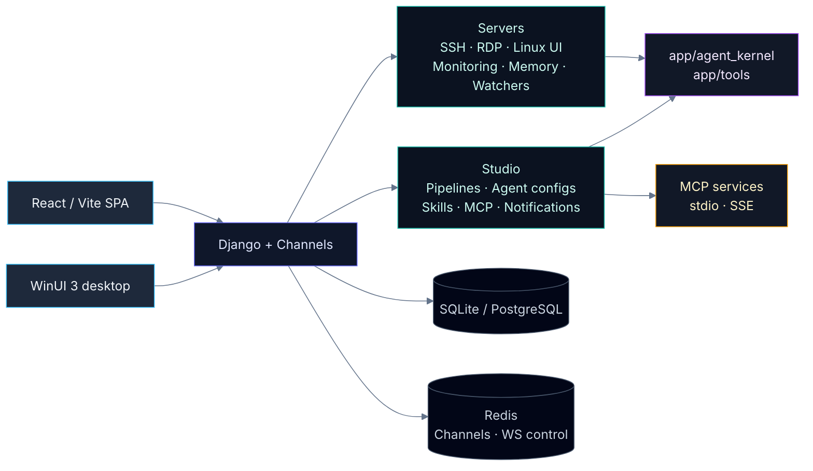
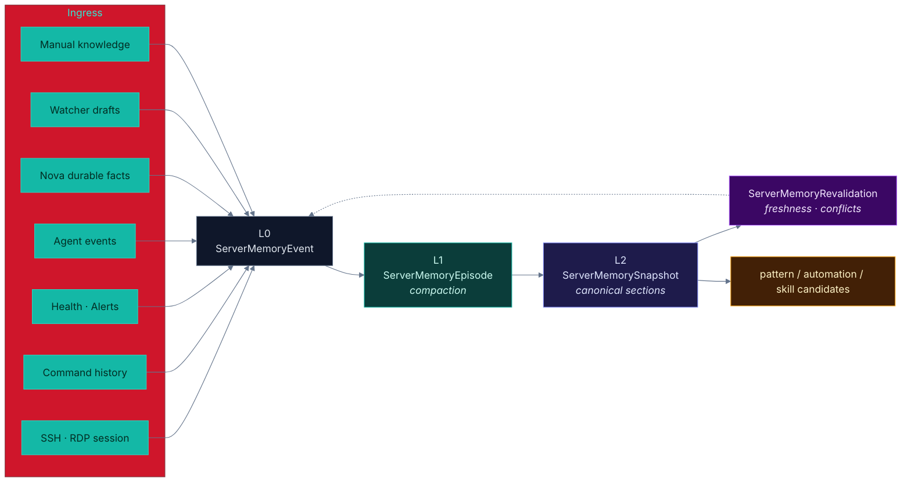

<p align="center">
  
</p>

<h1 align="center">WebTerm</h1>

<p align="center">
  <b>Одна панель для всей ops-работы.</b><br/>
  Серверы, SSH/RDP, <b>Nova</b> ассистент с snapshots, long-term AI memory,<br/>
  server agents, visual Studio pipelines, MCP и Windows desktop-клиент.
</p>

<p align="center">
  <a href="#быстрый-старт"></a>
  &nbsp;<a href="#nova-ai-ассистент-в-терминале"></a>
  &nbsp;<a href="#архитектура-в-двух-словах"></a>
  &nbsp;<a href="#layered-memory-по-серверам"></a>
</p>

<p align="center">
  
  
  
  
  
  
  
  
  <br/>
  
  
  
  
  
  
</p>

---

## Зачем это

В обычной ops-работе параллельно открыто десять вкладок: SSH-клиент, RDP, Grafana, Jira, Ansible, блокнот с заметками, ChatGPT, Telegram с алертами. Они не знают друг о друге.

**WebTerm склеивает это в одну плоскость:**

- Открыл сервер в SSH → рядом его **long-term AI-память**, **Linux UI** workspace и **SFTP** с редактором.
- Попросил **Nova** почистить диск → она соберёт план, спросит кликабельными вариантами что оставить, сделает **snapshot** перед рискованной командой и покажет rollback.
- Событие из терминала → попало в **layered memory** → dreams сжали в canonical runbook → promoted в **Studio skill** → следующий агент уже знает процедуру.
- Критичный alert → **watcher draft** → оператор подтверждает → **pipeline** с `ssh_cmd` / `mcp_call` / `human_approval` → уведомление в Telegram или email.

Один Django backend, один React SPA, один WinUI desktop — поверх того же API.

---

## Как это выглядит

<table>
  <tr>
    <td width="50%" valign="top">
      
      <h4 align="center">Servers</h4>
      <p align="center">
        Инвентарь, группы, shares, живые CPU/RAM/Disk/Traffic метрики,<br/>
        точка входа в SSH/RDP, Linux UI и server agents.
      </p>
    </td>
    <td width="50%" valign="top">
      
      <h4 align="center">Studio</h4>
      <p align="center">
        Visual pipeline editor с assistant, triggers, MCP registry,<br/>
        reusable agent configs, filesystem-backed skills и notifications.
      </p>
    </td>
  </tr>
</table>

---

## Numbers that matter

<table>
  <tr align="center">
    <td><b>3</b><br/><sub>уровня памяти<br/>L0 → L1 → L2</sub></td>
    <td><b>19</b><br/><sub>pipeline<br/>node types</sub></td>
    <td><b>12</b><br/><sub>типов server<br/>agents</sub></td>
    <td><b>5</b><br/><sub>settings-страниц<br/>AI · Memory · SSO · Audit · Access</sub></td>
    <td><b>4</b><br/><sub>WebSocket consumer-а<br/>SSH · RDP · Agent · Pipeline</sub></td>
    <td><b>40+</b><br/><sub>test suites<br/>backend + e2e</sub></td>
  </tr>
</table>

---

## Что внутри

<table>
  <tr>
    <td width="33%" valign="top">
      <h4>◆ Servers</h4>
      Инвентарь, группы, shares, master-password шифрование, bulk update, global/group/server knowledge, playbook builder и Ansible import.
    </td>
    <td width="33%" valign="top">
      <h4>◇ Terminal</h4>
      SSH и RDP через WebSocket, multi-tab hub, xterm.js, drag-and-drop файлов, SFTP-панель со встроенным редактором.
    </td>
    <td width="33%" valign="top">
      <h4>✦ Nova AI</h4>
      Agent loop c tools <code>shell</code>/<code>files</code>/<code>search</code>/<code>meta</code>, кликабельный <code>ask_user</code>, command snapshots, прогресс, read-only guard.
    </td>
  </tr>
  <tr>
    <td width="33%" valign="top">
      <h4>▣ Linux UI</h4>
      Оконный workspace по серверу: сервисы, процессы, логи, диски, сеть, пакеты, docker containers.
    </td>
    <td width="33%" valign="top">
      <h4>◈ Monitoring</h4>
      Auto health-check на <code>/servers</code>, живые CPU/RAM/Disk/Traffic, alerts, watcher drafts и fleet dashboard.
    </td>
    <td width="33%" valign="top">
      <h4>✶ Memory</h4>
      Многослойная память L0 → L1 → L2 + revalidation, dream/repair pipeline, canonical sections и skill candidates.
    </td>
  </tr>
  <tr>
    <td width="33%" valign="top">
      <h4>◉ Agents</h4>
      Server-bound агенты <code>mini</code>/<code>full</code>/<code>multi</code>, live через WebSocket, approve plan, AI-refine задач, schedules.
    </td>
    <td width="33%" valign="top">
      <h4>◐ Studio</h4>
      Visual pipeline editor, 19 node types, assistant с graph patch, reusable agent configs, skills, MCP pool, notifications.
    </td>
    <td width="33%" valign="top">
      <h4>⬢ Access</h4>
      Per-user/per-group permissions, 5 settings-страниц, domain auto-login, desktop API, audit log.
    </td>
  </tr>
</table>

---

## Nova в работе

Пример `agent`-turn в терминале, когда оператор просит добавить rate-limit и перезапустить nginx:

```text
you ▸ nova, добавь rate limit на /api/ в nginx, потом перезапусти

nova (agent, cwd=/etc/nginx, shell=bash, ssh://ops@core-web-01)

  plan
    1. прочитать текущий sites-enabled/default
    2. найти блок location /api/
    3. подобрать limit_req и snapshot конфиг
    4. nginx -t → systemctl reload

  tool ▸ files.read /etc/nginx/sites-enabled/default
         (1823 B · 3 matches for "location")
  think ▸ нашёл location /api/ на строке 42, rate-limit зоны нет

  ask_user ▸ какой RPS оставить?
    [ 10 r/s per IP ]   [ 50 r/s per IP ]   [ своё значение… ]
  you     ▸ 50 r/s per IP

  tool ▸ snapshot.create        CommandSnapshot#482 ← default (1.8 KiB)
  tool ▸ files.write            default (+7 lines, +1 zone limit_req_api)
  tool ▸ shell  sudo nginx -t
         ✓ nginx: configuration file test is successful
  tool ▸ shell  sudo systemctl reload nginx
         ✓ (exit 0, 142 ms)

  report ▸ rate limit 50 r/s настроен на /api/. Rollback одной кнопкой:
           /servers/api/snapshots/482/restore/
```

Что тут реально видно:

- **Structured agent turn** — план, tool calls, think, ответы.
- **ask_user со списком** — оператор нажимает вариант, агент продолжает.
- **CommandSnapshot** — снимок до записи, rollback URL сразу в отчёте.
- **Safety guard** — перед любой записью/перезапуском Nova проходит `app/tools/safety.is_dangerous_command()`.
- **Read-only** — если у сервера `ai_read_only=true`, шаги с `shell`/`files.write` просто не запустятся.

---

## Сценарии из жизни

<table>
  <tr>
    <td width="50%" valign="top">
      <b>Инцидент</b><br/>
      Watcher видит 500-е в логах → создаёт <i>draft</i> → оператор подтверждает → Studio pipeline с <code>agent/react</code> + <code>human_approval</code> + <code>output/telegram</code> чинит и пишет отчёт.
    </td>
    <td width="50%" valign="top">
      <b>Выкатка</b><br/>
      Nova в <code>agent</code>-режиме читает конфиги, делает snapshot, раскатывает правки, проверяет <code>nginx -t</code>, перезапускает и оставляет rollback-ссылку в чат.
    </td>
  </tr>
  <tr>
    <td width="50%" valign="top">
      <b>Ретро</b><br/>
      Все SSH-сессии и health-checks оседают в L0. Dreams сжимают их в L1 эпизоды и L2 canonical sections. Через неделю у сервера есть runbook, собранный из реальной эксплуатации.
    </td>
    <td width="50%" valign="top">
      <b>Регулярка</b><br/>
      `ServerAgent` <code>security_audit</code> раз в сутки по расписанию, live-лог в UI, approve plan — если нашёл подозрительное, авто-report в почту и layered memory.
    </td>
  </tr>
</table>

---

## Архитектура в двух словах



Границы между bounded contexts автоматически проверяются `lint-imports` через [`.importlinter`](./.importlinter).

---

## Nova: AI-ассистент в терминале

Nova — это встроенный в SSH-терминал ассистент. Живёт рядом с xterm, понимает текущий сервер и сессию, умеет работать в двух режимах:

<table>
  <tr>
    <td width="50%" valign="top">
      <h4>ask — собеседник</h4>
      Отвечает, объясняет вывод, предлагает команды — но <b>ничего не исполняет сам</b>. Оператор берёт готовую команду и сам решает, запускать её или нет.
    </td>
    <td width="50%" valign="top">
      <h4>agent — исполнитель</h4>
      Свой loop с инструментами <code>shell</code>, <code>files</code> (<code>read</code>/<code>write</code>/<code>append</code>/<code>grep</code>), <code>search</code>, <code>meta</code> (<code>ask_user</code>, <code>report</code>, <code>finish</code>). Тулзы ходят в SSH, в файлы, задают вопросы.
    </td>
  </tr>
</table>

Что делает Nova безопасной и контролируемой:

<table>
  <tr>
    <td width="50%" valign="top">
      ◆ <b>Session context</b> — Nova знает <code>cwd</code>, <code>user@host</code>, shell, venv/conda и recent commands; карточка контекста видна в UI.
    </td>
    <td width="50%" valign="top">
      ◆ <b>ask_user со списком</b> — агент шлёт <code>options</code>/<code>allow_multiple</code>/<code>free_text_allowed</code>, UI рисует кликабельные кнопки.
    </td>
  </tr>
  <tr>
    <td width="50%" valign="top">
      ◆ <b>Command snapshots</b> — <code>CommandSnapshot</code> перед risky-шагом + rollback endpoint.
    </td>
    <td width="50%" valign="top">
      ◆ <b>Dangerous command guard</b> — <code>app/tools/safety.is_dangerous_command()</code> гейт перед исполнением.
    </td>
  </tr>
  <tr>
    <td width="50%" valign="top">
      ◆ <b>Read-only режим</b> — сервер с <code>ai_read_only=true</code> принимает только read-операции.
    </td>
    <td width="50%" valign="top">
      ◆ <b>Egress redaction</b> — секреты и prompt-injection-строки вычищаются до записи в память.
    </td>
  </tr>
  <tr>
    <td width="50%" valign="top">
      ◆ <b>LLM budget</b> — <code>core_ui.services.llm_budget</code> считает запросы/токены per-user.
    </td>
    <td width="50%" valign="top">
      ◆ <b>Session memory</b> — эфемерная история AI внутри вкладки; <code>ai_clear_memory</code> чистит.
    </td>
  </tr>
</table>

---

## Layered memory по серверам

Долговременный слой памяти, который копится из реальной эксплуатации и потом кормит prompt-ы агентов и Nova.



Ключевые модели и политики:

- **L0 `ServerMemoryEvent`** — raw inbox всего, что происходит на сервере.
- **L1 `ServerMemoryEpisode`** — компактные эпизоды по сессиям/окнам.
- **L2 `ServerMemorySnapshot`** — canonical секции `profile`, `access`, `risks`, `runbook`, `recent_changes`, `human_habits`.
- **`ServerMemoryRevalidation`** — очередь устаревших/конфликтующих фактов.
- **`ServerMemoryPolicy`** — пользовательская политика памяти.
- **`BackgroundWorkerState`** — heartbeat/lease фоновых воркеров.

Dream/repair pipeline:

- nearline compaction и canonical rebuild;
- pattern mining → `pattern_candidate:*`;
- `automation_candidate:*` и `skill_draft:*` как операционные подсказки;
- confidence decay и freshness/revalidation;
- archive старых events/episodes, детекция fact conflicts.

Все записи проходят через `app/agent_kernel/memory/redaction.py`, одновременные записи защищены row-level lock. В UI — через `Settings → Memory` и `SettingsMemoryPage`.

```bash
python manage.py run_memory_dreams       # фоновый compaction / canonical / candidates
python manage.py repair_server_memory    # freshness / conflicts / archive
```

---

## Быстрый старт

> Нужно: Python 3.10+, Node.js 20+, опционально Docker Desktop и WebView2/Windows App SDK для desktop-клиента.

<table>
  <tr>
    <td width="50%" valign="top">
      <h4>Windows</h4>
<pre lang="powershell">
.\bootstrap-config.ps1
python -m venv .venv
.\.venv\Scripts\Activate.ps1
python -m pip install --upgrade pip
pip install -r requirements-mini.txt
python manage.py migrate
python manage.py createsuperuser
python manage.py runserver
</pre>
во втором терминале:
<pre lang="powershell">
cd ai-server-terminal-main
npm install
npm run dev
</pre>
<sub><code>bootstrap-config.ps1</code> только готовит локальные конфиги.</sub>
    </td>
    <td width="50%" valign="top">
      <h4>Linux / macOS</h4>
<pre lang="bash">
chmod +x ./bootstrap-linux.sh
./bootstrap-linux.sh           # полный bootstrap
./bootstrap-linux.sh --full    # + весь requirements.txt
./bootstrap-linux.sh --no-docker
</pre>
<code>bootstrap-linux.sh</code> создаёт <code>.env</code>, поднимает docker-сервисы, собирает venv, делает миграции и опционально ставит фронтенд.
    </td>
  </tr>
  <tr>
    <td width="50%" valign="top">
      <h4>Docker Compose — весь стек</h4>
<pre lang="bash">
cp .env.example .env
docker compose up -d --build
</pre>
      <table>
        <tr><td><code>frontend / nginx</code></td><td><code>:8080</code></td></tr>
        <tr><td><code>backend</code></td><td><code>:9000</code></td></tr>
        <tr><td><code>postgres</code></td><td><code>:5432</code></td></tr>
        <tr><td><code>redis</code></td><td><code>:6379</code></td></tr>
        <tr><td><code>mcp-demo</code></td><td><code>:8765</code></td></tr>
        <tr><td><code>mcp-keycloak</code></td><td><code>:8766</code></td></tr>
      </table>
    </td>
    <td width="50%" valign="top">
      <h4>Docker — только Studio-инфра</h4>
<pre lang="bash">
docker compose -f docker-compose.postgres-mcp.yml up -d
</pre>
      <h4>После запуска</h4>
      <ul>
        <li>SPA · <code>http://127.0.0.1:8080</code></li>
        <li>Health · <code>http://127.0.0.1:9000/api/health/</code></li>
        <li>Admin · <code>http://127.0.0.1:9000/admin/</code></li>
      </ul>
    </td>
  </tr>
</table>

> **Нюансы:** без `POSTGRES_HOST`/`POSTGRES_DB` backend стартует на SQLite. `python manage.py runserver` сам подставляет порт `9000`. Для production и multi-worker обязательно `CHANNEL_REDIS_URL` — `InMemoryChannelLayer` только для dev.

---

## Настройка `.env`

Шаблон — [`.env.example`](./.env.example). Production-шаблон — [`.env.production.example`](./.env.production.example). Для Render есть готовый [`render.yaml`](./render.yaml).

Ключевое руками:

| Переменная | Зачем |
| --- | --- |
| `DJANGO_DEBUG` / `DJANGO_SECRET_KEY` | Dev/prod и стабильный секрет в продакшене. |
| `SITE_URL` / `FRONTEND_APP_URL` / `ALLOWED_HOSTS` / `CSRF_TRUSTED_ORIGINS` | URL-ы и разрешённые origins, если frontend живёт на другом домене. |
| `POSTGRES_*` | Включают PostgreSQL вместо SQLite. |
| `CHANNEL_REDIS_URL` | Обязателен для production и multi-worker WebSocket control. |
| `GEMINI_API_KEY` / `ANTHROPIC_API_KEY` / `OPENAI_API_KEY` / `GROK_API_KEY` / `OLLAMA_*` | LLM-провайдеры. Активируется тот, у кого задан ключ. |
| `MASTER_PASSWORD` | Ключ шифрования паролей серверов. |
| `TELEGRAM_BOT_TOKEN` / `TELEGRAM_CHAT_ID` | Уведомления и approval-кнопки в Telegram. |
| `EMAIL_*` / `PIPELINE_NOTIFY_EMAIL` | SMTP и адрес для pipeline-нотификаций. |
| `KEYCLOAK_*` | Интеграция с Keycloak MCP-профилями. |

<details>
<summary><b>Все остальные переменные (таймауты, лимиты, логирование)</b></summary>

| Переменная | Зачем |
| --- | --- |
| `MONITORING_HEALTHCHECK_COOLDOWN_SECONDS` / `MONITORING_HEALTHCHECK_LOCK_SECONDS` | Anti-storm для auto health-check на `/servers`. |
| `AGENT_ACTIVE_RUNS_PER_USER_LIMIT` / `AGENT_ACTIVE_RUNS_GLOBAL_LIMIT` | Одновременные server-agent runs. |
| `PIPELINE_ACTIVE_RUNS_PER_USER_LIMIT` / `PIPELINE_ACTIVE_RUNS_GLOBAL_LIMIT` | Одновременные Studio-pipeline runs. |
| `SSH_TERMINAL_SESSIONS_PER_USER_LIMIT` / `SSH_TERMINAL_SESSIONS_GLOBAL_LIMIT` | Лимиты SSH-сессий. |
| `SSH_TERMINAL_SESSION_STALE_SECONDS` / `SSH_TERMINAL_SESSION_HEARTBEAT_SECONDS` | Heartbeat и stale-detection SSH-сессий. |
| `SSH_CONNECT_TIMEOUT_SECONDS` / `SSH_LOGIN_TIMEOUT_SECONDS` | Таймауты подключения и логина. |
| `SSH_KEEPALIVE_INTERVAL_SECONDS` / `SSH_KEEPALIVE_COUNT_MAX` | SSH keepalive. |
| `MCP_STDIO_INITIALIZE_TIMEOUT_SECONDS` / `MCP_STDIO_REQUEST_TIMEOUT_SECONDS` / `MCP_STDIO_TOOL_CALL_TIMEOUT_SECONDS` | MCP stdio-клиент. |
| `MCP_HTTP_CONNECT_TIMEOUT_SECONDS` / `MCP_HTTP_REQUEST_TIMEOUT_SECONDS` / `MCP_HTTP_TOOL_CALL_TIMEOUT_SECONDS` / `MCP_HTTP_RETRY_ATTEMPTS` | MCP HTTP/SSE-клиент. |
| `LLM_MAX_RETRY_ATTEMPTS` / `LLM_PROVIDER_TIMEOUT_SECONDS` | Поведение LLM-provider фасада. |
| `LLM_GEMINI_STREAM_TIMEOUT_SECONDS` / `LLM_GROK_STREAM_TIMEOUT_SECONDS` / `LLM_CLAUDE_STREAM_TIMEOUT_SECONDS` / `LLM_OPENAI_STREAM_TIMEOUT_SECONDS` / `LLM_OPENAI_RESPONSES_TIMEOUT_SECONDS` | Stream-таймауты конкретных провайдеров. |
| `APP_LOG_FILE` / `APP_LOG_LEVEL` / `APP_LOG_ROTATION` / `APP_LOG_RETENTION` | Файловое логирование. |
| `APP_LOG_SYSLOG_ENABLED` / `APP_LOG_SYSLOG_ADDRESS` / `APP_LOG_SYSLOG_PROTOCOL` / `APP_LOG_SYSLOG_FACILITY` | Syslog-отправка логов. |

</details>

---

## Команды, которые пригодятся

<details open>
<summary><b>Backend</b></summary>

```bash
python manage.py migrate
python manage.py createsuperuser
python manage.py runserver

# monitoring / watchers / agents
python manage.py run_monitor
python manage.py run_watchers
python manage.py run_scheduled_agents
python manage.py run_agent_execution_plane

# layered AI memory
python manage.py run_memory_dreams
python manage.py repair_server_memory

# studio / ops
python manage.py load_pipeline_templates
python manage.py run_scheduled_pipelines
python manage.py run_ops_supervisor
python manage.py validate_skills
python manage.py scaffold_skill <slug>
python manage.py setup_all_nodes_smoke_pipeline
python manage.py setup_docker_service_recovery_pipeline
python manage.py setup_keycloak_ops_pipelines
python manage.py setup_mcp_showcase_pipeline
python manage.py setup_server_update_pipeline
```

</details>

<details>
<summary><b>Frontend</b></summary>

```bash
cd ai-server-terminal-main
npm install
npm run dev
npm run build
npm run type-check
npm run lint
npm run test
npm run test:e2e
```

</details>

<details>
<summary><b>Качество и проверки</b></summary>

```bash
pytest
ruff check .
ruff format .
lint-imports
python manage.py check
```

</details>

---

## Структура репозитория

| Путь | Что там лежит |
| --- | --- |
| [`web_ui/`](./web_ui) | Django settings, root URLs, ASGI/WSGI, сборка WebSocket routing. |
| [`core_ui/`](./core_ui) | Auth/session API, redirects в SPA, access/settings/admin endpoints, middleware, desktop API, managed secrets, LLM budget. |
| [`servers/`](./servers) | Серверы, группы, SSH/RDP, Linux UI, file manager, monitoring, watchers, layered memory, server agents. |
| [`servers/services/terminal_ai/`](./servers/services/terminal_ai) | Nova terminal AI: agent loop, tools (`shell`/`files`/`search`/`meta`), prompts, session context, snapshot service, egress redaction. |
| [`studio/`](./studio) | Pipelines, runs, MCP registry, skills, triggers, notifications, live updates, pipeline assistant. |
| [`app/`](./app) | `agent_kernel` (domain / permissions / memory / runtime / hooks), LLM providers, SSH/server tools, safety. |
| [`ai-server-terminal-main/`](./ai-server-terminal-main) | Основной React/Vite SPA: терминал, Linux UI, Studio, settings, dashboard. |
| [`desktop/`](./desktop) | WinUI 3 клиент и solution. |
| [`docker/`](./docker) | Dockerfile, nginx config, production startup scripts. |
| [`tests/`](./tests) | Тесты верхнего уровня: API smoke, monitor, memory, agent loop, snapshots, policy, parallel executor. |
| [`scripts/`](./scripts) | Вспомогательные CLI-скрипты. |

---

## Desktop-клиент

Веб — основной интерфейс, но рядом живёт Windows-клиент на WinUI 3 поверх тех же API-точек под `/api/desktop/v1/`.

```powershell
cd desktop
dotnet restore .\MiniProd.Desktop.sln
dotnet build .\MiniProd.Desktop.sln -c Debug -p:Platform=x64 -m:1 /p:UseSharedCompilation=false /p:BuildInParallel=false
.\src\MiniProd.Desktop\bin\x64\Debug\net8.0-windows10.0.19041.0\MiniProd.Desktop.exe
```

---

## Production notes

- При `DJANGO_DEBUG=false` backend требует явный `CHANNEL_REDIS_URL` или `CELERY_BROKER_URL`; без этого приложение специально не стартует.
- `docker/render-backend-start.sh` перед запуском `daphne` делает `migrate` и `collectstatic`.
- Если фронтенд и backend живут на разных доменах, проверь `FRONTEND_APP_URL`, `SITE_URL`, `ALLOWED_HOSTS`, `CSRF_TRUSTED_ORIGINS`, `CROSS_SITE_AUTH`.
- Для Render готов blueprint [`render.yaml`](./render.yaml).
- Production-шаблон переменных — [`.env.production.example`](./.env.production.example).

---

## Что нового в последних релизах

<table>
  <tr>
    <td width="50%" valign="top">
      <h4>Nova agent loop (iterations A + B)</h4>
      Tool-using ассистент в терминале: <code>shell</code>/<code>files</code>/<code>search</code>/<code>meta</code>, кликабельный <code>ask_user</code>, session context, read-only guard.
    </td>
    <td width="50%" valign="top">
      <h4>Command snapshots</h4>
      <code>CommandSnapshot</code> + <a href="./servers/services/snapshot_service.py"><code>snapshot_service.py</code></a> — снимок до risky-шага и rollback одной кнопкой.
    </td>
  </tr>
  <tr>
    <td width="50%" valign="top">
      <h4>Egress redaction + LLM budget</h4>
      Секреты вычищаются до записи в память, бюджет запросов/токенов — per-user в <a href="./core_ui/services/llm_budget.py"><code>llm_budget.py</code></a>.
    </td>
    <td width="50%" valign="top">
      <h4>Ops memory runtime</h4>
      Layered memory L0 → L1 → L2 + revalidation, dream/repair pipeline, row-level lock против гонок, UI в <code>Settings → Memory</code>.
    </td>
  </tr>
  <tr>
    <td width="50%" valign="top">
      <h4>Settings redesign</h4>
      Одна страница разошлась на пять: <code>AI</code>, <code>Memory</code>, <code>SSO</code>, <code>Audit</code>, <code>Access</code>.
    </td>
    <td width="50%" valign="top">
      <h4>Studio pipeline workflow</h4>
      Pipeline assistant с graph patch, новые node types, smoke-сценарии (<code>setup_all_nodes_smoke_pipeline</code>) и MCP showcase.
    </td>
  </tr>
  <tr>
    <td width="50%" valign="top">
      <h4>Monitoring</h4>
      Auto health-check на <code>/servers</code> с anti-storm cooldown, живые CPU/RAM/Disk/Traffic в списке серверов.
    </td>
    <td width="50%" valign="top">
      <h4>Architecture contract</h4>
      <a href="./.importlinter"><code>.importlinter</code></a> + <code>servers/services/*</code> как публичный API для <code>studio</code>, без cross-context ORM-импортов.
    </td>
  </tr>
</table>

Полная история — `git log --oneline`.

---

## Gotchas

- **Две memory-системы** не смешиваются: эфемерная Nova session memory живёт в `SSHTerminalConsumer`, долговременная — в `ServerMemory*` моделях.
- **Опасные действия** обязательно проходят через [`app/tools/safety.py`](./app/tools/safety.py).
- **`passwords/`** остался в коде, но не подключён в `INSTALLED_APPS`.
- **Корневой `src/main.tsx`** — thin entrypoint, который реэкспортирует SPA из `ai-server-terminal-main/`.
- **Нарушения архитектуры** фиксируются [`lint-imports`](./.importlinter).

---

<p align="center">
  <sub>
    Made for ops teams that run real infrastructure. Apache&nbsp;2.0 · <a href="./LICENSE">LICENSE</a>
  </sub>
</p>
