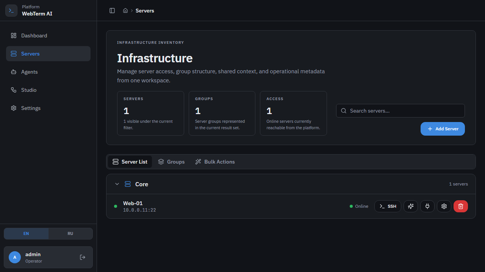
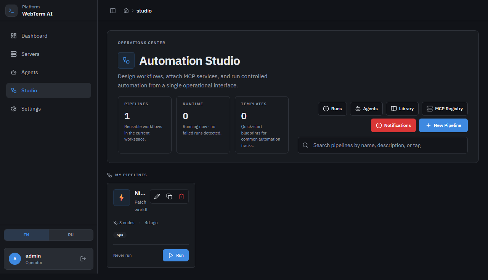
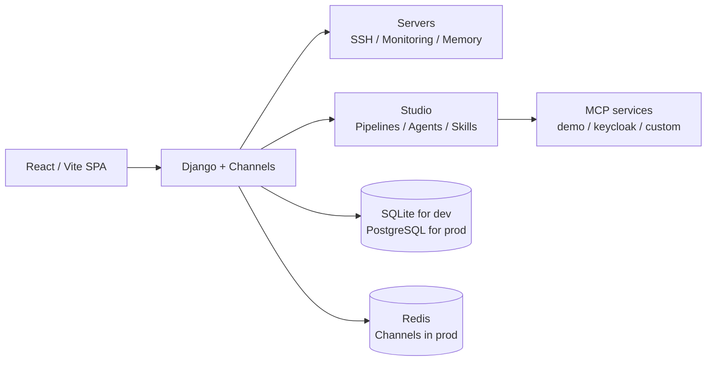

<p align="center">
  
</p>

<h1 align="center">WebTerm</h1>

<p align="center">
  Рабочая панель для серверов, терминалов и инфраструктурной автоматизации.
  Django держит API и WebSocket, React/Vite отвечает за веб-интерфейс.
</p>

<p align="center">
  
  
  
  
  
  
</p>

WebTerm собирает в одном месте то, что в обычной ops-работе часто живет в разных окнах: список серверов, SSH-доступ, мониторинг, заметки по инфраструктуре, AI-запуски, Studio pipelines, MCP-интеграции и уведомления. Это не отдельный SSH-клиент и не витрина для демо. Это рабочий интерфейс поверх Django backend, где сервер, его контекст и автоматизация находятся рядом.

## Как это выглядит

<table>
  <tr>
    <td width="50%" valign="top">
      
      <p><strong>Servers</strong><br />Инвентарь, группы, доступы, health-checks, SSH и быстрые действия по серверу.</p>
    </td>
    <td width="50%" valign="top">
      
      <p><strong>Studio</strong><br />Pipelines, triggers, runs, MCP registry, reusable agents, skills и уведомления.</p>
    </td>
  </tr>
</table>

## Что внутри

| Раздел | Практический смысл |
| --- | --- |
| Servers | Инвентарь серверов, группы, shares, проверка подключения, OS-detect, health history, контекст и knowledge по серверу. |
| Terminal | SSH через WebSocket, xterm.js на фронтенде, SFTP/file actions, snapshots перед рискованными изменениями. |
| Nova / Agents | AI-режимы для объяснения, планирования и выполнения задач по серверу с guardrails и подтверждениями. |
| Monitoring | Dashboard, alerts, watcher drafts и ручной запуск health-checks. |
| Studio | Визуальные pipeline-графы, triggers, node executors, run history, MCP tools, reusable agent configs и skill authoring. |
| Access | Сессии, группы, permissions, domain auto-login и audit middleware. |

## Типовые сценарии

- Открыть сервер, проверить состояние, перейти в SSH и сохранить контекст в одном месте.
- Запустить AI-агента по серверу, посмотреть live-лог, подтвердить план и получить отчет по выполнению.
- Собрать pipeline в Studio: webhook или schedule trigger, SSH-команда, MCP-вызов, human approval, Telegram или email на выходе.
- Поддерживать базу знаний по инфраструктуре: server context, memory events, runbooks и результаты прошлых действий.
- Дать операторам доступ только к нужным серверам, настройкам и действиям.

## Архитектура


```mermaid
flowchart LR
    UI["React / Vite SPA"] --> API["Django + Channels"]
    API --> Servers["Servers<br/>SSH / Monitoring / Memory"]
    API --> Studio["Studio<br/>Pipelines / Agents / Skills"]
    Studio --> MCP["MCP services<br/>demo / keycloak / custom"]
    API --> DB[("SQLite for dev<br/>PostgreSQL for prod")]
    API --> Redis[("Redis<br/>Channels in prod")]
```

Основная граница простая: `web_ui/` собирает Django-проект, `core_ui/` держит общие страницы и API, `servers/` отвечает за серверы и терминальные сценарии, `studio/` отвечает за automation layer, `app/` содержит общие runtime/LLM/safety сервисы.

## Быстрый старт

### Требования

- Python 3.10+
- Node.js 20+ и `npm`
- Docker Desktop, если нужен полный стек с PostgreSQL, Redis, nginx и MCP-сервисами

### Backend

`manage.py runserver` без явного порта сам использует `9000`. В WSL он автоматически слушает `0.0.0.0:9000`, чтобы Windows-браузер и Vite proxy не зависали на localhost relay; если нужен строгий loopback, задай `DJANGO_RUNSERVER_HOST=127.0.0.1`. Если `POSTGRES_HOST` и `POSTGRES_DB` не заданы, backend стартует на локальном SQLite, что удобно для первого запуска.

```powershell
python -m venv .venv
.\.venv\Scripts\Activate.ps1
python -m pip install --upgrade pip
pip install -r requirements-mini.txt
python manage.py migrate
python manage.py createsuperuser
python manage.py runserver
```

Если запускаешь backend в WSL, не передавай вручную `127.0.0.1:9000`; используй просто `python manage.py runserver` или `python manage.py runserver 0.0.0.0:9000`.
Если Windows `localhost:9000` после старого запуска WSL всё равно не отвечает, укажи Vite прямой адрес Ubuntu в `frontend/.env.local`: `VITE_DJANGO_URL=http://<ip из wsl hostname -I>:9000`.

После запуска:

- Django admin: `http://127.0.0.1:9000/admin/`
- Health endpoint: `http://127.0.0.1:9000/api/health/`

### Frontend

```powershell
cd frontend
npm ci
npm run dev
```

SPA будет доступна на `http://127.0.0.1:8080/`.

Если backend еще не поднят, для UI-разработки можно включить demo mode в `frontend/.env.local`:

```env
VITE_ENABLE_DEMO_MODE=true
```

### Linux/macOS

`bootstrap-linux.sh` умеет создать `.env`, поднять docker-сервисы, собрать venv, поставить зависимости, прогнать миграции и установить frontend-зависимости.

```bash
chmod +x ./bootstrap-linux.sh
./bootstrap-linux.sh
```

Полная Python-сборка с дополнительными RAG/embedding-зависимостями:

```bash
./bootstrap-linux.sh --full
```

Без Docker:

```bash
./bootstrap-linux.sh --no-docker
```

## Docker

Полный локальный стек:

```bash
cp .env.example .env
docker compose up -d --build
```

Этот compose поднимает не только web, но и рабочие фоновые процессы: расписания Studio,
расписания агентов, execution-plane для full/multi agents, monitor и Celery worker.
Если локально уже запущены Vite/Django на `8080`/`9000`, остановите их перед запуском
compose или поменяйте порты в `.env`.

Сервисы:

| Сервис | Порт | Назначение |
| --- | --- | --- |
| nginx / frontend | `8080` | Основная точка входа в SPA |
| backend | `9000` | Django API, admin, health, WebSocket backend |
| postgres | `${POSTGRES_PORT:-5432}` | Основная БД для compose-стека; внутри Docker всегда `postgres:5432` |
| redis | `6379` | Channels и runtime control |
| mcp-demo | `8765` | Демонстрационный MCP HTTP server |
| mcp-keycloak | `8766` | Keycloak MCP server |
| scheduled-pipelines | - | Фоновый запуск `trigger/schedule` в Studio pipelines |
| scheduled-agents | - | Планировщик server agents |
| celery-worker | - | Очереди памяти/фоновых задач через Redis |
| monitor | - | Health checks, alerts и cleanup старых monitoring данных |
| ops-supervisor | - | Memory dreams, agent execution plane и watcher drafts |
| telegram-bot | - | Optional profile для long-poll Telegram bot pipeline |

Проверка после старта:

```bash
docker compose ps
curl http://127.0.0.1:8080/api/health/
```

Telegram bot в dev не стартует по умолчанию. Если токен и chat_id уже заполнены:

```bash
docker compose --profile telegram-bot up -d telegram-bot
```

Production-заготовка:

```bash
cp .env.production.example .env.production
docker compose --env-file .env.production -f docker-compose.production.yml up -d --build
```

Telegram bot не стартует по умолчанию. Если pipeline и токен уже настроены, включай отдельный profile:

```bash
docker compose --env-file .env.production -f docker-compose.production.yml --profile telegram-bot up -d telegram-bot
```

При `DJANGO_DEBUG=false` backend специально требует нормальный `DJANGO_SECRET_KEY`, корректные `ALLOWED_HOSTS` и `CHANNEL_REDIS_URL` или `CELERY_BROKER_URL`.

## Настройка окружения

Шаблоны:

- [`.env.example`](./.env.example) - локальная разработка
- [`.env.production.example`](./.env.production.example) - production compose
- [`frontend/.env.example`](./frontend/.env.example) - Vite-переменные

Секреты не должны попадать в git. Минимум, который обычно проверяют руками:

| Переменная | Зачем нужна |
| --- | --- |
| `DJANGO_DEBUG` | Dev/prod режим. |
| `DJANGO_SECRET_KEY` | Обязателен в production. |
| `SITE_URL` | Базовый URL backend и ссылок из уведомлений. |
| `FRONTEND_APP_URL` | Внешний URL SPA. |
| `ALLOWED_HOSTS` | Допустимые host headers. |
| `CSRF_TRUSTED_ORIGINS` | Нужен при разных origin у frontend/backend. |
| `POSTGRES_*` | Переключают backend с SQLite на PostgreSQL. |
| `CHANNEL_REDIS_URL` | Нужен для production и multi-worker WebSocket control. |
| `PIPELINE_SCHEDULER_INTERVAL`, `SCHEDULED_AGENTS_INTERVAL` | Интервалы production worker-ов для schedule triggers и server agents. |
| `MONITOR_*`, `WATCHERS_*`, `MEMORY_DREAM_INTERVAL`, `AGENT_EXECUTION_INTERVAL` | Интервалы production monitor/ops-supervisor worker-ов. |
| `GEMINI_API_KEY`, `OPENAI_API_KEY`, `ANTHROPIC_API_KEY`, `GROK_API_KEY` | Провайдеры LLM-функций. |
| `TELEGRAM_BOT_TOKEN`, `TELEGRAM_CHAT_ID` | Telegram-уведомления. |
| `EMAIL_*`, `PIPELINE_NOTIFY_EMAIL` | Email-уведомления. |
| `KEYCLOAK_*` | Keycloak MCP integration. |

## Полезные команды

Backend:

```bash
python manage.py migrate
python manage.py createsuperuser
python manage.py runserver
python manage.py run_scheduled_pipelines
python manage.py run_scheduled_agents
python manage.py run_monitor
python manage.py run_telegram_bot
python manage.py run_watchers
python manage.py run_memory_dreams
python manage.py run_agent_execution_plane
python manage.py run_ops_supervisor --with-watchers
```

Frontend:

```bash
cd frontend
npm ci
npm run dev
npm run build
npm run test
npm run test:e2e:smoke
```

Качество и архитектурные проверки:

```bash
python scripts/check_architecture_sizes.py --strict-new
python -m pytest
ruff check .
ruff format .
```

## Структура репозитория

| Путь | Что там лежит |
| --- | --- |
| [`frontend/`](./frontend) | React/Vite SPA, Playwright/Vitest, Tailwind, UI-компоненты. |
| [`web_ui/`](./web_ui) | Django settings, root URLs, ASGI/WSGI, WebSocket routing. |
| [`core_ui/`](./core_ui) | Auth/session API, redirects, settings/access/admin endpoints, middleware. |
| [`servers/`](./servers) | Серверы, группы, SSH, monitoring, memory, server agents. |
| [`studio/`](./studio) | Pipelines, runs, triggers, MCP registry, skills, notifications. |
| [`app/`](./app) | Общие LLM, SSH, runtime, policy и safety сервисы. |
| [`docker/`](./docker) | Dockerfiles, nginx configs, startup scripts. |
| [`config/`](./config) | Версионируемые конфиги, которым не место в корне. |
| [`docs/`](./docs) | Документация, отчеты, MARS/QA-артефакты и локальные заметки. |
| [`scripts/`](./scripts) | Поддерживаемые maintenance-скрипты. |
| [`tests/`](./tests) | Backend и integration tests. |

Подробнее о текущей раскладке: [`docs/PROJECT_STRUCTURE.md`](./docs/PROJECT_STRUCTURE.md).

## Важные замечания

- Корневой каталог специально оставлен под entrypoint-файлы, которые ожидают Django, Docker, GitHub Actions и Python tooling.
- `frontend/node_modules/`, `frontend/dist/`, логи, runtime state и локальные `.env` игнорируются git.
- Опасные серверные действия должны проходить через проверки в [`app/tools/safety.py`](./app/tools/safety.py).
- Архитектурные ограничения по размеру файлов и import boundaries проверяются через [`scripts/check_architecture_sizes.py`](./scripts/check_architecture_sizes.py) и [`.importlinter`](./.importlinter).

## License

Проект распространяется по [Apache License 2.0](./LICENSE).
