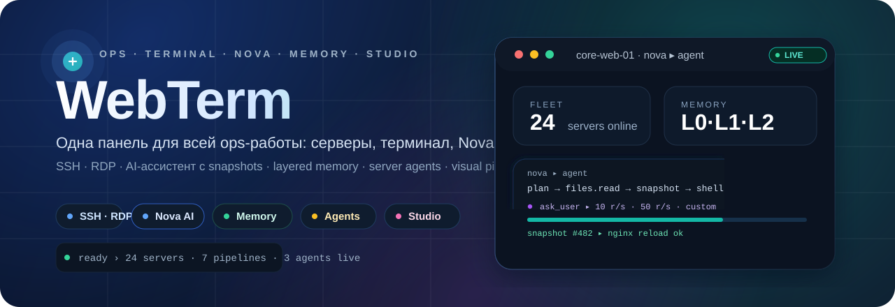

# WebTrerm

WebTrerm is a self-hosted admin and automation platform for teams that manage
servers, terminal work, infrastructure context, AI agents, and internal tools
from one browser workspace.

It is not just a web SSH client. The goal is to keep the server inventory,
terminal, monitoring, run history, automation pipelines, AI assistance, and
private plugin extensions in one controlled product.



## What This Project Does

- Manages servers, groups, access, health checks, and infrastructure context.
- Opens SSH terminals in the browser through Django Channels and xterm.js.
- Runs AI-assisted server and ops workflows with guardrails and audit logs.
- Builds Studio pipelines for scheduled jobs, webhooks, MCP tools, approvals,
  notifications, and reusable automation.
- Provides monitoring, alerts, watcher drafts, and operational history.
- Supports self-hosted plugin extensions through `.wtp` packages and private
  catalogs, without a public paid marketplace.
- Keeps permissions, settings, secrets, review gates, sandbox rules, and audit
  events explicit.

## Main Areas

| Area | Purpose |
| --- | --- |
| Servers | Inventory, SSH access, groups, monitoring, memory, and server actions. |
| Terminal | Browser terminal, SFTP/file actions, snapshots, and guarded commands. |
| Studio | Visual pipelines, triggers, runs, MCP registry, skills, and notifications. |
| Agents | AI-assisted execution, live logs, reports, and reusable agent configs. |
| Plugins | Internal extension manager for dashboards, pages, Studio nodes, tools, hooks, and connectors. |
| Access | Users, groups, feature gates, permissions, sessions, and audit events. |

## Stack

- Backend: Python, Django, Django Channels.
- Frontend: React, Vite, TypeScript, Tailwind.
- Runtime services: PostgreSQL, Redis, Celery, Docker Compose.
- Automation integrations: MCP services, LLM providers, Telegram/email
  notifications, optional Keycloak integration.

## Security

- Public process: [`SECURITY.md`](SECURITY.md) (supported versions, disclosure, SLA).
- Third-party notices: [`THIRD_PARTY_NOTICES.md`](THIRD_PARTY_NOTICES.md).
- Threat model and findings ledger: [`security/`](security/).
- CI: `.github/workflows/security.yml` (pip-audit, npm audit, SBOM, checksums, GitHub-signed provenance attestations).

## Repository Layout

```text
frontend/            React/Vite SPA
web_ui/              Django project settings, URLs, ASGI/WSGI
core_ui/             auth, access, settings, admin/common API
servers/             server inventory, SSH, monitoring, server agents
studio/              pipelines, runs, triggers, MCP, skills
app/                 shared runtime, LLM, safety, plugin contracts
plugin_marketplace/  internal plugin extension store and APIs
docs/                architecture notes and product plans
scripts/             maintenance and architecture checks
tests/               backend and integration tests
```

The internal Django app is still named `plugin_marketplace` for compatibility,
but the product direction is private/self-hosted plugin extensions.

## Quick Start

### Backend

The canonical backend development path is WSL/Linux with Python 3.11. Native
Windows is compatibility-only and is not release evidence. Never reuse one
virtual environment from both Windows and WSL; see the
[support matrix](docs/releases/SUPPORT_MATRIX.md).

WSL/Linux:

```bash
python3.11 -m venv .venv-wsl
source .venv-wsl/bin/activate
python -m pip install --require-hashes -r requirements-dev.lock
python manage.py migrate
python manage.py createsuperuser
python manage.py runserver 0.0.0.0:9000
```

From Windows PowerShell, the same locked setup can be launched inside WSL:

```powershell
wsl -e bash -lc 'cd /mnt/c/WebTrerm && ./bootstrap-linux.sh --no-docker --skip-frontend'
```

Backend URLs:

- Django admin: `http://127.0.0.1:9000/admin/`
- Health check: `http://127.0.0.1:9000/api/health/`

### Frontend

Use Node.js `22.23.1` with npm `10.9.8` (`.nvmrc` and `packageManager` are
versioned):

```powershell
cd frontend
npm ci
npm run dev
```

Frontend URL:

- `http://127.0.0.1:8080/`

For UI-only work without a backend, create `frontend/.env.local`:

```env
VITE_ENABLE_DEMO_MODE=true
```

## Docker

### One-command Linux server install

On a clean Linux host (installs Docker if needed, prepares env, starts the full
platform including agent workers, creates admin):

```bash
chmod +x install-server.sh
./install-server.sh --host 10.0.0.15
# or with HTTPS:
./install-server.sh --host webterm.example.com --https
```

This starts postgres, redis, backend, frontend, nginx, MCP services, plus
ops-supervisor, scheduled-agents, scheduled-pipelines, monitor,
kubernetes-ops-sync, and celery-worker.

### Local full stack

```bash
cp .env.example .env
docker compose up -d --build
```

### Production-like stack (manual)

```bash
cp .env.production.example .env.production
# edit secrets / SITE_URL / ALLOWED_HOSTS
./docker/install-production.sh --generate-secrets --create-superuser \
  --superuser-username admin \
  --superuser-email admin@example.com \
  --superuser-password 'ChangeMe123!'
```

Or:

```bash
docker compose --env-file .env.production -f docker-compose.production.yml up -d --build
```

Check services:

```bash
docker compose --env-file .env.production -f docker-compose.production.yml ps
curl http://127.0.0.1:8080/api/health/
```

## Useful Commands

```bash
python manage.py check
python manage.py migrate
python -m pytest
python scripts/check_architecture_sizes.py --strict-new
```

After editing runtime or development inputs, regenerate both Linux/Python 3.11
locks:

```bash
uv pip compile requirements-mini.txt -o requirements.lock \
  --python-version 3.11 --python-platform linux --generate-hashes
uv pip compile requirements-dev.in -o requirements-dev.lock \
  --python-version 3.11 --python-platform linux --generate-hashes
```

```bash
cd frontend
npm run build
npm run test
npm run test:e2e:smoke
```

## Documentation

- [Architecture index](docs/architecture/README.md)
- [Project structure](docs/PROJECT_STRUCTURE.md)
- [Plugin author guide](docs/architecture/PLUGIN_AUTHOR_GUIDE.md)
- [Plugin extension plan](docs/architecture/PLUGIN_MARKETPLACE_IMPLEMENTATION_PLAN.md)
- [Platform development rules](docs/architecture/PLATFORM_DEVELOPMENT_RULES.md)

## License

Apache License 2.0. See [LICENSE](LICENSE).
