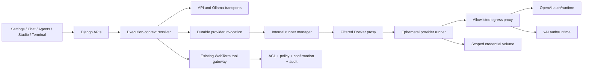

# Codex CLI и Grok CLI как AI-провайдеры WebTerm

- Статус: реализовано в коде, требуется live conformance/deployment gate
- Актуально на: 2026-08-11
- Целевой профиль: self-hosted, 5–30 внутренних пользователей
- Transport IDs: `codex_subscription`, `grok_subscription`
- Feature flag: `AI_CLI_SUBSCRIPTIONS_ENABLED=false` по умолчанию

## 1. Итоговое решение

WebTerm поддерживает Codex CLI и Grok CLI как отдельные subscription transports рядом с существующими API и Ollama. Подписка не маскируется под API-ключ и не меняет смысл существующих provider IDs.

Пользователь или администратор:

1. создаёт personal или workspace connection;
2. проходит официальный device/browser login;
3. назначает подключение или pool как default для Assistant, Agents, Terminal или Internal;
4. при необходимости переопределяет binding для конкретного чата, агента, pipeline или запуска;
5. получает typed error при auth/limit/capacity/runtime failure — без перехода на другой provider.

Все CLI-процессы работают в отдельных ephemeral контейнерах. OAuth/device credentials находятся только в scoped Docker volume и не возвращаются frontend, Django API, логам или базе.

## 2. Зафиксированные продуктовые требования

- Personal connections доступны только владельцу.
- Workspace connections создаёт staff/admin; доступ default-deny через явные user/group/project grants.
- Workspace pool выбирает доступного healthy member, после чего конкретный connection закрепляется за session/run.
- Default concurrency для connection — `1`; увеличение является явным admin-решением.
- Поддерживаются interactive и unattended/scheduled вызовы.
- Scheduled jobs сохраняют binding snapshot до постановки в очередь.
- Есть defaults по назначению и override конкретного объекта/запуска.
- API/Ollama остаются самостоятельными canonical targets.
- Нельзя автоматически fallback на иной CLI, API, Ollama или иной subscription account.
- Subscription transport не используется для embeddings.
- Если отдельный embedding backend не настроен, RAG выключен и API возвращает `409 rag_embedding_backend_not_configured`.
- CLI не получает прямой SSH, Docker socket, backend filesystem, application secrets или произвольный shell.
- Любое действие с инфраструктурой выполняется существующими WebTerm tools с permissions, policy и confirmations.

## 3. Canonical provider targets

| Target | Transport | Legacy input |
| --- | --- | --- |
| `openai_api` | OpenAI API | `openai` |
| `grok_api` | xAI API | `grok` |
| `claude_api` | Anthropic API | `claude`, `anthropic` |
| `gemini_api` | Gemini API | `gemini` |
| `ollama_local` | Ollama HTTP | `ollama` |
| `codex_subscription` | isolated Codex SDK/CLI | `codex`, `codex_cli` |
| `grok_subscription` | isolated Grok ACP/CLI | `grok_cli`, `grok_build` |

`grok` всегда означает xAI API. `grok_subscription` всегда означает subscription CLI. Subscription target никогда не преобразуется в API target.

## 4. Архитектура



Границы модулей:

- `app/ai_runtime/` — pure contracts, target normalization, typed events/errors и routing precedence;
- `app/core/` — LLM facade bridge, без Django imports в pure contract;
- `core_ui/models/ai_providers.py` — connection/auth/pool/grant/preference/invocation/lease metadata;
- `core_ui/services/` — ACL, routing, auth worker, invocation persistence и backpressure;
- `ai_cli_runner_manager/` — internal HTTP manager, Docker lifecycle и provider adapters;
- `servers/`, `studio/`, Assistant и Terminal — builders для `LLMExecutionContext`;
- `frontend/src/api/aiProviders.ts` и settings/surface selectors — пользовательский UI.

## 5. Единый execution context

Каждый generative LLM call получает:

```text
actor_user_id
project_id
purpose
source_kind
source_id
mode = interactive | unattended
binding
provider_session_id
idempotency_key
tool_policy
output_schema
```

Routing precedence:

1. explicit per-call/per-run binding;
2. stored binding объекта или snapshot запуска;
3. personal user preference по purpose;
4. workspace preference по purpose;
5. явно настроенный platform API/Ollama default.

Resolver проверяет выбранный binding один раз. Если он недоступен, истёк, исчерпал лимит или занят, вызов завершается typed error. Resolver не пробует следующий пункт после runtime failure.

Purpose mapping:

| Surface | Purpose/default | Mode |
| --- | --- | --- |
| Assistant/Operator chat | `assistant` | interactive |
| Server Agent, Studio Agent, Pipeline | `agents` | interactive или unattended |
| Terminal AI | `terminal` | interactive |
| monitoring, memory, adaptation и internal summaries | `internal` | обычно unattended |

Статический AST guard тестирует, что все production-вызовы `stream_chat` и `stream_chat_tools` передают `execution_context=`.

## 6. Модель данных

### `AIProviderConnection`

- target, scope, owner, status, enabled;
- opaque `credential_ref`, не secret;
- runtime/auth revision, health/limits/error metadata;
- concurrency limit;
- timestamps verification и lifecycle.

### `AIConnectionAuthFlow`

- public flow ID;
- status, verification URI, user code, expiry;
- durable claim: `claimed_at`, `claimed_by`, `lease_expires_at`;
- только один pending flow на connection.

### `AIProviderPool` и `AIProviderPoolMember`

- только workspace connections одного target;
- enabled membership и weight metadata;
- выбор только среди connected, enabled, ACL-accessible members со свободным slot.

### `AIProviderConnectionGrant`

- ровно один principal: user, group или project/project role;
- отдельные `allow_interactive` и `allow_unattended`;
- отсутствие grant означает deny.

### `AIProviderPreference`

- purpose-specific user или workspace default;
- binding содержит target и connection/pool/model;
- subscription binding обязан ссылаться на connection или pool.

### `AIProviderInvocation` и `AIProviderLease`

- immutable binding snapshot и selected connection;
- status, usage, provider session, error code;
- globally unique non-empty idempotency key;
- fenced slot lease, owner, heartbeat, expiry и release state.

ChatSession, AgentRun, PipelineRun и TerminalAiProviderState хранят binding/session snapshot. Pool binding после успешного выбора преобразуется в точный connection binding.

## 7. Authentication lifecycle

1. Backend создаёт opaque credential reference и pending flow.
2. Production auth worker атомарно claims flow через PostgreSQL row lock.
3. Runner стартует официальный device flow внутри credential container.
4. Frontend получает только HTTPS verification URL и short user code.
5. Verification URL проверяется по provider-owned host allowlist.
6. После success connection получает `connected` и новую auth revision.
7. Verify выполняется в том же scoped volume.
8. Revoke сначала завершает только процессы этого connection и удаляет только его volume.
9. Если cleanup не подтверждён, DB record/credential reference сохраняется, API возвращает ошибку; ложный `revoked` не записывается.

Production запускает `run_ai_provider_auth_worker`; daemon thread остаётся только локальным development режимом.

## 8. Provider adapters

### Codex

- pinned package: `openai-codex==0.144.4`;
- device-code login через официальный SDK;
- thread start/resume;
- `ApprovalMode.deny_all`;
- `Sandbox.read_only` и `cwd=/workspace`;
- structured output для tool protocol;
- provider stderr/exception detail не передаётся пользователю.

### Grok

- официальный Grok Build binary передаётся в image build как exact URL + SHA-256;
- ACP stdio (`grok agent stdio`);
- cached-token verification и device login;
- `session/new`, `session/load`, prompt/update streaming;
- terminal и filesystem capabilities не выдаются;
- auto-update внутри production image запрещён immutable image lifecycle.

Перед release необходимо live-подтверждение конкретных pinned versions на тестовых personal accounts. Unit/fake conformance не подтверждает entitlement или provider quota.

## 9. Versioned runner protocol

Request schema: `webterm.ai-cli-runner-request.v1`.

Ограничения:

- только subscription targets;
- connection/invocation IDs проходят строгий format validation;
- до 200 messages/tools;
- суммарный prompt до 500 000 chars;
- encoded request до 1 MiB;
- output до configured hard limit;
- only JSON objects/lists в schema fields.

Normalized event types:

- `text_delta`, `reasoning_delta`;
- `tool_request`, `tool_result`, `approval_required`;
- `usage`, `limit`, `auth_required`;
- `cancelled`, `completed`, `error`.

Raw hidden chain-of-thought не сохраняется. Неизвестный tool, malformed arguments или non-JSON tool response даёт `provider_tool_protocol_invalid`; такой turn не получает последующий `completed`.

## 10. Isolation и network policy

Каждый provider invocation запускается с:

- immutable image digest (`sha256:...` или repository digest);
- non-root `10001:10001`;
- read-only root filesystem;
- `cap-drop=ALL`;
- `no-new-privileges`;
- private cgroup namespace;
- bounded CPU, RAM и PIDs;
- no-exec tmpfs `/tmp` и `/workspace`;
- единственным credential volume конкретного connection;
- dedicated `ai-cli-egress` network;
- mandatory HTTP/HTTPS proxy.

Runner не монтирует host workspace, SSH keys, app config, database socket или Docker socket. Docker socket видит только отдельный proxy. Proxy разрешает только заранее сформированный hardened runner create/start/stop и точное удаление volume с approved prefix. Arbitrary containers, images, mounts, networks и unrelated volumes запрещены.

Egress proxy разрешает только необходимые OpenAI/xAI hosts и запрещает direct routing к backend, Postgres, Redis, Docker и metadata services.

## 11. WebTerm tools и подтверждения

CLI-модель не исполняет tools самостоятельно. Prompt сообщает только allowlisted WebTerm tool schema. Provider возвращает constrained JSON tool request, затем обычный Operator/Agent runtime:

1. повторно разрешает tool по user/project/server permissions;
2. применяет policy и risk classification;
3. требует существующее typed confirmation для mutating action;
4. выполняет действие в WebTerm execution plane;
5. пишет существующий audit/event trail;
6. возвращает redacted result модели.

Таким образом, смена AI transport не расширяет права пользователя и не создаёт отдельный privileged execution path.

## 12. REST API и UI

REST namespace: `/api/ai/providers/`.

- catalog;
- connection list/create/detail/revoke;
- auth start и auth-flow polling;
- verify;
- pool CRUD;
- grant create/delete;
- user/workspace preferences.

API никогда не сериализует `credential_ref`, OAuth tokens, credential files или provider stderr.

Frontend:

- `/settings/ai-connections` для personal/workspace connections, device auth, verify/revoke;
- per-purpose defaults;
- admin pool/grant controls;
- provider selector в Assistant chat;
- provider binding в Server Agent wizard;
- unattended binding в Studio AgentConfig;
- unattended binding в Pipeline Editor;
- API поддерживает explicit binding для manual agent/pipeline run.

Пустой binding означает реальное удаление stored override. Он не материализует текущий default в объект.

## 13. Unattended jobs и capacity

- Schedule dispatch разрешает binding в unattended mode до создания run.
- Run сохраняет binding snapshot; последующее изменение preference не меняет уже поставленный run.
- Connection concurrency по умолчанию равен `1`.
- При pool route выбирается свободный доступный member и закрепляется на run/session.
- Interactive backpressure по умолчанию ждёт до 30 секунд.
- Unattended backpressure по умолчанию ждёт до 300 секунд.
- Ожидание не меняет binding и не выбирает другой account/provider.
- Lease heartbeat продлевает ownership; fencing token растёт после освобождения/истечения slot.
- Duplicate idempotency owner не может повторно запустить уже созданный invocation.

## 14. RAG и embeddings

Subscription CLI нельзя использовать как embedding backend.

Если `app.rag.engine.RAGEngine` отсутствует или недоступен:

- RAG health = `disabled`;
- add/query/reset/delete/documents/upload возвращают 409;
- upload не записывает файл перед этой проверкой;
- legacy chat с `use_rag=true` возвращает 409;
- Django pages показывают RAG unavailable, а не падают при import.

Для включения RAG нужен отдельно настроенный и проверенный embedding backend. Он остаётся самостоятельным target и budget domain.

## 15. Production deployment runbook

### 15.1 Собрать provider image

Получить exact official Grok Build artifact URL и SHA-256 из утверждённого release record, затем:

```powershell
docker build `
  -f docker/ai-cli-provider-runner.Dockerfile `
  --build-arg GROK_BUILD_URL=$env:GROK_BUILD_URL `
  --build-arg GROK_BUILD_SHA256=$env:GROK_BUILD_SHA256 `
  -t webterm-ai-cli-provider:approved .

docker image inspect webterm-ai-cli-provider:approved --format '{{.Id}}'
```

Значение `sha256:<64 hex>` из inspect записать в `AI_CLI_RUNNER_IMAGE`. Tag `latest` manager отклонит.

### 15.2 Настроить environment

Обязательные значения:

```text
AI_CLI_SUBSCRIPTIONS_ENABLED=true
AI_CLI_RUNNER_MANAGER_TOKEN=<strong random internal token>
AI_CLI_RUNNER_IMAGE=sha256:<64 lowercase hex>
```

Рекомендуемые defaults находятся в `.env.production.example`. Provider credentials туда не записываются.

### 15.3 Применить migrations и запустить профиль

```powershell
docker compose --env-file .env.production -f docker-compose.production.yml run --rm backend python manage.py migrate
docker compose --env-file .env.production -f docker-compose.production.yml --profile ai-cli up -d --build
```

Проверить:

```powershell
docker compose --env-file .env.production -f docker-compose.production.yml --profile ai-cli ps
docker compose --env-file .env.production -f docker-compose.production.yml logs ai-cli-runner-manager ai-provider-auth
```

### 15.4 Emergency stop

1. выставить `AI_CLI_SUBSCRIPTIONS_ENABLED=false` для backend/workers;
2. перезапустить backend и execution workers;
3. остановить profile services;
4. revoke affected connections через UI/API;
5. не удалять credential volumes массовой wildcard-командой;
6. сохранить invocation/audit metadata для расследования.

## 16. Проверки

Обязательные automated gates:

- Django system check и migration consistency;
- runtime/routing/ACL/pool/lease tests;
- auth claim/recovery/URL allowlist tests;
- runner protocol/adapter/fake runtime tests;
- Docker socket proxy allow/deny tests;
- credential revoke exact-scope tests;
- no-context AST coverage test;
- Assistant/Operator, Server Agent, Studio Pipeline и Terminal regressions;
- frontend typecheck, ESLint, unit tests и production build;
- compose config с profile `ai-cli`;
- `git diff --check`.

Live gates, которые нельзя заменить unit tests:

1. migrations и lease contention на PostgreSQL;
2. Docker runner на Linux host;
3. Codex device login, verify, first turn, resume, cancel, revoke;
4. Grok device login, ACP session new/load, cancel, revoke;
5. egress deny probes к arbitrary internet, backend, Postgres, Redis и metadata IP;
6. cross-user volume/connection/flow ID probes;
7. worker/manager restart во время auth и invocation;
8. auth expiry, quota/limit и provider outage;
9. 5–30-user capacity/load с concurrency `1`, pools и schedule backlog;
10. подтверждение актуальных provider integration terms для self-hosted use.

## 17. Rollout gates

### Gate A — controlled pilot, 1–5 users

- Codex и Grok live conformance green;
- только self-hosted trusted users;
- feature flag включается admin вручную;
- no credentials in DB/API/log/browser payload;
- revoke и emergency stop доказаны;
- no silent fallback tests green.

### Gate B — 5–30 internal users

- PostgreSQL leases/fencing и restart tests green;
- workspace grants/pools прошли cross-user audit;
- real capacity/backpressure load green;
- dashboards/runbook/alerts готовы;
- device-auth worker работает отдельно от HTTP processes.

### Gate C — public/commercial

Не входит в текущий scope. Потребуются отдельные provider-policy/commercial review, external secrets/KMS strategy, abuse/account-takeover controls, network isolation review и penetration test. Consumer subscription нельзя использовать как скрытую shared backend capacity.

## 18. Текущий verification status

Подтверждено локально:

- contracts, canonical target separation и strict routing;
- personal/workspace ACL, grants, pools, leases/fencing;
- durable auth claim model;
- exact credential revoke policy;
- Codex/Grok adapter normalization;
- tool protocol fail-closed;
- integration со всеми Python generative callsites;
- Assistant/Agent/Studio/Terminal persisted bindings;
- TLS CONNECT-only egress allowlist и exact-scope Docker socket policy;
- `manage.py check`, `makemigrations --check` и production `check --deploy`;
- Ruff по всем изменённым Python-файлам и strict architecture fitness gate;
- 66/66 provider/routing/auth/runner/security contract tests;
- 125/125 Assistant/Agent/Studio/Terminal/playbook integration tests;
- frontend typecheck, ESLint, 61/61 test files (229/229 tests) и production build;
- production Compose model с profile `ai-cli` и `git diff --check`.

Ещё не является live-доказательством:

- PostgreSQL `localhost:5433` недоступен в текущем окружении, поэтому locking/lease contention остаётся deployment gate;
- Docker daemon недоступен в текущем окружении, поэтому Linux container conformance и реальные image builds остаются deployment gate;
- реальные Codex/Grok accounts нужны для device auth и quota tests;
- production images должны быть собраны и pinned до включения flag.

## 19. Официальные источники

- OpenAI Codex app-server: <https://learn.chatgpt.com/docs/app-server>
- OpenAI Codex authentication: <https://learn.chatgpt.com/docs/auth>
- OpenAI Codex SDK: <https://learn.chatgpt.com/docs/codex-sdk>
- xAI Grok headless scripting: <https://docs.x.ai/build/cli/headless-scripting>
- xAI Grok CLI reference: <https://docs.x.ai/build/cli/reference>

Provider docs являются меняющимся внешним контрактом. Exact versions, artifact checksums, tested auth behavior и review date входят в release evidence.
