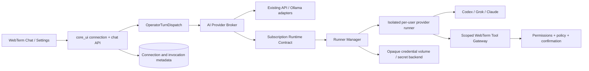

# AI-провайдеры через пользовательские подписки и CLI — план реализации

- Статус: implementation plan
- Дата: 2026-07-31
- Владельцы доменов: `app` — чистые runtime-контракты; `core_ui` — пользовательские подключения, auth, permissions и audit; отдельный runner service — изолированное выполнение CLI
- Frontend surface: `frontend/src/pages/settings`, Chat/Operator provider picker
- Первый rollout: self-hosted controlled pilot, Codex subscription, chat/read-only
- Public multi-user rollout: запрещён до прохождения отдельного security, provider-policy, durability и load gate

## 1. Решение

WebTerm должен поддержать пользовательские AI-подписки как дополнительный transport рядом с существующими API и Ollama:

1. Пользователь подключает собственную подписку через официальный login flow провайдера.
2. WebTerm запускает официальный CLI или agent runtime в отдельной изолированной среде этого пользователя.
3. Runtime-события преобразуются в единый внутренний контракт WebTerm.
4. Frontend продолжает работать с обычным Chat/Operator API и не знает деталей CLI.
5. WebTerm tools доступны модели только через scoped gateway с серверной проверкой permissions, policy и confirmations.
6. Системные фоновые задачи, embeddings и массовые вызовы продолжают использовать API или локальные модели.

Подписка не превращается в API-ключ. WebTerm не должен извлекать OAuth access token из CLI-хранилища и использовать его для прямых запросов к provider API.

Целевой продуктовый режим:

| Назначение | Рекомендуемый transport |
| --- | --- |
| Интерактивный Chat/Operator | пользовательская CLI-подписка или API |
| Coding/ops agent в выбранном workspace | пользовательская CLI-подписка |
| Read-only диагностика через WebTerm tools | CLI-подписка + scoped MCP/tool gateway |
| Изменяющие действия | CLI-подписка + `AssistantAction` + обязательная policy/confirmation |
| Embeddings/RAG indexing | API или локальная модель |
| Cron, monitoring summaries, массовая классификация | API или локальная модель |
| Высокая параллельность и SLA | API/enterprise provider transport |

Первым provider adapter должен стать Codex через `codex app-server`. Grok Build и Claude Code подключаются после стабилизации общего контракта, не параллельными ad-hoc subprocess-ветками.

## 2. Продуктовые границы

### 2.1 Что строим

- Личные AI connections пользователя: Codex, Grok Build, Claude Code.
- Официальный browser/device-code login без передачи пароля WebTerm.
- Изолированное per-user/per-provider credential storage.
- Единый provider event protocol для Chat, Operator и будущих agent surfaces.
- Продолжение и отмена provider sessions там, где это официально поддерживается.
- Явный выбор между личной подпиской, platform API и Ollama.
- Понятные состояния: подключено, нужна повторная авторизация, лимит исчерпан, runtime недоступен.
- Scoped tool access через WebTerm permissions и approvals.
- Kill switches отдельно для всего subsystem и каждого provider adapter.

### 2.2 Что не строим

- Не раздаём одну подписку нескольким пользователям.
- Не продаём и не перепродаём provider usage.
- Не принимаем cookies, `auth.json`, refresh tokens или скопированные browser sessions через UI.
- Не вызываем provider API токеном, извлечённым из CLI credential cache.
- Не обещаем API-совместимые rate limits, token accounting или SLA для consumer subscriptions.
- Не заменяем подписками embeddings, batch jobs и все внутренние LLM-вызовы.
- Не разрешаем CLI прямой доступ к backend container, Docker socket, общей файловой системе или секретам серверов.
- Не включаем mutating WebTerm tools в первом pilot.
- Не реализуем Codex, Claude и Grok одним mega-PR.
- Не обновляем CLI автоматически внутри production runner.

### 2.3 Поддерживаемые deployment-профили

| Профиль | Статус | Ограничения |
| --- | --- | --- |
| Один self-hosted оператор | целевой первый pilot | Codex, chat/read-only, ручное включение admin |
| 5–10 внутренних пользователей | после pilot gate | отдельный runner/credential scope на пользователя, monitoring и kill switch |
| 20–30 пользователей | только после multi-worker/load gate | durable runner dispatch, capacity model, restart/lease tests |
| Публичный multi-tenant SaaS | не входит в pilot | требуется явная provider-policy/commercial проверка, усиленная изоляция и abuse controls |

## 3. Подтверждённое текущее состояние WebTerm

### 3.1 Provider registry и API runtime

- `app/core/provider_adapters.py` уже различает `api` и `cli` provider types.
- `app/core/llm_provider_stream.py` является общей веткой потоковых API-вызовов для Gemini, Grok, Claude, OpenAI и Ollama.
- Текущие публичные provider IDs (`grok`, `openai`, `claude`, `ollama`) уже используются в config, frontend и usage logs. Их нельзя тихо переопределять как subscription transport.
- `app/core/model_config.py` маршрутизирует `chat`, `agent` и `orchestrator`, но configuration глобальная, а не пользовательская.
- `core_ui/managed_secrets.py` хранит LLM API keys в глобальном `LLM_API_KEY_OBJECT_ID = 1`.

Следствие: subscription connection должна быть отдельной сущностью и отдельным routing target. Нельзя использовать поле `provider="claude"` одновременно для Anthropic API и Claude Code subscription.

### 3.2 CLI-заготовки

- `core_ui/views/chat_helpers.py` умеет запускать Cursor CLI и стримить stdout.
- Cursor запускается обычным backend subprocess с унаследованным process environment и общим workspace. Это нельзя использовать как multi-user security model.
- `web_ui/settings/runtime_services.py` содержит конфигурации Cursor, Claude и Codex CLI, но Claude/Codex не подключены к общему LLM routing contract.
- Текущая Claude CLI config содержит `--dangerously-skip-permissions`, а Codex config — deprecated `--full-auto`. Новый subscription runtime не должен наследовать эти флаги.
- `provider_adapters.py` описывает Claude как CLI provider, но требует `ANTHROPIC_API_KEY`; фактический `stream_provider_chat(..., model="claude")` использует Anthropic SDK/API. Это naming debt, а не готовая subscription integration.

### 3.3 Chat и durable dispatch

- `ChatSession`, `ChatMessage`, `AssistantAction` и `ChatTurnState` уже моделируют chat, tool confirmations и parked turns.
- `OperatorTurnDispatch` уже является durable lease-owned очередью с `queued/claimed/completed/failed/canceled`, heartbeat, lease expiry и retry count.
- `run_operator_execution_plane` присутствует в development и production compose.

Следствие: subscription provider не должен создавать второй независимый Operator queue. Он подключается как provider invocation внутри существующего turn/dispatch lifecycle. Отдельная durable сущность нужна только для состояния внешнего CLI invocation и его reconciliation.

### 3.4 Isolation foundation

- `app/agent_kernel/sandbox/ephemeral_runner.py` уже задаёт хороший fail-closed Docker baseline: immutable image digest, non-root user, read-only rootfs, dropped capabilities, `no-new-privileges`, tmpfs, CPU/RAM/PID limits и bounded input/output.
- Этот runner предназначен для коротких SSH commands и удаляется после вызова.
- Subscription CLI требует долгоживущего credential volume, provider session resume и отдельного lifecycle controller.

Следствие: нужно переиспользовать hardening rules, но не расширять `ephemeral_runner.py` provider-specific ветками.

### 3.5 Settings и permissions

- `/api/settings/` и `SettingsAIPage` сейчас ориентированы на platform-wide config.
- Изменение AI provider/model и API keys доступно только staff/admin.
- Обычный пользователь не может иметь собственное provider connection или routing preference.

Следствие: personal subscription connections должны получить отдельный user-owned API. Их нельзя добавлять в admin-only settings payload.

## 4. Provider support matrix

Матрица фиксирует transport, а не право бесконечно использовать consumer subscription в любом deployment. Перед включением публичного продукта условия и официальные integration paths перепроверяются.

| Adapter ID | Provider family | Runtime | Auth для pilot | Machine interface | Первый scope |
| --- | --- | --- | --- | --- | --- |
| `codex_subscription` | OpenAI | Codex app-server | ChatGPT sign-in/device auth | JSON-RPC events | Chat + read-only |
| `grok_subscription` | xAI | Grok Build | browser/device auth | ACP или streaming JSON | Chat + read-only |
| `claude_subscription` | Anthropic | Claude Code | Claude account login | Agent SDK или stream JSON | Chat + read-only |

### 4.1 Codex

- Использовать `codex app-server`, а не разбор терминального UI.
- App-server предназначен для интеграции auth, conversations, approvals и streaming events в собственный клиент.
- Начальный sandbox: read-only.
- `codex exec` допустим только для compatibility spike/fallback, но не должен стать основным долгоживущим protocol.
- ChatGPT-managed auth в unattended/public automation считается advanced mode; pilot остаётся self-hosted и user-owned.

### 4.2 Grok Build

- Предпочитать ACP (`grok agent stdio`), если provider conformance spike подтверждает стабильный lifecycle.
- Допустимый fallback: `grok -p --output-format streaming-json --no-auto-update`.
- Для headless login использовать официальный device-code flow.
- Не включать `--always-approve`.

### 4.3 Claude Code

- Сначала проверить Agent SDK и официальный machine-readable auth lifecycle.
- Fallback для turn execution: `claude -p --output-format stream-json` с ограниченным permission mode.
- Не использовать `--dangerously-skip-permissions`.
- Claude Pro/Max покрывает Claude Code, но не является Anthropic API entitlement. Adapter не должен маскировать CLI usage под API usage.
- Public/commercial rollout блокируется, пока официальный договор/документация не подтверждает выбранный integration mode.

### 4.4 Обязательный compatibility record

Для каждого adapter release хранить и показывать admin:

- provider и adapter ID;
- pinned CLI/SDK version;
- image digest;
- поддерживаемый login method;
- поддержка device flow;
- поддержка resume/cancel;
- event schema version;
- tool/approval behavior;
- provider terms review date;
- tested operating systems/container base;
- known quota/reporting limitations.

## 5. Целевая архитектура



### 5.1 Domain ownership

| Responsibility | Owner | Target modules |
| --- | --- | --- |
| Pure provider/runtime contracts | `app` | `app/ai_runtime/contracts.py`, `events.py`, `capabilities.py`, `registry.py`, `routing.py` |
| Provider event parsers | `app` | `app/ai_runtime/adapters/codex.py`, `grok.py`, `claude.py` |
| ORM connections/invocations | `core_ui` | `core_ui/models/ai_provider.py` |
| User auth flow orchestration | `core_ui` | `core_ui/services/ai_connections/` |
| Durable provider invocation bridge | `core_ui` | `core_ui/services/ai_provider_invocations/` |
| HTTP endpoints | `core_ui` | `core_ui/views/ai_connection_views.py` |
| Runner orchestration | separate service | `app/ai_runner/` package + dedicated process/image |
| Scoped WebTerm tool gateway | `core_ui` contract + domain providers | `core_ui/services/ai_tool_gateway/` |
| Frontend API | frontend | `frontend/src/api/aiConnections.ts` |
| Frontend UI | frontend | `frontend/src/pages/settings-ai-connections/` |

`app` contracts не импортируют Django, `core_ui`, `servers` или `studio`. Server/Studio capabilities подключаются к tool gateway через существующие provider/registry seams.

### 5.2 Stable routing identity

Не переиспользовать legacy provider names для разных transports. Ввести `ProviderTarget`:

```text
target_id: openai_api | codex_subscription | xai_api | grok_subscription |
           anthropic_api | claude_subscription | ollama_local | ollama_cloud
provider_family: openai | xai | anthropic | ollama
transport: api | subscription_cli | local
runtime_adapter: responses_api | codex_app_server | grok_acp |
                 anthropic_api | claude_code | ollama_http
```

Legacy values остаются совместимыми:

| Legacy provider | Canonical target |
| --- | --- |
| `openai` | `openai_api` |
| `grok` | `xai_api` |
| `claude` | `anthropic_api` |
| `ollama` | определяется текущим local/cloud config |

### 5.3 Pure runtime contract

Минимальный protocol:

```python
class SubscriptionRuntime(Protocol):
    async def start(self, request: StartInvocation) -> RuntimeHandle: ...
    async def stream(self, handle: RuntimeHandle, after_seq: int = 0) -> AsyncIterator[ProviderEvent]: ...
    async def respond_to_approval(self, handle: RuntimeHandle, decision: ApprovalDecision) -> None: ...
    async def cancel(self, handle: RuntimeHandle) -> None: ...
    async def reconcile(self, handle: RuntimeHandle) -> RuntimeStatus: ...
    async def close(self, handle: RuntimeHandle) -> None: ...
```

`ProviderEvent` использует versioned envelope:

```json
{
  "schema": "webterm.ai-provider-event.v1",
  "sequence": 17,
  "invocation_id": "uuid",
  "type": "message.delta",
  "timestamp": "2026-07-31T12:00:00Z",
  "payload": {"text": "..."}
}
```

Обязательные event types:

- `runtime.started`;
- `session.created`;
- `message.delta`;
- `message.completed`;
- `reasoning.status` без raw hidden reasoning;
- `tool.requested`;
- `approval.required`;
- `tool.completed`;
- `usage.updated` с nullable counters;
- `limit.reached`;
- `auth.required`;
- `runtime.warning`;
- `runtime.failed`;
- `runtime.completed`;
- `runtime.canceled`.

Unknown event type не игнорируется молча: сохраняется sanitized diagnostic и переводит adapter в controlled compatibility error, если событие влияет на correctness.

## 6. Модель данных

### 6.1 `AIProviderConnection`

Новая user-owned ORM-сущность в `core_ui`:

| Поле | Назначение |
| --- | --- |
| `id` UUID | opaque connection ID |
| `user` FK | единственный владелец |
| `target_id` | `codex_subscription`, `grok_subscription`, `claude_subscription` |
| `status` | lifecycle state |
| `credential_ref` | opaque runner/vault reference, никогда не token |
| `external_account_label` | optional masked display label |
| `capabilities` JSON | verified adapter capabilities snapshot |
| `runtime_version` | фактически проверенная CLI/SDK version |
| `image_digest` | immutable runner image identity |
| `policy_version` | применённая sandbox/tool policy |
| `connected_at` | успешное завершение auth |
| `last_verified_at` | последняя health/auth проверка |
| `last_used_at` | последняя invocation |
| `status_code` | стабильный safe reason code |
| `status_detail` | sanitized admin/user detail |
| `disabled_at` | local disable timestamp |
| `created_at`, `updated_at` | audit timestamps |

Connection status state machine:

```text
new -> authorizing -> connected -> degraded -> connected
                       |    |          |
                       |    |          -> reauth_required
                       |    -> limited -> connected
                       -> disabled -> authorizing
                       -> revoked
                       -> error -> authorizing
```

Один пользователь может иметь максимум одну активную connection на один `target_id` в v1. Повторное подключение создаёт новый auth flow, но не перезаписывает рабочие credentials до успешного verify.

### 6.2 `AIConnectionAuthFlow`

Короткоживущая запись для login ceremony:

- connection/user;
- provider adapter;
- state nonce digest;
- PKCE/device-flow metadata без client secret;
- safe verification URI;
- masked user code, если provider его возвращает;
- expires/started/completed/canceled timestamps;
- status и sanitized error code;
- initiating IP/user-agent audit metadata.

Raw access/refresh token в этой таблице запрещён.

### 6.3 `AIProviderInvocation`

Durable состояние одного provider turn:

| Поле | Назначение |
| --- | --- |
| `id` UUID | idempotency и event correlation |
| `user`, `connection` | ownership |
| `chat_session`, `chat_turn` nullable FK | связь с Operator lifecycle |
| `purpose` | chat/agent/orchestrator/terminal purpose |
| `status` | queued/starting/running/awaiting_approval/terminal state |
| `runner_handle` | opaque runner session reference |
| `provider_session_ref` | opaque resume reference, если безопасно хранить |
| `workspace_ref` | selected isolated workspace, не raw host path |
| `sandbox_policy` JSON | immutable snapshot |
| `capability_grant` JSON | immutable scoped grants |
| `last_event_sequence` | replay/reconnect cursor |
| `lease_owner`, `lease_expires_at`, `heartbeat_at` | reconciliation |
| `attempt_count`, `max_attempts` | bounded retry |
| `first_output_at`, `completed_at` | latency/operations |
| `stop_reason`, `error_code`, `safe_error` | diagnostics |
| token counters nullable | только если provider надёжно сообщает их |

Invocation state machine:

```text
queued -> starting -> running -> awaiting_approval -> running
   |         |          |              |
   |         |          |              -> canceled / timed_out
   |         |          -> completed / failed / limited / auth_required
   |         -> failed / timed_out
   -> canceled
```

Retry разрешён автоматически только до подтверждённого provider session acceptance. После acceptance retry требует provider resume/idempotency support; иначе invocation завершается `reconcile_required`, чтобы не создать двойное действие или двойной расход лимита.

### 6.4 Usage accounting

Текущий `LLMUsageLog` рассчитан на API token counts. Для subscription transport добавить совместимые поля или отдельную `AIProviderUsageEvent`:

- `provider_family`;
- `target_id`;
- `transport`;
- `connection_id`;
- `invocation_id`;
- `user_id`;
- nullable input/output tokens;
- turn count;
- duration;
- status/limit reason;
- cost: `null` для subscription, если provider не даёт подтверждённую стоимость.

Нулевые tokens не должны отображаться как подтверждённый нулевой расход. UI показывает «провайдер не сообщил токены».

## 7. Credential и login architecture

### 7.1 Основное правило

Django хранит только connection metadata и opaque `credential_ref`. Provider credentials принадлежат isolated runner credential store.

### 7.2 Self-hosted pilot

- отдельный opaque Docker/Podman volume на `user + target_id`;
- volume не монтируется в backend/frontend/worker containers;
- runner видит его как собственный `$HOME`/provider home;
- owner-only permissions внутри volume;
- хостовое шифрование диска обязательно документируется;
- backup по умолчанию выключен; включение требует encrypted backup policy;
- disconnect удаляет local credential volume через runner manager и записывает audit result.

### 7.3 Production

- encrypted per-connection volume или external secret store/KMS envelope;
- отдельный data-encryption key на connection;
- runner manager имеет минимальную scoped роль;
- Django не имеет read API для credential content;
- rotation/re-auth атомарно переключает новый credential reference после verify;
- credential deletion имеет подтверждаемое terminal state и reconciliation job.

### 7.4 Login flow

1. Пользователь нажимает «Подключить».
2. Backend проверяет feature/capability, provider kill switch, per-user login limit и CSRF/session.
3. Создаётся `AIConnectionAuthFlow` с TTL и state nonce.
4. Runner manager запускает официальный login flow в изолированном enrollment runner.
5. UI получает только provider URL, device code/status и expiry.
6. Пользователь аутентифицируется непосредственно у provider.
7. Runner выполняет официальный login status/identity capability probe.
8. Только после успешного probe новый credential volume становится active connection.
9. WebTerm пишет audit без токена, cookie и полного account identifier.

Если provider не предоставляет стабильный machine-readable login/device flow, public connection для него остаётся disabled. Для self-hosted pilot допустим одноразовый встроенный terminal relay только после отдельного threat review; парсить ANSI/TUI и угадывать OAuth callback запрещено.

## 8. Runner isolation contract

### 8.1 Обязательные sandbox свойства

Каждый provider runner:

- запускается из image, pinned по repository digest;
- работает non-root с уникальным UID/user namespace;
- имеет read-only root filesystem;
- получает отдельные writable tmpfs для `/tmp` и runtime state;
- монтирует только свой credential volume и явно выбранный workspace;
- не получает Docker/Podman socket;
- не получает backend `.env`, Django secrets, SSH private keys или credentials других connections;
- запускается с `cap-drop=ALL`, `no-new-privileges`, seccomp/AppArmor/SELinux profile;
- имеет CPU, memory, PID, file-size, disk quota и wall-clock limits;
- имеет bounded stdout/stderr/event size;
- имеет deny-by-default egress;
- может обращаться только к allowlisted provider endpoints и scoped tool gateway;
- не использует host network;
- не скачивает и не обновляет CLI во время invocation;
- удаляется или hibernates по idle TTL согласно lifecycle policy.

### 8.2 Workspace policy

По умолчанию Chat/Operator получает пустой scratch workspace.

| Режим | Mount policy |
| --- | --- |
| Обычный chat | без repository/host mounts |
| Анализ артефакта | копия конкретного артефакта в scratch, read-only source |
| Coding workspace read-only | explicit user-selected workspace, read-only |
| Coding workspace write | отдельный grant + confirmation + workspace-write sandbox |
| Server/SSH operations | никаких raw SSH secrets; только WebTerm tool gateway |

Host path не принимается напрямую из request. Backend разрешает только зарегистрированный `workspace_ref`, проверенный на ownership и root boundary.

### 8.3 Runner manager boundary

Web/backend containers не должны владеть unrestricted container socket.

Self-hosted варианты по приоритету:

1. rootless Podman/Docker controller с allowlisted images, labels, volumes и limits;
2. отдельный runner-manager service с узким authenticated API;
3. scoped container socket proxy только как временный pilot-компромисс с явным risk acceptance.

Production: dedicated Kubernetes namespace/controller с минимальным RBAC, NetworkPolicy, ResourceQuota, Pod Security и immutable image policy.

## 9. WebTerm tools и approvals

### 9.1 Центральное правило

CLI runtime не является security authority. Даже если provider показывает собственный approval, окончательное решение принимает WebTerm backend.

### 9.2 Tool gateway token

Runner получает короткоживущий capability token:

- user ID;
- invocation ID;
- connection ID;
- allowed tool IDs;
- allowed object/tenant scope;
- permission snapshot/version;
- risk ceiling: none/read/mutating;
- issued/expires timestamps;
- nonce/audience;
- signature key ID.

Token не содержит provider credentials и не может быть использован вне invocation.

### 9.3 Tool rollout

| Stage | Разрешено |
| --- | --- |
| Pilot A | tools disabled, pure chat |
| Pilot B | read-only tools: inventory/status/log-safe reads |
| Pilot C | proposal-only mutating tools, создающие `AssistantAction` |
| Controlled actions | выполнение после typed confirmation и повторной permission check |
| Public | только после cross-tenant, replay, revocation и load gates |

### 9.4 Mutating action flow

1. Provider запрашивает tool.
2. Gateway валидирует schema, ownership, feature permission и risk metadata.
3. Создаётся `AssistantAction` и safe preview.
4. Invocation переходит в `awaiting_approval`.
5. Пользователь подтверждает action через существующий typed confirmation flow.
6. Backend повторно проверяет permissions и staleness.
7. Действие выполняется через канонический WebTerm service/policy path.
8. Sanitized result возвращается provider runtime.
9. Все переходы пишутся в audit.

CLI shell/file tools не должны обходить этот flow для WebTerm infrastructure actions.

## 10. Routing и fallback policy

### 10.1 Per-user preference

Новая preference не меняет global admin defaults:

```text
chat_target = personal | platform_default | explicit target
agent_target = personal | platform_default | explicit target
orchestrator_target = platform_default by default
api_fallback = disabled | ask_user | allowed_for_this_run
```

### 10.2 Selection algorithm

1. Проверить purpose и required capabilities.
2. Проверить backend access к AI subscription feature.
3. Проверить ownership/connection status.
4. Проверить runtime/image compatibility.
5. Проверить quota/limit state и active-run limits.
6. Проверить data classification и tool policy.
7. Выбрать explicit personal target или admin-allowed fallback.
8. Зафиксировать resolved target/policy snapshot в invocation до запуска.

### 10.3 Запрет silent billing switch

Если subscription limit исчерпан, WebTerm не переключается автоматически на billable platform API.

Пользователь получает выбор:

- подождать сброса лимита;
- использовать локальную модель;
- один раз разрешить platform API;
- изменить личный provider preference.

### 10.4 Failure matrix

| Состояние | Поведение |
| --- | --- |
| `reauth_required` | остановить новые runs, показать reconnect |
| `limited` | сохранить connection, предложить wait/fallback |
| runner unavailable | bounded queue, затем controlled timeout |
| first output timeout | cancel/reconcile, не запускать второй turn вслепую |
| unknown provider event | compatibility failure + sanitized diagnostic |
| partial response then failure | сохранить partial transcript с incomplete marker |
| lease lost | новый worker делает reconcile, не повторяет accepted turn |
| provider outage | circuit breaker per adapter, другие targets остаются доступны |
| credential deletion pending | connection unusable до terminal deletion result |

## 11. HTTP и streaming API

Personal connection endpoints должны жить отдельно от admin `/api/settings/`.

| Method | Route | Назначение |
| --- | --- | --- |
| `GET` | `/api/ai/provider-targets/` | доступный catalog + capabilities |
| `GET` | `/api/ai/connections/` | connections текущего пользователя |
| `POST` | `/api/ai/connections/connect/` | начать official login flow |
| `GET` | `/api/ai/connection-flows/:id/` | poll status/device flow |
| `POST` | `/api/ai/connection-flows/:id/cancel/` | отменить login |
| `POST` | `/api/ai/connections/:id/verify/` | read-only health/auth probe |
| `POST` | `/api/ai/connections/:id/reconnect/` | новая atomic auth ceremony |
| `DELETE` | `/api/ai/connections/:id/` | disconnect + credential deletion workflow |
| `GET/PATCH` | `/api/ai/preferences/` | личный routing/fallback preference |
| `GET` | `/api/ai/invocations/:id/` | owner-scoped invocation status |
| `POST` | `/api/ai/invocations/:id/cancel/` | idempotent cancel |

Response никогда не содержит:

- raw token/cookie;
- credential filesystem path;
- provider refresh data;
- полный provider account identifier;
- raw stderr с потенциальными secrets;
- host/container internals.

Chat/Operator сохраняет существующий public event surface. Backend adapter переводит `ProviderEvent` в существующие UI events, добавляя только versioned optional metadata: `target_id`, `transport`, `connection_status`, `limit_state`.

## 12. Permissions и audit

### 12.1 Backend capabilities

Минимальные capabilities:

- `ai_subscription.view`;
- `ai_subscription.connect`;
- `ai_subscription.use`;
- `ai_subscription.disconnect`;
- `ai_subscription.tools_read`;
- `ai_subscription.tools_mutate`;
- `ai_subscription.admin_status`;
- `ai_subscription.admin_kill`.

Если текущий access registry поддерживает только coarse feature flags, v1 вводит feature `ai_subscriptions`, но owner checks и tool risk policy всё равно остаются отдельными backend rules.

### 12.2 Admin visibility

Admin видит:

- connection owner;
- target/status/version;
- last verified/used;
- safe error code;
- invocation counts/latency;
- runner capacity.

Admin не видит credential content, raw user prompt по умолчанию или полный внешний account identity.

### 12.3 Audit events

- `ai_connection.auth_started`;
- `ai_connection.connected`;
- `ai_connection.reauth_required`;
- `ai_connection.verify_failed`;
- `ai_connection.disconnected`;
- `ai_connection.credential_deleted`;
- `ai_invocation.queued/started/completed/failed/canceled`;
- `ai_invocation.limit_reached`;
- `ai_tool.requested/approved/denied/completed/failed`;
- `ai_runtime.kill_switch_changed`;
- `ai_runtime.image_changed`.

Audit metadata проходит redaction. Login URL query, device secret, token fragments и raw provider stderr запрещены.

## 13. Frontend UX

### 13.1 Settings split

`/settings/ai` получает два явно разделённых блока:

1. **Мои AI-подключения** — доступен обычному пользователю с feature permission.
2. **Платформенные AI-провайдеры** — существующие API keys/models, только staff/admin.

Нельзя смешивать пользовательскую подписку с global API key card.

### 13.2 Connection card

Карточка показывает:

- Codex / Grok Build / Claude Code;
- тип: «Личная подписка»;
- connected/reauth/limited/unavailable;
- masked account label, если provider безопасно возвращает его;
- runtime version;
- last verified/used;
- доступные capabilities;
- Connect/Reconnect/Test/Disconnect;
- понятное описание: расход идёт из лимита подписки пользователя.

### 13.3 Login dialog

- provider-owned verification URL;
- device code с copy button, если применимо;
- expiry countdown;
- polling status;
- cancel/retry;
- предупреждение не вставлять cookies/tokens;
- success state только после backend verify;
- mobile/desktop состояния;
- закрытие dialog не отменяет flow без явного решения.

### 13.4 Chat provider picker

Отображать targets, а не неоднозначные provider families:

- `Codex · моя подписка`;
- `Grok Build · моя подписка`;
- `Claude Code · моя подписка`;
- `OpenAI API · платформа`;
- `Grok API · платформа`;
- `Claude API · платформа`;
- `Ollama · локально`.

Disabled item объясняет причину: нет подключения, нужна повторная авторизация, provider выключен admin, несовместимая CLI version или достигнут лимит.

### 13.5 Run states

Chat должен различать:

- ожидание runner capacity;
- запуск provider runtime;
- provider отвечает;
- требуется WebTerm approval;
- лимит подписки;
- нужна авторизация;
- отмена;
- incomplete partial result;
- fallback choice.

## 14. Runtime limits и operations

Новые настройки с безопасными defaults:

```text
AI_SUBSCRIPTION_CONNECTIONS_ENABLED=false
AI_SUBSCRIPTION_CODEX_ENABLED=false
AI_SUBSCRIPTION_GROK_ENABLED=false
AI_SUBSCRIPTION_CLAUDE_ENABLED=false
AI_SUBSCRIPTION_TOOLS_MODE=none
AI_SUBSCRIPTION_API_FALLBACK=disabled
AI_SUBSCRIPTION_ACTIVE_RUNS_PER_USER=1
AI_SUBSCRIPTION_ACTIVE_RUNS_GLOBAL=3
AI_SUBSCRIPTION_LOGIN_FLOWS_PER_USER=1
AI_SUBSCRIPTION_FIRST_OUTPUT_TIMEOUT_SECONDS=120
AI_SUBSCRIPTION_TURN_TIMEOUT_SECONDS=1800
AI_SUBSCRIPTION_IDLE_RUNNER_TTL_SECONDS=900
AI_SUBSCRIPTION_EVENT_MAX_BYTES=1048576
```

Runtime readiness проверяет:

- subsystem/provider flags;
- immutable images;
- runner-manager health;
- network policy/egress allowlist;
- credential storage encryption/config;
- database migrations;
- worker heartbeat/capacity;
- provider adapter version compatibility;
- external secret/signing keys;
- tool gateway signing/verification;
- orphan runner/volume count;
- pending credential deletions.

Kill switches:

- global subscription subsystem;
- connection creation;
- отдельный provider adapter;
- новые invocations;
- all tools;
- mutating tools;
- API fallback.

Kill switch блокирует новые действия, но не удаляет credentials. Active invocation получает controlled cancel/drain policy.

## 15. Пошаговый план реализации

Каждый пункт ниже — отдельный небольшой PR. Не объединять architecture refactor, provider behavior и frontend redesign в один PR.

### Phase 0 — provider feasibility и contracts

#### PR-01: Characterization tests текущего routing

- Зафиксировать legacy mapping `openai/grok/claude/ollama`.
- Зафиксировать API streaming, purpose routing и provider readiness.
- Зафиксировать Cursor CLI behavior отдельно от API provider path.
- Не менять production behavior.

Exit gate:

- публичные provider IDs и текущие chat flows защищены tests;
- Claude API не может случайно стать Claude CLI после добавления adapter.

#### PR-02: Provider compatibility spike

- В изолированном test environment проверить Codex app-server auth/events/resume/cancel.
- Проверить Grok ACP/device auth/headless events.
- Проверить Claude Agent SDK/CLI auth/events/resume/cancel.
- Сохранить sanitized compatibility report и точные pinned versions.
- Не сохранять real credentials в repository/artifacts.

Exit gate:

- для provider есть machine-readable auth + turn lifecycle или он исключён из текущего rollout;
- выбран Codex protocol и fallback;
- provider policy/commercial questions оформлены как explicit blockers.

#### PR-03: ADR и pure contracts

- Добавить ADR: subscription transport, credential boundary, runner isolation.
- Добавить `ProviderTarget`, capabilities, events, errors и registry.
- Registry fail-fast на duplicate/unknown adapter.
- Snapshot/restore lifecycle для tests.

Exit gate:

- `app` не импортирует Django/feature apps;
- fake adapter проходит contract suite;
- architecture gates green.

### Phase 1 — persistence, permissions и runner foundation

#### PR-04: ORM models и migrations

- `AIProviderConnection`;
- `AIConnectionAuthFlow`;
- `AIProviderInvocation`;
- indexes/constraints/state validation;
- admin safe-status view без secret fields.

Exit gate:

- ownership/unique-active constraints;
- migration forwards/backwards test;
- serializer negative tests на secret leakage.

#### PR-05: Feature permissions и audit vocabulary

- Добавить `ai_subscriptions` feature/capabilities.
- Owner/staff access rules.
- Audit events/redaction.
- Admin kill-switch checks.

Exit gate:

- deny tests для другого user, обычного user и disabled feature;
- audit snapshots не содержат tokens, auth URL query или raw stderr.

#### PR-06: Runner manager contract + fake runner

- Authenticated manager API.
- Start/status/stream/cancel/reconcile/delete-credentials operations.
- Idempotency keys и bounded requests.
- Fake deterministic runner для CI.

Exit gate:

- backend не требует container socket;
- duplicate start не создаёт два runner;
- crash/restart/reconcile tests green.

#### PR-07: Hardened provider runner image

- Non-root immutable base.
- No auto-update package policy.
- Read-only rootfs, resource limits, egress policy.
- Separate credential and scratch mounts.
- Image SBOM, vulnerability scan, checksum/digest verification.

Exit gate:

- container cannot read host/backend secrets;
- cannot access other connection volumes;
- cannot reach non-allowlisted network destinations;
- cannot escape configured CPU/RAM/PID/file limits.

### Phase 2 — Codex connection pilot

#### PR-08: Codex app-server adapter

- App-server process lifecycle.
- JSON-RPC initialize/auth/turn/events/cancel/reconcile.
- Event normalization.
- Read-only sandbox default.
- Pinned version compatibility guard.

Exit gate:

- streaming/reconnect/cancel tests;
- unknown event controlled failure;
- no `danger-full-access`, `--full-auto` или shared `CODEX_HOME`.

#### PR-09: Personal connection API

- Connect/poll/cancel/verify/reconnect/disconnect endpoints.
- Codex device/browser auth flow.
- Atomic credential replacement after successful verify.
- Async credential deletion terminal state.

Exit gate:

- CSRF/session/ownership tests;
- expired/replayed auth flow denied;
- old connection remains usable when reconnect fails;
- responses contain no secret material.

#### PR-10: Personal connection frontend

- «Мои AI-подключения» section.
- Codex card и login dialog.
- Loading/error/expired/canceled/connected/reauth/limited states.
- Admin platform provider section remains separate.

Exit gate:

- focused Vitest;
- desktop/mobile browser flow;
- keyboard/focus/accessibility checks;
- zero console errors;
- lint/typecheck/build green.

#### PR-11: Chat read-only routing

- Per-user preference.
- Resolve `codex_subscription` target.
- Connect provider invocation to existing `OperatorTurnDispatch`/Chat lifecycle.
- Preserve API/Ollama behavior.
- Explicit no-tools mode.

Exit gate:

- user A cannot invoke user B connection;
- backend restart resumes/reconciles without duplicate turn;
- limit/auth errors shown as typed states;
- no silent API fallback;
- stop/cancel reaches terminal state.

### Phase 3 — scoped tools

#### PR-12: Tool gateway with read-only catalog

- Short-lived signed capability token.
- Read-only tools through existing domain providers.
- Scope/ownership/expiry/audience checks.
- Redacted results and audit.

Exit gate:

- cross-user/cross-object, expired, replayed и modified token tests denied;
- runner имеет нулевой direct access к SSH/platform secrets;
- tool result size bounded.

#### PR-13: Approval bridge

- Map provider tool request to `AssistantAction`.
- Park invocation in `awaiting_approval`.
- Existing typed-confirm flow.
- Permission re-check immediately before execution.
- Resume provider turn with sanitized result.

Exit gate:

- no mutating execution before confirmation;
- reject/cancel/timeout terminal transitions;
- duplicate approval idempotent;
- permission revoked while waiting causes deny.

### Phase 4 — additional providers

#### PR-14: Grok Build adapter

- ACP preferred, streaming JSON fallback only if contract-equivalent.
- Device auth.
- No auto-update/no always-approve.
- Same conformance suite as Codex.

#### PR-15: Claude Code adapter

- Agent SDK preferred when subscription auth lifecycle is supported.
- Stream JSON fallback only after compatibility/policy approval.
- Restricted permission mode.
- Same conformance suite as Codex.

Каждый provider остаётся за отдельным feature flag и не включается только потому, что binary найден.

### Phase 5 — production hardening

#### PR-16: Durable reconciliation и capacity scheduler

- Runner heartbeat/orphan detection.
- Lease loss reconciliation.
- Fair per-user scheduling.
- Per-provider circuit breaker.
- Drain/rolling restart behavior.

#### PR-17: Operations/readiness/admin status

- Readiness checks.
- Capacity/latency/auth/limit dashboards.
- Credential deletion reconciliation.
- Incident and rollback runbook.
- Provider adapter compatibility matrix UI.

#### PR-18: Load, chaos и cross-tenant security gates

- 20–30-user realistic chat load.
- Provider capacity exhaustion.
- Worker/runner-manager restart.
- Network outage/auth expiry/limit exhaustion.
- Cross-user workspace/volume/tool probes.
- Long-running and cancel storms.

## 16. Test strategy

### 16.1 Unit/contract tests

- Provider target normalization.
- Event parsers с recorded sanitized fixtures.
- Unknown/out-of-order/duplicate event handling.
- Connection/invocation state machines.
- Retry/idempotency decisions.
- Routing and explicit fallback.
- Redaction.
- Capability token verification.

### 16.2 Django tests

- Models, constraints, migrations.
- Owner/staff permissions.
- Connect/poll/cancel/reconnect/disconnect.
- CSRF/replay/expiry.
- OperatorTurnDispatch integration.
- Restart/reconcile transitions.
- Audit and usage metadata.
- No secret fields in JSON/admin/logs.

### 16.3 Runner integration tests

- Fake provider end-to-end.
- Codex/Grok/Claude adapter conformance with test accounts outside normal CI.
- First output/idle/turn timeout.
- Cancel and process tree cleanup.
- Credential volume isolation.
- Read-only/workspace-write mount enforcement.
- Egress allowlist.
- CPU/RAM/PID/output limits.
- Pinned image and CLI version mismatch.

### 16.4 Frontend tests

- Connection cards/statuses.
- Login flow polling and expiry.
- Reconnect without destructive overwrite.
- Disconnect confirmation.
- Provider picker reasons.
- Limit/reauth/fallback UI.
- Approval/resume/cancel.
- Mobile, keyboard and screen-reader labels.

### 16.5 Security scenarios

- user A guesses connection/invocation/flow ID пользователя B;
- login state/device flow replay;
- malicious provider output injects fake WebTerm action;
- CLI writes secret to stdout/stderr;
- runner tries metadata service, localhost, database, Redis or arbitrary internet;
- symlink/path traversal in workspace mount;
- tool token replay after permission revocation;
- provider session resume attached to wrong user;
- runner/volume remains after disconnect;
- compromised adapter image or unexpected CLI version;
- prompt attempts to bypass WebTerm confirmation.

### 16.6 Required commands per implementation PR

Backend/Django claims run in locked WSL environment:

```powershell
wsl -e bash -lc 'cd /mnt/c/WebTrerm && .venv-wsl/bin/python -m pytest <focused tests>'
wsl -e bash -lc 'cd /mnt/c/WebTrerm && .venv-wsl/bin/python manage.py check --settings=web_ui.settings.test'
wsl -e bash -lc 'cd /mnt/c/WebTrerm && .venv-wsl/bin/python manage.py makemigrations --check --dry-run'
python scripts/check_architecture_no_regression.py
python scripts/check_architecture_sizes.py --strict-new
```

Frontend PR:

```powershell
cd frontend
npm run test -- <focused tests>
npm run typecheck
npm run lint
npm run build
```

Docs-only PR:

```powershell
rg -n "AI_SUBSCRIPTION|codex_subscription|grok_subscription|claude_subscription" docs frontend app core_ui web_ui
git diff --check
```

## 17. Rollout gates

### 17.1 Gate A — Codex self-hosted pilot

GO только если:

- Codex app-server protocol и pinned version подтверждены;
- official login flow работает без передачи token WebTerm frontend/backend;
- credential volume уникален и недоступен другим users/services;
- chat streaming, reconnect, cancel и backend restart пройдены;
- tools полностью disabled;
- no silent API fallback;
- per-user/global limits и kill switch работают;
- logs, audit, DB и browser payload не содержат credentials;
- provider-policy review зафиксирован;
- admin runbook описывает disconnect, reauth, limit и emergency stop.

Pilot scope:

- 1–5 доверенных self-hosted пользователей;
- Codex only;
- chat/read-only;
- без SLA;
- ручной monitoring;
- feature flag off by default.

### 17.2 Gate B — internal read-only tools

- Scoped tool token и deny tests green.
- Нет direct SSH/platform secret access.
- Read-only catalog покрывает object ownership.
- Tool outage не ломает plain chat.
- Audit и result redaction проверены.

### 17.3 Gate C — controlled mutating actions

- Every mutating tool maps to policy metadata.
- Typed confirmation и permission re-check обязательны.
- Duplicate/replayed approval не повторяет действие.
- Cancel/timeout/restart сохраняют terminal state.
- Blast radius/dry-run/verification присутствуют для high-risk actions.

### 17.4 Gate D — 20–30-user multi-worker

- Re-run current readiness audit against live deployment.
- PostgreSQL/Redis/execution workers подтверждены.
- Runner capacity model и fair queue работают.
- 20–30-user load включает реальные provider invocations, Operator turns, cancel и reconnect.
- Worker и runner-manager rolling restart не создаёт duplicate turns.
- Cross-tenant isolation suite green.
- `manage.py check --deploy` green.
- alerting, runbook, backup/deletion и incident response готовы.

### 17.5 Gate E — public/commercial rollout

- Письменно подтверждён поддерживаемый integration/auth mode каждого включённого provider.
- Consumer subscription не используется как pooled backend capacity.
- Terms/privacy/data-retention review актуален.
- External KMS/encrypted credential storage включён.
- Dedicated production runner orchestrator и network policy включены.
- Abuse, rate, quota, account takeover и support flows готовы.
- Provider-specific kill switch протестирован.
- Public security review и penetration test закрыты.

До Gate E UI не должен рекламировать feature как публично поддерживаемую замену API.

## 18. Definition of Done

Feature считается реализованной для первого release только когда:

1. Пользователь подключает Codex subscription через официальный flow.
2. Ни один credential не проходит через frontend payload и не хранится raw в Django DB/logs.
3. Каждый user/provider работает в отдельном isolated credential/runtime scope.
4. Chat использует subscription target через единый provider contract.
5. Existing API/Ollama routes не изменили behavior.
6. Auth expiry, subscription limit, timeout, cancel и runner restart дают typed recoverable state.
7. Нет silent billable fallback.
8. Admin может отключить subsystem/provider и увидеть safe health/capacity.
9. Pilot security, restart и cross-user tests green.
10. Архитектурные guards, focused backend tests и frontend test/typecheck/lint/build green.
11. Документация и operations runbook соответствуют фактическому runtime.
12. Codex pilot остаётся feature-flagged; Grok/Claude не считаются готовыми до собственных conformance и policy gates.

## 19. Рекомендуемый первый вертикальный slice

Самый маленький полезный и безопасный slice:

```text
Codex app-server
-> один personal connection на пользователя
-> official device/browser login
-> отдельный credential volume
-> isolated read-only runner
-> plain chat without tools
-> typed limit/auth/cancel states
-> manual feature flag for 1–5 self-hosted users
```

Не добавлять в этот slice:

- Claude/Grok;
- mutating tools;
- workspace-write;
- automatic API fallback;
- public signup;
- background automations;
- provider billing estimates.

После этого slice архитектура проверяется на реальном использовании. Только затем добавляются read-only WebTerm tools и второй provider adapter.

## 20. Официальные источники, которые нужно перепроверять перед adapter release

- OpenAI Codex authentication: <https://learn.chatgpt.com/docs/auth.md>
- OpenAI Codex app-server: <https://learn.chatgpt.com/docs/app-server.md>
- OpenAI Codex non-interactive mode: <https://learn.chatgpt.com/docs/non-interactive-mode.md>
- Anthropic Claude Code setup/auth: <https://docs.anthropic.com/en/docs/claude-code/getting-started>
- Anthropic Claude Code CLI: <https://docs.anthropic.com/en/docs/claude-code/cli-usage>
- xAI Grok Build overview: <https://docs.x.ai/build/overview>
- xAI Grok Build authentication: <https://github.com/xai-org/grok-build/blob/main/crates/codegen/xai-grok-pager/docs/user-guide/02-authentication.md>
- xAI Grok Build headless scripting: <https://docs.x.ai/build/cli/headless-scripting>

Provider docs и terms являются меняющимся внешним контрактом. Дата review и tested versions входят в release evidence каждого adapter.
