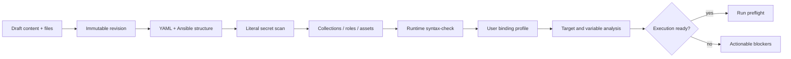

# Ansible Playbook Workspace — целевая архитектура и план внедрения

- Статус: implementation plan
- Дата: 2026-07-24
- Владелец домена: `servers`
- Frontend surface: `frontend/src/pages/automation`
- Текущий rollout-режим: сначала контролируемый внутренний pilot; публичный multi-worker запуск требует отдельного runtime-gate.

## 1. Решение

Playbooks должны стать самостоятельным продуктовым разделом WebTerm на маршруте `/automation`, а не вкладкой внутри страницы серверов.

Целевая система строится вокруг пяти правил:

1. У playbook есть только один исполняемый источник истины.
2. Импортированный оригинал никогда не перезаписывается.
3. Редактирование происходит в восстанавливаемом draft, а запуск — только из неизменяемой revision.
4. Совместимость считается для конкретной revision, Ansible runtime и набора целей; она не является постоянным свойством playbook.
5. Просмотр, редактирование, публикация, запуск и шаринг проверяются backend-capability policy, а не видимостью кнопок.

Быстрый перенос UI в отдельный раздел можно сделать первым небольшим PR без изменения backend-поведения. Ревизии, новый редактор, шаринг и runtime hardening должны идти отдельными PR.

## 2. Что подтверждено в текущем коде

### 2.1 Навигация

- Sidebar уже показывает пункт Playbooks и ведёт на `/automation`.
- `frontend/src/pages/AutomationPage.tsx` сейчас не является страницей: он перенаправляет на `/servers` с `mainTab: "playbook"`.
- `frontend/src/pages/servers/ServersPageView.tsx` монтирует `PlaybooksWorkspace` внутри четвёртой вкладки Servers.
- Сам `PlaybooksWorkspace` уже умеет самостоятельно загрузить server/group bootstrap, если данные не переданы через props. Поэтому первый перенос не требует нового backend API.
- Текущий режим workspace хранится только в React state. URL не содержит открытый playbook, revision или run; после reload пользователь возвращается в каталог.

### 2.2 Редактирование

- Для обычного runbook интерфейс редактирует список shell-команд.
- Для импортированного Ansible source показывается read-only `Textarea`.
- Ниже read-only YAML всё равно отображается редактируемый список производных shell-задач.
- Frontend `buildPayload()` не отправляет `source_yaml` при обычном сохранении.
- Runner явно предпочитает `source_yaml` и только при его отсутствии генерирует YAML из `tasks`.

Следствие: пользователь может изменить производную карточку задачи у импортированного playbook, получить сообщение «Сохранено», но реальный Ansible запуск продолжит выполнять YAML. Это необходимо устранить до расширения редактора.

### 2.3 Импорт и модель данных

Текущая `Playbook` хранит:

- owner (`user`);
- metadata, category, tags и `visibility`;
- `tasks`;
- исходный `source_yaml`;
- import `fidelity`;
- последний compatibility report;
- активную `PlaybookCompatibilityRevision`;
- краткие поля последнего run.

`PlaybookCompatibilityRevision` уже сохраняет:

- hash исходника;
- адаптированный YAML;
- inventory bindings;
- compatibility report;
- semantic guard;
- change summary;
- status.

`PlaybookRun` сохраняет snapshot playbook, targets, options, inventory preview, progress, log и результаты. Это правильная база для воспроизводимости, но snapshot пока не ссылается на универсальную content revision и runtime fingerprint.

### 2.4 Совместимость

Уже реализованы важные безопасные свойства:

- import сохраняет исходный YAML, а compatibility apply создаёт отдельную revision и не перезаписывает его;
- deterministic analyzer находит selectors, variables, roles, collections, local assets, literal secrets и базовые OS mismatches;
- AI может вернуть не полный YAML, а не более шести точечных замен;
- semantic guard защищает структуру tasks, module args, roles, порядок, conditions, handlers и часть execution controls;
- перед активацией вызывается syntax-check, хотя текущий runtime может вернуть `skipped`;
- runtime inventory binding меняет только host selectors;
- run использует validated compatibility revision только при совпадении source hash.

Эти гарантии нужно сохранить, но текущий guard нельзя считать полной гарантией сохранения поведения. Он намеренно не защищает часть `vars`, `environment`, `no_log` и `vars_files`. Существующий тест даже разрешает изменение значения переменной пакета. Новый редактор не должен обходить guard для операции «автоадаптировать», а сам guard необходимо усилить до явно классифицированных change classes.

### 2.5 Текущие ограничения

- `visibility=shared` означает глобальную видимость всем пользователям с feature `servers`.
- `source_yaml` всё ещё можно заменить через owner update API; его неизменяемость пока является свойством обычного UI/compatibility flow, а не schema-level invariant.
- Shared playbook можно читать, дублировать и запускать на доступных пользователю серверах; редактировать, удалять и адаптировать может только owner.
- Нет явных ролей viewer/runner/editor.
- Inventory bindings находятся внутри compatibility revision, хотя они зависят от пользователя и его доступного inventory.
- Нет project bundle для `roles/`, `templates/`, `files/`, `vars/` и `requirements.yml`; analyzer поэтому блокирует playbook с локальными assets/roles.
- `fidelity.score` показывает качество преобразования Ansible tasks в shell-задачи, но реальный Ansible runner выполняет source YAML. Такой процент легко принять за показатель реальной совместимости.
- Syntax validation может подготовить allowlisted collections в текущем runtime. Значит результат зависит от изменяемого окружения и нуждается в fingerprint/staleness.
- Run запускается daemon-thread внутри web-процесса. Перезапуск процесса может оборвать работу; это не production-grade durable dispatch.
- HTTP-run проходит analyze/binding/compile/syntax gates, но Operator-run запускает `source_yaml` через другой путь и обходит active compatibility revision и bindings.
- При `engine=auto` недоступный Ansible может привести к fallback на lossy shell projection импортированного YAML. Для Ansible source такой fallback должен быть запрещён.
- Run state обновляется через `QuerySet.update()`; связанный `post_save` notification для припаркованного Operator turn при этом не срабатывает.
- Compatibility revision может получить status `validated` при missing bindings или при syntax-check со status `skipped`/`passed=None`. Значит текущее слово validated не равно runtime ready.
- Ansible inventory alias строится из display name без immutable server id; одинаковые имена могут столкнуться.
- Ansible runtime принудительно отключает host-key checking, хотя Server уже хранит trusted host keys.
- `extra_vars` сохраняются внутри обычного JSON `PlaybookRun.options` и возвращаются serializer. Secret values должны быть заменены managed-secret references.
- `online_only` записывается в options, но текущий runner его не применяет.
- Shared detail сериализует active revision bindings с server/group IDs владельца; user-specific target data нельзя раскрывать получателю.
- Frontend карточка сейчас показывает Edit/Delete/Run без учёта owner/capabilities, поэтому shared пользователь видит действия, которые backend затем отклоняет.
- Import сразу вызывает `save=true`, хотя backend уже умеет parse preview через `save=false`.
- Активного exact export/round-trip в workspace нет; legacy localStorage export реконструирует другой shell playbook и не может использоваться.
- Несколько файлов близки к лимиту архитектуры в 500 строк: `server_playbooks.py`, `frontend/src/api/playbooks.ts`, `usePlaybooksWorkspace.ts` и `RunWizard.tsx`. Новую функциональность нельзя добавлять туда монолитно.
- В `frontend/src/pages/servers/PlaybooksPanel.tsx` остаётся неиспользуемая legacy localStorage-реализация.

### 2.6 P0 integrity gate

До расширения sharing или допуска новых пользователей необходимо закрыть пять backend-gates:

1. Единый `prepare_playbook_run()` для HTTP, Operator, schedules и будущих integrations.
2. Запрет Ansible-source → shell fallback без отдельной явной конвертации и review.
3. Явный `transition_playbook_run()`, который атомарно меняет state, пишет audit и через `transaction.on_commit` отправляет terminal/operator notification.
4. Строгая классификация совместимости:
   - static valid;
   - runtime checked;
   - bindings complete;
   - target ready;
   - published.
5. Collision-safe inventory identity и соблюдение SSH host trust policy.

Перенос страницы в `/automation` не зависит от этих gates. Расширенный editor можно разрабатывать параллельно, но новый execution/sharing rollout до их закрытия включать нельзя.

### 2.7 Audit evidence

Во время подготовки плана read-only focused suites прошли:

- `test_playbook_api.py + test_playbook_compatibility.py + test_playbook_parser.py`: 15 passed;
- `test_ansible_engine.py + test_operator_async_and_tools.py`: 22 passed;
- architecture size/import-boundary guard: passed.

Это подтверждает текущие unit-контракты, но не закрывает real Ansible multi-worker, process-restart, load, SSH trust и end-to-end browser scenarios.

## 3. Цели продукта

### 3.1 Основной пользователь

Оператор или DevOps-инженер, который должен:

1. быстро импортировать существующий Ansible playbook или создать новый;
2. понимать, что именно будет выполнено;
3. удобно редактировать YAML и связанные файлы;
4. видеть ошибки рядом с конкретной строкой;
5. привязать логические host selectors к своему inventory;
6. передать runtime variables без раскрытия secrets;
7. проверить совместимость и dry-run;
8. запустить неизменяемую revision;
9. поделиться опубликованной revision с другим пользователем;
10. восстановить историю, сравнить изменения и повторить run.

### 3.2 UX-метрики

- Время от импорта до первого понятного compatibility report.
- Время от импорта до validated revision.
- Доля ошибок, которые показываются с конкретным stage и location.
- Доля runs, запущенных из validated revision.
- Доля runs, для которых сохранены revision hash и runtime fingerprint.
- Число потерянных draft/conflict overwrite: целевое значение 0.
- Доля shared playbooks с явно выбранной ролью, а не legacy global sharing.

### 3.3 Не-цели первой версии

- Не строить собственный Git hosting.
- Не делать анонимный запуск playbook по ссылке.
- Не делать real-time multi-cursor collaborative editor.
- Не устанавливать произвольные Galaxy dependencies из пользовательского YAML внутри web request.
- Не объединять Ansible workspace со Studio pipeline/skill models: `servers` не должен импортировать `studio`.
- Не переписывать runner, редактор, permissions и дизайн одним mega-PR.

## 4. Information architecture

### 4.1 Основная навигация

Sidebar:

- Playbooks → `/automation`.

Внутри раздела:

- Библиотека;
- Запуски;
- Шаблоны.

Compatibility, Variables, Files, History и Sharing относятся к конкретному playbook и не должны становиться глобальными вкладками.

Execution environments следует показывать в статусе раздела и в preflight. Отдельная административная настройка может появиться позже, когда будет поддержано более одного управляемого runtime.

Первый route-move сохраняет текущий backend feature `servers`, потому что отдельного `playbooks` feature в access registry сейчас нет. Если продукту нужна независимая выдача доступа к разделу, это отдельный PR: feature choice, migration, profile defaults, `feature_allowed_for_user()`, backend decorators, frontend gate и deny tests. Один только новый sidebar flag не является security boundary.

### 4.2 Маршруты

| Маршрут | Назначение |
| --- | --- |
| `/automation` | canonical каталог Library |
| `/automation/new` | выбор способа создания |
| `/automation/import` | import staging/review |
| `/automation/guided` | guided builder |
| `/automation/templates` | templates |
| `/automation/runs` | история runs |
| `/automation/runs/:runId` | live/result view |
| `/automation/playbooks/:playbookId` | overview опубликованной revision |
| `/automation/playbooks/:playbookId/edit` | draft editor |
| `/automation/playbooks/:playbookId/revisions/:revisionId` | read-only revision/diff |
| `/automation/playbooks/:playbookId/run` | preflight/run wizard |

Текущий `/automation` должен остаться стабильным. Старый переход через `/servers` нужно поддержать как временный redirect, а не как второй экземпляр workspace.

### 4.3 Каталог

Для небольшого набора можно сохранить cards, но основной scalable view — компактный список/таблица:

- name и description;
- type: Ansible YAML или WebTerm runbook;
- owner/access mode;
- published revision;
- compatibility: ready / needs targets / blocked / stale / unchecked;
- last run;
- updated at;
- быстрые actions по capabilities.

Фильтры:

- Мои / Доступные мне / Все разрешённые;
- type;
- category;
- compatibility status;
- tags;
- owner;
- «есть невалидированный draft».

Search должен работать серверно и иметь debounce. Текущий client-side поиск после получения максимум 200 строк не масштабируется и возвращает неточный count.

Primary CTA: «Новый playbook». Secondary: «Импорт».

Меню создания:

- пустой Ansible YAML;
- WebTerm runbook builder;
- импорт файла;
- импорт project bundle;
- из template;
- guided builder.

## 5. Редактор

### 5.1 Один источник истины

| Kind | Исполняемый источник истины | Дополнительное представление |
| --- | --- | --- |
| Ansible | YAML/project files | Outline и task summary только производные |
| Runbook | typed task JSON | Сгенерированный Ansible preview только read-only |

Нельзя одновременно разрешать независимое редактирование YAML и производного списка tasks.

Для imported Ansible:

- вкладка «Оригинал» всегда read-only;
- вкладка «Рабочая версия» редактирует draft;
- Outline строится из draft и служит навигацией;
- изменение Outline допускается только после появления безопасного round-trip transform. До этого Outline read-only.

Для runbook:

- structured task builder остаётся основным;
- YAML preview не сохраняется обратно автоматически;
- действие «Преобразовать в Ansible» создаёт новую revision или копию и показывает diff.

### 5.2 Desktop layout

`CodeEditor` на CodeMirror 6 и `react-resizable-panels` уже есть в frontend dependencies и должны переиспользоваться.

```text
┌ Breadcrumb / name / draft status / revision ─ Save draft ─ Validate ─ Run ┐
├───────────────┬──────────────────────────────────────┬──────────────────────┤
│ Outline/Files │ CodeMirror YAML editor               │ Problems             │
│ plays         │ line numbers, fold, search           │ Variables            │
│ tasks         │ diagnostics, Ctrl+S                  │ Compatibility         │
│ handlers      │                                      │ Dependencies          │
│ assets        │                                      │ Target bindings       │
├───────────────┴──────────────────────────────────────┴──────────────────────┤
│ branch/base revision · line/column · encoding · autosave · runtime status  │
└─────────────────────────────────────────────────────────────────────────────┘
```

На узком экране одновременно видна одна рабочая область:

- Editor;
- Outline/Files;
- Problems/Compatibility.

Панели открываются tabs/sheet; editor остаётся полноширинным. Run запускается только через отдельный preflight route, не через опасный одноклавишный shortcut.

Accessibility contract:

- selectable target rows используют `aria-pressed`;
- wizard step использует semantic list и `aria-current="step"`;
- editor toolbar и task actions имеют accessible names;
- `Label` связан с control;
- interactive target не меньше принятого design-system touch target;
- Problems объявляет новые blocker через controlled live region, но не озвучивает каждое autosave событие;
- keyboard focus возвращается в понятное место после dialog/diff/navigation.

### 5.3 Обязательные функции editor

- YAML syntax highlighting;
- line numbers, folding, bracket matching, search/replace;
- Ctrl/Cmd+S → сохранить draft;
- undo/redo;
- dirty indicator и navigation guard;
- server autosave после короткой паузы и при blur;
- явный status: «Сохранено», «Сохраняется», «Конфликт», «Ошибка»;
- optimistic concurrency через `draft_version`/ETag;
- conflict dialog: сравнить server/local, сохранить копию или принять server;
- Problems с severity, stage, line/column и переходом к месту;
- compare: original ↔ draft, published ↔ draft, revision ↔ revision;
- revision message при публикации;
- восстановление draft после reload и на другом устройстве;
- read-only mode для viewer/runner;
- controlled fallback при ошибке parser/editor, чтобы страница не становилась пустой.

### 5.4 Autosave и publish

Autosave не должен создавать сотни immutable revisions.

Модель:

1. `PlaybookDraft` — изменяемый server-side working copy.
2. Autosave обновляет draft с expected version.
3. «Создать revision» замораживает exact content/files.
4. Validation привязывается к hash revision.
5. «Опубликовать» меняет pointer `published_revision`.
6. Run всегда получает exact published/selected revision id и hash.

Viewer и runner видят только published revisions. Editor видит draft. Непубликованный draft никогда не начинает выполняться только из-за autosave.

## 6. Compatibility и validation

### 6.1 Понятия нужно разделить

- Content validity: YAML и Ansible structure корректны.
- Semantic safety: AI adaptation не изменила защищённую логику, variables, secret-hiding или execution context.
- Dependency readiness: collections, roles и assets доступны.
- Runtime compatibility: выбранный Ansible runtime способен проверить revision.
- Target compatibility: selectors, variables и OS соответствуют выбранным targets.
- Execution readiness: все обязательные gates пройдены для конкретного run.

Один badge «Готов» без контекста недостаточен.

### 6.2 Validation pipeline



Stages:

1. Input guard: size, encoding, safe paths, safe YAML load.
2. YAML/Ansible structure.
3. Static analyzer.
4. Literal secret detection.
5. Dependency manifest and asset resolution.
6. Syntax-check в выбранном runtime.
7. Inventory selector bindings.
8. Required variable schema.
9. Target OS/capability warnings.
10. Optional check-mode/canary preflight.

Статусы не смешиваются:

- `draft` — content ещё изменяемый;
- `static_valid` — parser/analyzer прошли, но runtime/targets могут быть не готовы;
- `runtime_checked` — syntax-check реально выполнен и `passed=true`;
- `target_ready` — bindings, variables и targets complete;
- `published` — owner/editor policy активировала immutable revision;
- `stale` — evidence больше не соответствует revision/runtime/targets;
- `blocked` — есть обязательный blocker.

`syntax_check.status=skipped`, missing bindings и unresolved required variables никогда не должны отображаться как полная готовность к запуску.

Каждый issue должен иметь:

- stable `code`;
- `severity`;
- `stage`;
- user-facing message;
- remediation hint;
- file/path;
- line/column, когда доступно;
- `retryable`;
- безопасные details без secrets.

### 6.3 Runtime fingerprint и stale status

Результат runtime validation должен хранить fingerprint:

- method: native / WSL / Docker;
- ansible-core version;
- Python version;
- image digest, если Docker;
- installed collection names и versions;
- relevant config hash;
- analyzer version.

Validation становится stale, если изменился:

- revision content hash;
- asset bundle hash;
- analyzer version;
- runtime fingerprint;
- binding profile version;
- target signature для target-specific report.

Stale — отдельный status, а не «ready».

Подготовку dependencies нужно отделить от проверки. В production runtime не должен незаметно меняться во время обычного validation request. Особенно это важно для shared viewer: read/analyze чужого playbook не должен устанавливать collections. Allowlisted automatic setup можно сохранить только как owner/admin pilot-mode action с audit и последующей фиксацией нового fingerprint.

### 6.4 Inventory bindings

Content revision и inventory mapping — разные сущности.

`linux_servers`, `web` или другой selector относится к YAML. Конкретные server/group IDs относятся к пользователю и его inventory.

Нужен `PlaybookBindingProfile`:

- playbook/revision selector schema;
- owner user;
- name;
- mappings selector → accessible server/group ids;
- version/hash;
- last validation;
- optional default flag.

Для shared playbook получатель создаёт собственный binding profile. Нельзя автоматически использовать server IDs владельца.

### 6.5 Runtime variables и secrets

Analyzer формирует variable schema:

- name;
- inferred type;
- required;
- default present;
- secret flag;
- description/source location.

Обычные values могут храниться в user-owned preset. Secret value:

- не хранится в revision;
- не попадает в export;
- не попадает в AI prompt;
- не возвращается frontend после сохранения;
- не попадает raw в audit/log/run snapshot;
- выбирается как managed secret reference и разрешается just-in-time.

Raw `extra_vars` API должен пройти typed normalization, redaction и limits. UI должен показывать generated form вместо единственного JSON textarea.

### 6.6 AI adaptation

Существующий bounded-edit protocol сохраняется:

- максимум шесть exact unique `old_text → new_text` edits;
- source, report и user instruction;
- никаких literal secrets;
- full generated replacement не принимается;
- semantic guard обязателен.

Change classes:

- автоматически допустима только runtime host-selector binding, предпочтительно вообще без изменения сохранённого YAML;
- `vars`, `vars_files`, `environment`, `no_log`, collections, become и execution controls считаются behavior/security changes;
- такие изменения требуют отдельного diff, явного подтверждения и новой content revision;
- снятие `no_log` или добавление literal secret всегда блокируется;
- текущий тест, разрешающий тихую замену значения package variable, должен быть заменён characterization + deny/explicit-review tests.

Новый UX:

1. «Предложить безопасное исправление».
2. Backend создаёт proposal.
3. UI показывает side-by-side/unified diff и причины.
4. Semantic violations видны до apply.
5. Пользователь применяет proposal в draft или создаёт отдельную revision.
6. Revision проходит полный validation pipeline.
7. Только после validation её можно publish/activate.

Кнопка не должна одновременно генерировать, скрыто применять и переключать active revision без review trail.

## 7. Project files, import и export

### 7.1 Поддерживаемые входы

MVP:

- `.yml` / `.yaml`;
- paste YAML;
- существующие templates/guided recipes.

Следующий этап:

- ZIP/TAR project bundle;
- `playbook.yml`;
- `roles/`;
- `templates/`;
- `files/`;
- `vars/` и `group_vars/`;
- `requirements.yml`;
- WebTerm `manifest.json`.

Позже:

- Git URL + branch/tag/commit + subpath;
- private Git credentials только через managed secret reference;
- pull/sync с preview, никогда не auto-publish.

### 7.2 Import flow

1. Upload/paste.
2. Parse preview без persistence.
3. Показать plays, tasks, selectors, variables, dependencies, files и secret warnings.
4. Выбрать entry playbook, если их несколько.
5. Выбрать name/category/tags/visibility.
6. Создать playbook + immutable origin revision + draft.
7. Запустить deterministic validation.
8. Предложить binding profile.

Import commit должен быть transaction-safe. Ошибка одного обязательного файла не должна оставлять половину playbook.

### 7.3 Bundle security

- reject path traversal и absolute paths;
- reject symlinks/hardlinks на первом этапе;
- configurable limits для archive size, extracted size, file count и individual file size;
- content hash каждого файла;
- text/binary distinction;
- no automatic executable bit trust;
- YAML только через safe loader;
- никакого выполнения plugins/lookups во время import;
- encrypted Vault content не расшифровывать автоматически;
- secrets scan до preview/export/AI;
- quarantine/blocked state для подозрительного bundle.

### 7.4 Export

Экспортируется exact immutable revision:

- source/project files;
- manifest с name, revision id/hash, required collections/roles и schema version;
- optional sanitized validation summary;
- без inventory host addresses;
- без credentials;
- без secret values;
- без user-specific binding profiles.

Форматы:

- raw YAML для single-file playbook;
- project bundle;
- WebTerm bundle для round-trip import.

## 8. Sharing и permissions

### 8.1 Capability model

Нужен единый backend service, например `servers.services.playbooks.access`, который возвращает capabilities и используется всеми endpoints.

Viewer/Runner/Editor — понятные UI presets. В storage лучше держать явный capability set по аналогии с `ServerShare`, потому что edit и run не обязаны наследоваться друг от друга. Один principal может быть Editor без права production run.

| Capability | Owner | Editor | Runner | Viewer |
| --- | ---: | ---: | ---: | ---: |
| Читать published revision | да | да | да | да |
| Читать draft | да | да | нет | нет |
| Редактировать draft | да | да | нет | нет |
| Создать/валидировать revision | да | да | нет | нет |
| Publish/rollback | да | по явно выбранной policy | нет | нет |
| Создать свой binding profile | да | да | да | нет |
| Run на доступных себе targets | да | только если также runner | да | нет |
| Export published | да | да | да, если разрешено | если разрешено |
| Управлять shares | да | нет | нет | нет |
| Delete playbook | да | нет | нет | нет |

Роли являются независимыми от feature gate. Сначала пользователь должен иметь `servers`/будущий `playbooks` feature, затем object capability.

Frontend получает готовые flags:

- `can_view`;
- `can_edit`;
- `can_validate`;
- `can_publish`;
- `can_run`;
- `can_share`;
- `can_delete`;
- `can_export`.

Но каждый backend endpoint всё равно повторно авторизует действие.

### 8.2 Share scopes

Поддержать:

- private;
- конкретные пользователи;
- Django auth groups;
- workspace-wide published access.

Отдельной Organization/Tenant/WorkspaceMembership модели в репозитории сейчас нет. Поэтому слово «команда» в UI не должно скрывать несуществующий tenancy-domain: первый вариант использует users и Django auth groups. Новую organization model можно вводить только отдельным архитектурным решением.

Новые workspace-wide shares по умолчанию view-only. Run access включается отдельно.

Для миграции существующий `visibility=shared` сначала сохраняет текущую read/run семантику как помеченный legacy grant, иначе rollout неожиданно сломает пользователей. UI должен предложить owner выбрать явную новую роль.

### 8.3 Share links

Только последующий этап и только для immutable published revision:

- token хранится как hash;
- срок действия;
- revoke;
- view/download flags;
- никогда не даёт execute;
- не показывает drafts, bindings, inventory, variables values или secrets;
- access audit;
- feature disabled по умолчанию.

### 8.4 Audit events

Обязательны:

- playbook created/imported/deleted;
- draft saved/conflict;
- revision created/validated/published/rolled back;
- adaptation proposed/applied/rejected;
- share granted/changed/revoked/link viewed;
- export;
- binding profile changed;
- run requested/approved/started/cancelled/completed;
- dependency environment prepared.

Metadata должна содержать ids/hashes/status, но не YAML, inventory secrets или variable values.

## 9. Run preflight и execution

### 9.1 Новый wizard

Шаг 1 — Revision и runtime:

- published/selected immutable revision;
- validation freshness;
- runtime fingerprint;
- blockers.

Шаг 2 — Targets:

- server/group selection;
- binding profile;
- selector coverage;
- доступность и OS summary.

Шаг 3 — Variables и policy:

- typed variables;
- managed secret references;
- tags/skip-tags/limit;
- become;
- concurrency;
- check/diff mode;
- optional canary.

Defaults:

- новый, imported или изменённый playbook сначала предлагает dry-run/check;
- production run требует отдельного явного выбора;
- `become` берётся из revision/policy и не включается безусловно;
- warnings требуют acknowledgement, blockers не обходятся frontend-кнопкой.

Шаг 4 — Review:

- exact revision/hash;
- exact target count;
- resolved selectors;
- redacted variables summary;
- risk warnings;
- dry-run/check status;
- approval requirement;
- явная кнопка запуска.

### 9.2 Execution contract

Все инициаторы вызывают один service:

```text
HTTP / Operator / schedule / integration
            ↓
prepare_playbook_run()
  authorize → resolve revision → resolve targets
  → bind selectors → resolve secret refs
  → analyze → compile → syntax/preflight
  → create immutable run snapshot
            ↓
dispatch_playbook_run()
```

Ни Operator, ни schedule не имеют права собирать snapshot самостоятельно.

Run snapshot должен включать:

- playbook id;
- revision id и content hash;
- origin/published relation;
- sanitized content/project bundle reference;
- validation id;
- runtime fingerprint;
- binding profile version и resolved selector groups;
- target ids;
- normalized options;
- redacted variable manifest;
- actor;
- approval/audit correlation id.

Удаление или редактирование playbook не меняет уже созданный run snapshot.

Runtime invariants:

- Ansible content выполняется только Ansible engine; недоступный runtime возвращает controlled blocker;
- shell runner принимает только explicit command-runbook content или явно опубликованную конверсию;
- inventory alias всегда включает immutable server id, например `wt_123_web_01`;
- display name хранится отдельно и безопасно quoted;
- per-run `known_hosts` строится из trusted host keys, а host-key checking не отключается глобально;
- `online_only` либо реально фильтрует targets до snapshot, либо удаляется из public contract;
- secret variables разрешаются just-in-time и не записываются в `options`/serializer;
- target capability проверяется повторно при preparation и перед claim.

### 9.3 Durable execution gate

Текущий daemon-thread приемлем только для локального/контролируемого pilot.

Перед public или multi-worker rollout требуется:

- durable dispatch/claim;
- transactional pending → claimed transition;
- worker heartbeat/lease;
- recovery stale running jobs после restart;
- global и per-user concurrency;
- idempotent start;
- cancellation, которая видна worker;
- секреты с ограниченным временем жизни;
- log retention/redaction;
- load и restart tests.

До полноценной queue миграции нужен отдельный быстрый fix state transitions:

- не полагаться на `post_save` после `QuerySet.update()`;
- terminal status меняется через единый transition service;
- terminal/operator notification отправляется ровно один раз после commit;
- добавляется `terminal_notified_at`/idempotency marker;
- interrupted non-idempotent mutation не requeue автоматически.

UI-редизайн не должен делать ложное заявление о production readiness до закрытия этого gate.

## 10. Целевая модель данных

### 10.1 Playbook

Сохраняет identity и metadata:

- owner;
- name/description/category/tags;
- kind;
- origin revision pointer;
- published revision pointer;
- optional `forked_from_revision` provenance для копии shared/template playbook;
- sharing mode;
- soft state/archived flag;
- timestamps.

Не должен оставаться главным хранилищем изменяемого YAML после migration.

### 10.2 PlaybookDraft

- playbook;
- base revision;
- content format;
- source text или runbook JSON;
- draft/project bundle pointer;
- version;
- content/bundle hash;
- last editor;
- updated_at.

На playbook достаточно одного общего draft в первом collaborative варианте. Optimistic lock предотвращает silent overwrite. Branching drafts можно добавить позже.

### 10.3 PlaybookRevision

- playbook;
- monotonically increasing revision number;
- parent revision;
- author;
- immutable source/runbook snapshot;
- immutable asset bundle;
- content hash и bundle hash;
- origin type: imported/manual/guided/template/adaptation/conversion;
- message;
- created_at.

Revision не меняется после создания.

### 10.4 PlaybookValidation

- revision;
- analyzer version;
- runtime fingerprint;
- target signature;
- binding profile version;
- status;
- stage reports;
- issues;
- started/finished;
- stale reason.

### 10.5 PlaybookBindingProfile

- playbook;
- owner user;
- name/default;
- selector mappings;
- version/hash;
- timestamps.

### 10.6 PlaybookGrant

- playbook;
- user или auth group;
- UI role preset и нормализованные capabilities: view/edit/validate/publish/run/export/manage_shares;
- granted_by;
- timestamps;
- unique and check constraints для principal.

### 10.7 PlaybookAssetBundle

- storage key;
- manifest;
- archive/content hash;
- file count/size;
- security scan status;
- created_by/created_at.

Binary payload лучше держать в artifact storage abstraction, а не раздувать основную SQL row. Local filesystem backend допустим для single-node; production storage contract должен быть заменяемым.

### 10.8 Existing compatibility revisions

`PlaybookCompatibilityRevision` не нужно удалять первым migration:

- добавить nullable link на generic revision/proposal;
- backfill active adaptation как child revision;
- сохранить старые API на compatibility facade;
- после cutover перестать создавать legacy rows;
- удалить только после telemetry и data verification.

## 11. Backend architecture

Новая логика не добавляется в текущие крупные view modules.

Предлагаемая структура:

```text
servers/
  services/playbooks/
    access.py
    catalog.py
    drafts.py
    revisions.py
    validation.py
    adaptation.py
    bindings.py
    variables.py
    bundles.py
    sharing.py
    run_preparation.py
    run_state.py
    dispatch.py
    inventory_identity.py
    runtime.py
    serialization.py
  views/
    playbook_catalog_views.py
    playbook_draft_views.py
    playbook_revision_views.py
    playbook_validation_views.py
    playbook_binding_views.py
    playbook_share_views.py
    playbook_bundle_views.py
```

Текущие `server_playbooks.py`, `server_playbook_compatibility_views.py` и `server_playbook_run_views.py` остаются thin route-compatible facades или постепенно делегируют новым services.

`access.py` следует проектировать по уже работающему принципу `ServerShare`/central query service: один policy result, action capabilities, expiry/revoke и viewer-aware serialization. Studio models/components можно использовать только как UX-ориентир; прямой import `servers → studio` запрещён.

`run_preparation.py` должен стать единственным местом, где выбираются revision, targets, bindings, variables, runtime и validation evidence. `run_state.py` — единственным местом terminal transitions и notifications.

Запрещено:

- переносить playbook business logic в `core_ui`;
- импортировать `studio`;
- возвращать secret values;
- прятать authorization только в queryset без action-specific capability;
- выполнять долгий AI/syntax/bundle job внутри view после появления job layer.

## 12. API contract

Существующие endpoints сохраняются до миграции. Новые contracts вводятся versionlessly только если backward-compatible; иначе под `/api/playbooks/v2/` с явным cutover.

Основные resources:

```text
GET    /servers/api/playbooks/
POST   /servers/api/playbooks/
GET    /servers/api/playbooks/:id/
PATCH  /servers/api/playbooks/:id/

GET    /servers/api/playbooks/:id/draft/
PUT    /servers/api/playbooks/:id/draft/
POST   /servers/api/playbooks/:id/revisions/
GET    /servers/api/playbooks/:id/revisions/
GET    /servers/api/playbooks/:id/revisions/:revisionId/
POST   /servers/api/playbooks/:id/revisions/:revisionId/publish/
POST   /servers/api/playbooks/:id/revisions/:revisionId/validate/

GET    /servers/api/playbooks/:id/bindings/
POST   /servers/api/playbooks/:id/bindings/
PATCH  /servers/api/playbooks/:id/bindings/:bindingId/

GET    /servers/api/playbooks/:id/shares/
POST   /servers/api/playbooks/:id/shares/
DELETE /servers/api/playbooks/:id/shares/:shareId/

POST   /servers/api/playbooks/import/preview/
POST   /servers/api/playbooks/import/commit/
GET    /servers/api/playbooks/:id/revisions/:revisionId/export/

POST   /servers/api/playbooks/:id/revisions/:revisionId/runs/
GET    /servers/api/playbooks/runs/
GET    /servers/api/playbooks/runs/:runId/
POST   /servers/api/playbooks/runs/:runId/cancel/
```

Draft update:

- request содержит `expected_version` или `If-Match`;
- mismatch → HTTP 409 с server draft metadata;
- response возвращает новую version/hash и save status.

Единая ошибка:

```json
{
  "success": false,
  "error": {
    "code": "playbook_draft_conflict",
    "message": "Draft was changed by another editor",
    "stage": "draft_save",
    "field": null,
    "retryable": false,
    "details": {}
  }
}
```

Старое строковое `error` можно дублировать в transition period.

## 13. Frontend architecture

`frontend/src/api/playbooks.ts` уже близок к лимиту и должен стать compatibility facade.

Предлагаемая структура:

```text
frontend/src/api/playbooks/
  index.ts
  types.ts
  catalog.ts
  drafts.ts
  revisions.ts
  validation.ts
  bindings.ts
  sharing.ts
  runs.ts
  bundles.ts

frontend/src/pages/automation/
  AutomationPage.tsx
  AutomationRoutes.tsx
  catalog/
  editor/
  runs/
  templates/
  sharing/
```

Rules:

- route components только координируют;
- query/mutation logic живёт в controller hooks;
- CodeMirror wrapper расширяется через reusable extensions, а не fork внутри playbook;
- runtime state находится в URL/query cache, не в одном огромном `view.mode`;
- forms используют typed API contracts;
- loading, empty, error, denied, stale и unavailable имеют отдельные состояния;
- mobile layout покрывается component/E2E tests;
- `frontend/src/lib/api.ts` остаётся только facade.

## 14. Migration strategy

### 14.1 Data backfill

Для каждого существующего playbook:

1. Создать origin revision:
   - `source_yaml` для Ansible;
   - normalized `tasks` snapshot для runbook.
2. Если есть active validated compatibility revision:
   - проверить source hash;
   - создать child revision origin=adaptation;
   - перенести change summary и semantic evidence;
   - сделать её published revision, если она действительно была active.
   - если hash не соответствует доступному source, оставить nullable legacy link и не выдумывать потерянный parent content.
3. Иначе published revision = origin revision.
4. Создать draft на базе published revision.
5. Сохранить legacy fields для dual-read.
6. Перенести `visibility=shared` в legacy workspace grant с сохранением поведения.

Backfill:

- idempotent;
- batched;
- с counters и audit log;
- не вызывает AI/syntax-check;
- не меняет source text;
- имеет rollback migration только для schema, а не удаляет новые evidence rows.

### 14.2 Dual-read / dual-write

1. Schema + backfill, UI ещё старый.
2. Read new model, fallback legacy.
3. Dual-write через один service.
4. Pilot V2 UI.
5. Telemetry сравнивает hashes/snapshots.
6. Cutover runner на revision.
7. Остановить legacy writes.
8. Удалить legacy fields/API только отдельным cleanup PR.

### 14.3 Migration risks

- Старые compatibility rows имеют hash, но не всегда имеют доступный исторический source; их нельзя насильно привязать к неверной revision.
- Legacy shared нельзя молча превратить в private/team-only: сначала сохраняется поведение и показывается migration notice.
- Stale/deleted server IDs в JSON bindings не переносятся в content revision и не ломают immutable run snapshots.
- Исторические `options.extra_vars`, YAML и logs могут содержать secrets; перед export/search/indexing нужен scan/redaction/retention policy, а не слепой backfill.
- Pending/running jobs при переходе на durable worker помечаются `interrupted`; mutation автоматически не повторяется.
- Import endpoint раньше мог принять source больше create/update limit; backfill идёт batch-ами без долгой blocking migration.

## 15. План PR

### PR-0 — Characterization и безопасные seams

Одна ответственность: зафиксировать текущее поведение до изменения.

- backend tests для CRUD/import/shared/run/source precedence;
- HTTP/Operator preparation parity;
- запрет Ansible → shell fallback;
- Operator terminal notification после run transition;
- duplicate-name inventory aliases;
- vars/no_log semantic changes;
- skipped syntax/missing bindings readiness;
- secret redaction в run serializer;
- frontend tests для route redirect и workspace modes;
- зафиксировать source immutability/semantic guard;
- выделить API/types/controller facades без behavior change, если следующий PR превысит size limit;
- никаких визуальных изменений.

### PR-1 — Самостоятельный раздел Playbooks

Одна ответственность: navigation/route move.

- `AutomationPage` рендерит `PageShell + PlaybooksWorkspace`;
- `/automation` становится реальной страницей;
- удалить Playbooks tab из Servers или заменить короткой ссылкой;
- legacy navigation state redirect;
- sidebar active state;
- automation breadcrumb/topbar;
- command palette entry;
- route prefetch;
- route reload smoke;
- backend без изменений.

### PR-2 — Единая подготовка run

Одна ответственность: HTTP/Operator parity.

- добавить `playbook_run_preparation.py`;
- HTTP и Operator используют один pipeline;
- запретить auto-shell fallback для Ansible source;
- snapshot создаётся только после authorization/analyze/bind/compile/syntax;
- characterization для active revision и missing bindings.

### PR-3 — Явные run transitions

Одна ответственность: корректный lifecycle/notification.

- добавить `playbook_run_state.py`;
- заменить terminal `QuerySet.update()` на controlled transition;
- audit + `transaction.on_commit` notification;
- idempotency marker для Operator completion;
- cancel/rerun/outcome tests.

### PR-4 — Semantic/readiness hardening

Одна ответственность: честные safety statuses.

- `vars/environment/no_log/vars_files` больше не считаются автоматически безопасными;
- missing bindings и skipped syntax не дают status ready;
- static/runtime/target readiness разделены;
- analyze не подготавливает runtime для shared viewer;
- negative tests для behavior/security changes.

### PR-5 — Inventory identity и SSH trust

Одна ответственность: корректная host identity.

- alias включает immutable server id;
- collision и quoting tests;
- per-run known_hosts из trusted keys;
- host-key checking не отключается глобально;
- controlled mismatch error и audit.

### PR-6 — Честный YAML editor

Одна ответственность: устранить dual-source UX.

- переиспользовать `CodeEditor` с YAML;
- Ansible tasks outline read-only;
- runbook builder остаётся отдельным mode;
- API разрешает source-only create/update;
- save действительно сохраняет исполняемый content;
- dirty/navigation guard;
- diagnostics для parse errors;
- direct editor route.

### PR-7 — Draft и immutable content revisions

Одна ответственность: versioning.

- models/migration/backfill;
- autosave draft + optimistic version;
- revision list/diff/rollback;
- runner ещё может dual-read legacy;
- migration and conflict tests.

### PR-8 — Validation V2

Одна ответственность: revision-based compatibility.

- stage-based validation report;
- runtime fingerprint;
- stale detection;
- compatibility result больше не хранится как бесконтекстное поле;
- fidelity percentage убирается из readiness UI;
- current bounded AI protocol сохраняется.

### PR-9 — Binding profiles и variables

Одна ответственность: user/target-specific execution inputs.

- bindings отделены от content revision;
- shared recipient создаёт свои bindings;
- typed variables/presets;
- managed secret references вместо plaintext `extra_vars`;
- target-specific validation;
- реализовать либо удалить `online_only` contract.

### PR-10 — Sharing roles

Одна ответственность: object access.

- grants users/groups/workspace;
- capability service и viewer-aware serializer;
- share UI;
- не отдавать owner binding IDs;
- migrate legacy shared semantics;
- deny/audit tests;
- никаких public links.

### PR-11 — Project bundle

Одна ответственность: assets/dependencies/import/export.

- preview/commit;
- safe archive extraction;
- roles/templates/files/vars/requirements;
- storage abstraction;
- sanitized export;
- malicious bundle tests.

### PR-12 — Run preflight + exact revision execution

Одна ответственность: execution contract.

- four-step preflight;
- immutable revision/validation/fingerprint snapshot;
- stale gate;
- redacted variables;
- direct run URLs;
- current runner остаётся pilot-only.

### PR-13 — Durable worker gate

Одна ответственность: production run lifecycle.

- claim/lease/recovery;
- global concurrency;
- interrupted state без автоматического повтора mutation;
- restart/cancel/idempotency tests;
- production readiness evidence.

### PR-14 — Optional Git sync/share links

Отдельные features после основного workflow и security review.

## 16. Test strategy

### 16.1 Backend

Models/migrations:

- existing YAML/tasks backfill byte-identical;
- active compatibility revision becomes correct child revision;
- duplicate names remain valid;
- migration idempotency;
- unique/check constraints for grants;
- deletion policies preserve run snapshots.

Draft/revision:

- autosave version increments;
- stale expected version → 409;
- no lost update;
- immutable revision cannot be mutated;
- original revision cannot be overwritten;
- rollback changes pointer, not history.

Validation:

- invalid YAML;
- duplicate/unsupported structure;
- selectors and variables;
- roles/assets/collections;
- literal secrets;
- analyzer/runtime/binding/target staleness;
- runtime unavailable;
- dependency setup failure surfaced exactly;
- AI patch exact-edit limit;
- semantic guard violations;
- full replacement rejected.
- `vars/environment/no_log/vars_files` change rejected or requires explicit review class;
- `syntax_check=skipped` never produces runtime-ready;
- missing bindings never produces target-ready;
- shared static analyze has no runtime mutation side effect.

Permissions:

- every role × every endpoint;
- group grants;
- workspace grant;
- admin override audited;
- shared user cannot access owner draft/bindings/secrets;
- runner only sees/executes published revision;
- target resolution never crosses user inventory access.
- shared serializer does not return owner binding IDs or private draft/adapted source.

Bundles:

- zip-slip, absolute path, symlink, decompression bomb limits;
- binary asset;
- malformed requirements;
- transaction rollback;
- export contains no inventory/credentials/secrets.

Runs:

- exact revision/hash snapshot;
- HTTP/Operator/schedule preparation parity;
- Ansible source never falls back to lossy shell projection;
- duplicate server display names create distinct inventory aliases;
- trusted host key is enforced and mismatch is controlled;
- terminal transition notifies parked Operator exactly once;
- stale validation rejected;
- bindings subset of selected targets;
- secrets redacted;
- plaintext secret-like `extra_vars` are not serialized/stored;
- `online_only` behavior matches the public option;
- cancel/rerun;
- worker restart/reclaim after durable dispatch is implemented.

### 16.2 Frontend

- direct route and reload for catalog/editor/revision/run;
- create/import modes;
- Ansible source edit changes actual save payload;
- no editable no-op task cards for YAML;
- Ctrl+S/autosave/error/conflict;
- jump from issue to line;
- diff/original/revision;
- permission-denied/read-only actions;
- stale validation;
- binding/variable forms;
- sharing role picker;
- loading/empty/error/unavailable;
- keyboard and focus order;
- responsive single-panel editor;
- no duplicate API requests from hidden tabs.

### 16.3 E2E golden paths

1. Import single YAML → preview → draft → validate → bind → dry-run → publish → run.
2. Import playbook with collection → environment blocker/preparation → revalidate.
3. AI proposal → diff → semantic guard → revision → publish.
4. Share as runner → recipient creates own binding → run only on own servers.
5. Concurrent edit → 409 → compare/resolve with no data loss.
6. Bundle with template/role → import → syntax-check → export round-trip.
7. Web process restart during run: pilot limitation documented; durable phase later proves recovery.

## 17. Rollout, telemetry и rollback

Feature flags:

- `PLAYBOOK_WORKSPACE_V2_UI`;
- `PLAYBOOK_REVISIONS_V2`;
- `PLAYBOOK_SHARING_V2`;
- `PLAYBOOK_DURABLE_RUNS`.

Rollout:

1. Tests + schema in dark mode.
2. Backfill report.
3. Staff/internal pilot.
4. Selected operators.
5. Default UI with legacy read fallback.
6. Stop legacy writes.
7. Cleanup only after stable telemetry window.

Operational counters:

- legacy/new content hash mismatches;
- draft conflicts;
- validation duration/fail stage;
- stale validation blocks;
- active runtime fingerprints;
- run dispatch wait/claim/recovery;
- denied permission actions;
- bundle quarantine;
- secret redaction failures.

Rollback:

- UI flag returns old workspace;
- legacy API remains during transition;
- published revision pointer changes transactionally;
- no destructive down-migration of revisions/evidence;
- runner dual-read remains until revision snapshot parity is proven.

## 18. Acceptance criteria

Система считается улучшенной, когда:

- Playbooks открываются как самостоятельный раздел, без скрытого redirect в Servers;
- editor URL восстанавливается после reload;
- редактируемый UI всегда меняет именно исполняемый источник;
- imported original доступен byte-identical и read-only;
- draft восстанавливается и защищён от lost update;
- каждый run связан с immutable revision/hash;
- compatibility показывает stage, environment и staleness;
- selectors хранятся в user-owned binding profiles;
- secrets не попадают в YAML history, export, AI, audit или logs;
- shared access имеет явную роль и backend enforcement;
- получатель shared playbook не наследует inventory владельца;
- bundle безопасно поддерживает Ansible assets;
- public/multi-worker rollout не заявляется готовым до durable run gate;
- все изменения прошли focused tests, architecture guard, frontend lint/build и docs check.

## 19. Рекомендованный первый срез

Работу следует вести двумя узкими треками.

Видимый UX-срез:

1. PR-0: characterization.
2. PR-1: сделать `/automation` настоящей отдельной страницей.
3. PR-6: подключить существующий CodeMirror YAML editor.
4. Убрать ложное редактирование производных tasks у imported YAML.
5. Сделать source-only create/update рабочим.
6. Добавить direct URL, save/dirty/error states.

Обязательный integrity gate до расширения rollout:

1. PR-2: единая подготовка HTTP/Operator run и запрет lossy fallback.
2. PR-3: корректные run transitions и terminal notification.
3. PR-4: строгий semantic/readiness contract.
4. PR-5: collision-safe inventory и SSH host trust.

После обоих треков можно безопасно вводить drafts/revisions, compatibility V2 и role-based sharing. Сам route/editor разрешено показать внутренним пользователям раньше, но расширять возможность execution/sharing до закрытия integrity gate нельзя.
