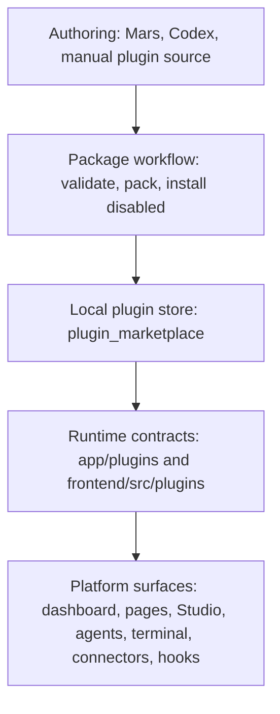

# WebTerm Self-Hosted Plugin Extensions Plan

Last reviewed: 2026-06-28

Status: product direction corrected.

This document keeps the old filename only because repository links already point
to it. The product we are building is not a public marketplace. It is a
self-hosted plugin extension system for teams that run their own WebTerm
instance.

Short version:

> WebTerm must let admins and internal developers add missing platform
> functions through safe plugins: dashboards, pages, Studio nodes, agent tools,
> connectors, hooks, terminal actions, and reports.

The normal story is simple:

1. A team deploys WebTerm for itself.
2. Admins see that the platform misses a workflow.
3. They create a plugin with Mars, Codex, or by hand.
4. They validate and pack it as `.wtp`.
5. An admin installs it disabled.
6. The admin reviews permissions, secrets, egress, settings, and surfaces.
7. The admin enables it.
8. The plugin extends the platform.
9. The admin can later disable, update, roll back, audit, or remove it.

That is the main direction. Everything else is secondary.

## 1. What We Are Building

Build a private extension platform inside WebTerm.

The platform must support:

- local `.wtp` package installation;
- private/internal plugin catalogs;
- manifest-driven dashboards and pages;
- Studio pipeline nodes;
- agent tools;
- terminal actions;
- connectors;
- hooks/webhooks;
- plugin settings;
- secret binding by reference;
- permissions with admin approval;
- egress policy;
- compatibility checks;
- static package checks;
- sandboxed backend code when explicitly enabled;
- dynamic frontend UI only when explicitly enabled;
- audit, health, rollback, quarantine, and cleanup.

The product should feel like an admin extension manager, not like an app store.

Use this wording in the default user experience:

- "Extensions" or "Plugins";
- "Install local package";
- "Private catalog";
- "Internal team";
- "Review and enable";
- "Permissions";
- "Secrets";
- "Health";
- "Rollback".

Avoid this wording in the default user experience:

- "Marketplace";
- "Seller";
- "Buyer";
- "Checkout";
- "Paid plugin";
- "Revenue share";
- "Public app store".

## 2. What We Are Not Building Now

Do not spend product effort on public marketplace features right now.

Out of scope for the default path:

- paid plugins;
- checkout flows;
- billing, settlement, or revenue sharing;
- public publisher accounts;
- public ratings/reviews as the main product surface;
- public marketplace moderation;
- public plugin discovery;
- required external KMS/HSM provider;
- required external malware scanner;
- hosted public plugin store infrastructure.

Runtime code for these areas should not exist in the default product. If the
idea is ever revived, it must come back as a separate, explicit product track
with its own models, APIs, UI, tests, and deployment review.

## 3. Architecture Boundaries

Keep the extension platform split into three layers.



### Layer 1: Runtime Contracts

Owner paths:

```text
app/plugins/
frontend/src/plugins/
```

Responsibilities:

- define plugin manifest contracts;
- define supported surfaces;
- project installed plugins into active runtime surfaces;
- isolate plugin rendering and execution failures;
- expose narrow adapters for platform domains.

Rules:

- no Django persistence here;
- no package install/update logic here;
- no direct imports from feature internals like `servers`, `studio`, terminal,
  or dashboard pages;
- keep these contracts stable and boring.

### Layer 2: Local Plugin Store

Owner path:

```text
plugin_marketplace/
```

The package name can stay for now to avoid repo churn. Product copy should call
it "Plugin Extensions" or just "Extensions".

Responsibilities:

- installed plugin state;
- package validation and retention;
- local package upload/install;
- private catalog sync/install;
- enable/disable/update/rollback;
- permission grants;
- secret binding references;
- settings;
- health and quarantine;
- audit events;
- compatibility and scan records.

Rules:

- install packages disabled by default;
- never execute package code during install;
- never expose raw secrets through API or frontend;
- do not import feature internals directly;
- call narrow providers/adapters when a feature surface needs integration;
- every risky action must be auditable.

### Layer 3: Authoring And Private Distribution

Owner paths:

```text
docs/architecture/PLUGIN_AUTHOR_GUIDE.md
plugin_marketplace/management/commands/
```

Responsibilities:

- scaffold plugin source;
- provide Mars/Codex-ready plugin templates;
- validate plugin source;
- pack deterministic `.wtp` archives;
- install local packages disabled;
- sync private catalogs;
- show package risk before enable.

Rules:

- no-code/metadata plugins must remain easy;
- code plugins require explicit sandbox settings;
- private catalog credentials must never be returned to frontend raw;
- public discovery is not part of the current product direction.

## 4. Plugin Surfaces

Priority order:

1. Dashboard widgets.
2. Platform pages.
3. Studio pipeline nodes.
4. Agent tools.
5. Terminal actions.
6. Connectors.
7. Hooks/webhooks.
8. Reporting and monitoring panels.

Every surface needs:

- manifest schema;
- active-surface projection;
- permission checks for actions;
- disabled-state behavior;
- settings and secret binding if required;
- audit events for risky execution;
- tests for disabled and denied states.

## 5. Package And Manifest Contract

Package extension:

```text
.wtp
```

Recommended package name:

```text
webtrerm-plugin-<team>-<slug>.wtp
```

Recommended source layout:

```text
my-plugin/
  webtrerm.plugin.json
  README.md
  CHANGELOG.md
  LICENSE
  backend/
    plugin.py
    tests/
  frontend/
    manifest.json
  assets/
    icon.svg
    screenshots/
  docs/
    usage.md
```

The manifest is the source of truth.

Required manifest areas:

- stable plugin id;
- name, slug, version, summary;
- internal author/team metadata;
- WebTerm compatibility;
- requested permissions with reasons;
- settings schema;
- secret declarations;
- surfaces;
- egress declarations;
- risk tier;
- disable and uninstall impact notes.

Default package restrictions:

- no install scripts;
- no automatic dependency installation;
- no automatic enablement after install;
- no raw secret exposure to frontend code;
- no direct imports from WebTerm feature internals;
- no shell execution unless explicitly declared and permission-gated;
- no backend code execution unless sandbox support is enabled.

## 6. Authoring Flow For Mars And Codex

The extension platform should be easy for internal teams to use with AI tools.

Required flow:

```powershell
python manage.py plugin_scaffold acme.ops-panel --template dashboard
cd webtrerm-plugin-acme-ops-panel
python manage.py plugin_validate .
python manage.py plugin_pack . --overwrite
python manage.py plugin_install_local .\dist\webtrerm-plugin-acme-ops-panel.wtp
```

The same package must also be installable through `/settings/plugins` by
uploading the `.wtp` file.

Supported scaffold templates:

- `empty`;
- `dashboard`;
- `page`;
- `studio-node`;
- `agent-tool`;
- `connector`;
- `hook`;
- `full`.

Prompt contract for Mars/Codex:

```text
Build a WebTerm self-hosted plugin.
Use webtrerm.plugin.json as the source of truth.
Target a private team deployment, not a public marketplace.
Package must validate with: python manage.py plugin_validate .
Package must pack with: python manage.py plugin_pack . --overwrite
Package must install disabled with: python manage.py plugin_install_local <package.wtp>
Do not execute code during install.
Declare permissions, settings, secrets, surfaces, and egress explicitly.
Use metadata-only surfaces unless backend code is required.
For backend code, use sandbox:backend/plugin.py:handle only.
```

Acceptance:

- a developer can create a simple dashboard/page plugin in under 10 minutes;
- validation errors name the exact broken manifest field or package rule;
- generated code follows the same package rules as hand-written plugins;
- local install always creates a disabled installation.

## 7. Admin Install Flow

Admin flow:

1. Upload or select a `.wtp`.
2. Backend validates package structure and manifest.
3. Backend stores retained package metadata.
4. Backend creates or updates installation in disabled state.
5. UI shows what the plugin wants to do.
6. Admin grants permissions.
7. Admin binds required secrets.
8. Admin reviews egress and compatibility.
9. Admin enables the plugin.

The UI must show before enable:

- plugin name/version/id;
- surfaces it adds;
- permissions and reasons;
- missing permission grants;
- required secrets and binding state;
- settings schema and current values;
- egress hosts;
- compatibility result;
- static scan result;
- rollback availability;
- health and recent events.

Enable blockers must be explicit:

- missing required permission;
- missing required secret binding;
- incompatible WebTerm version;
- failed package validation;
- denied scan policy;
- sandbox required but disabled;
- dynamic frontend bundle required but disabled.

Acceptance:

- incompatible packages cannot be enabled;
- missing permissions or secrets block execution;
- disabled plugins expose no active surfaces;
- install, enable, disable, update, rollback, and uninstall are audited.

## 8. Private Catalog Flow

Private catalog means an internal list of approved plugin packages.

Supported sources:

- local JSON catalog import;
- HTTPS JSON catalog URL;
- optional host allowlist;
- optional auth handled server-side only.

Catalog item UI must show:

- plugin id/name/version;
- summary;
- package URL or local package ref;
- source;
- compatibility;
- permissions;
- secrets;
- egress;
- surfaces;
- install/update state.

Rules:

- catalog source secrets must be redacted in API responses;
- install from catalog also creates a disabled installation;
- incompatible catalog items are blocked;
- sync and install are audited.

Acceptance:

- admin can add an internal catalog;
- admin can sync it;
- admin can install a compatible item disabled;
- frontend never receives raw catalog credentials.

## 9. Code Plugin Safety

No-code plugins are the default. Code plugins are an advanced path.

Backend code execution must be denied unless sandbox support is explicitly
configured.

Frontend dynamic UI must be denied unless frontend sandbox and bundle review are
explicitly configured.

Required controls:

- sandbox provider setting;
- timeout limits;
- output size limits;
- egress allow/deny enforcement;
- dependency allowlist or dependency review;
- failure logging;
- health failure counter;
- quarantine or kill switch;
- clear admin-visible error state.

Acceptance:

- code execution is denied by default;
- enabling sandbox support is explicit;
- denied egress is blocked and tested;
- plugin failure does not crash WebTerm;
- repeated plugin failures can be quarantined or disabled;
- admins can see why a plugin failed.

## 10. Operations

Admins need control after a plugin is enabled.

Required operations:

- enable;
- disable;
- update;
- rollback;
- uninstall/remove;
- permission grant/revoke;
- secret bind/rebind;
- settings update;
- retained package cleanup;
- health check;
- quarantine/restore;
- event history.

Disable behavior:

- active surfaces disappear;
- saved config/layout should remain unless uninstall explicitly removes it;
- background execution stops;
- future hook/agent/tool execution is denied.

Rollback behavior:

- previous retained package can be restored;
- rollback creates an audit event;
- plugin returns disabled or preserves enable state only if checks still pass.

## 11. Current Implementation Checkpoint

Already present or mostly present in the current worktree:

- runtime contracts under `app/plugins`;
- frontend plugin types/runtime under `frontend/src/plugins`;
- local plugin store under `plugin_marketplace`;
- installed plugin state;
- permission grants;
- settings validation;
- secret binding references;
- active surfaces;
- dashboard/page surfaces;
- Studio node bridge;
- agent tool bridge;
- terminal action bridge;
- connector and hook foundations;
- lifecycle impact;
- package validation;
- local package install disabled;
- UI upload for local `.wtp`;
- package retention;
- update/rollback foundations;
- static scan and compatibility foundations;
- backend sandbox foundations;
- frontend sandbox/dynamic bundle gates;
- private catalog sync;
- audit events;
- architecture/import boundary checks.

Removed from the default runtime direction:

- public publisher registration/submission;
- ratings/reviews;
- abuse reports;
- paid listing/license/checkout/settlement foundations;
- external commerce and publisher identity provider readiness probes.

## 12. Execution Plan

Execute in this order.

### Phase A: Product Language

Goal: default UI/docs talk about extensions, not marketplace commerce.

Tasks:

1. Keep `plugin_marketplace` as internal Django app name for now.
2. Rename visible main-path copy to "Plugin Extensions" or "Extensions".
3. Make `/settings/plugins` the primary admin entry point.
4. Keep public marketplace screens out of the default product.
5. Update docs to describe self-hosted plugin workflow first.

Done when:

- default admin path has no payment/public-store language;
- admin understands this is for internal/team extensions;
- existing tests still pass.

### Phase B: Authoring

Goal: Mars/Codex/manual authoring is first-class.

Tasks:

1. Maintain scaffold templates for common plugin types.
2. Keep metadata-only templates simple and sandbox-free.
3. Require sandbox declarations for code templates.
4. Keep `plugin_validate` errors actionable.
5. Keep `PLUGIN_AUTHOR_GUIDE.md` aligned with actual commands.

Done when:

- scaffold, validate, pack, and install work for a demo plugin;
- package install does not execute code;
- docs show the exact command path.

### Phase C: Local Install And Review

Goal: admins can safely install internal packages.

Tasks:

1. Local upload and CLI install create disabled installation.
2. Plugin detail shows permissions, secrets, settings, egress, surfaces, scan,
   compatibility, and rollback state.
3. Enable blockers explain missing items.
4. Disable removes active surfaces without deleting saved configuration.

Done when:

- local `.wtp` install is safe by default;
- admin can review before enable;
- install/enable/disable are audited.

### Phase D: Private Catalog

Goal: teams can share approved internal plugins.

Tasks:

1. Support local JSON and HTTPS catalog sync.
2. Let admin select exact source for sync/install.
3. Show catalog item details before install.
4. Redact source credentials in frontend payloads.
5. Install compatible catalog items disabled.

Done when:

- private catalog works without public marketplace concepts;
- incompatible catalog items are blocked;
- catalog sync/install is auditable.

### Phase E: Safe Code Plugins

Goal: code plugins work only through explicit sandbox gates.

Status on 2026-06-28: implemented for the current backend sandbox path. Backend
code execution is denied unless sandbox support and sandboxed code packages are
enabled. Sandbox execution now records failure state on the installation,
updates `health_status`, increments `health_failure_count`, stores `last_error`,
emits sandbox failure/execution events, and auto-quarantines an enabled plugin
after repeated sandbox failures. The installed extensions UI shows health/error
state to admins.

Tasks:

1. Keep no-code plugins working without sandbox complexity.
2. Deny backend code execution by default.
3. Allow backend code only through configured sandbox provider.
4. Enforce timeout, output, and egress limits.
5. Record sandbox failures in health/events.
6. Add quarantine or clear admin kill-switch path.
7. Test denied/default/failure paths.

Done when:

- sandbox disabled means code cannot run;
- sandbox enabled means policy is enforced;
- plugin errors are isolated and visible to admins.

### Phase F: Remove Old Marketplace Features

Goal: old public commerce code does not confuse default deployments.

Status on 2026-06-29: public marketplace runtime code was removed from the
default backend/frontend path. The default admin UI renders the self-hosted
extension manager. Public publisher/submission, public catalog/rating/abuse,
paid license/checkout/settlement, commerce provider, publisher identity
provider, and provider-readiness API/CLI paths are not part of the current
runtime.

Tasks:

1. Keep paid plugin UI removed.
2. Keep checkout/settlement UI removed.
3. Keep public publisher flows removed.
4. Keep public marketplace docs out of the primary path.
5. Keep tests focused on self-hosted extension workflows.

Done when:

- default deployment shows only self-hosted plugin management;
- no normal admin flow requires public marketplace providers;
- payment/public-store code is absent from runtime.

## 13. Next Work From Current State

If continuing implementation from the current worktree, do this next:

1. Run a final Definition-of-Done audit against the current worktree, not
   memory. Check each requirement below against code, API responses, UI build,
   docs, and tests.
2. Close any audit gaps found for permissions, secrets, settings, surface
   projection, update/rollback, and private catalog behavior.
3. Keep public ecosystem modules out of the runtime unless the product decision
   explicitly changes later.
4. Run verification:

```powershell
pytest tests/test_plugin_marketplace_*.py -q
python manage.py check
python scripts/check_architecture_sizes.py --strict-new
git diff --check
```

5. Do a final product pass over `/settings/plugins` and the author docs so the
   feature reads like an extension manager end to end.

## 14. Definition Of Done

The self-hosted extension platform is ready when:

- an admin can install a local `.wtp` disabled;
- an admin can install a private catalog item disabled;
- an admin can review permissions, secrets, settings, egress, surfaces, scan,
  and compatibility before enable;
- required permissions and secrets block execution until resolved;
- disabled plugins expose no active surfaces;
- dashboard/page/Studio node/agent tool surfaces work;
- invalid and incompatible packages are rejected;
- code execution is denied by default;
- sandboxed code is explicitly enabled and policy-gated;
- plugin failures are isolated and visible;
- update and rollback work from retained packages;
- important actions are audited;
- docs and scaffold templates let an internal team create useful plugins quickly;
- default UI does not look like a public paid marketplace.

This is the direction: make WebTerm easy to extend privately and safely.
