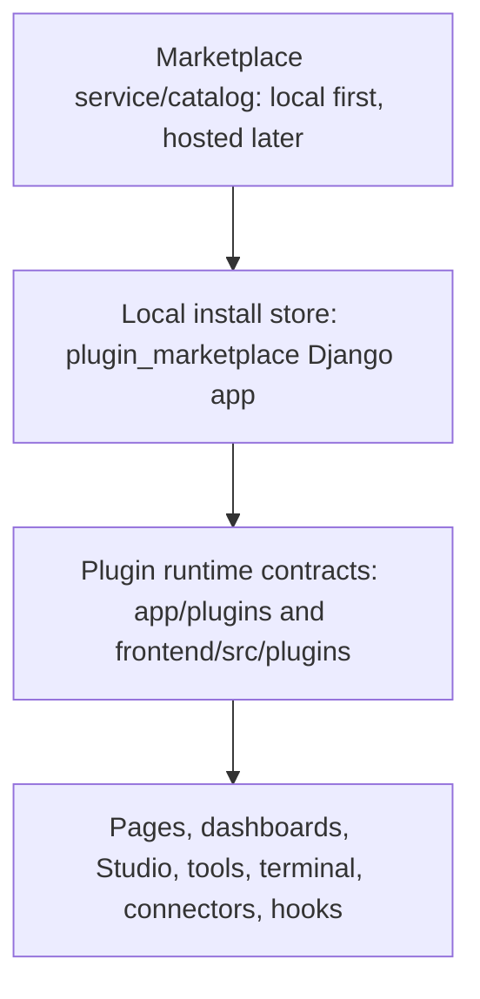
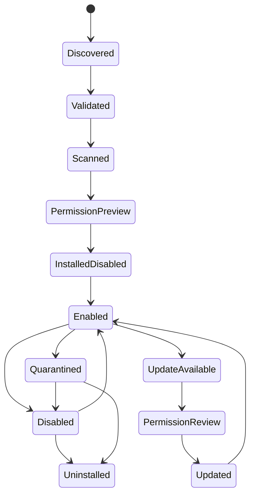
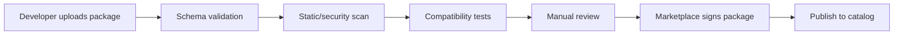

# WebTrerm Plugin Marketplace Implementation Plan

Last reviewed: 2026-06-25

Status: implementation plan

Related documents:

- `PLUGIN_PLATFORM_ARCHITECTURE_PLAN.md` - base plugin runtime contracts, registries, hooks, surfaces, and permission model.
- `PLATFORM_DEVELOPMENT_RULES.md` - general rules for changing WebTrerm safely.
- `STUDIO_OPS_AUTOMATION_PLATFORM_PLAN.md` - broader Studio and automation platform direction.

## 1. Goal

Build WebTrerm so users can install, enable, disable, update, review, and eventually publish third-party plugins without editing core platform files.

The final target is a marketplace where developers can share plugins for:

- platform pages;
- dashboard widgets;
- Studio pipeline nodes;
- agent tools;
- terminal actions;
- connectors to other applications;
- webhooks and automations;
- reporting and monitoring panels.

The first target is smaller: make a safe internal plugin marketplace foundation that proves package metadata, permission review, installation state, catalog UI, and controlled runtime registration.

## 2. Non-Goals

Do not start by building a public app store with arbitrary executable code.

Do not let marketplace plugins bypass existing WebTrerm safety, audit, redaction, permissions, feature gates, or import boundaries.

Do not migrate every existing feature into a plugin. New extension work should use plugin contracts first. Existing built-ins can migrate later only when touched for real product work.

Do not ship dynamic frontend JavaScript from unknown authors in the first marketplace version. Start with manifest/schema-driven UI, compiled built-ins, or sandboxed rendering only after the trust model is ready.

Do not allow plugin install scripts, shell hooks, arbitrary `pip install`, or runtime monkey-patching in the first versions.

## 3. Product Direction

The marketplace should feel like part of WebTrerm, not like a separate admin toy.

Core product flows:

1. Admin opens marketplace.
2. Admin searches or filters plugins.
3. Admin opens plugin detail page.
4. Platform shows screenshots, version, author, permissions, risk level, compatibility, changelog, and reviews.
5. Admin installs plugin into a disabled or staged state.
6. Admin reviews permissions and grants only needed scopes.
7. Admin enables plugin.
8. Plugin surfaces appear in navigation, dashboards, Studio, agent tools, terminal actions, or connector settings.
9. Platform shows health, audit events, errors, updates, and uninstall impact.
10. Plugin can be disabled or removed without breaking the platform.

Developer flows:

1. Developer scaffolds plugin.
2. Developer declares manifest, permissions, settings schema, surfaces, and tests.
3. Developer validates package locally.
4. Developer runs plugin in local WebTrerm.
5. Developer packages plugin.
6. Developer publishes to private marketplace first.
7. Later, developer submits to public marketplace review.
8. Marketplace validates, scans, reviews, signs, and publishes the plugin.

## 4. Architecture Principle

Separate three layers:



### Layer 1: Plugin Runtime

The runtime answers:

- what is a plugin;
- what surfaces can it expose;
- what permissions can it request;
- how it registers into WebTrerm;
- how it is disabled safely;
- how runtime errors are isolated.

Target paths:

```text
app/plugins/
frontend/src/plugins/
```

This layer should stay mostly pure contracts and adapters. It should not own marketplace moderation, package uploads, reviews, ratings, or publisher accounts.

### Layer 2: Local Plugin Store

The local store answers:

- which plugins are installed;
- which version is active;
- who installed it;
- which permissions were granted;
- what health state it has;
- what updates are available;
- whether it is blocked, disabled, or quarantined.

Recommended target app:

```text
plugin_marketplace/
```

This Django app may use `core_ui` auth/access APIs and `app.plugins` contracts. It must not become a dumping ground for runtime feature logic.

### Layer 3: Marketplace Catalog

The marketplace answers:

- what plugins are available;
- who published them;
- what versions exist;
- what compatibility they declare;
- whether they passed review;
- whether they are signed;
- what users rate and report;
- what updates should be offered.

Start with a local/private catalog. Later move it to a hosted service or federated registry.

## 5. Maturity Ladder

Build in maturity levels. Do not jump directly to public third-party code execution.

| Level | Name | What It Enables | Trust Level |
| --- | --- | --- | --- |
| M0 | Runtime contract | Built-in plugins can declare surfaces through stable contracts | Trusted internal code |
| M1 | Local plugin store | Admin can see installed plugins, enable/disable, review permissions | Trusted/internal |
| M2 | Package format | Plugin packages can be validated, packed, installed from local file | Private/curated |
| M3 | Private marketplace | Admin can install from approved internal catalog | Curated third-party |
| M4 | Public submission | External developers can submit packages for review | Untrusted until reviewed |
| M5 | Public marketplace | Users can discover, install, review, report, update plugins | Reviewed/signed |
| M6 | Advanced ecosystem | Paid plugins, revenue sharing, verified publishers, automated compatibility | Commercial |

Recommended order:

1. M0 and M1 first.
2. M2 only after permission denial and disable/uninstall behavior are proven.
3. M3 before public marketplace.
4. M4/M5 only after signing, scanning, review, sandboxing, and update rollback exist.

## 6. Package Format

Recommended package name:

```text
webtrerm-plugin-<publisher>-<slug>.wtp
```

Use a zip-compatible archive with deterministic file layout.

```text
my-plugin/
  webtrerm.plugin.json
  README.md
  CHANGELOG.md
  LICENSE
  backend/
    plugin.py
    schemas.py
    tests/
  frontend/
    manifest.json
    components/
  assets/
    icon.svg
    screenshots/
  docs/
    usage.md
  migrations/
    README.md
  signatures/
    package.sig
    publisher.cert.json
```

### First-Version Package Restrictions

For M2/M3:

- `backend/plugin.py` can be loaded only for trusted/private plugins.
- `frontend/components/` is ignored unless the plugin is compiled into WebTrerm or rendered through a later sandbox.
- `migrations/` must be empty or documentation-only.
- no install scripts;
- no shell commands;
- no automatic dependency installation;
- no monkey-patching;
- no direct imports from WebTrerm feature internals.

### Later Package Capabilities

For M4+ after sandbox work:

- sidecar worker process for backend execution;
- declarative migrations with review;
- iframe or web worker frontend sandbox;
- dependency allowlist;
- package signatures;
- marketplace-issued attestations;
- automated compatibility test matrix.

## 7. Plugin Manifest

Primary manifest file:

```text
webtrerm.plugin.json
```

Example:

```json
{
  "manifest_version": "1.0",
  "id": "acme.slack-alerts",
  "name": "Slack Alerts",
  "slug": "slack-alerts",
  "publisher": {
    "id": "acme",
    "name": "Acme Automation",
    "website": "https://example.com",
    "verified": false
  },
  "version": "0.1.0",
  "api_version": "plugins.v1",
  "webtrerm": {
    "min_version": "0.1.0",
    "max_version": null
  },
  "summary": "Send WebTrerm automation alerts to Slack.",
  "description": "Adds a connector, dashboard status widget, and Studio output node for Slack alerts.",
  "risk_tier": "network_write",
  "categories": ["alerts", "connectors", "studio"],
  "permissions": [
    {
      "scope": "connectors.slack.send",
      "reason": "Send selected alert messages to Slack channels."
    },
    {
      "scope": "secrets.read",
      "reason": "Read the bound Slack bot token at runtime."
    }
  ],
  "secrets": [
    {
      "id": "slack_bot_token",
      "label": "Slack bot token",
      "required": true,
      "kind": "bearer_token"
    }
  ],
  "egress": [
    {
      "host": "slack.com",
      "ports": [443],
      "reason": "Slack Web API"
    }
  ],
  "surfaces": {
    "pages": [],
    "dashboard_widgets": [
      {
        "id": "slack-alert-status",
        "title": "Slack Alert Status",
        "data_endpoint": "/api/plugins/acme.slack-alerts/widgets/status/"
      }
    ],
    "studio_nodes": [
      {
        "type": "output/slack_alert",
        "title": "Slack Alert",
        "schema_ref": "backend.schemas.SlackAlertNodeSchema"
      }
    ],
    "agent_tools": [],
    "terminal_actions": [],
    "hooks": []
  },
  "settings_schema": {
    "type": "object",
    "properties": {
      "default_channel": { "type": "string" }
    },
    "required": ["default_channel"]
  },
  "support": {
    "docs_url": "https://example.com/docs",
    "issues_url": "https://example.com/issues",
    "email": null
  }
}
```

## 8. Manifest Rules

Plugin ID:

- use lowercase;
- use `publisher.slug`;
- do not allow spaces;
- do not allow path separators;
- do not allow reserved names like `core`, `app`, `studio`, `servers`, `admin`;
- once published, ID is immutable.

Version:

- use semantic versioning;
- install exact versions;
- updates are explicit;
- breaking changes require major version bump.

API compatibility:

- plugin declares `api_version`;
- WebTrerm declares supported plugin API versions;
- incompatible plugin cannot be enabled;
- compatible-but-older plugin can be enabled with warning only if contracts still pass validation.

Permissions:

- every action declares permission scopes;
- every permission has a human-readable reason;
- permissions are denied until granted;
- permission grants are stored per plugin version;
- new version with new scopes must require approval again.

Secrets:

- plugin never receives raw secret values in catalog or frontend;
- runtime receives secret through a scoped provider;
- every secret read is auditable;
- uninstall can keep, revoke, or delete secret bindings by admin choice.

Egress:

- every external host must be declared;
- admin can deny egress;
- future worker sandbox should enforce egress allowlist.

Surfaces:

- no surface is active unless plugin is enabled;
- disabled plugin surfaces must disappear without crashing routes or layouts;
- saved dashboard layouts must survive removed widgets.

## 9. Permission Scopes

Base scopes:

```text
plugins.read
plugins.manage
plugins.install
plugins.uninstall
plugins.publish
plugins.review
```

Data scopes:

```text
servers.read
servers.write
servers.execute
terminal.read
terminal.write
terminal.execute
studio.read
studio.write
studio.execute
monitoring.read
dashboard.read
files.read
files.write
memory.read
memory.write
settings.read
settings.write
```

AI and automation scopes:

```text
agents.tools.register
agents.tools.execute
agents.context.read
hooks.subscribe
hooks.emit
workflows.trigger
```

Connector scopes:

```text
connectors.read
connectors.manage
connectors.health
webhooks.receive
webhooks.send
network.egress
secrets.read
secrets.write
```

High-risk scopes:

```text
terminal.execute
servers.execute
files.write
settings.write
network.egress
secrets.read
agents.tools.execute
studio.execute
```

High-risk scopes require:

- admin approval;
- explicit reason;
- audit event;
- test coverage;
- marketplace review;
- clear UI warning.

## 10. Backend Target Modules

Runtime contracts:

```text
app/plugins/
  __init__.py
  contracts.py
  validation.py
  registry.py
  discovery.py
  catalog.py
  permissions.py
  hooks.py
  surfaces.py
  dashboard.py
  pages.py
  connectors.py
  studio_nodes.py
  agent_tools.py
  terminal_actions.py
  errors.py
```

Local plugin store:

```text
plugin_marketplace/
  __init__.py
  apps.py
  models.py
  services/
    catalog_service.py
    install_service.py
    package_service.py
    permission_service.py
    signing_service.py
    review_service.py
    update_service.py
    uninstall_service.py
    health_service.py
    audit_service.py
  views/
    catalog_views.py
    install_views.py
    permission_views.py
    publisher_views.py
    review_views.py
    update_views.py
  serializers.py
  urls.py
  management/commands/
    plugin_validate.py
    plugin_pack.py
    plugin_install_local.py
    plugin_scaffold.py
    plugin_audit.py
```

Frontend:

```text
frontend/src/api/plugins.ts
frontend/src/api/pluginMarketplace.ts
frontend/src/plugins/
  types.ts
  registry.ts
  permissions.ts
  PluginPageHost.tsx
  PluginSettingsHost.tsx
  DashboardWidgetHost.tsx
  StudioPluginNodeHost.tsx
  PluginErrorBoundary.tsx
frontend/src/pages/plugin-marketplace/
  MarketplacePage.tsx
  PluginDetailPage.tsx
  InstalledPluginsPage.tsx
  PluginDeveloperPage.tsx
  PluginReviewQueuePage.tsx
  components/
```

## 11. Database Model Plan

Recommended models for `plugin_marketplace/models.py`:

### PluginPublisher

Fields:

- `id`
- `slug`
- `display_name`
- `website_url`
- `support_url`
- `verified_at`
- `created_by`
- `created_at`
- `updated_at`
- `status`: `pending`, `verified`, `suspended`

Purpose:

- identity for marketplace authors;
- namespace ownership;
- verification and suspension.

### PluginPackage

Fields:

- `id`
- `plugin_id`
- `publisher`
- `name`
- `slug`
- `version`
- `api_version`
- `manifest_json`
- `package_hash`
- `signature_status`
- `risk_tier`
- `review_status`
- `created_at`
- `updated_at`

Purpose:

- immutable package/version metadata;
- source of installable versions.

### PluginInstallation

Fields:

- `id`
- `plugin_id`
- `package`
- `enabled`
- `status`: `installed`, `enabled`, `disabled`, `blocked`, `quarantined`, `uninstalling`
- `installed_by`
- `enabled_by`
- `installed_at`
- `enabled_at`
- `disabled_at`
- `last_health_status`
- `last_health_checked_at`

Purpose:

- local install state;
- the runtime registry reads from this model or a service projection.

### PluginPermissionGrant

Fields:

- `id`
- `installation`
- `scope`
- `granted`
- `grant_reason`
- `granted_by`
- `granted_at`
- `expires_at`
- `source`: `admin`, `policy`, `default`

Purpose:

- version-aware permission approvals;
- a new plugin version with new scopes requires new grant rows.

### PluginSecretBinding

Fields:

- `id`
- `installation`
- `secret_id`
- `secret_provider`
- `secret_ref`
- `created_by`
- `created_at`
- `last_used_at`

Purpose:

- bind plugin secret requirements to existing secret storage;
- do not store raw secret values here.

### PluginSetting

Fields:

- `id`
- `installation`
- `key`
- `value_json`
- `updated_by`
- `updated_at`

Purpose:

- store plugin settings validated against `settings_schema`.

### PluginInstallEvent

Fields:

- `id`
- `installation`
- `event_type`
- `actor`
- `message`
- `metadata_json`
- `created_at`

Purpose:

- audit install, enable, disable, permission grants, updates, failures, health changes.

### PluginReview

Fields:

- `id`
- `package`
- `reviewer`
- `status`: `pending`, `approved`, `rejected`, `needs_changes`
- `notes`
- `created_at`
- `updated_at`

Purpose:

- marketplace moderation and security review.

### PluginRating

Fields:

- `id`
- `package`
- `user`
- `rating`
- `review_text`
- `created_at`
- `updated_at`

Purpose:

- public marketplace quality signal.

### MarketplaceSource

Fields:

- `id`
- `name`
- `base_url`
- `kind`: `local`, `private`, `public`
- `enabled`
- `last_sync_at`
- `created_at`

Purpose:

- allow local, private, and hosted catalogs later.

## 12. API Plan

Separate local plugin runtime APIs from marketplace APIs.

### Local Runtime APIs

```text
GET    /api/plugins/catalog/
GET    /api/plugins/installed/
GET    /api/plugins/{plugin_id}/
POST   /api/plugins/{plugin_id}/enable/
POST   /api/plugins/{plugin_id}/disable/
POST   /api/plugins/{plugin_id}/uninstall/
GET    /api/plugins/{plugin_id}/permissions/
POST   /api/plugins/{plugin_id}/permissions/
GET    /api/plugins/{plugin_id}/settings/
POST   /api/plugins/{plugin_id}/settings/
GET    /api/plugins/{plugin_id}/health/
POST   /api/plugins/{plugin_id}/health/check/
GET    /api/plugins/{plugin_id}/events/
```

### Package APIs

```text
POST   /api/plugin-marketplace/packages/validate/
POST   /api/plugin-marketplace/packages/install-local/
GET    /api/plugin-marketplace/packages/{package_id}/manifest/
GET    /api/plugin-marketplace/packages/{package_id}/security-report/
```

### Marketplace Catalog APIs

```text
GET    /api/plugin-marketplace/catalog/
GET    /api/plugin-marketplace/catalog/{plugin_id}/
GET    /api/plugin-marketplace/catalog/{plugin_id}/versions/
GET    /api/plugin-marketplace/catalog/{plugin_id}/reviews/
POST   /api/plugin-marketplace/catalog/sync/
```

### Publisher APIs

```text
GET    /api/plugin-marketplace/publishers/
POST   /api/plugin-marketplace/publishers/
GET    /api/plugin-marketplace/publishers/{publisher_id}/
POST   /api/plugin-marketplace/publishers/{publisher_id}/verify/
```

### Submission APIs

```text
POST   /api/plugin-marketplace/submissions/
GET    /api/plugin-marketplace/submissions/
GET    /api/plugin-marketplace/submissions/{submission_id}/
POST   /api/plugin-marketplace/submissions/{submission_id}/approve/
POST   /api/plugin-marketplace/submissions/{submission_id}/reject/
POST   /api/plugin-marketplace/submissions/{submission_id}/request-changes/
```

## 13. Frontend Product Plan

Routes:

```text
/settings/plugins
/marketplace
/marketplace/:pluginId
/marketplace/:pluginId/versions
/marketplace/developer
/marketplace/review-queue
/plugins/:pluginId/:pageId
```

Pages:

- Installed plugins page.
- Marketplace catalog page.
- Plugin detail page.
- Install confirmation dialog.
- Permission review dialog.
- Plugin settings page.
- Plugin health/events page.
- Developer console.
- Review queue for admins.

Important components:

```text
PluginSearchBar
PluginCategoryFilter
PluginRiskBadge
PluginCompatibilityBadge
PluginInstallButton
PluginPermissionReview
PluginPermissionDiff
PluginVersionSelector
PluginHealthBadge
PluginInstallEventTimeline
PluginSettingsForm
PluginScreenshots
PluginReviewList
PluginPublisherBadge
PluginUpdateBanner
PluginUninstallDialog
PluginQuarantineNotice
```

UI rules:

- show risk before install;
- show permission diff before update;
- show compatibility before install;
- show publisher verification state;
- show when a plugin is disabled, blocked, or quarantined;
- never crash because a plugin surface is missing;
- unknown plugin route must render controlled not-found state;
- disabled plugin widget must render a "plugin disabled" placeholder or disappear according to dashboard layout policy.

## 14. Install Lifecycle

Lifecycle:



Install steps:

1. Read package.
2. Verify archive structure.
3. Parse `webtrerm.plugin.json`.
4. Validate manifest schema.
5. Validate plugin ID and version.
6. Check compatibility with WebTrerm and plugin API.
7. Calculate package hash.
8. Verify signature when present.
9. Run static safety checks.
10. Build permission preview.
11. Store package metadata.
12. Create disabled installation.
13. Bind settings and secrets only after admin approval.
14. Enable plugin.
15. Register runtime surfaces.
16. Run health check.
17. Emit audit event.

Failure behavior:

- validation failure returns actionable errors;
- package scan failure blocks install;
- enable failure leaves plugin installed but disabled;
- runtime failure disables only the plugin surface, not the whole app;
- repeated health failure can quarantine plugin.

## 15. Update Lifecycle

Update rules:

- never auto-enable a new version that adds permissions;
- never silently change egress hosts;
- never silently add secret requirements;
- never run data migrations without a rollback plan;
- keep previous package metadata for rollback;
- preserve settings when schema is compatible;
- require settings migration preview for breaking changes.

Update steps:

1. Check marketplace source for newer compatible version.
2. Download metadata only.
3. Show changelog.
4. Show permission diff.
5. Show settings schema diff.
6. Show migration and uninstall impact.
7. Admin approves.
8. Install package as pending version.
9. Disable current plugin surfaces.
10. Enable new version.
11. Run health check.
12. Roll back automatically if health check fails before activation completes.
13. Emit audit event.

## 16. Uninstall Lifecycle

Uninstall must answer:

- what surfaces disappear;
- what dashboard layouts reference this plugin;
- what Studio pipelines reference plugin nodes;
- what agent tools become unavailable;
- what secrets are bound;
- what settings and data remain;
- whether uninstall is reversible.

Uninstall modes:

| Mode | Behavior |
| --- | --- |
| Disable only | Keep package, settings, secrets, layouts, and data |
| Soft uninstall | Remove active surfaces, keep recoverable data |
| Full uninstall | Remove package and plugin-owned data where safe |
| Quarantine | Disable runtime, keep evidence and events |

First version should support disable and soft uninstall. Full uninstall can come later.

## 17. Security Model

The marketplace is a security boundary.

Default posture:

- deny by default;
- no arbitrary code from public authors;
- no install scripts;
- no raw secrets to frontend;
- no undeclared network egress;
- no undeclared terminal/server execution;
- no direct feature-app imports from plugin contracts;
- no plugin can crash a core page;
- no plugin can bypass audit logging.

Required security controls before public marketplace:

1. Manifest schema validation.
2. Package hash verification.
3. Publisher namespace ownership.
4. Signature verification.
5. Static scan.
6. Dependency allowlist or isolation.
7. Permission review.
8. Egress declaration.
9. Secret binding model.
10. Runtime error boundary.
11. Audit trail.
12. Quarantine switch.
13. Admin report/abuse action.
14. Review queue.
15. Update rollback.

## 18. Sandbox Strategy

### M0-M1

Only trusted in-repo or built-in plugins.

Runtime:

- in-process Python;
- compiled frontend;
- registry-based activation;
- no third-party packages.

### M2-M3

Private curated plugins.

Runtime:

- in-process allowed only for trusted packages;
- stronger validation;
- no install scripts;
- no dynamic frontend code;
- optional sidecar proof of concept.

### M4-M5

Public reviewed plugins.

Runtime target:

- backend plugin actions run in isolated worker process or service;
- frontend plugin UI runs as schema-driven UI, iframe sandbox, or pre-reviewed compiled bundle;
- network egress is allowlisted;
- filesystem access is denied by default;
- secret access goes through scoped provider;
- timeouts and memory limits are enforced.

## 19. Marketplace Review Pipeline

Submission pipeline:



Review checks:

- manifest is complete;
- permissions match actual behavior;
- egress hosts are justified;
- secrets are justified;
- no direct feature internals import;
- no install scripts;
- no hidden network calls;
- no unsafe frontend injection;
- README explains usage;
- screenshots match plugin behavior;
- tests cover permission deny and disable behavior;
- uninstall impact is documented;
- support link exists.

Reject reasons:

- unsafe permissions;
- hidden behavior;
- incomplete manifest;
- incompatible API version;
- missing tests;
- misleading description;
- broken uninstall;
- raw secret exposure;
- marketplace policy violation.

## 20. Developer SDK

Management commands:

```powershell
python manage.py plugin_scaffold acme.slack-alerts
python manage.py plugin_validate path\to\plugin
python manage.py plugin_pack path\to\plugin
python manage.py plugin_install_local path\to\plugin.wtp
python manage.py plugin_audit acme.slack-alerts
```

Future CLI wrapper:

```powershell
webtrerm plugin scaffold acme.slack-alerts
webtrerm plugin validate .
webtrerm plugin pack .
webtrerm plugin install .\dist\acme.slack-alerts-0.1.0.wtp
webtrerm plugin publish .\dist\acme.slack-alerts-0.1.0.wtp
```

SDK files:

```text
app/plugins/sdk/
  __init__.py
  manifest.py
  permissions.py
  testing.py
  fixtures.py
```

Frontend SDK files:

```text
frontend/src/plugins/sdk/
  createPluginPage.tsx
  createDashboardWidget.tsx
  createSettingsForm.tsx
  schemas.ts
```

Templates:

```text
templates/plugins/
  dashboard-widget/
  connector/
  studio-node/
  agent-tool/
  terminal-action/
```

## 21. Testing Strategy

Backend tests:

```powershell
python -m pytest tests/test_plugin_manifest_validation.py
python -m pytest tests/test_plugin_registry.py
python -m pytest tests/test_plugin_marketplace_install.py
python -m pytest tests/test_plugin_marketplace_permissions.py
python -m pytest tests/test_plugin_marketplace_updates.py
python -m pytest tests/test_plugin_marketplace_uninstall.py
python -m pytest tests/test_plugin_marketplace_review.py
```

Frontend tests:

```powershell
npm run test -- src/plugins
npm run test -- src/pages/plugin-marketplace
npx eslint src/plugins src/pages/plugin-marketplace
```

Architecture checks:

```powershell
python scripts/check_architecture_sizes.py --strict-new
lint-imports
```

Required test cases:

- invalid manifest is rejected;
- duplicate plugin ID is rejected;
- incompatible API version is rejected;
- package with reserved ID is rejected;
- package with new permissions requires approval;
- package with undeclared egress is rejected or blocked;
- disabled plugin does not register surfaces;
- missing plugin page does not crash;
- missing plugin widget does not crash dashboard;
- plugin tool cannot execute without grant;
- plugin connector cannot read secret without grant;
- plugin node validation fails when plugin disabled;
- uninstall preserves dashboard layout safely;
- update rollback works after failed health check;
- audit events are created for install, enable, disable, update, uninstall, permission grant, and quarantine.

## 22. Current Architecture Cleanup Gate Before Marketplace

This section records current architecture problems that must be fixed before marketplace work grows the platform further.

Verification command:

```powershell
python scripts/check_architecture_sizes.py --strict-new
```

Current result on 2026-06-25:

- import-linter fails;
- god-file prevention fails;
- the architecture README status must not claim the guard is green until this is fixed and rechecked.

### Problem 1: `core_ui` Imports Feature Domains Directly

Observed violations:

```text
core_ui.services.assistant_chat -> servers.models
core_ui.services.assistant_chat -> servers.views.server_helpers
core_ui.services.assistant_chat -> studio.views.pipeline_helpers
```

Why this is dangerous for marketplace:

- `core_ui` is supposed to own auth, access, settings, and admin shell concerns.
- Marketplace will need plugin permissions, install state, and admin UI.
- If `core_ui` starts importing feature domains directly, plugin management will become another central dependency knot.
- It becomes hard to add plugin-provided agent tools, Studio nodes, or server actions without editing core services.

Required fix:

1. Split `core_ui.services.assistant_chat` into a thin chat/session owner and provider-based action resolution.
2. Move server-specific assistant behavior behind a `servers` provider.
3. Move Studio-specific assistant behavior behind a `studio` provider.
4. Introduce a shared provider/registry contract that `core_ui` can call without importing `servers` or `studio`.
5. Register providers from feature app startup or explicit wiring, not from `core_ui`.
6. Keep the API response shape stable.
7. Add import-linter regression coverage.

Target shape:

```text
core_ui/
  services/
    assistant_chat.py          # session, permission, response orchestration only
    assistant_action_registry.py

servers/
  assistant_actions.py         # server-owned action provider

studio/
  assistant_actions.py         # Studio-owned action provider

app/
  assistant_actions.py         # pure contracts if a shared runtime contract is needed
```

Acceptance:

- `core_ui` no longer imports `servers` or `studio`.
- import-linter contract `core_ui must not import servers or studio` is kept.
- assistant chat behavior still works.
- denied/unknown actions return controlled errors.
- this provider registry can later feed plugin-provided assistant actions.

### Problem 2: New Marketplace-Adjacent God Files

Observed files from the current guard output:

```text
core_ui/services/assistant_chat.py
frontend/src/pages/ChatPage.tsx
servers/agent_run_report.py
studio/assistant_actions.py
frontend/src/api/agents.ts
frontend/src/pages/AgentRunPage.tsx
frontend/src/pages/AgentsPage.tsx
frontend/e2e/agents.spec.ts
frontend/e2e/support/platformFixtures.ts
tests/test_servers_agent_control_api.py
tests/test_servers_agent_run_api_smoke.py
```

Why this is dangerous for marketplace:

- Plugin surfaces will touch chat, agents, Studio, dashboards, and server actions.
- Large files invite "just add one more case" changes.
- Marketplace install/update/uninstall logic needs predictable owners and testable service boundaries.
- Large E2E fixtures make marketplace tests brittle and slow to maintain.

Required fix:

1. Split `core_ui/services/assistant_chat.py` by responsibility:
   - session lifecycle;
   - message persistence;
   - action routing;
   - provider registry;
   - response serialization.
2. Split `frontend/src/pages/ChatPage.tsx` into:
   - page container;
   - data hook;
   - message list;
   - composer;
   - action/result panels;
   - empty/error states.
3. Split `servers/agent_run_report.py` into:
   - report query service;
   - artifact collector;
   - payload builder;
   - formatter;
   - delivery adapter.
4. Split `studio/assistant_actions.py` into:
   - action specs;
   - registry bridge;
   - executors;
   - serializers.
5. Split `frontend/src/api/agents.ts` by API area:
   - agent configs;
   - agent runs;
   - reports;
   - scheduling;
   - control actions.
6. Split large E2E specs into scenario files and shared page-object helpers.
7. Keep compatibility exports only as thin facades while callers migrate.

Acceptance:

- no newly touched marketplace-adjacent file exceeds the size guard limit;
- compatibility files do not grow with new logic;
- tests still cover assistant chat, agent runs, report generation, and action execution;
- marketplace code does not depend on the large files directly.

### Problem 3: Assistant Actions And Future Plugin Actions Can Diverge

Current risk:

- assistant actions exist or are being introduced across multiple domains;
- plugin actions will need similar metadata: id, title, input schema, permission scopes, risk, executor, audit category;
- if these systems are separate, WebTrerm will end with two or three action registries that do the same thing differently.

Required fix:

1. Define one action contract shape before marketplace actions are added.
2. Reuse it for assistant actions, terminal actions, agent tools where practical, and plugin actions.
3. Keep domain-specific execution in domain providers.
4. Keep permission and audit metadata explicit.
5. Do not infer policy for plugin actions.

Target metadata:

```text
id
owner
title
description
input_schema
output_schema
required_permissions
risk_tier
audit_category
executor_ref
enabled_when
```

Acceptance:

- built-in assistant actions and future plugin actions can be listed through a common catalog projection;
- each action has explicit permission metadata;
- every execution path records owner/plugin id in audit metadata.

### Problem 4: Architecture Status Documentation Can Become Stale

Current risk:

- architecture docs may say the guard is green while the current dirty worktree is not;
- future marketplace work may start from outdated assumptions.

Required fix:

1. Keep `docs/architecture/README.md` tied to the latest verified guard result.
2. If the guard is red, write the exact failing areas and link to this cleanup gate.
3. Do not mark marketplace phases as complete until the guard is rerun.

Acceptance:

- README status matches the latest verification;
- this plan records the cleanup backlog;
- final implementation notes for marketplace phases include the guard result.

### Problem 5: Plugin Contracts Need Import Boundaries Before They Grow

Current risk:

- after `app.plugins` and `plugin_marketplace` are added, code can easily start importing feature internals directly;
- this would recreate the same boundary issues under a new plugin name.

Required fix:

1. Add import-linter contracts after modules exist:
   - `app.plugins` must not import `servers`, `studio`, or `core_ui`;
   - `plugin_marketplace` may import `app.plugins` and `core_ui` access/auth, but must not import feature implementation internals for runtime behavior;
   - feature apps may register providers into plugin contracts through narrow adapters.
2. Add tests or checks that plugin contracts remain pure.
3. Keep marketplace persistence in `plugin_marketplace`, not in `app.plugins`.

Acceptance:

- plugin contracts are importable without Django setup where practical;
- feature integrations are provider/adapter based;
- future marketplace code cannot bypass boundaries unnoticed.

### Cleanup Must Happen Before These Marketplace Milestones

| Cleanup Item | Must Be Done Before |
| --- | --- |
| Fix `core_ui.services.assistant_chat` boundary leak | Phase 1 runtime foundation |
| Split assistant/chat god files | Phase 2 installed plugins page |
| Split action metadata into a shared contract | Phase 3 permission grants |
| Split agent report/action files | Phase 8 and Phase 9 |
| Split frontend chat/agent pages touched by marketplace UI | Phase 6 and Phase 9 |
| Add plugin import-linter contracts | Before `app.plugins` becomes a dependency for feature apps |
| Refresh README guard status | Every phase completion |

### Cleanup Definition Of Done

The cleanup gate is closed when:

- `python scripts/check_architecture_sizes.py --strict-new` passes, or any remaining legacy exceptions are explicitly documented and not touched by marketplace work;
- import-linter has no `core_ui -> servers/studio` violations;
- no new marketplace module starts above the size limit;
- assistant actions are provider-based;
- plugin action metadata has one shared contract shape;
- architecture README no longer claims stale green status.

## 23. Implementation Roadmap

### Phase 0: Align Docs, Boundaries, And Current Guard Failures

Goal:

- make this plan and base plugin architecture plan the source of truth;
- fix current architecture guard failures before marketplace work adds new surfaces.

Tasks:

1. Keep `PLUGIN_PLATFORM_ARCHITECTURE_PLAN.md` for runtime contracts.
2. Keep this file for marketplace, packaging, publishing, review, and ecosystem.
3. Link both from `docs/architecture/README.md`.
4. Add future import-boundary notes when `app.plugins` and `plugin_marketplace` exist.
5. Fix the current `core_ui.services.assistant_chat` import boundary leak.
6. Split marketplace-adjacent god files before extending them.
7. Refresh `docs/architecture/README.md` after every architecture guard recheck.

Acceptance:

- architecture README points to this plan;
- current guard status is accurate;
- import-linter has no `core_ui -> servers/studio` violation;
- next implementation task can start from a named phase without building on known architecture debt.

### Phase 1: Runtime Foundation

Goal:

- WebTrerm can register built-in plugins through contracts.

Files:

```text
app/plugins/contracts.py
app/plugins/validation.py
app/plugins/registry.py
app/plugins/catalog.py
frontend/src/api/plugins.ts
frontend/src/plugins/types.ts
frontend/src/plugins/registry.ts
```

Tasks:

1. Define dataclass/protocol manifest types.
2. Define permission types.
3. Define surface types for page, dashboard widget, connector, Studio node, agent tool, terminal action, and hook.
4. Implement manifest validation.
5. Implement in-memory registry.
6. Implement safe catalog projection.
7. Add `GET /api/plugins/catalog/`.
8. Add one demo built-in plugin with harmless dashboard metadata.
9. Add frontend catalog types and loader.
10. Add controlled empty/error states.

Acceptance:

- catalog endpoint returns demo plugin;
- disabled plugin surfaces are omitted;
- frontend can render catalog without crashing;
- backend tests cover invalid and duplicate manifests;
- architecture size guard passes.

### Phase 2: Local Installed Plugins Page

Goal:

- admins can see installed plugins and their runtime status.

Files:

```text
plugin_marketplace/models.py
plugin_marketplace/services/install_service.py
plugin_marketplace/views/install_views.py
frontend/src/pages/plugin-marketplace/InstalledPluginsPage.tsx
```

Tasks:

1. Create `plugin_marketplace` Django app.
2. Add `PluginPackage`.
3. Add `PluginInstallation`.
4. Add `PluginInstallEvent`.
5. Add admin-only installed plugins API.
6. Add installed plugins page under `/settings/plugins`.
7. Show enabled/disabled/blocked status.
8. Show version, publisher, risk tier, health state.
9. Add enable/disable actions.
10. Emit audit events.

Acceptance:

- admin can view installed plugins;
- admin can enable and disable demo plugin;
- non-admin cannot manage plugins;
- disable removes demo surfaces;
- audit events are visible through API or admin/debug output.

### Phase 3: Permission Grants

Goal:

- plugins cannot do anything risky without explicit grants.

Files:

```text
app/plugins/permissions.py
plugin_marketplace/models.py
plugin_marketplace/services/permission_service.py
plugin_marketplace/views/permission_views.py
frontend/src/pages/plugin-marketplace/components/PluginPermissionReview.tsx
```

Tasks:

1. Add `PluginPermissionGrant`.
2. Add permission preview service.
3. Add grant/revoke API.
4. Add permission review UI.
5. Add permission diff helper for updates.
6. Add runtime permission check helper.
7. Wire permission checks into demo plugin action.
8. Add high-risk permission warning copy.

Acceptance:

- plugin action is denied before grant;
- admin can grant/revoke scopes;
- permission denial is clear and non-crashing;
- permission grant is audited;
- new version with new scope requires approval.

### Phase 4: Package Validator And Local Install

Goal:

- WebTrerm can validate and install a local `.wtp` package into disabled state.

Files:

```text
plugin_marketplace/services/package_service.py
plugin_marketplace/services/install_service.py
plugin_marketplace/management/commands/plugin_validate.py
plugin_marketplace/management/commands/plugin_pack.py
plugin_marketplace/management/commands/plugin_install_local.py
```

Tasks:

1. Define `.wtp` package reader.
2. Validate archive layout.
3. Validate `webtrerm.plugin.json`.
4. Reject install scripts.
5. Reject reserved paths.
6. Calculate package hash.
7. Store immutable package metadata.
8. Create disabled installation.
9. Add local install API or admin command.
10. Add install events.

Acceptance:

- invalid package fails with actionable errors;
- valid local package installs disabled;
- package cannot enable until permissions reviewed;
- install does not execute arbitrary package code;
- package hash is stored.

### Phase 5: Plugin Settings And Secret Binding

Goal:

- plugin settings and secrets are configured safely.

Files:

```text
plugin_marketplace/models.py
plugin_marketplace/services/permission_service.py
plugin_marketplace/services/install_service.py
frontend/src/pages/plugin-marketplace/components/PluginSettingsForm.tsx
```

Tasks:

1. Add `PluginSetting`.
2. Add `PluginSecretBinding`.
3. Validate settings against schema.
4. Render schema-driven settings form.
5. Bind plugin secret requirement to existing secret storage/provider.
6. Never expose raw secret values to frontend.
7. Audit secret binding and use.

Acceptance:

- invalid settings are rejected;
- plugin cannot read unbound secret;
- frontend never receives secret value;
- settings survive disable/enable;
- uninstall can keep or remove settings.

### Phase 6: Dashboard And Page Marketplace Surfaces

Goal:

- installed plugins can add pages and dashboard widgets without editing page-local lists.

Files:

```text
app/plugins/pages.py
app/plugins/dashboard.py
frontend/src/plugins/PluginPageHost.tsx
frontend/src/plugins/DashboardWidgetHost.tsx
```

Tasks:

1. Add page surface registry.
2. Add widget surface registry.
3. Add `/plugins/:pluginId/:pageId` host route.
4. Add dashboard widget host.
5. Merge built-in and plugin widgets.
6. Preserve saved layouts when plugin disabled.
7. Add plugin error boundary.

Acceptance:

- demo plugin page renders;
- demo widget renders;
- disabling plugin removes/hides page and widget safely;
- unknown page route shows controlled not-found;
- widget error does not crash dashboard.

### Phase 7: Connector Marketplace Surface

Goal:

- plugins can add external app connectors safely.

Files:

```text
app/plugins/connectors.py
plugin_marketplace/services/health_service.py
frontend/src/pages/plugin-marketplace/components/PluginHealthBadge.tsx
```

Tasks:

1. Define connector manifest contract.
2. Define connector settings schema.
3. Define health check interface.
4. Define action interface.
5. Require egress declaration.
6. Require secret binding.
7. Add connector health API.
8. Add audit events for connector actions.
9. Build one safe connector demo, such as Telegram or Slack stub.

Acceptance:

- connector appears only when plugin enabled;
- health check works without exposing secrets;
- denied egress or missing secret blocks action;
- action logs audit event.

### Phase 8: Studio Node Marketplace Surface

Goal:

- plugins can add Studio nodes through one registration path.

Files:

```text
app/plugins/studio_nodes.py
studio/executor/registry.py
studio/node_manifest.py
frontend/src/plugins/StudioPluginNodeHost.tsx
```

Tasks:

1. Add plugin node spec.
2. Merge plugin node manifests with built-ins.
3. Register plugin executors only when enabled.
4. Add permission checks before execution.
5. Add schema-driven frontend config panel.
6. Ensure unknown/disabled plugin nodes fail validation clearly.

Acceptance:

- demo plugin node appears in Studio palette;
- validation accepts node only when plugin enabled;
- execution checks permissions;
- frontend does not need hardcoded metadata for simple plugin nodes.

### Phase 9: Agent Tool And Terminal Action Surfaces

Goal:

- plugins can safely extend agent tools and terminal actions.

Files:

```text
app/plugins/agent_tools.py
app/plugins/terminal_actions.py
app/agent_kernel/tools/registry.py
servers/services/terminal_ai/
frontend/src/components/terminal/
```

Tasks:

1. Convert plugin tool specs to explicit `ToolSpec`.
2. Reject plugin tools without explicit policy metadata.
3. Include plugin ID in audit metadata.
4. Add terminal action registry.
5. Route terminal actions through service-level registry.
6. Add frontend action rendering from catalog.
7. Add permission-deny and disabled-plugin tests.

Acceptance:

- plugin tool appears only when enabled;
- plugin tool cannot use compatibility inference;
- terminal action cannot execute without permission;
- AI panel does not crash when plugin action registry is empty.

### Phase 10: Private Marketplace Catalog

Goal:

- admin can sync and install from a trusted catalog source.

Files:

```text
plugin_marketplace/models.py
plugin_marketplace/services/catalog_service.py
plugin_marketplace/views/catalog_views.py
frontend/src/pages/plugin-marketplace/MarketplacePage.tsx
frontend/src/pages/plugin-marketplace/PluginDetailPage.tsx
```

Tasks:

1. Add `MarketplaceSource`.
2. Define catalog JSON feed format.
3. Add catalog sync service.
4. Store available packages as metadata.
5. Add marketplace list UI.
6. Add plugin detail UI.
7. Add category/risk/compatibility filters.
8. Add install from catalog.
9. Install catalog package into disabled state.

Acceptance:

- admin can sync private catalog;
- available plugin appears in marketplace;
- admin can install package disabled;
- incompatible plugin cannot install;
- plugin detail shows risk, permissions, changelog, publisher, and compatibility.

### Phase 11: Review Queue And Signing

Goal:

- marketplace packages can be reviewed and signed before publication.

Files:

```text
plugin_marketplace/services/review_service.py
plugin_marketplace/services/signing_service.py
plugin_marketplace/views/review_views.py
frontend/src/pages/plugin-marketplace/PluginReviewQueuePage.tsx
```

Tasks:

1. Add `PluginPublisher`.
2. Add `PluginReview`.
3. Add review queue API.
4. Add approve/reject/request-changes flow.
5. Add package signature verification.
6. Add marketplace signature status.
7. Add reviewer notes.
8. Add rejection reasons.

Acceptance:

- only reviewers/admins can approve packages;
- unsigned public package cannot be installed without override;
- approved package receives signature status;
- rejected package is not shown in public catalog.

### Phase 12: Public Marketplace MVP

Goal:

- external developers can submit packages, and users can install reviewed plugins.

Tasks:

1. Add publisher registration.
2. Add package submission.
3. Add automated validation job.
4. Add static scan job.
5. Add review queue.
6. Add public catalog projection.
7. Add ratings/reviews.
8. Add abuse report.
9. Add deprecate/unpublish flow.
10. Add compatibility matrix.

Acceptance:

- external publisher can submit package;
- bad package is rejected before review;
- reviewer can approve and publish;
- users can install only reviewed compatible package;
- users can report abusive plugin;
- admin can quarantine plugin.

### Phase 13: Advanced Ecosystem

Goal:

- make marketplace sustainable and scalable.

Potential features:

- verified publishers;
- paid plugins;
- trial licenses;
- organization-scoped installs;
- plugin analytics;
- automatic compatibility test matrix;
- security attestations;
- dependency scanning;
- revenue sharing;
- marketplace search ranking;
- plugin collections;
- enterprise allowlist/denylist;
- federated marketplace sources.

Do not start this phase until public marketplace basics are stable.

## 24. First Three Implementation Sprints

### Sprint 0: Architecture Cleanup Gate

Deliver:

- fixed `core_ui.services.assistant_chat` boundary leak;
- split assistant/chat files that marketplace work would touch;
- shared action metadata contract draft;
- updated architecture README status.

Done when:

- `python scripts/check_architecture_sizes.py --strict-new` is green or remaining legacy exceptions are documented and not part of marketplace work;
- import-linter has no `core_ui -> servers/studio` violation;
- assistant actions can be resolved through providers.

### Sprint 1: Runtime And Installed Plugin Shell

Deliver:

- `app/plugins` contracts and validation;
- catalog endpoint;
- frontend plugin types;
- installed plugins page;
- demo built-in plugin.

Done when:

- admin can see demo plugin;
- enable/disable works;
- disabled plugin has no active surfaces;
- tests cover manifest validation and duplicate ID.

### Sprint 2: Permission Grants And Package Validation

Deliver:

- permission grant model/service;
- permission review UI;
- `.wtp` package validation;
- local install disabled;
- install events.

Done when:

- local plugin package validates;
- install does not execute plugin code;
- plugin action denied without grant;
- admin grant enables action.

### Sprint 3: Marketplace Catalog MVP

Deliver:

- private catalog feed;
- marketplace page;
- plugin detail page;
- install from catalog;
- compatibility/risk/permission display.

Done when:

- admin can sync catalog;
- compatible package can be installed disabled;
- incompatible package is blocked;
- plugin detail explains risk before install.

## 25. Rules For Marketplace Plugin Authors

Authors must:

- use a stable plugin ID;
- declare every permission;
- explain every permission;
- declare every egress host;
- declare every secret;
- validate settings through schema;
- include tests;
- include README, changelog, license, and support link;
- avoid feature-internal imports;
- provide safe disable behavior;
- document uninstall impact;
- never expose raw secrets;
- never execute shell commands unless permission explicitly allows it;
- never mutate platform state outside declared contracts.

## 26. Platform Rules For Implementers

When adding marketplace code:

1. Pick the owner module first.
2. Add contract before runtime behavior.
3. Add permission checks before actions.
4. Add audit events for risky actions.
5. Add disable behavior before enabling new surfaces.
6. Add tests for deny paths, not only success paths.
7. Keep compatibility files thin.
8. Keep plugin contracts pure.
9. Keep marketplace persistence out of `app.plugins`.
10. Keep frontend API calls under `frontend/src/api/`.
11. Add controlled empty/error states.
12. Update docs when a contract changes.
13. Do not begin package install, marketplace catalog, or public publishing work while the cleanup gate is red.

## 27. Risk Register

| Risk | Impact | Control |
| --- | --- | --- |
| Marketplace starts while architecture guard is red | High | Close cleanup gate before Sprint 1 runtime work |
| Plugin marketplace repeats current `core_ui -> feature app` dependency leak | High | Provider registries and import-linter contracts |
| Assistant actions and plugin actions become separate incompatible systems | Medium | Shared action metadata contract before plugin actions |
| Public plugin executes unsafe code | Critical | No arbitrary code until sandbox/signing/review exists |
| Plugin bypasses permissions | Critical | Runtime permission engine and tests for deny paths |
| Plugin exposes secrets | Critical | Secret binding provider, no raw frontend values, audit reads |
| Plugin breaks dashboard route | High | Error boundaries and disabled/missing plugin placeholders |
| Update adds hidden permissions | High | Permission diff and reapproval |
| Uninstall breaks saved layouts | Medium | Soft uninstall and layout placeholder policy |
| Marketplace becomes huge before runtime is proven | High | M0-M3 first, public marketplace later |
| Plugin imports feature internals | High | Import boundaries and review checks |
| Compatibility files grow again | Medium | Registry bridges only, no plugin-specific central methods |
| Review process becomes manual bottleneck | Medium | Automated validation, scan, compatibility tests |

## 28. Public Marketplace Readiness Checklist

Do not launch public marketplace until all are true:

- current architecture cleanup gate is closed;
- plugin runtime contract exists;
- installed plugin store exists;
- permission grants exist;
- local package validation exists;
- disable/uninstall works;
- update rollback exists;
- secrets are scoped;
- audit events exist;
- package signatures exist;
- private catalog works;
- review queue exists;
- static scan exists;
- sandbox or strict no-code package policy exists;
- abuse report/quarantine exists;
- compatibility checks exist;
- frontend error boundaries exist;
- documentation for authors exists.

## 29. Definition Of Done

Marketplace foundation is done when:

- current architecture cleanup gate is closed;
- admins can view installed plugins;
- admins can install local/private package into disabled state;
- admins can review permissions before enable;
- plugins can add at least one page or dashboard widget through registry;
- plugin disable removes all active surfaces safely;
- marketplace catalog can show available packages;
- install/update/uninstall actions are audited;
- invalid packages are rejected;
- incompatible packages are rejected;
- high-risk permissions are visible before install;
- tests cover success, denial, disable, update, and uninstall behavior.

Public marketplace is done when:

- external publishers can submit packages;
- package validation and security scan run automatically;
- reviewers can approve/reject;
- approved packages are signed;
- users can install only compatible reviewed packages;
- users can rate/report plugins;
- admins can quarantine plugins;
- update and rollback are reliable.

## 30. Recommended Next Step

Start with Sprint 0, then Sprint 1.

Sprint 0:

1. Fix the `core_ui.services.assistant_chat` boundary leak.
2. Split assistant/chat god files that marketplace work would touch.
3. Draft shared action metadata contract for assistant and future plugin actions.
4. Update architecture README with the verified guard status.
5. Rerun `python scripts/check_architecture_sizes.py --strict-new`.

Then Sprint 1:

1. Implement `app/plugins` pure contracts.
2. Implement manifest validation.
3. Implement runtime registry.
4. Add catalog endpoint.
5. Add frontend plugin types and catalog loader.
6. Add one harmless built-in demo plugin.
7. Add installed plugins page shell.

This gives WebTrerm a stable extension point without taking the risk of public third-party code too early.
