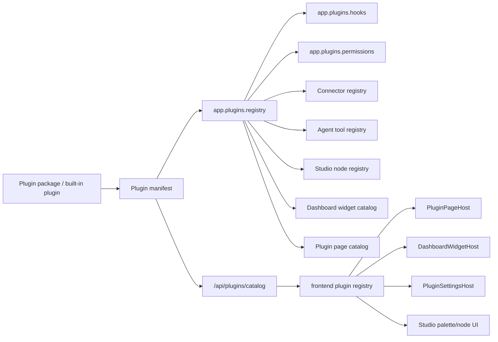

# WebTrerm Plugin Platform Architecture Plan

Last reviewed: 2026-06-21

This document describes the next architecture layer for WebTrerm: a typed plugin platform for pages, dashboards, connectors, Studio nodes, agent tools, terminal actions, and cross-application integrations.

The goal is not to replace the current codebase. The goal is to turn the extension points that already exist into one explicit, testable contract so new features can be added through manifests, registries, hooks, and permission-scoped adapters instead of editing compatibility classes or central UI files.

## Executive Summary

WebTrerm already has several useful extension mechanisms:

- Agent tools: `app.agent_kernel.tools.registry.ToolRegistry` and `ToolSpec`.
- Agent lifecycle hooks: `app.agent_kernel.hooks.manager.HookManager`.
- Studio runtime nodes: `studio.executor.registry.NodeRegistry`.
- Studio node catalog: `studio.node_manifest.NODE_MANIFESTS`.
- Dashboard widgets: `frontend/src/components/dashboard/CustomizableDashboard.tsx` plus `WidgetDefinition`.
- Feature access: `core_ui.access.feature_allowed_for_user()` and frontend `FeatureGate`.
- Integration patterns: MCP pools, notification settings, webhooks, Telegram, SMTP, and provider registries.
- Import boundaries: `.importlinter` keeps `app`, `servers`, `studio`, and `core_ui` separated.

The missing layer is a stable plugin contract that joins these pieces:

- one backend plugin manifest format;
- one frontend plugin manifest format;
- one registry/catalog endpoint;
- typed hooks and permission scopes;
- installation/discovery rules;
- UI slots for pages, settings, dashboards, and terminal/Studio extensions;
- tests that prove a plugin cannot bypass policy, audit, redaction, or import boundaries.

## Current State And Gaps

### What Is Already Good

The project is already moving in the right direction:

- Direct cross-app imports are guarded by `.importlinter`.
- The architecture guard passes and legacy size baselines are now empty.
- Studio node execution uses a registry and fails unknown node types instead of silently skipping them.
- Built-in agent tools declare policy metadata through `ToolSpec`.
- Many runtime integrations already go through providers or gateways instead of feature-app imports.
- Dashboard widgets are already described by a small `WidgetDefinition` type.

These should be reused.

### Main Gaps

1. **Registries are isolated**

   Agent tools, Studio nodes, node manifests, dashboard widgets, MCP connectors, and app navigation each have their own registration style. A new feature often needs several manual edits in unrelated files.

2. **Backend and frontend catalogs are duplicated**

   Studio node metadata exists in backend `studio.node_manifest` and frontend `frontend/src/components/pipeline/nodes/nodeMeta.tsx`. This is manageable for built-ins, but plugin nodes should not require manual frontend edits.

3. **Navigation and page routes are static**

   `frontend/src/App.tsx`, `AppSidebar`, and feature access lists define route/menu surfaces manually. Plugin pages need a slot-based approach.

4. **Dashboard widgets are component-local**

   User/admin dashboard widgets are built by page-local functions. Plugin widgets need a registry that can merge built-ins with plugin-provided widgets.

5. **Connector templates are not a platform contract**

   MCP templates, Telegram, SMTP, webhooks, and future apps such as GitHub/Slack/Notion/Jira should share connector contracts: settings schema, secret requirements, health check, allowed actions, and audit category.

6. **Hooks are agent-specific**

   `HookManager` is useful, but platform events should cover more domains: server connection, terminal command completion, pipeline run lifecycle, dashboard load, alert creation, connector health, and plugin enable/disable.

7. **Docs are not fully aligned**

   Some local docs still describe old architecture status and old priority order. The plugin platform plan should become a public architecture target, then the local development rules should be refreshed to match the current green guard and empty legacy baseline state.

## Design Principles

1. **Manifest first**

   A plugin is not "some imported code". It is a manifest plus optional backend and frontend modules.

2. **Deny by default**

   A plugin gets no permissions unless declared and granted.

3. **No raw internal imports**

   Plugins use public contracts from `app.plugins`, `frontend/src/plugins`, and domain SDK adapters. They should not import feature internals such as `servers.models`, `studio.models`, or `core_ui.models` directly.

4. **Policy before execution**

   Any action that mutates state, calls an external service, runs a command, writes files, sends notifications, or invokes MCP must pass permission, redaction, audit, and optional approval.

5. **Stable UI slots**

   Plugin UI should mount into known slots: pages, settings panels, dashboard widgets, Studio palette nodes, terminal action menu, AI assistant actions.

6. **Runtime isolation where practical**

   Start with in-process plugins for speed. Keep the contract compatible with later process-isolated or package-installed plugins.

7. **Compatibility shells stay thin**

   Existing compatibility classes such as `SSHTerminalConsumer` should not become plugin hosts. They should call registry/hook services.

8. **Everything testable**

   Every plugin surface needs a smoke test, permission-deny test, schema validation test, and architecture guard check.

## Target Architecture



## Backend Module Layout

Create a new bounded platform area:

```text
app/plugins/
  __init__.py
  contracts.py          # dataclasses/protocols: manifest, extension contracts, hook payloads
  registry.py           # process registry for enabled plugin manifests and backend adapters
  discovery.py          # built-in plugin discovery and optional package discovery
  validation.py         # manifest schema validation and compatibility checks
  permissions.py        # plugin permission scopes and grant decisions
  hooks.py              # typed event bus
  catalog.py            # API-safe plugin catalog projection
  connectors.py         # ConnectorSpec, ConnectorRuntime, health/action contracts
  dashboard.py          # backend dashboard widget data-source specs
  studio_nodes.py       # plugin Studio node manifest/executor registration bridge
  agent_tools.py        # plugin ToolSpec bridge into ToolRegistry
  terminal_actions.py   # terminal/AI action specs
```

Do not put Django ORM models in `app.plugins` at first. Keep this layer mostly pure contracts. If persistent plugin state is needed, add a feature-app-owned model later, likely in `core_ui` or a new `plugins` Django app, but keep the pure contracts importable without Django.

## Frontend Module Layout

```text
frontend/src/plugins/
  types.ts                 # PluginManifest, PluginPage, PluginWidget, PluginSettingPanel
  registry.ts              # built-in + API-loaded plugin registry projection
  permissions.ts           # frontend permission helpers
  PluginPageHost.tsx       # renders plugin pages by id/route
  PluginOutlet.tsx         # generic slot renderer
  DashboardWidgetHost.tsx  # renders plugin widgets
  PluginSettingsHost.tsx   # renders plugin settings panels
  StudioPluginNodeHost.tsx # renders plugin-provided node UI where needed
```

The frontend should not execute arbitrary remote UI code in the first version. Start with **built-in compiled plugin UI components** plus backend-provided metadata. Later, if needed, add package loading or iframe isolation.

## Plugin Manifest Contract

### Backend Python Shape

```python
from dataclasses import dataclass, field
from typing import Any, Literal

PluginSurface = Literal[
    "page",
    "dashboard_widget",
    "settings_panel",
    "studio_node",
    "agent_tool",
    "connector",
    "terminal_action",
    "hook",
]

@dataclass(frozen=True)
class PluginPermission:
    scope: str
    description: str
    risk: Literal["read", "write", "exec", "network", "admin", "egress"]
    default_grant: bool = False

@dataclass(frozen=True)
class PluginManifest:
    id: str
    name: str
    version: str
    description: str
    owner: str = "webtrerm"
    surfaces: tuple[PluginSurface, ...] = ()
    permissions: tuple[PluginPermission, ...] = ()
    pages: tuple["PluginPageSpec", ...] = ()
    dashboard_widgets: tuple["PluginDashboardWidgetSpec", ...] = ()
    settings_panels: tuple["PluginSettingsPanelSpec", ...] = ()
    connectors: tuple["ConnectorSpec", ...] = ()
    studio_nodes: tuple["PluginStudioNodeSpec", ...] = ()
    agent_tools: tuple["PluginAgentToolSpec", ...] = ()
    terminal_actions: tuple["TerminalActionSpec", ...] = ()
    hooks: tuple["PluginHookSpec", ...] = ()
    metadata: dict[str, Any] = field(default_factory=dict)
```

### API Catalog Shape

Expose only UI-safe data:

```json
{
  "version": 1,
  "plugins": [
    {
      "id": "telegram-alerts",
      "name": "Telegram Alerts",
      "version": "1.0.0",
      "enabled": true,
      "permissions": [
        {"scope": "notifications.send", "risk": "egress", "granted": true}
      ],
      "pages": [],
      "dashboard_widgets": [
        {
          "id": "telegram-alert-status",
          "title": "Telegram Alert Status",
          "default_size": {"w": 4, "h": 1},
          "data_endpoint": "/api/plugins/telegram-alerts/widgets/status/"
        }
      ],
      "settings_panels": [
        {"id": "telegram-settings", "title": "Telegram"}
      ],
      "connectors": [
        {"id": "telegram", "health_endpoint": "/api/plugins/telegram-alerts/connectors/telegram/health/"}
      ]
    }
  ]
}
```

Never expose secrets, raw env values, private keys, tokens, or connector credentials in this catalog.

## Required Plugin Surfaces

### 1. Pages

Use case:

- add a plugin page under `/plugins/:pluginId/:pageId`;
- add a menu entry if the user has permission;
- support route-level feature gating.

Contract:

```python
@dataclass(frozen=True)
class PluginPageSpec:
    id: str
    path: str
    title: str
    nav_label: str
    nav_group: str = "Plugins"
    required_permissions: tuple[str, ...] = ()
    frontend_component: str = ""
```

Rules:

- Plugin pages must be lazy-loaded.
- Plugin pages must go through `FeatureGate` plus plugin permission checks.
- Plugin pages must not bypass `AppLayout`.
- Plugin pages must use domain API modules, not ad-hoc `fetch`.

Implementation target:

- Add `PluginPageHost` route in `frontend/src/App.tsx`.
- Add plugin navigation entries in `AppSidebar` from catalog.
- Backend endpoint: `GET /api/plugins/catalog/`.

### 2. Dashboard Widgets

Use case:

- plugin adds cards, charts, status panels, or action panels to user/admin dashboards.

Backend contract:

```python
@dataclass(frozen=True)
class PluginDashboardWidgetSpec:
    id: str
    title: str
    dashboard_types: tuple[str, ...] = ("user",)
    default_size: dict[str, int] = field(default_factory=lambda: {"w": 4, "h": 1})
    required_permissions: tuple[str, ...] = ()
    data_endpoint: str = ""
    refresh_seconds: int = 30
```

Frontend contract:

```ts
export interface PluginDashboardWidget {
  id: string;
  pluginId: string;
  title: string;
  defaultSize: { w: number; h: number };
  component: string;
  dataEndpoint?: string;
  requiredPermissions: string[];
}
```

Rules:

- Widget renderers must be small leaf components.
- Widget data must come from a typed API client.
- Mutating widgets need explicit action specs and audit.
- Unknown widget ids should be ignored gracefully in saved layouts.

Migration target:

- Keep existing `WidgetDefinition`.
- Add `getPluginDashboardWidgets(catalog)` and merge it with built-ins.
- Move built-in widget definitions toward the same shape over time.

### 3. Connectors

Use case:

- connect to Telegram, Slack, GitHub, Notion, Jira, Kubernetes, cloud providers, custom HTTP, CRM.

Contract:

```python
@dataclass(frozen=True)
class ConnectorSpec:
    id: str
    title: str
    description: str
    auth_type: str  # none, api_key, oauth, bot_token, basic, env_secret
    required_secrets: tuple[str, ...] = ()
    settings_schema: dict[str, Any] = field(default_factory=dict)
    action_scopes: tuple[str, ...] = ()
    supports_webhooks: bool = False
```

Runtime protocol:

```python
class ConnectorRuntime(Protocol):
    def health_check(self, context: ConnectorContext) -> ConnectorHealth: ...
    def list_actions(self) -> list[ConnectorActionSpec]: ...
    async def execute_action(self, action: str, payload: dict[str, Any], context: ConnectorContext) -> ConnectorResult: ...
```

Rules:

- Secrets live in managed secret storage or env references.
- Connector health checks must redact error details.
- Outbound calls need egress policy.
- Webhook receivers need signature/token validation.
- Connector actions must log audit events with plugin id, connector id, action, target, and redaction status.

### 4. Studio Pipeline Nodes

Use case:

- plugin adds `output/slack`, `agent/github_issue`, `ops/kubernetes_rollout`, or custom business workflow nodes.

Current problem:

- backend `studio.node_manifest` and frontend `NODE_TYPE_META` are separate.
- node executor registration lives in `studio.executor.nodes.__init__`.

Target:

- plugin declares node manifest and executor class;
- backend registry merges built-in and plugin nodes;
- frontend palette loads backend node catalog and only uses local fallbacks for built-ins.

Contract:

```python
@dataclass(frozen=True)
class PluginStudioNodeSpec:
    node_type: str
    category: str
    description: str
    input_schema: dict[str, Any]
    output_schema: dict[str, Any]
    source_handles: tuple[str, ...]
    risk_level: str = "read_only"
    supports_dry_run: bool = False
    required_permissions: tuple[str, ...] = ()
    executor: type | None = None
```

Rules:

- Unknown plugin node types fail validation.
- Node manifests and executor registry must be registered together.
- Mutating nodes require policy metadata.
- Egress nodes require redaction and destination audit.
- Frontend node config panels should be schema-driven first. Custom panels are allowed later, but only through `StudioPluginNodeHost`.

### 5. Agent Tools

Use case:

- plugin adds a tool that agents can use, such as `github_create_issue`, `slack_send_message`, `k8s_get_pods`, `jira_search_ticket`.

Use existing `ToolSpec`.

Contract extension:

```python
@dataclass(frozen=True)
class PluginAgentToolSpec:
    name: str
    description: str
    input_schema: dict[str, Any]
    category: str
    risk: str
    mutates_state: bool = False
    requires_preflight: tuple[str, ...] = ()
    requires_verification: bool = False
    required_permissions: tuple[str, ...] = ()
    connector_id: str | None = None
```

Rules:

- Every plugin tool must become a `ToolSpec`.
- No compatibility inference for plugin tools.
- Tool execution must pass `PermissionEngine`.
- Tool output must pass redaction/compaction before entering LLM context.
- Tool calls must include plugin id in audit metadata.

### 6. Terminal And AI Actions

Use case:

- plugin adds terminal-side commands/actions such as:
  - "Collect Nginx report";
  - "Run Docker health check";
  - "Open incident workflow";
  - "Explain Kubernetes pod crash";
  - "Generate backup verification report".

Contract:

```python
@dataclass(frozen=True)
class TerminalActionSpec:
    id: str
    title: str
    description: str
    placement: str  # terminal_toolbar, ai_quick_prompt, server_context_menu
    required_permissions: tuple[str, ...] = ()
    risk: str = "read"
    prompt_template: str = ""
    command_template: str = ""
    handler: str = ""
```

Rules:

- `SSHTerminalConsumer` should not grow plugin-specific methods.
- Terminal actions should dispatch through `terminal_actions.py` or a service-level registry.
- Mutating command templates require preflight and verification.
- AI prompt templates must be sanitized before LLM use.

### 7. Hooks

Use case:

- plugins react to platform events without central file edits.

Initial hook names:

```text
plugin.enabled
plugin.disabled
server.connected
server.disconnected
terminal.command.completed
terminal.ai.report.generated
agent.run.started
agent.run.finished
pipeline.run.created
pipeline.run.finished
pipeline.node.finished
monitoring.alert.created
dashboard.loaded
connector.health.changed
```

Hook contract:

```python
@dataclass(frozen=True)
class PluginHookSpec:
    event: str
    handler: str
    required_permissions: tuple[str, ...] = ()
    async_handler: bool = True
```

Rules:

- Hook payloads must be typed dataclasses.
- Hooks must not receive secrets.
- Hooks must have timeout and failure isolation.
- Hook failures should be audit events, not app crashes.
- Hooks must be idempotent when possible.

## Permission Model

Start with scope strings:

```text
plugins.read
plugins.manage
dashboard.widgets.read
dashboard.widgets.configure
connectors.read
connectors.manage
connectors.execute
connectors.egress
studio.nodes.use
studio.nodes.manage
agents.tools.use
terminal.actions.use
servers.read
servers.execute
notifications.send
webhooks.receive
webhooks.send
```

Mapping:

- Backend: extend `core_ui` feature permissions or add plugin permission grants.
- Frontend: catalog returns granted plugin scopes per user.
- Runtime: every plugin action checks `PluginPermissionEngine` before doing work.

Suggested first implementation:

- Keep existing feature gates.
- Add plugin-level grants as config/env or DB rows later.
- MVP can grant built-in demo plugin permissions to staff only.

## Security And Safety Rules

Every plugin must follow these rules:

1. No raw secrets in manifest, catalog, logs, reports, LLM prompts, or frontend payloads.
2. Any egress must declare destination, risk level, redaction behavior, and audit category.
3. Any mutating action must declare whether it needs approval, preflight, and verification.
4. Any tool that writes files, runs commands, sends messages, or calls external APIs must pass the same execution policy layer as built-in tools.
5. Plugin APIs must be authenticated and feature-gated.
6. Plugin webhooks must use token/signature validation.
7. Plugin errors should be contained to the plugin surface.
8. Plugin install/enable changes must be audited.

## Coding Rules For Plugin Authors

### Backend Rules

- Put contracts in `app.plugins`, not in feature apps.
- Put feature-specific adapters in the owning app.
- Do not import `servers` from `studio` or `studio` from `servers`.
- Do not import Django from pure contract modules.
- Keep files under the architecture standard size limit.
- Use dataclasses/Protocols for contracts.
- Validate manifests at startup and in tests.
- Add targeted tests for every registered surface.

### Frontend Rules

- Plugin page components must be lazy-loaded.
- Plugin widgets must fit `WidgetDefinition` or `PluginDashboardWidget`.
- Plugin UI must use existing design primitives.
- Icon-only actions need accessible labels.
- No direct `fetch` from UI components. Use a plugin API client.
- No large page-local state in plugin host components.
- Unknown plugin components must render a controlled empty/error state, not crash the app.

### Data Contract Rules

- Every plugin surface has an input schema and output schema where practical.
- Schema validation happens before runtime execution.
- API payloads use stable snake_case from backend, typed adapters in frontend if needed.
- Version fields are mandatory for manifest and catalog.

## Implementation Roadmap

### Phase 0: Architecture Alignment

Goal: prepare the repo before adding runtime plugin behavior.

Tasks:

1. Refresh `docs/local/DEVELOPMENT_RULES.md` to remove stale status about red architecture guard and old legacy-large files.
2. Add this plugin platform plan to `docs/architecture/README.md`.
3. Add a short rule to `docs/local/ARCHITECTURE_CONTRACT.md`: plugin contracts live in `app.plugins`; feature app adapters register through providers.
4. Run `python scripts/check_architecture_sizes.py --strict-new`.

Acceptance:

- Docs do not contradict current green architecture state.
- Plugin platform has a documented target boundary.

### Phase 1: Plugin Manifest MVP

Goal: introduce a backend-only registry and catalog endpoint without changing runtime behavior.

Files:

```text
app/plugins/contracts.py
app/plugins/validation.py
app/plugins/registry.py
app/plugins/catalog.py
core_ui/views/plugin_views.py or app-level API wiring
tests/test_plugin_manifest_registry.py
```

Tasks:

1. Define `PluginManifest`, permission, page, widget, connector, node, tool, terminal action, and hook specs.
2. Implement registry with `register_plugin(manifest)` and `list_plugins()`.
3. Implement validation:
   - plugin id slug format;
   - semantic version format;
   - unique surface ids;
   - known permission risk values;
   - no secret-looking manifest values.
4. Add `GET /api/plugins/catalog/` returning safe catalog data.
5. Register one built-in demo plugin with no dangerous actions.

Acceptance:

- Catalog endpoint returns a safe manifest projection.
- Duplicate ids fail fast.
- Secret-like values in manifest fail validation.
- Architecture guard passes.

### Phase 2: Frontend Plugin Catalog And Page Host

Goal: frontend can read catalog and render safe plugin route placeholders.

Files:

```text
frontend/src/api/plugins.ts
frontend/src/plugins/types.ts
frontend/src/plugins/registry.ts
frontend/src/plugins/PluginPageHost.tsx
frontend/src/plugins/PluginSettingsHost.tsx
frontend/src/App.tsx
frontend/src/components/AppSidebar.tsx
```

Tasks:

1. Add typed `fetchPluginCatalog()`.
2. Add route `/plugins/:pluginId/:pageId`.
3. Add `PluginPageHost`.
4. Add sidebar entries from catalog where permission allows.
5. Unknown plugin/page renders a controlled not-found state.

Acceptance:

- Plugin catalog loads without crashing logged-in app.
- A demo plugin page can appear for staff.
- Missing page id does not blank the screen.
- `npm run build` passes.

### Phase 3: Dashboard Widget Plugins

Goal: plugin widgets can be added to user/admin dashboards.

Files:

```text
app/plugins/dashboard.py
frontend/src/plugins/DashboardWidgetHost.tsx
frontend/src/components/dashboard/dashboardTypes.ts
frontend/src/components/dashboard/dashboardLayoutModel.ts
frontend/src/pages/UserDashboard.tsx
frontend/src/pages/DashboardRouter.tsx or admin dashboard composition
```

Tasks:

1. Add backend widget specs to catalog.
2. Add frontend plugin widget definitions from catalog.
3. Merge built-in widgets with plugin widgets.
4. Keep unknown saved widget ids ignored safely.
5. Add demo widget: "Plugin System Health".

Acceptance:

- User can add/remove a plugin widget from dashboard layout.
- Widget data loads from a typed endpoint.
- Permission denial hides the widget.
- Saved layouts survive plugin disable.

### Phase 4: Connector Contract

Goal: make integrations uniform.

Files:

```text
app/plugins/connectors.py
app/plugins/permissions.py
studio/views/mcp_views.py        # migrate templates later
studio/views/notification_views.py
tests/test_plugin_connectors.py
```

Tasks:

1. Define `ConnectorSpec`, `ConnectorRuntime`, `ConnectorHealth`, `ConnectorActionSpec`.
2. Build connector registry.
3. Add health endpoint projection.
4. Migrate Telegram notification config as the first connector-shaped adapter.
5. Migrate MCP templates later as connector-like definitions where practical.

Acceptance:

- Connector health check is redacted.
- Connector action checks permission.
- Connector action emits audit event.
- Missing secrets produce controlled health status.

### Phase 5: Studio Plugin Nodes

Goal: plugins can add Studio nodes through one backend registration path.

Files:

```text
app/plugins/studio_nodes.py
studio/node_manifest.py
studio/executor/registry.py
studio/views/capability_views.py
frontend/src/components/pipeline/nodes/nodeMeta.tsx
frontend/src/pages/pipeline-editor/node-config/
```

Tasks:

1. Add plugin node specs to backend node manifest payload.
2. Add bridge that registers plugin node executor classes in `NodeRegistry`.
3. Update node manifest consistency command to include plugin nodes.
4. Make frontend palette prefer backend catalog metadata.
5. Keep built-in `NODE_TYPE_META` as fallback.
6. Add schema-driven generic node config panel for plugin nodes.

Acceptance:

- Demo plugin node appears in Studio palette.
- Pipeline validation accepts the plugin node only when registered.
- Executor runs through `NodeRegistry`.
- Unknown plugin node fails validation with a clear message.
- Frontend does not need a hardcoded metadata edit for simple plugin nodes.

### Phase 6: Agent Tool Plugins

Goal: plugins can provide agent tools safely.

Files:

```text
app/plugins/agent_tools.py
app/agent_kernel/tools/registry.py
servers/agent_engine_runner.py
servers/multi_agent_engine_runner.py
tests/test_plugin_agent_tools.py
```

Tasks:

1. Convert plugin `PluginAgentToolSpec` to `ToolSpec`.
2. Merge plugin tools into `ToolRegistry.from_sources()`.
3. Require explicit policy metadata for plugin tools.
4. Include plugin id in audit metadata and prompt slices.
5. Add permission-deny and redaction tests.

Acceptance:

- Plugin tool appears in agent tool registry only when enabled.
- Tool cannot execute without required permission.
- Mutating tool requires correct policy path.
- Output is sanitized before LLM context.

### Phase 7: Terminal Actions And AI Assistant Extensions

Goal: terminal/AI features extend through actions, not consumer methods.

Files:

```text
app/plugins/terminal_actions.py
servers/services/terminal_ai/
servers/consumers/ssh_terminal_ai_controls.py
frontend/src/components/terminal/AiPanel.tsx
frontend/src/pages/terminal-page/useTerminalAiActions.ts
```

Tasks:

1. Define `TerminalActionSpec`.
2. Add backend endpoint for available terminal actions by server/user.
3. Add frontend action rendering in AI panel quick prompts or terminal toolbar.
4. Dispatch actions through existing terminal AI request flow or a service method.
5. Add permission and command-safety checks.

Acceptance:

- Demo terminal action appears for allowed users.
- Action does not add methods to `SSHTerminalConsumer`.
- Dangerous action is blocked or requires approval.
- AI panel does not crash if action registry is empty or missing.

### Phase 8: Platform Hooks

Goal: plugins can react to events without central edits.

Files:

```text
app/plugins/hooks.py
servers/services/terminal_events.py
studio/trigger_dispatch.py or pipeline runtime lifecycle points
servers/agent_engine_runner.py
servers/multi_agent_engine_runner.py
```

Tasks:

1. Define typed event payloads.
2. Add async hook dispatcher with timeout.
3. Add built-in no-op and logging hook handlers.
4. Emit hooks at selected lifecycle points:
   - pipeline run created/finished;
   - agent run started/finished;
   - terminal command completed;
   - monitoring alert created;
   - connector health changed.
5. Add failure isolation and audit.

Acceptance:

- Hook handler failure does not crash source workflow.
- Hook timeout is logged and audited.
- Hook payload contains no secrets.
- Tests cover success, failure, timeout, and disabled plugin.

## Demo Plugins To Build First

### Demo 1: System Health Widget

Surfaces:

- dashboard widget;
- read-only backend endpoint.

Why:

- Low risk.
- Proves catalog, frontend registry, widget host, and permission gating.

### Demo 2: Telegram Alerts Connector

Surfaces:

- connector;
- settings panel;
- optional dashboard widget;
- output action.

Why:

- The app already has Telegram behavior.
- Good test for secrets, egress, health checks, and audit.

### Demo 3: Studio Node `output/slack_stub`

Surfaces:

- Studio node manifest;
- executor registry;
- generic schema-based config panel.

Why:

- Proves plugin node flow without needing real Slack auth first.

### Demo 4: Terminal Action `collect_nginx_report`

Surfaces:

- terminal action;
- AI prompt template;
- read-only command bundle.

Why:

- Proves terminal extension without changing `SSHTerminalConsumer`.

## Testing Strategy

### Backend Tests

Minimum:

```powershell
python -m pytest tests/test_plugin_manifest_registry.py
python -m pytest tests/test_plugin_permissions.py
python -m pytest tests/test_plugin_connectors.py
python -m pytest tests/test_plugin_studio_nodes.py
python scripts\check_architecture_sizes.py --strict-new
```

Required cases:

- duplicate plugin id fails;
- invalid manifest fails;
- secret-looking manifest value fails;
- disabled plugin does not register surfaces;
- permission deny blocks action;
- egress action audits destination and redaction;
- unknown plugin node fails validation;
- plugin hook failure is isolated.

### Frontend Tests

Minimum:

```powershell
cd frontend
npm run build
npm run test -- src/plugins
```

Required cases:

- catalog maps to typed registry;
- unknown page/widget renders controlled state;
- disabled plugin hides surfaces;
- dashboard layout survives removed plugin widget;
- plugin page route respects access gating.

### Architecture Tests

Always run:

```powershell
python scripts\check_architecture_sizes.py --strict-new
```

Add import boundary expectations:

- `app.plugins` must not import `servers`, `studio`, or `core_ui` directly if it stays pure.
- Feature apps may import plugin contracts, but plugin contracts should not import feature apps.
- Plugin adapters can live in feature apps and register into `app.plugins.registry`.

## Suggested Import Boundary Addition

After `app.plugins` exists, add this to `.importlinter`:

```ini
[importlinter:contract:app-plugins-no-feature-apps]
name = app/plugins contracts must not import feature apps
type = forbidden
source_modules =
    app.plugins
forbidden_modules =
    servers
    studio
    core_ui
```

If a Django-backed plugin app is later needed, split pure contracts and Django implementation:

```text
app/plugins/          # pure contracts
core_ui/plugin_store/ # Django DB/settings if needed
```

## Migration Rules For Existing Code

### Dashboard

Keep current widgets working. Add plugin widgets beside them.

Do not immediately rewrite `UserDashboard` or admin dashboard. First create a merge function:

```ts
const availableWidgets = [
  ...builtInWidgets,
  ...pluginWidgetsFromCatalog,
];
```

Later, move built-ins to the same manifest shape.

### Studio Nodes

Do not delete built-in `NODE_MANIFESTS`. Add a plugin node provider:

```python
def node_manifest_payload() -> list[dict[str, Any]]:
    builtins = [manifest.to_api_payload() for manifest in NODE_MANIFESTS.values()]
    plugin_nodes = plugin_registry.node_manifest_payload()
    return [*builtins, *plugin_nodes]
```

Then update validation and executor registry to use merged known node types.

### Agent Tools

Keep `ToolRegistry.from_sources()` but add plugin specs as an explicit source.

Do not allow `_infer_tool_spec()` for plugin tools. Built-ins may keep compatibility inference temporarily; plugins must be explicit.

### Terminal

Keep `SSHTerminalConsumer` as a transport shell. Plugin actions should be resolved in service modules and dispatched through existing AI/manual command paths.

### Connectors

Start by wrapping existing Telegram/notification config as connector-shaped metadata. Do not migrate all MCP behavior in one step.

## Plugin Authoring Checklist

Before writing code:

- Pick plugin id: lowercase slug.
- Pick surfaces: page, widget, connector, Studio node, agent tool, terminal action, hook.
- Declare permissions and risk.
- Define input/output schema.
- Decide whether the plugin stores secrets.
- Decide audit category.
- Decide test scope.

During implementation:

- Add manifest.
- Add backend adapter only if needed.
- Add frontend component only if needed.
- Register through the plugin registry.
- Add permission checks.
- Add audit events for mutating/egress actions.
- Add tests.

Before merge:

- `python scripts\check_architecture_sizes.py --strict-new`
- backend targeted pytest
- `npm run build` if frontend changed
- no secret values in catalog snapshots
- no direct forbidden imports

## Definition Of Done For The Platform

The platform is usable when all of these are true:

- A demo plugin can add one dashboard widget without editing dashboard page code.
- A demo plugin can add one plugin page without editing static route lists beyond `PluginPageHost`.
- A demo plugin can add one Studio node through manifest + executor registration.
- A demo plugin can add one agent tool through `ToolSpec`.
- A demo plugin connector can report health and execute one permission-checked action.
- Disabling the plugin removes its surfaces without breaking saved layouts or existing routes.
- Permission denial is tested for every mutating/egress action.
- Hook failure does not crash the caller.
- Plugin catalog never exposes secrets.

## Recommended First Sprint

Do this first:

1. Add backend `app.plugins` contracts, validation, registry, and catalog.
2. Add one built-in demo plugin manifest.
3. Add frontend `plugins/types.ts`, `api/plugins.ts`, and basic catalog loader.
4. Add `PluginPageHost` with a safe placeholder page.
5. Add `DashboardWidgetHost` and one read-only demo widget.
6. Add tests and architecture guard.

Do not start with dynamic third-party package loading. It adds security and bundling complexity before the contract is proven.

## Recommended Second Sprint

1. Add connector contract.
2. Wrap Telegram notification config as the first connector.
3. Add connector health endpoint.
4. Add connector settings panel.
5. Add egress audit and redaction tests.

## Recommended Third Sprint

1. Add plugin Studio node bridge.
2. Add backend merged node manifest catalog.
3. Add frontend schema-driven plugin node config panel.
4. Add a simple `output/slack_stub` or `output/http_stub` demo node.
5. Update node manifest consistency command.

## Recommended Fourth Sprint

1. Add plugin agent tool bridge.
2. Add terminal action registry.
3. Add platform hooks for terminal command completion and pipeline run finished.
4. Add one read-only terminal action demo.

## Open Decisions

1. **Storage**

   Should plugin enable/disable and permission grants live in DB from day one, or start in settings/env?

   Recommendation: start with settings/env for MVP, then move to DB when the UI is ready.

2. **Third-party installation**

   Should plugins be Python packages, local folders, or only built-ins?

   Recommendation: start with built-in/local plugins only. Add package loading after permissions and isolation are proven.

3. **Frontend dynamic UI**

   Should plugins ship frontend code dynamically?

   Recommendation: no for MVP. Use compiled built-in components and schema-driven UI. Consider iframe/module federation only later.

4. **Marketplace**

   Is this for internal platform modules only or a future marketplace?

   Recommendation: treat it as internal first. Marketplace requirements are stricter: signatures, sandboxing, review, version constraints, migrations, and uninstall safety.

## Risks

- Overbuilding the plugin system before the first real plugin.
- Allowing plugins to import feature internals directly and bypass the new contract.
- Duplicating permission systems instead of integrating with current feature access and execution policy.
- Exposing secrets through catalog endpoints.
- Making frontend dynamic loading too early.
- Forgetting saved-layout and disabled-plugin behavior for dashboard widgets.
- Letting plugin hooks crash source workflows.

## Final Guidance

The correct direction is incremental:

1. Standardize manifests.
2. Add catalog and registry.
3. Add one low-risk read-only surface.
4. Add connector and egress controls.
5. Add Studio nodes and agent tools.
6. Add terminal actions and hooks.

Do not turn every existing feature into a plugin immediately. First make new extension work use the plugin contract. Then migrate built-ins only when touching them for real product work.
