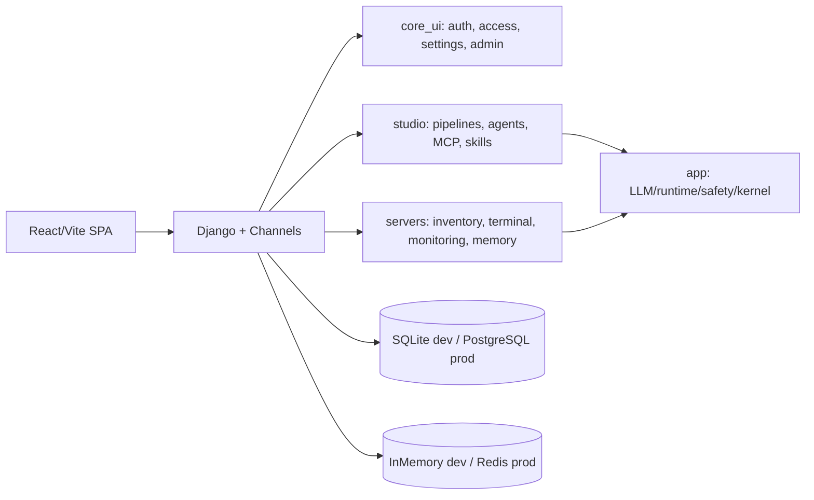

# Architecture Notes

Last reviewed: 2026-07-29

This folder is the public architecture entry point. The enforced working contract is [ARCHITECTURE_CONTRACT.md](ARCHITECTURE_CONTRACT.md), and accepted decisions are indexed in [adr/README.md](adr/README.md).

Production agent SSH isolation is defined in [AGENT_COMMAND_SANDBOX.md](AGENT_COMMAND_SANDBOX.md).

## Current Shape



## Enforced Rules

- New Python/TypeScript files should stay under the architecture standard size limit.
- Legacy large files are pinned in `pyproject.toml` and should not grow.
- Import boundaries are declared in `.importlinter`.
- Production settings must run with `DJANGO_DEBUG=false`, a strong secret key, explicit hosts, and Redis-backed channel layer.

Run:

```powershell
python scripts/check_architecture_sizes.py --strict-new
```

## Active Refactor Status

- Architecture sizes and import boundaries are green on `test` commit `389c6ac` (2026-07-24). This removes the recorded F-08/F-09 baseline debt; it does not by itself approve a release. The remaining release gates are tracked in [the WebTerm/RoutineOps competitive plan](WEBTERM_ROUTINEOPS_COMPETITIVE_PLAN.md).
- Plugin work targets self-hosted extensions, not a public paid marketplace. Existing foundations include pure `app.plugins` contracts, the internal `plugin_marketplace` store/API, permission grants, package audit/signing/scanning metadata, private catalogs, lifecycle/rollback/quarantine APIs, sandbox policy boundaries, and production trust checks.
- Backend view endpoint groups have mostly been split into focused modules.
- `core_ui/views/_views_all.py`, `servers/views/_views_all.py`, and `studio/views/_views_all.py` remain compatibility shims.
- `studio/pipeline_executor.py` remains the production pipeline executor.
- `studio/executor/` is the target node-registry architecture; production dispatch already routes registered node types through this registry, and both target/production paths fail unregistered node types instead of skipping them.
- Terminal-AI per-run request state is being moved out of `SSHTerminalConsumer` into `servers.services.terminal_ai.session`; confirm/cancel/stop transitions, forbidden-pattern lifecycle, and new-request/cancel reset are now service-level state-machine methods.
- `app.tools`, `core_ui`, Studio startup/skill validation/monitoring triggers/server resource binding/pipeline runtime, and shared runtime-limit helpers no longer import feature apps directly for server tooling, SSH host-key verification, chat server context, admin dashboard metrics, smoke-test seeding, runtime run/session limits, monitoring alert events and snapshots, tool activity/audit logging, agent-tool catalog reads, owned-server access, command history, server memory, server-agent execution, or server secret reads; these now go through provider/gateway/event seams.
- `app.core` now reads managed LLM API keys, budget state, and usage logging through app-level providers instead of importing `core_ui` implementations.
- LLM retry/runtime settings, managed key application, model catalog defaults, Ollama URL/model normalization, provider status/default policy, and auto provider routing are split out of the main LLM/model config modules.
- The LLM provider registry, live agent-engine registry, and Studio node registry now expose explicit lifecycle reset hooks for tests and host-managed runtimes.
- `servers` now uses `app.agent_kernel.skill_provider_registry` for skill resolution/access checks instead of importing `studio` directly.
- Notification config and server sudo secret access now go through shared/provider seams instead of direct cross-domain imports.
- Built-in agent tools now declare explicit policy metadata next to their registration; server engines inject that catalog into `ToolRegistry`, which still keeps compatibility inference for undeclared and MCP tools.
- Settings/env parsing, model-local helpers, pipeline validation schema helpers, and node-manifest schema builders now live outside the large compatibility modules.
- Frontend legacy-growth pages have been split into focused feature modules for agent configs, agent wizard state/UI, server groups, server CRUD, server list/share/knowledge/rules/security/execute workflow state, Studio skills, and shared AI provider constants.
- Frontend API calls are moving by domain under `frontend/src/api/`; auth/session, settings/access, server management, Studio pipelines/runs/skills/MCP/triggers/templates, Linux UI, files, memory, monitoring, agents, MARS, and Studio notifications now live outside the compatibility facade in `frontend/src/lib/api.ts`.
- `app.plugins` is pure Python and guarded from Django/feature-app imports; `plugin_marketplace` may use `core_ui` access/audit but is guarded from direct `servers` and `studio` imports.

## Current Architecture Plans

- [Ansible Playbook Workspace plan](ANSIBLE_PLAYBOOK_WORKSPACE_PLAN.md) defines the standalone Playbooks section, canonical YAML editor, immutable drafts/revisions, compatibility and runtime fingerprints, target bindings, sharing roles, project bundles, exact-revision execution, migration, tests, and the durable-worker production gate.
- [ADR-0001: primary runtime and toolchain](adr/0001-primary-runtime-and-toolchain.md) freezes the supported Python/Django/Node/npm contract and the boundary between WSL release evidence and native Windows compatibility.
- [CI and Git governance](CI_GOVERNANCE.md) defines independent product gates, the no-regression rollout, `test -> main` promotion and safe branch-protection bootstrap.
- [Release documentation](../releases/README.md) contains the v0.1 support matrix, frozen capability scope and evidence-driven release checklist.
- [Operations control plane roadmap](WEBTERM_OPERATIONS_CONTROL_PLANE_ROADMAP.md) is the active three-release product plan: Pilot Hardening, Daily Operations and Infrastructure Cockpit, centered on the existing server and Playbooks lifecycle.
- [WebTerm/RoutineOps competitive plan](WEBTERM_ROUTINEOPS_COMPETITIVE_PLAN.md) is retained as the historical Stage 1 stabilization record. Its Endpoint Management stage is superseded and must not be implemented without passing the new-major-subsystem gate.
- `STUDIO_OPS_AUTOMATION_PLATFORM_PLAN.md` describes the target shape for turning Studio into a broad admin/DevOps automation platform using pipeline nodes, MCP connectors, skills, policy, approvals, and domain capability packs.
- `PLUGIN_PLATFORM_ARCHITECTURE_PLAN.md` describes the next plugin-platform layer: manifests, registries, hooks, connector contracts, dashboard widgets, plugin pages, Studio nodes, agent tools, terminal actions, permissions, and rollout phases.
- `PLUGIN_MARKETPLACE_IMPLEMENTATION_PLAN.md` describes the roadmap for the self-hosted plugin extension system: package format, local install store, permissions, private catalogs, safe code gates, health, rollback, and quarantine.
- `PLUGIN_MARKETPLACE_OPERATIONS.md` describes production checks for hardened private extension operation.
- `PLUGIN_AUTHOR_GUIDE.md` is the safe metadata-first guide for plugin authors using scaffold, validate, pack, audit, review, signing, and private extension install gates.
- `KUBERNETES_OPS_OPERATIONS.md` is the operator/admin runbook for Kubernetes Ops: production configuration, readiness gates, provider outage DR, sync worker recovery, token rotation, audit retention, terminal/debug policy, rollback, and daily checks.
- `KUBERNETES_LOW_LEVEL_ADMIN_MODE_PLAN.md` is the focused Freelens++ Admin Mode chapter of the master Kubernetes plan in `docs/WebTerm_Kubernetes_Ops_Rancher_Fleet_Devtron_Report.md`: WebTerm-only live resource explorer, full YAML, log streaming, dry-run/apply, exec, port-forward, and break-glass access behind separate permissions, sessions, TTL, approvals, and audit.
- `KUBERNETES_FRONTEND_PARALLEL_UI_PLAN.md` is the frontend-only parallel work contract for redesigning Kubernetes into a WebTerm-native Freelens-like UI without changing backend/API behavior from the UI session.
- `PLATFORM_DEVELOPMENT_RULES.md` is the short working contract for changing the platform safely: ownership, boundaries, permissions, frontend/backend patterns, Studio, terminal, dashboards, integrations, checks, and stop conditions.
