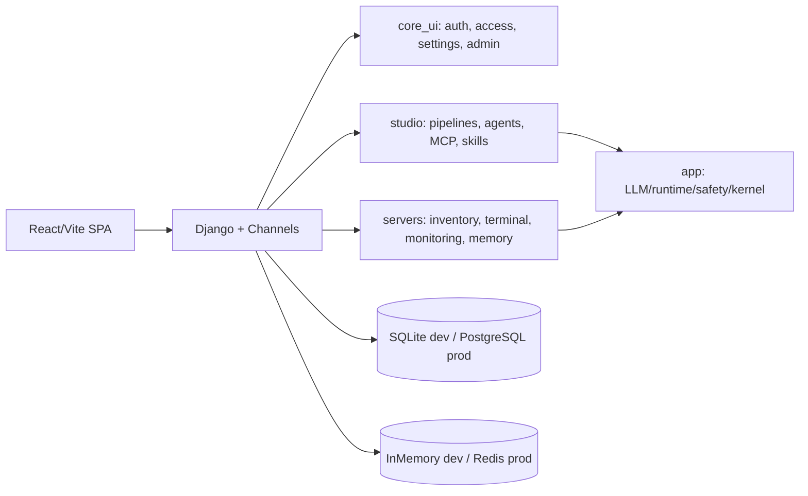

# Architecture Notes

Last reviewed: 2026-05-27

This folder is the public architecture entry point. The detailed working contract currently lives in the local-only file `docs/local/ARCHITECTURE_CONTRACT.md` because it came from internal root docs and is ignored by git.

## Current Shape



## Enforced Rules

- New Python/TypeScript files should stay under the architecture standard size limit.
- Legacy large files are pinned in `pyproject.toml` and should not grow.
- Import boundaries are declared in `.importlinter`.
- Production settings must run with `DJANGO_DEBUG=false`, a strong secret key, explicit hosts, and Redis-backed channel layer.

Run:

```powershell
python scripts/check_architecture_sizes.py --strict-new
```

## Active Refactor Status

- Current architecture command status: import boundaries pass, but the size guard fails because `key_mcp.py` is 2094 lines against pinned baseline 2089.
- Backend view endpoint groups have mostly been split into focused modules.
- `core_ui/views/_views_all.py`, `servers/views/_views_all.py`, and `studio/views/_views_all.py` remain compatibility shims.
- `studio/pipeline_executor.py` remains the production pipeline executor.
- `studio/executor/` is the target node-registry architecture and currently contains migrated output node implementations.
- `app.tools.server_tools` and `app.tools.ssh_tools` still bridge into server-domain code as documented exceptions.

## Current Architecture Plans

- `STUDIO_OPS_AUTOMATION_PLATFORM_PLAN.md` describes the target shape for turning Studio into a broad admin/DevOps automation platform using pipeline nodes, MCP connectors, skills, policy, approvals, and domain capability packs.
