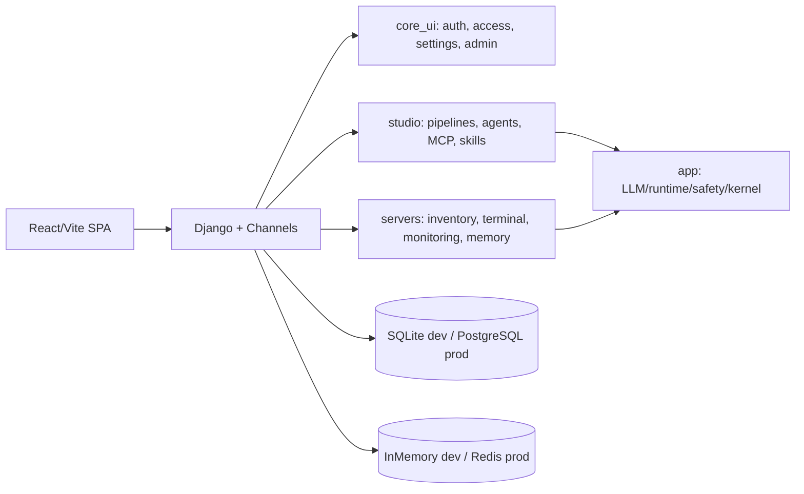

# Architecture Notes

Last reviewed: 2026-06-20

This folder is the public architecture entry point. The detailed working contract currently lives in the local-only file `docs/local/ARCHITECTURE_CONTRACT.md` because it came from internal root docs and is ignored by git.

## Current Shape



## Enforced Rules

- New Python/TypeScript files should stay under the architecture standard size limit.
- Legacy large files are pinned in `pyproject.toml` and should not grow.
- Import boundaries are declared in `.importlinter`.
- Production settings must run with `DJANGO_DEBUG=false`, a strong secret key, explicit hosts, and Redis-backed channel layer.

Run:

```powershell
python scripts/check_architecture_sizes.py --strict-new
```

## Active Refactor Status

- Current architecture command status: import boundaries pass; size guard passes under `--strict-new`.
- Backend view endpoint groups have mostly been split into focused modules.
- `core_ui/views/_views_all.py`, `servers/views/_views_all.py`, and `studio/views/_views_all.py` remain compatibility shims.
- `studio/pipeline_executor.py` remains the production pipeline executor.
- `studio/executor/` is the target node-registry architecture; production dispatch already routes registered node types through this registry, and both target/production paths fail unregistered node types instead of skipping them.
- Terminal-AI per-run request state is being moved out of `SSHTerminalConsumer` into `servers.services.terminal_ai.session`; confirm/cancel/stop transitions, forbidden-pattern lifecycle, and new-request/cancel reset are now service-level state-machine methods.
- `app.tools`, `core_ui`, Studio startup/skill validation/monitoring triggers/server resource binding/pipeline runtime, and shared runtime-limit helpers no longer import feature apps directly for server tooling, SSH host-key verification, chat server context, admin dashboard metrics, smoke-test seeding, runtime run/session limits, monitoring alert events and snapshots, tool activity/audit logging, agent-tool catalog reads, owned-server access, command history, server memory, server-agent execution, or server secret reads; these now go through provider/gateway/event seams.
- `app.core` now reads managed LLM API keys, budget state, and usage logging through app-level providers instead of importing `core_ui` implementations.
- LLM retry/runtime settings, managed key application, model catalog defaults, Ollama URL/model normalization, provider status/default policy, and auto provider routing are split out of the main LLM/model config modules.
- The LLM provider registry, live agent-engine registry, and Studio node registry now expose explicit lifecycle reset hooks for tests and host-managed runtimes.
- `servers` now uses `app.agent_kernel.skill_provider_registry` for skill resolution/access checks instead of importing `studio` directly.
- Notification config and server sudo secret access now go through shared/provider seams instead of direct cross-domain imports.
- Built-in agent tools now declare explicit policy metadata next to their registration; server engines inject that catalog into `ToolRegistry`, which still keeps compatibility inference for undeclared and MCP tools.
- Settings/env parsing, model-local helpers, pipeline validation schema helpers, and node-manifest schema builders now live outside the large compatibility modules.
- Frontend legacy-growth pages have been split into focused feature modules for agent configs, agent wizard state/UI, server groups, server CRUD, server list/share/knowledge/rules/security/execute workflow state, Studio skills, and shared AI provider constants.
- Frontend API calls are moving by domain under `frontend/src/api/`; auth/session, settings/access, server management, Studio pipelines/runs/skills/MCP/triggers/templates, Linux UI, files, memory, monitoring, agents, MARS, and Studio notifications now live outside the compatibility facade in `frontend/src/lib/api.ts`.

## Current Architecture Plans

- `STUDIO_OPS_AUTOMATION_PLATFORM_PLAN.md` describes the target shape for turning Studio into a broad admin/DevOps automation platform using pipeline nodes, MCP connectors, skills, policy, approvals, and domain capability packs.
