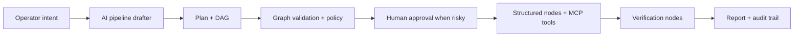

# Studio OPS Automation Platform Plan

Last reviewed: 2026-05-28

Цель: сделать Studio платформой, через которую админы, DevOps, SRE и операторы смогут автоматизировать большую часть повторяемых задач: диагностику, remediation, change management, отчеты, интеграции и безопасное выполнение runbook.

Ключевая идея: не строить "ИИ, который просто выполняет любую shell-команду". Правильная архитектура - это управляемая фабрика workflow:



## Product Target

Studio должна уметь принимать задачу вида:

- "Проверь почему Keycloak не логинит пользователей и предложи fix"
- "Если контейнер unhealthy, собери логи, перезапусти, проверь health и закрой alert"
- "Сделай rollout restart deployment в namespace X после approval"
- "Создай GitLab MR с изменением nginx config и проверь pipeline"
- "Проверь свободное место, найди крупные логи, предложи cleanup, выполни после подтверждения"

И превращать это в pipeline:

1. Trigger: manual, webhook, schedule, monitoring.
2. Discovery: собрать состояние систем.
3. Analysis: ИИ анализирует факты, но не меняет систему напрямую.
4. Plan: ИИ предлагает конкретный безопасный план.
5. Approval: если есть риск или production mutation.
6. Action: структурированные OPS-ноды или MCP tools.
7. Verification: проверка состояния после действия.
8. Report: отчет, audit, уведомления.

## Architecture Principle

Чтобы покрыть "почти любые" OPS-задачи, Studio не должна плодить отдельную ноду под каждое действие и каждый сервис. Правильная модель: минимальный набор универсальных workflow-нóд плюс MCP/skills/templates, которые дают доменную специфику.

Пример: задачи Keycloak "создать группу", "добавить роль", "выдать пользователю доступ" не требуют отдельных нод `keycloak/create_group`, `keycloak/assign_role`, `keycloak/create_user`. Для них достаточно:

- `agent/mcp_call` или универсальной `tool/action` ноды, которая вызывает Keycloak MCP tool;
- approval node для production IAM changes;
- verification node, которая читает состояние Keycloak после изменения;
- report node, которая пишет аудит-friendly отчет.

То же самое должно работать для Jira, GitLab, Kubernetes, Grafana, cloud, databases и внутренних сервисов. Новая нода нужна только когда появляется новый универсальный workflow primitive, а не когда появляется новый сервис.

## Minimal Universal Node Set

Минимальный набор, из которого можно собрать почти любой workflow:

| Node family | Purpose |
| --- | --- |
| Trigger | manual, webhook, schedule, monitoring event. |
| AI Plan / AI Analyze | Понять задачу, построить план, принять решение по evidence. |
| Tool / MCP Action | Вызвать конкретный MCP/tool/API с typed arguments. |
| System Action | Выполнить ограниченное действие внутри Linux/Docker/host, когда нет API. |
| Read / Snapshot | Собрать состояние: server snapshot, service state, API read, logs, metrics. |
| Condition | Ветвление по фактам и статусам. |
| Human Approval | Подтверждение рискованных изменений. |
| Wait / Poll | Подождать событие, CI, rollout, operator reply. |
| Verify | Проверить, что изменение реально сработало. |
| Report / Notify | Отчет, Telegram/email/webhook, audit output. |

Текущие 30 node types уже близки к этому набору. Дальше важнее улучшать универсальность `agent/mcp_call`, manifests, policy, UI и assistant compiler, чем добавлять десятки узких service-specific nodes.

Capability pack = набор:

| Component | Purpose |
| --- | --- |
| MCP connectors | Интеграции с внешними системами: Keycloak, GitLab, Kubernetes, Grafana, Jira, cloud, DB, internal APIs. |
| Skills | Доменные runbook-инструкции, terminology, order of operations, validation rules и tool policies. |
| Templates | Готовые pipelines для типовых сценариев конкретного сервиса. |
| MCP connectors | Интеграции с внешними системами: GitLab, Kubernetes, Grafana, Jira, cloud, DB. |
| Policies | Risk rules, approval rules, allow/deny operations, redaction. |
| Tests | Smoke graph, runtime unit tests, dry-run fixtures. |

Capability pack может добавлять новые ноды только если стандартного набора недостаточно. По умолчанию pack добавляет MCP tools, skills, templates и policies.

## Current Baseline

Текущий baseline уже дает основу:

- Pipeline graph contract и 30 known node types описаны в `docs/PIPELINE_NODES_SPEC.md`.
- Есть trigger layer: manual, webhook, schedule, monitoring.
- Есть AI/agent layer: `agent/react`, `agent/multi`, `agent/llm_query`, `agent/mcp_call`.
- Есть human control: `logic/human_approval`, `logic/telegram_input`.
- Есть output layer: report, webhook, email, Telegram.
- Есть первый OPS pack: `ops/server_snapshot`, `ops/log_query`, `ops/file_action`, `ops/package_action`, `ops/disk_cleanup`, `ops/backup_restore_check`, `ops/service_action`, `ops/docker_action`, `ops/process_action`, `ops/http_check`, `ops/alert_update`.
- Есть MCP registry и Studio skills.
- Начат общий `NodeManifest` (`studio/node_manifest.py`), который уже питает validation, AI assistant catalog и отдельный `GET /api/studio/node-manifests/` endpoint.
- Каждая manifest-нода теперь отдает `input_schema`, `output_schema`, risk metadata, handles, dry-run/approval flags и tags; `/api/studio/capabilities/` встраивает тот же node contract в capability registry.
- Начат pilot `Capability Registry` (`/api/studio/capabilities/`): он сводит универсальные ноды, доступные MCP/skills и task families вроде Keycloak/IAM, Kubernetes, runtime ops, DB, CI/CD и incident response.
- Добавлен pilot template pack в `studio/templates_data.py`: 9 production-like starters для Keycloak/IAM, Kubernetes rollout, GitLab failed pipeline -> MR, DB diagnostics/maintenance, Observability/Incident, Linux package maintenance, Linux disk cleanup, backup restore check и service config/restart. Все используют универсальные ноды, approval, verification/report и покрыты `tests/test_studio_pipeline_templates.py`.
- AI drafter теперь получает `template_recommendations` из `studio/services/pipeline_template_recommendations.py`: intent matching выбирает подходящий pilot skeleton, prompt требует сохранять approval/verification/report shape, а local fallback при provider error может собрать matching pilot DAG вместо generic runbook.
- AI Drafts UI показывает выбранный pilot skeleton и позволяет оператору переключить draft на другой recommended skeleton через `/api/studio/assistant/drafts/<id>/use-template/` без запуска runtime actions.
- Добавлен prompt-eval набор `tests/fixtures/studio_ops_prompt_evals.json`: 35 representative OPS prompts проверяют, что selector выбирает правильный pilot skeleton, skeleton graph валиден, использует универсальные ноды, содержит read/analyze/approval/mutation/verification/report stages.
- Начат resource binding для pilot skeletons: builder подставляет доступные MCP servers по capability name, доступный target server по явному совпадению в prompt/draft title или единственному серверу, и доступные skills по slug/service/category. Если ресурс неоднозначен, он остается в `resource_plan.missing`, а не выбирается случайно.
- Добавлен typed argument binding для pilot skeletons: builder консервативно извлекает из prompt понятные OPS-сущности (`realm`, `username`, `role`, `namespace`, `deployment`, `project_id`, `pipeline_id`, `service_name`, `healthcheck_url`, `database`, `schema`, `alert_id`, `alert_source`, `alert_severity`) и подставляет их в `agent/mcp_call.arguments` / generic OPS поля до применения draft. Нераспознанные input placeholders остаются как `{placeholder}` и попадают в `resource_plan.missing` или runtime notes.
- Добавлен первый static pilot capability pack registry (`studio/pilot_capability_packs.py`): Keycloak, Kubernetes, GitLab CI/MR, DB и Observability/Incident MCP tools теперь имеют `input_schema`, `operation_kind`, `risk_level`, `permission_mode`, approval/policy tags и recommended skills. Template builder встраивает эти metadata в `agent/mcp_call` nodes, а capability registry отдает packs в assistant context/API.
- Добавлен provider-free deterministic compiler mode для AI Drafts: payload `compiler_mode="deterministic"` собирает draft из локального pilot compiler без вызова LLM provider. UI получил кнопку `Quick skeleton`, backend помечает `selected_template.source="pilot_template_compiler"`, а тесты проверяют, что LLM не вызывается.
- Добавлен AI Drafts interview mode: если resource binding/skeleton оставляет blocking gaps (`Argument: realm`, `service_name`, target server, MCP server), response получает 1-3 конкретных `questions`, draft уходит в `needs_input`, а Composer показывает режим `Answer questions`. Revise endpoint передает AI исходную задачу + открытые вопросы + ответ оператора, поэтому ответы вроде `realm prod, operation add` дополняют текущую автоматизацию вместо создания новой задачи.
- Prompt evals расширены до end-to-end draft API проверки: все 35 representative OPS prompts создают валидные drafts через `/api/studio/assistant/drafts/` с `compiler_mode="deterministic"`, без вызова LLM provider, с правильным pilot template, approval, verification/report paths и без service-specific node types.
- Backend risk review теперь учитывает MCP capability metadata (`mutates_state`, `requires_approval`, `permission_mode`, `operation_kind`, `risk_level`), а не только regex по `tool_name`.
- Capability registry оставлен как backend/API слой для AI Drafts, templates и будущих экранов. Тяжелый overview-блок с readiness task families убран из Studio UI, чтобы первый экран оставался рабочим списком пайплайнов.
- Добавлен общий backend policy contract `studio/execution_policy.py`: `ExecutionPolicyDecision` классифицирует external/mutating/dangerous MCP, SSH, OPS actions и output side effects, считает approved human-approval path и отдает единый формат для validation errors, AI Draft risk review и runtime policy summary.
- Runtime output boundary теперь редактирует node outputs/context перед reports/webhook/email/Telegram/approval previews, чтобы MCP/SSH outputs не утекали во внешние каналы как raw secrets.
- UI `logic/human_approval` теперь явно показывает `manual_link_only` в Delivery section: запуск без email/Telegram delivery остается возможным для теста/pilot, но это осознанный режим, а не скрытый advanced flag.
- UI `agent/ssh_cmd` теперь показывает runtime-supported preflight/verification commands как advanced one-command-per-line поля, чтобы raw SSH шаги можно было запускать с явными before/after checks без новой сервисной ноды.
- Schedule triggers теперь валидируются и исполняются через общий cron helper: с `croniter` используется strict path, без него работает local 5-field fallback parser, поэтому pilot schedules не становятся no-op в минимальной среде.
- UI save/run path теперь делает preflight validation для `logic/condition`: `contains` и `not_contains` требуют непустой `check_value` до обращения к backend, чтобы оператор сразу видел ошибку в editor.
- Saved pipeline manual Run получил validate-only/dry-run path: UI кнопка `Проверить` сохраняет текущий граф и вызывает `POST /api/studio/pipelines/<id>/run/` с `validate_only=true`, backend возвращает graph/manual-trigger/reference/risk результат и не создает `PipelineRun` / не запускает runtime actions.
- Все `output/*` ноды переведены на production registry adapter. Report сохраняет `PipelineRun.summary`, возвращает markdown в `output` и редактирует secrets; webhook сохраняет runtime parity по redacted context/outputs payload, templated headers, `timeout_seconds` и опциональному fail on non-2xx; email сохраняет SMTP/global settings, normalized recipients/from, STARTTLS/SSL, templates и redaction preserve-list; Telegram сохраняет global/node credentials, context fallback, chunks, API error handling и redaction.
- `logic/condition` переведен на production registry adapter с parity по `passed`, `output`, contains/not_contains, status checks и `always_true`.
- `logic/parallel` переведен на production registry adapter с parity по gateway output; executor batch routing всё ещё отвечает за фактический fan-out.
- `logic/merge` переведен на production registry adapter с parity по `mode=all|any`, fallback invalid mode -> `all` и human-readable `output`; router-level ожидание веток остается в `PipelineExecutor`.
- `logic/wait` переведен на production registry adapter с parity по `wait_minutes` parsing/clamp, chunked sleep, stop-event handling, DB stopped status и completed/stopped output.
- `logic/human_approval` переведен на production registry adapter без смены approval semantics: state arming, email/Telegram delivery, Telegram callback polling, DB decision polling, timeout и stop handling остаются совместимыми с прежним runtime path.
- `logic/telegram_input` переведен на production registry adapter без смены polling semantics: ForceReply delivery, DB/operator reply polling, Telegram reply polling, timeout и stop handling остаются совместимыми с прежним runtime path.
- `agent/llm_query` и `agent/mcp_call` переведены на production registry adapter без смены runtime semantics; MCP adapter сохраняет shared `executed_mcp_tools` tracking для skill-policy order rules.
- `agent/react`, `agent/multi` и `agent/ssh_cmd` переведены на production registry adapter без смены runtime semantics; ReAct/multi сохраняют AgentConfig/server/MCP/skill resolution и event callbacks, SSH сохраняет preflight/verification, permission/sandbox/hook checks, command history и fallback в ReAct.
- `PipelineExecutor._execute_node` теперь dispatch-ит по `node_type in registry`, поэтому новые registry-ноды не требуют отдельной ветки в production executor.
- `check_node_manifest_consistency` теперь проверяет registry coverage и schema coverage: все non-trigger node types из manifest должны иметь registered runtime class, лишние runtime types запрещены, каждая нода должна иметь object `input_schema` и `output_schema`.

Главный следующий шаг: превратить это из набора нод в расширяемую automation platform.

## Target Runtime Model

### 1. Node Registry First

Все новые ноды должны идти через `studio/executor/registry.py` и `studio/executor/nodes/`.

Нужен общий node manifest:

```json
{
  "type": "ops/package_action",
  "category": "Ops",
  "risk_level": "mutating",
  "supports_dry_run": true,
  "requires_approval_by_default": true,
  "input_schema": {},
  "output_schema": {},
  "handles": ["success", "error", "out"],
  "verification": ["ops/server_snapshot", "ops/http_check"]
}
```

Этот manifest должен питать:

- backend validation;
- frontend palette/forms;
- AI assistant catalog;
- docs generation;
- smoke tests;
- policy engine.

### 2. Intent-To-Pipeline Compiler

AI assistant должен работать как compiler:

1. Classify intent: диагностика, remediation, deployment, access, incident, report.
2. Resolve resources: servers, clusters, namespaces, MCP servers, skills.
3. Pick capability pack: Linux, Docker, Kubernetes, GitLab, Observability, etc.
4. Draft DAG from templates.
5. Fill node configs from context.
6. Run validation and policy risk pass.
7. Add approval gates for mutating steps.
8. Add verification and rollback branches.
9. Return graph patch plus explanation.

AI не должен напрямую превращать любую просьбу в `agent/ssh_cmd`. Для типовых действий он должен выбирать structured nodes или MCP tools.

### 3. Universal Tool Action Layer

Самый важный primitive для сервисных задач - не новая нода под каждый сервис, а typed tool action:

```json
{
  "type": "agent/mcp_call",
  "data": {
    "mcp_server_id": 12,
    "tool_name": "keycloak_assign_realm_role",
    "arguments": {
      "realm": "{realm}",
      "username": "{username}",
      "role": "{role}"
    },
    "skill_slugs": ["kubernetes-safety"],
    "permission_mode": "ASSISTED"
  }
}
```

Для пользователя это должно выглядеть не как ручной JSON, а как нормальная форма:

- сервис: Keycloak;
- действие: Assign realm role;
- target: realm/user/role;
- risk: IAM mutation;
- approval: required;
- verification: read user roles after change.

Та же нода должна уметь вызвать GitLab, Jira, Kubernetes, Grafana, cloud или любой internal MCP. Разница только в MCP tool schema и skill.

### 4. Policy And Approval Layer

Нужен единый decision contract для SSH, MCP, file actions, OPS nodes, webhooks, terminal AI и agents:

```json
{
  "actor": "user_id",
  "operation_kind": "k8s.rollout_restart",
  "target": "cluster/prod namespace/auth deployment/keycloak",
  "risk_level": "high",
  "requires_approval": true,
  "allowed": true,
  "reason": "Production restart requires approval and verification",
  "redacted_preview": "kubectl rollout restart deployment/keycloak -n auth",
  "evidence_required": ["pre_snapshot", "approval", "post_health_check"]
}
```

Минимальная политика:

- Read-only операции можно выполнять автоматически.
- Mutating операции требуют approval, если это production или unknown environment.
- Destructive операции требуют explicit break-glass approval.
- Secret exfiltration, raw credential output и unknown outbound destinations блокируются.
- Любой action должен иметь audit record и желательно verification node.

### 5. Evidence Context

Для качественной автоматизации ИИ должен видеть не только prompt, но и operational evidence:

- server inventory;
- monitoring alerts;
- recent logs;
- metrics;
- deployments;
- git changes;
- previous pipeline runs;
- server memory;
- runbook/skill context;
- MCP tool outputs.

Но перед попаданием в prompt/report/log и внешние output-каналы (`webhook`, `email`, `Telegram`) нужно применять redaction.

### 6. Execution Modes

| Mode | Meaning | Allowed usage |
| --- | --- | --- |
| `READ_ONLY` | Только сбор данных и отчеты. | Default для диагностики. |
| `ASSISTED` | ИИ предлагает план, человек подтверждает actions. | Default для prod. |
| `AUTO_GUARDED` | Автовыполнение low-risk actions с policy и rollback/verify. | Для well-known runbooks. |
| `AUTONOMOUS` | Без approval. | Только dev/test или явно разрешенные safe packs. |
| `BREAK_GLASS` | Опасные действия. | Только explicit approval, audit, limited scope. |

## Capability Packs To Build

Capability packs не должны означать "создать много новых нод". В большинстве случаев pack добавляет MCP connector, skill, templates, tool schemas и policies.

### Pack 1: Identity And Access Services

Purpose: Keycloak, Okta, Auth0, LDAP/AD, internal IAM.

Typical tasks:

- создать пользователя;
- создать группу;
- назначить роль;
- убрать роль;
- проверить effective permissions;
- подготовить access review report;
- обработать ticket на доступ.

Implementation:

- MCP tools: `create_user`, `create_group`, `assign_role`, `revoke_role`, `list_user_roles`, `audit_realm`.
- Skills: service-specific safety rules, naming conventions, approval requirements.
- Pipeline nodes: mostly `agent/mcp_call`, `logic/human_approval`, `ops/http_check`, `output/report`.
- New node only if needed: generic `identity/access_change` can be added later, but not required for MVP.

### Pack 2: Linux And Runtime Operations

Purpose: логи, сервисы, процессы, файлы, диски, packages.

Typical tasks:

- найти причину падения сервиса;
- почистить диск;
- проверить конфиг и рестартнуть сервис;
- обновить package;
- собрать diagnostic report.

Implementation:

- Use existing OPS nodes for snapshot/service/docker/process/http/alert.
- Add only generic missing primitives when raw SSH becomes too common. Started: `ops/file_action` covers read/write UTF-8 text files over SFTP with approval required for write; `ops/package_action` covers read-only update listing plus explicit install/update/remove package lists behind approval; `ops/disk_cleanup` covers read-only disk inspect plus bounded journal/tmp cleanup behind approval; `ops/backup_restore_check` covers read-only backup freshness/latest archive verification.
- Skills define safe commands, forbidden paths, required checks.

### Pack 3: Kubernetes And Deployments

Purpose: clusters, namespaces, workloads, rollouts.

Typical tasks:

- crashloop diagnosis;
- rollout restart;
- scale deployment;
- collect pod logs/events;
- create GitLab MR for manifest change.

Implementation:

- Prefer Kubernetes MCP tools or GitOps MCP tools.
- Use `agent/mcp_call` for typed K8s operations.
- Use `logic/human_approval` for mutating prod operations.
- Use `ops/http_check` or MCP read tools for verification.
- Add K8s-specific node only if it is a UI convenience wrapper over common MCP actions.

### Pack 4: GitLab, CI/CD And Change Management

Purpose: PR/MR-first operational changes.

Typical tasks:

- создать MR с config change;
- проверить CI pipeline;
- дождаться deploy;
- сделать rollback через MR;
- написать release/change report.

Implementation:

- GitLab MCP tools for repo/file/MR/pipeline actions.
- Skills enforce branch naming, MR templates, reviewer rules, PR-first production policy.
- Existing wait/condition/report nodes compose the workflow.

### Pack 5: Observability And Incident

Purpose: alerts, logs, metrics, incidents.

Typical tasks:

- triage alert;
- запросить метрики/логи;
- создать Jira/PagerDuty incident;
- обновить incident;
- подготовить postmortem draft.

Implementation:

- Done for pilot: `observability-incident` pack in `studio/pilot_capability_packs.py` defines Grafana/Prometheus/Loki/Jira/PagerDuty-style MCP tool contracts for alert context, metrics/log evidence, incident ticket/update and acknowledgement verification.
- Skills define alert taxonomy, severity, escalation, report format; pilot templates reference `incident-response-safety` and keep it in `resource_plan.missing` until the skill is installed/shared.
- Nodes stay generic: `trigger/monitoring`, `agent/mcp_call`, `agent/llm_query`, `logic/human_approval`, `output/report`.

### Pack 6: Cloud, Infrastructure, Database

Purpose: cloud APIs, Terraform/OpenTofu, DB/cache operations.

Typical tasks:

- cloud inventory/cost check;
- Terraform plan;
- access/IAM review;
- DB readonly query;
- backup/restore check;
- cache flush after approval.

Implementation:

- MCP tools for cloud/terraform/database.
- Strict policies: readonly by default, writes require approval, destructive operations require break-glass.
- Add narrow nodes only for high-volume safe operations where UI form matters.

## AI Roles Inside Studio

Разделить ответственность ИИ:

| Role | Responsibility |
| --- | --- |
| Drafter | Превращает просьбу в pipeline DAG. |
| Planner | Делает план действий на основе evidence. |
| Executor Controller | Выбирает structured node/MCP, не делает raw destructive shell. |
| Verifier | Сравнивает before/after evidence. |
| Reporter | Пишет отчет, incident summary, next actions. |
| Reviewer | Проверяет риск, missing approval, missing verification. |

Это можно реализовать как разные system prompts/skills поверх одного executor.

## Required UX

Studio UI должна стать не просто canvas editor, а cockpit автоматизации:

1. "Опиши задачу" - AI draft pipeline.
2. "Какие системы подключить" - servers, MCP, skills, secrets, clusters.
3. "Покажи риск" - risk summary before save/run.
4. "Dry run / validate" - прогон без mutating actions.
5. "Approval queue" - кто и что должен подтвердить.
6. "Evidence view" - before/after snapshots.
7. "Runbook catalog" - готовые шаблоны по доменам.
8. "Capability registry" - какие MCP/tools/nodes доступны.

## Implementation Roadmap

### Phase 0 - Baseline Stabilization

Status: in progress.

Deliverables:

- Keep `PIPELINE_NODES_SPEC.md` as source of truth.
- Keep all node types in all-nodes smoke graph.
- Keep frontend palette, assistant catalog, validation and runtime in sync.
- Continue moving new nodes to registry adapter.

### Phase 1 - Pilot Launch: Let Operators Feel The Product

Goal: дать людям в тесте/первом production pilot возможность реально создавать workflow через ИИ и запускать безопасные сценарии, не дожидаясь полного каталога будущих нод.

Pilot should optimize for:

- "Я описал задачу обычным языком, Studio собрала workflow".
- "Я подключил MCP + skill для сервиса, и агент понял, как с ним работать".
- "Я вижу риск, approval, verification и отчет".
- "Я могу руками поправить workflow на canvas".
- "Я могу запустить read-only или assisted сценарий без страха сломать prod".

Pilot scope:

| Area | MVP behavior |
| --- | --- |
| Services | Keycloak first, then one GitLab/Kubernetes/observability example. |
| Node set | Use existing generic nodes: trigger, agent/llm_query, agent/mcp_call, ops snapshot/action/check, condition, approval, wait, report/notify. |
| MCP | Service-specific actions come from MCP tools, not from many service-specific nodes. |
| Skills | Each service pilot has a skill with rules, examples, forbidden actions and verification expectations. |
| AI drafter | Generates valid workflow from prompt and attaches MCP/skill where available. |
| Safety | Mutations require approval; read-only diagnosis can run directly. |
| Evidence | Every pilot workflow produces before/after facts and a report. |

Pilot acceptance:

1. At least 20 representative prompts generate valid pipelines.
2. At least 5 prompts are service/business operations, for example Keycloak roles/groups/users.
3. At least 5 prompts are system operations, for example logs, Docker, service restart, HTTP health.
4. Generated workflows use `agent/mcp_call` for service actions instead of inventing new service-specific nodes.
5. Mutating workflows include `logic/human_approval` and a verification step.
6. A non-developer can open the generated workflow, understand it, and run a safe test.

### Phase 2 - Node Manifest And Schema

Deliverables:

- Add backend `NodeManifest` structure.
- Each node exposes input schema, output schema, risk metadata, handles, dry-run support. Started in `studio/node_manifest.py`; schemas are also exposed through `GET /api/studio/node-manifests/` and embedded in `/api/studio/capabilities/`.
- Frontend forms can be generated or checked from manifest. Started: `PipelineEditorPage` loads node manifests and `pipelineClientValidation` checks configured enum/range values before save/run without making incomplete draft required fields a hard blocker.
- AI assistant consumes the same manifest instead of a separate hand-written list.
- Started: `python manage.py check_node_manifest_consistency` now verifies that `NodeManifest`, input/output schemas, validation handles, assistant catalog/aliases, frontend `NODE_TYPES`/palette/metadata and `docs/PIPELINE_NODES_SPEC.md` stay in sync.

Acceptance:

- One command verifies docs, schemas, validation, assistant catalog and UI palette match node manifests. Started with `check_node_manifest_consistency`.

### Phase 3 - Unified Policy Engine

Deliverables:

- Introduce shared `ExecutionPolicyDecision`. Started: `studio/execution_policy.py` is now used by pipeline validation and AI Draft risk review.
- Wire it into OPS nodes, `agent/ssh_cmd`, `agent/mcp_call`, webhooks and terminal/server tools. Started: `validate_pipeline_definition(...)` now blocks mutating MCP/SSH/OPS nodes unless every upstream path passes an approved human-approval edge; runtime inherits this through its pre-execution validation and records `trigger_data.execution_policy` for audit-friendly run evidence. Output webhook/email/Telegram targets are classified as `external` review items when real delivery targets are configured.
- Add redaction before prompt/log/report/activity output. Started: pipeline runtime now redacts node outputs/context before `output/report`/`PipelineRun.summary`, webhook JSON payload, email subject/body, Telegram messages, approval previews and Telegram-input prompts while preserving internal approval links.

Acceptance:

- Tests prove mutating production operations cannot run without required approval.
- Tests prove secrets are redacted from node output, audit, reports and external output payloads/messages.

### Phase 4 - Capability Registry

Deliverables:

- Registry table/API for installed capability packs. MVP API started: `/api/studio/capabilities/`.
- MCP tools normalized into capabilities with risk and schema.
- Skills declare supported intents and tool policies.
- UI shows what can be automated in current workspace.

Acceptance:

- Given connected servers/MCP/skills, Studio can explain which task families are supported and what is missing.

### Phase 5 - AI Pipeline Compiler

Deliverables:

- Intent classifier.
- Template chooser.
- Graph patch generator with validation loop.
- Risk reviewer that adds approval/verification nodes.
- Dry-run preview.

Acceptance:

- 20 common admin/DevOps prompts generate valid DAGs without manual graph editing.

### Phase 6 - Service Capability Packs

Build packs in this order:

1. Identity/Access services: Keycloak first.
2. Linux/runtime operations.
3. Kubernetes/deployments.
4. GitLab/CI/CD.
5. Observability/incident.
6. Cloud/IaC/DB.

Acceptance per pack:

- At least 5 production-like templates.
- MCP tools, skills, policies and verification flows are registered.
- New service-specific nodes are avoided unless a generic primitive is missing.
- Tests for validation, runtime and AI drafting.
- Policy coverage for dangerous operations.

### Phase 7 - Guarded Autonomy

Deliverables:

- Auto-run only for approved low-risk runbooks.
- Change windows.
- Rollback branch support.
- Incident/ticket integration.
- Run outcome learning into skills/templates.

Acceptance:

- Studio can safely auto-remediate selected low-risk alerts with evidence and audit.

## Definition Of Done For The Big Goal

The goal "можно автоматизировать большую часть задач админов/DevOps" is achieved when:

1. Studio can generate valid pipelines from natural language for at least 20 representative OPS tasks.
2. Each generated pipeline uses the minimal generic node set plus MCP/skills/templates, not raw shell by default.
3. Read-only, approval, mutating, verification and reporting stages are represented.
4. Policy blocks dangerous actions without approval.
5. MCP and skills are discoverable and selectable by the assistant.
6. Service capability packs cover Identity/Keycloak, Linux/runtime, Kubernetes, GitLab/CI, Observability and at least one Cloud/DB class.
7. Every pack has MCP tools or adapters, skills, templates, policies, tests and smoke pipelines.
8. UI shows risk, required approvals and missing capabilities before run.
9. Runs produce audit evidence and operator-friendly reports.
10. Documentation can be regenerated/verified against the live node registry.

## Immediate Next Build Slice

Next concrete slice for the pilot launch:

1. Make `agent/mcp_call` first-class in UI: service/tool picker, typed arguments form, risk preview, skill selection. Started: editor now has schema-driven typed arguments, permission mode, risk preview and skill/policy selection for MCP call nodes. Backend and frontend pre-save validation now check embedded MCP `input_schema` required arguments, enum values and basic types before run.
2. Improve AI drafter so service-specific tasks prefer MCP + skill, not new hardcoded nodes. Started: assistant context now includes capability registry and prompt rules for service tasks; Kubernetes rollout and IAM/user-access remain MCP/skill/template workflows instead of new service-specific `ops/*` nodes for MVP.
3. Add pilot capability list: connected MCP tools + skills -> "what tasks this workspace can automate now". Backend/API pilot scope is done via `/api/studio/capabilities/`; visible UI should expose this only in focused flows, not as a heavy default block on Studio overview.
4. Add risk preview and required approval summary before run.
5. Add dry-run/validate action for generated workflow.
6. Add pilot templates. Done: built-in `Pilot OPS` templates now cover:
   - Keycloak role/group/user access change with approval and verification.
   - Kubernetes diagnosis and rollout restart through MCP.
   - GitLab failed pipeline triage and MR creation through MCP.
   - Database read-only diagnostics and approved guarded maintenance.
   - Linux package maintenance through `ops/package_action`, approval and package-state verification.
   - Linux disk cleanup through `ops/disk_cleanup`, approval and disk-state verification.
   - Backup restore readiness through `ops/backup_restore_check`, latest archive verification and report.
   - Service config validate and structured restart with HTTP verification.
7. Keep `NodeManifest` moving in parallel so metadata stays consistent, but do not block the pilot on a perfect generated form system.

Next best pilot slice after these starters:

1. Add risk preview and required approval summary before run. Started: editor manual Run dialog now shows a graph risk summary based on mutating MCP/OPS/SSH steps, approval gates and verification nodes.
2. Add dry-run/validate action for generated workflow/draft review. Started: AI Drafts now has a validate/dry-run action backed by `/api/studio/assistant/drafts/<id>/validate/`; saved pipeline manual Run also has a validate-only action backed by `POST /api/studio/pipelines/<id>/run/` with `validate_only=true`. Both recheck graph contract, references and risk without executing MCP tools, SSH commands, OPS actions or notifications.
3. Make AI drafter choose these pilot templates as skeletons before generating raw DAGs. Done: assistant context includes matched pilot skeletons and provider-error fallback can emit the selected pilot DAG.
4. Make AI drafter ask/consume missing operational details before apply. Done for draft flow: missing arguments/resources become short questions, draft status becomes `needs_input`, and revise preserves the original goal while applying the operator's answer.

Next best pilot slice:

1. Add first real capability pack metadata for Keycloak/GitLab/Kubernetes MCP tools so template nodes can prefill exact tool schemas instead of placeholder tool names. Done for pilot packs: Keycloak, Kubernetes, GitLab, DB and Observability/Incident tool schemas/policies are centralized in `studio/pilot_capability_packs.py` and embedded into generated `agent/mcp_call` node data.
2. Extend resource binding from resources to typed arguments. Done for pilot skeletons: prompt entities like realm, username, namespace, deployment, project_id, pipeline_id, service_name, healthcheck_url, alert_id, alert_source and alert_severity are mapped into node arguments before apply when they are explicit.
3. Expand prompt evals from skeleton selection to end-to-end assistant draft creation once provider-free deterministic compiler mode is available. Done for pilot scope: all 35 eval prompts now create validated drafts through the draft API without provider calls.
