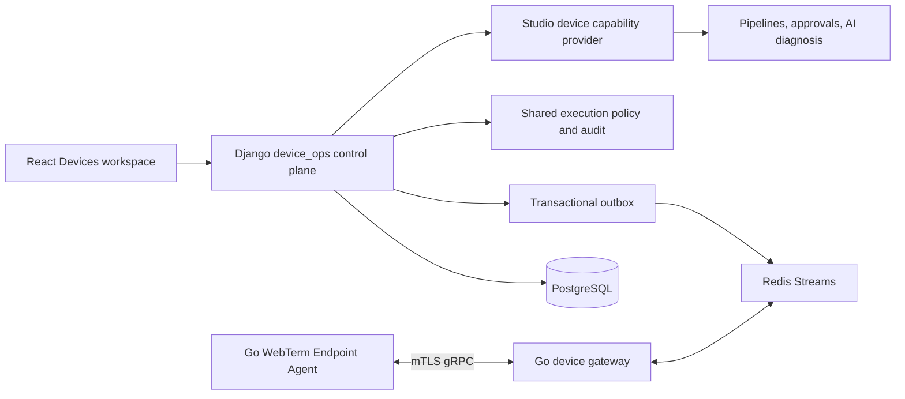

# WebTerm: план превосходства над RoutineOps

- Статус: proposed implementation roadmap.
- Baseline date: 2026-07-22.
- WebTerm baseline: [`b8924ee`](https://github.com/LLprod39/WebTerm/commit/b8924eeb1bcfd0647e80615eaa8c7684828e517a), branch `test`.
- RoutineOps baseline: [`8453023`](https://github.com/Floodww/RoutineOps/commit/8453023fd248e538b81abcd0203b7cdbc9879833), version `2.4.6`.
Owner decision: сначала полностью завершить Stage 1, только затем начинать Stage 2.

## Содержание

- [1. Цель документа](#1-цель-документа)
- [2. Проверенный вывод по сравнению](#2-проверенный-вывод-по-сравнению)
- [3. Целевое позиционирование продукта](#3-целевое-позиционирование-продукта)
- [4. Неподлежащие обходу правила](#4-неподлежащие-обходу-правила)
- [Stage 1 — исправления и стабилизация](#stage-1--исправления-и-стабилизация)
- [Stage 2 — Endpoint Management и функциональное превосходство](#stage-2--endpoint-management-и-функциональное-превосходство)
  - [5. Целевая архитектура](#5-целевая-архитектура)
  - [6. Что именно можно взять из RoutineOps](#6-что-именно-можно-взять-из-routineops)
  - [7. Test strategy Stage 2](#7-test-strategy-stage-2)
  - [8. Scorecard и доказательства превосходства](#8-scorecard-и-доказательства-превосходства)
  - [9. Полная последовательность реализации](#9-полная-последовательность-реализации)
  - [10. Риски и stop conditions](#10-риски-и-stop-conditions)
  - [11. Definition of Done](#11-definition-of-done-для-любого-milestone)
  - [12. Следующий практический шаг](#12-следующий-практический-шаг)

## 1. Цель документа

Цель не в том, чтобы скопировать больше экранов, чем у RoutineOps. Цель — сделать WebTerm сильнее по каждому проверяемому критерию:

- понятность продукта;
- функциональная ширина и глубина;
- архитектура и поддерживаемость;
- тесты и CI;
- безопасность и supply chain;
- документация и contribution experience;
- интерфейс и связанность сценариев;
- готовность к реальному использованию.

План разделён ровно в требуемом порядке:

1. **Stage 1 — исправления, стабилизация и честный release gate.** Новые крупные подсистемы заморожены.
2. **Stage 2 — endpoint management и дополнительные функции.** Добавляются только поверх зелёной архитектуры и CI.

Этот документ является текущим roadmap. Старые отчёты, где architecture guard назван зелёным, не являются доказательством текущего состояния.

## 2. Проверенный вывод по сравнению

Предыдущая оценка была верной по направлению: RoutineOps сейчас выглядит более сфокусированным продуктом, WebTerm — более мощной, но менее дисциплинированной платформой. Однако прежняя оценка RoutineOps `8/10` была завышена, а часть фактов уже устарела.

### 2.1. Что изменилось у RoutineOps

- В репозитории 29 коммитов, один автор, ни одного исторического PR, тега или GitHub Release.
- `main` не защищён; все изменения попадали в него напрямую.
- Версия в репозитории — `2.4.6`, но changelog всё ещё называет её готовящейся.
- Последний [CI run](https://github.com/Floodww/RoutineOps/actions/runs/29911771655) красный: отсутствует `scripts/check-public-docs.sh`. Поэтому `go build`, `go test -race` и coverage на текущем commit не запускались.
- Предыдущий зелёный run действительно показал 76,9% backend coverage, aggregate gate 70% и per-package floor 55%.
- Web CI запускается только на PR, которых в истории не было. Web lint не является blocking gate; Playwright в CI не запускается.
- CI проверяет legacy `installer/windows/agent.wxs`, тогда как распространяемый universal MSI собирается из `build/msi/mdm-agent.wxs`.
- Закоммиченный MSI не подписан; macOS PKG также не имеет обязательной подписи/notarization.
- `SECURITY.md` утверждает, что CA встроен в подписанный MSI/PKG payload, но текущие `build/msi/mdm-agent.wxs` и `build/pkg/build-pkg.sh` прямо описывают загрузку CA по SHA-256 pin. Committed MSI не подписан, а signing optional; поэтому этот раздел SECURITY stale и не является безопасной инструкцией для reuse.
- Оба installer fail-open при enrollment: MSI использует `EnrollExec Return="ignore"`, а PKG продолжает после `enroll ... || echo ...` и завершает install с `exit 0`. WebTerm не должен наследовать это поведение.
- `update.sh` обновляет production из плавающего `main`, а затем локальный deployment key подписывает собранные агенты. Это нельзя переносить в WebTerm как release policy.
- В коде есть собственные god-files: `postgres.go` около 2,5 тыс. строк, `cmd/agent/main.go` около 1,9 тыс., `handler.go` около 1,6 тыс.

При этом зафиксированный snapshot `2.4.6` содержит реализации bulk enrollment, approval queue, decommission, durable outbox, расширенной inventory, service API tokens, ограничения параллельных scripts и полноценного server-side `blocked` kill-switch. Для `.deb/.rpm` присутствуют nfpm definitions/targets, но нет опубликованных packages, tags, Releases или подтверждённого package install CI. Реализованные patterns нужно учитывать в Stage 2, не приписывая им release status.

### 2.2. Что подтверждено у WebTerm

- `test` синхронизирован с `origin/test`; относительно `origin/main` history diverged: `test` впереди на 26 коммитов и позади на один merge commit.
- Diff относительно `origin/main`: 743 файла, `+64 550 / -5 479`.
- В репозитории 2 482 tracked files; pytest собирает 2 166 backend tests.
- Синхронизация `package.json`/lock подтверждена только через `npm ci --ignore-scripts --dry-run`; полноценный clean `npm ci` в CI ещё должен быть доказан. Старый lock-file failure относится к PR #17.
- Production Vite build проходит; `tsc --noEmit` проходит.
- ESLint проходит с 69 warnings.
- Vitest красный: 3 test files, 8 failed tests, 100 passed tests и 6 unhandled errors.
- Наблюдавшийся полный backend pytest в незапиненной WSL-среде: 2 159 passed, 7 failed; это provisional baseline до пересоздания locked environment в F0.
- Ruff красный: 166 ошибок, из них 60 unused imports и одна реальная Python-version проблема с `BaseExceptionGroup` при заявленной поддержке Python 3.10.
- Обычный development Django system check проходит; production deploy check имеет отдельные blockers ниже.
- Architecture Fitness красный: 28 size violations и 11 запрещённых импортов `core_ui -> servers`.
- Production `manage.py check --deploy` остаётся заблокирован `plugin_marketplace.E001/E003/E005/E010/E016`: не заданы signing keys, remote/catalog allowlists, external KMS/HSM и external scanner. До release нужен либо реальный production trust stack, либо fail-closed profile `plugins disabled/preview`, проходящий system checks.
- HEAD `b8924ee` не имеет собственного GitHub Architecture/Playwright run: workflows фильтруют push по `main`; последние публичные checks относятся к слитому PR #17 и красные. Все исправления на `test` пока являются только локальными доказательствами.
- Обязательный CI не запускает pytest, Ruff, Django checks, Vitest, TypeScript check и обычную production frontend build.
- `main` не защищён. [PR #17](https://github.com/LLprod39/WebTerm/pull/17) был слит за 33 секунды при красных Architecture Fitness и Playwright.
- Отсутствуют `CONTRIBUTING.md`, `SECURITY.md`, `CHANGELOG.md`, CODEOWNERS, git tags и GitHub Releases.
- На исходном аудите отображаемый бренд и package metadata расходились. F-12 фиксирует канонический `WebTerm`, public version `0.1.0` и отдельный список legacy compatibility identifiers.
- Функциональность реальна: SSH, файловые операции, мониторинг, Ansible/playbooks, Studio pipelines, MCP, skills, Kubernetes, plugins, audit, permissions и production security settings присутствуют в коде.

### 2.3. Скорректированная оценка

Оценки ниже — planning score, а не маркетинговое утверждение. Они основаны на текущем публичном коде и CI, но не заменяют независимый pentest или production pilot.

| Критерий | RoutineOps сейчас | WebTerm сейчас | Stage 1 target | Stage 2 target |
| --- | ---: | ---: | ---: | ---: |
| Понятность продукта | 9 | 6 | 9 | 9.5 |
| Функциональный масштаб | 7.5 | 9.5 | 9.5 | 10 |
| Архитектура и поддерживаемость | 6.5–7 | 4 | 9 | 9+ |
| Тесты и CI | 6.5 | 3.5 | 9 | 9.5 |
| Безопасность | 7 | 7 | 8.5 | 9.5 |
| Документация | 7.5 | 6.5–7 | 9 | 9.5 |
| Интерфейс | 7.5–8 | 7.5–8 | 8.5 | 9 |
| Готовность к использованию | 5.5 | 4.5–5 | 8 | 9 |
| Общая ориентировочная оценка | около 7 | около 6.3 | 8.5+ | 9+ |

WebTerm должен обойти замороженный baseline RoutineOps уже после Stage 1 по engineering quality и release readiness. Stage 2 должен добавить endpoint depth, сохранив преимущество WebTerm в DevOps automation.

## 3. Целевое позиционирование продукта

Рекомендованный единый тезис:

> **WebTerm — self-hosted operations control plane для SSH-серверов и agent-managed устройств: inventory → diagnosis → guarded automation → compliance → audited recovery.**

Платформа должна иметь три понятных рабочих пространства:

1. **Infrastructure** — SSH servers, terminal, files, monitoring, Kubernetes.
2. **Automation** — AI agents, playbooks, Studio pipelines, MCP, approvals.
3. **Devices** — Windows/macOS/Linux endpoints с установленным endpoint agent.

Нужно сохранить два разных resource type:

- `Server` — SSH-managed infrastructure resource из существующего `servers` domain;
- `ManagedDevice` — endpoint с mTLS agent, heartbeat, desired/actual state и offline queue.

Нельзя расширять текущий `Server` до MDM-модели: SSH host и управляемое пользовательское устройство имеют разные identity, lifecycle, trust boundary и failure modes.

Также нельзя называть оба типа runtime одинаково словом `Agent`:

- **AI Agent** — существующий WebTerm automation actor;
- **Endpoint Agent** — новый системный сервис на устройстве.

## 4. Неподлежащие обходу правила

1. До Stage 1 exit gate не добавлять новые крупные product domains.
2. Не «чинить» architecture guard увеличением baseline или исключениями import-linter.
3. Не сливать PR при любом красном required check.
4. Не считать docs, screenshots или локальный ручной запуск доказательством release readiness.
5. Не переносить RoutineOps целиком. Использовать отдельные invariants, tests и небольшие Apache-2.0 компоненты.
6. Не копировать prebuilt binaries, signing keys, CA material, branding или Enterprise-only идеи как существующий код.
7. Любая mutation должна иметь backend permission, policy decision, audit, idempotency и failure evidence.
8. Документ может сообщать `PASS` только со ссылкой на commit и машинный artifact/run.

## Stage 1 — исправления и стабилизация

### F0. Зафиксировать честный baseline и runtime contract

#### Работы

- Добавить исполняемый release checklist, где каждому пункту соответствует команда и artifact.
- Исправить stale PASS в `docs/architecture/README.md` и пометить исторические отчёты как snapshots, а не current status.
- Зафиксировать один primary release runtime: **Python 3.11 + Django 5.2.16 из `requirements.lock`**. Python 3.12 оставить отдельной compatibility lane, а не второй production truth.
- Синхронизировать `requires-python >=3.11,<3.13`, Ruff target, Docker image, primary CI, README и lock. Убрать из README незапиненный release path через `requirements-mini.txt`.
- Пересоздать отдельные clean virtual environments из lock. Никогда не делить один `.venv` между Windows и WSL; локальные Django 6.0 environments не являются release evidence.
- Добавить versioned `requirements-dev.lock` с Ruff, pytest, pytest-cov/coverage и остальными test tools. Зафиксировать Node/npm через `engines` и `packageManager` после проверки Node 22 LTS; добавить `npm run typecheck` вместо CI-вызова raw `tsc`.
- Создать release-scope matrix для product domains (Servers, Terminal/files, Monitoring, Playbooks, Agents, Chat, Studio, MCP, Plugins, Kubernetes, MARS) и обязательных foundations (auth/session, RBAC/groups, SSO/Keycloak/LDAP, managed secrets, audit, settings/readiness, dashboard, notifications): `GA`, `preview` или `disabled`, owner, production prerequisites и обязательный smoke/security/E2E artifact. Kubernetes сейчас по умолчанию скрыт production flag, а Plugins блокируют deploy check — это должно быть явным release decision.
- Создать `docs/reports/COMPETITIVE_BASELINE_2026-07-22.md` только при необходимости отдельного архивного снимка; этот roadmap остаётся source of truth для работы.
- Ввести `scripts/collect_release_evidence.py`: он отвергает dirty worktree и собирает только реальные JUnit, coverage, bundle, SBOM и CI artifacts вместе с command exit codes, tool versions, config hashes и commit SHA. Скрипт не может сам объявить локальный незапиненный запуск `PASS`.

#### Acceptance

- Одна таблица support matrix описывает Python, Node, PostgreSQL, Redis и browser versions.
- Primary release и compatibility runtimes разделены; Windows/WSL environments физически независимы.
- Clean clone поднимается только из versioned runtime и dev/test lock files.
- У каждого top-level domain есть release status и evidence owner; скрытая или неподготовленная функция не выдаётся за GA.
- `PASS` в current-status docs соответствует текущему commit.
- Локальная незапиненная среда не влияет на release verdict.

#### Implementation record — F-01 (2026-07-22)

- Runtime ADR: [`adr/0001-primary-runtime-and-toolchain.md`](adr/0001-primary-runtime-and-toolchain.md).
- Support/scope/checklist: [`../releases/README.md`](../releases/README.md).
- Frozen baseline: [`../reports/COMPETITIVE_BASELINE_2026-07-22.md`](../reports/COMPETITIVE_BASELINE_2026-07-22.md).
- Runtime and development locks are separated; the development lock is constrained to the exact production runtime.
- Clean WSL installation verified with Python 3.11.15, Django 5.2.16 and 107 compatible packages; the five F-01 contract/evidence tests pass in that environment.
- Clean frontend installation verified with Node 22.23.1/npm 10.9.8. The lock is synchronized; the remaining 3 transitive High audit findings are explicitly carried into F-10 and prevent a security-ready claim.
- `scripts/verify_runtime_contract.py` passes. `scripts/collect_release_evidence.py` rejects dirty source trees and always leaves the release decision unevaluated.

### F1. Закрыть текущие красные проверки

#### F1.1. Backend pytest: 7 provisional failures

| Failure | Требуемое решение |
| --- | --- |
| `test_monitoring_status_display` (`90` vs `300`) | Выбрать один production contract для metrics trust window; API, dashboard и docs должны читать один setting. |
| `test_servers_monitoring_live` (cache roundtrip пуст) | Использовать test Redis/fake cache с тем же serialization contract; исключить зависимость от случайного local cache backend. |
| `test_agent_inputs` (runtime protocol text drift) | Зафиксировать structured prompt contract; тестировать обязательные safety semantics, а не хрупкую фразу, если текст не является API. |
| `test_llm_ollama` (новый `options`) | Зафиксировать payload schema и default precedence для `num_ctx`, `num_predict`, temperature. |
| Два `test_prompt_caching` для Grok | Проверить, что system prompt не теряется при новом OpenAI-compatible streaming path; это security/behavior regression, а не просто stale assertion. |
| `test_terminal_ai_plan_items` (`unknown -> agent`, ожидалось `step`) | Выбрать fail-safe default и задокументировать migration. Не менять тест без product decision. |

После исправления запустить полный набор в clean locked environment, а не только `--lf`.

#### F1.2. Frontend tests

- Исправить shared `framer-motion` mock: он должен экспортировать `useReducedMotion`.
- Разобрать реальные expectation drift в:
  - `AppSidebar.mars.test.tsx`;
  - `Servers.test.tsx`;
  - `SettingsKubernetesPage.test.tsx`.
- Устранить 6 unhandled errors; test run с unhandled error не может считаться зелёным даже при passed assertions.
- Добавить shared render harness с router, i18n, motion и feature gates, чтобы page tests не создавали несовместимые mocks.

#### F1.3. Ruff, ESLint и bundle health

- Исправить все 166 Ruff errors. Сначала `F821/F841/F401`, затем import order и safe simplifications.
- Устранить `BaseExceptionGroup` mismatch переходом Ruff/runtime contract на выбранный Python 3.11.
- Довести ESLint warnings с 69 до 0; после этого включить `--max-warnings 0`.
- Сохранить зелёный TypeScript через versioned `npm run typecheck`.
- Ввести machine-readable bundle artifact с gates: каждый minified JS chunk <=500 KiB, initial-entry required JS <=450 KiB gzip, lazy route chunk <=200 KiB gzip. Текущий `vendor` — 979.34 kB minified и 328.44 kB gzip: gzip сам по себе укладывается, но minified chunk требует code splitting.
- В locked environment измерить backend/frontend coverage, сначала поставить no-regression ratchet относительно baseline, затем довести Stage 1 до target. Backend denominator — все packages со статусом GA в release-scope matrix, включая соответствующие `app`, `core_ui`, `servers`, `studio`, `kubernetes_ops`, `plugin_marketplace`, `mars`, `web_ui`; нельзя оставить старый coverage source только `app/core_ui/servers`. Critical >=90% отдельно охватывает auth/session, RBAC/object permissions, secrets, execution policy, approvals, plugin trust, SSH host-key decisions и mutation audit. Frontend artifact публикует line/branch/function coverage по каждому GA critical flow.

#### F1.4. Production deploy checks

- Повторить `manage.py check --deploy` с production settings и зафиксировать все system-check IDs.
- Для `plugin_marketplace.E001/E003/E005/E010/E016` принять одно из двух release решений:
  1. provision real signing keys, catalog/remote allowlists, external KMS/HSM и scanner, затем пройти integration smoke;
  2. выпустить fail-closed production profile `plugins disabled/preview`, в котором routes/UI/mutations выключены и deploy checks зелёные.
- Не ослаблять checks и не подставлять dummy secrets ради зелёного release verdict.

#### Acceptance

```text
pytest: full collected suite, 0 failed, 0 collection errors
test count: >= frozen F0 baseline; любое снижение документировано и одобрено
ruff: 0 errors
npm ci: clean install pass
npm run typecheck: pass
eslint --max-warnings 0: pass
vitest: 0 failed, 0 unhandled errors
vite build: pass within bundle budget
manage.py check --deploy: pass for declared release profile
```

### F2. Закрыть Architecture Fitness без новых исключений

#### F2.1. Убрать `core_ui -> servers`

Создать framework-neutral ports в `app`, например:

```text
app/operator_ports/
  server_context.py
  run_reports.py
  memory.py
  actions.py
  registry.py

servers/operator_provider/
  server_context.py
  run_reports.py
  memory.py
  actions.py
  bootstrap.py
```

`servers.apps.ServersConfig.ready()` регистрирует implementations, но framework-neutral orchestration переезжает из `core_ui/services/operator_*` в `app/operator/`; `core_ui` остаётся HTTP/session adapter и видит только `app.operator_ports`/`app.operator` contracts. Нельзя просто спрятать прежнюю business logic за registry.

`app/operator` содержит только pure orchestration/DTOs и получает `ChatSessionStore`, `TurnStore` и server capabilities как typed dependencies. `core_ui/operator_provider` реализует ORM-backed session/turn storage; `servers/operator_provider` — server capabilities. `app/operator*` не импортирует Django, `core_ui` или `servers`.

Wiring contract для `ready()`:

- registration idempotent и thread-safe;
- никакого DB/network I/O во время import/`ready()`;
- missing provider fail-fast с понятной diagnostics;
- reset/isolation tests для ASGI, WSGI, Celery и `manage.py` процессов.

Перевести через ports все текущие нарушения:

- `operator_async.py` — run reports и agent-run lookup;
- `operator_duty.py` — server selection/access;
- `operator_loop.py` — context, tool catalog и server actions;
- `operator_memory.py` — server memory store;
- `operator_tools.py` — server helper operations.

Запрещено:

- добавлять exceptions в `.importlinter`;
- переносить ORM models в `app`;
- прятать forbidden import внутри function без изменения ownership;
- превращать registry в global service locator без typed protocol и reset hook.

#### F2.2. План разделения 28 текущих нарушений

| Текущий файл | Проблема | Целевые модули |
| --- | --- | --- |
| `servers/operator_tools.py` | 1 507 lines, смешаны read/mutate/catalog | inventory, monitoring, memory, planning, registration |
| `core_ui/services/operator_loop.py` | 1 176 lines, orchestration + persistence + tools | prompt, history, turn store, tool cycle, stream, coordinator |
| `app/core/llm_tools.py` | 1 065 lines, provider-specific branches | OpenAI, Anthropic, Ollama adapters, JSON fallback, selection |
| `frontend/src/pages/ChatPage.tsx` | 1 657 lines | controller hook, transport, thread list, composer, messages, approvals, artifacts |
| `servers/operator_mutate_tools.py` | 764 lines | commands, playbooks, schedules, rollback/undo, registration |
| `studio/assistant_actions.py` | 800 lines | draft, validate, run, inspect, registration |
| `frontend/src/pages/UserDashboard.tsx` | 820 lines | data controller + focused widget sections |
| `frontend/src/pages/admin-dashboard/adminDashboardWidgets.tsx` | 610 lines | catalog, formatters, renderers, attention items |
| `core_ui/models.py` | 518 lines | chat, access, audit/usage, secrets, terminal preferences, dashboard layout + compatibility exports |
| `app/core/llm.py` | 643 lines | provider orchestration, streaming, retry/runtime settings |
| `core_ui/services/operator_artifacts.py` | 599 lines | storage, serialization, render metadata |
| `core_ui/services/operator_session.py` | 526 lines | lifecycle, state transitions, persistence |
| `core_ui/views/settings_config_views.py` | 522 lines | settings domains as separate thin views |
| `servers/agent_engine.py` | 503 lines | coordinator facade + setup/run/finalize services |
| `servers/agent_engine_runner.py` | legacy growth | execution loop, events, result handling |
| `servers/agent_sessions.py` | 562 lines | session lifecycle, access, serialization |
| `servers/agent_tools.py` | 698 lines | catalog, policy metadata, execution adapters |
| `servers/agents.py` | 576 lines | templates, run orchestration, persistence/finalization, fanout, compatibility facade |
| `servers/assistant_actions.py` | 673 lines | read actions, mutate actions, registration |
| `servers/monitoring_live.py` | 504 lines | sampling, cache, serialization, websocket events |
| `servers/views/server_monitoring.py` | legacy growth | thin views + monitoring services |
| `frontend/e2e/support/platformFixtureRoutes.ts` | 530 lines | fixture routers by API domain |
| `frontend/src/lib/api-demo-server-admin.ts` | legacy growth | groups, shares, rules, knowledge, CRUD modules |
| `frontend/src/pages/AgentsPage.tsx` | 505 lines | list controller, filters, dialogs, worker panels |
| `frontend/src/pages/Servers.tsx` | legacy growth | route coordinator + feature hooks/components |
| `frontend/src/pages/agents-page/AgentWizardStepContent.tsx` | legacy growth | one component per wizard step |
| `frontend/src/pages/agents-page/CreateAgentDialog.tsx` | legacy growth | shell + validation/controller hook |
| `frontend/src/pages/agents-page/agentPageUtils.ts` | legacy growth | schedules, budgets, artifacts, validation, labels |

Каждый split PR должен сначала добавить characterization tests, затем извлечь один responsibility без изменения публичного API.

Перед split `core_ui/models.py` обязательны `makemigrations --check --dry-run`, стабильные app labels/table names/content types, migration-graph tests и compatibility imports для admin/signals. Рефакторинг моделей не должен порождать ложные migrations или менять permissions/content types.

#### Acceptance

- Все 9 import contracts kept.
- Ноль forbidden imports.
- Ноль size violations и legacy-growth violations.
- Operator orchestration принадлежит `app/operator`, а `core_ui` остаётся adapter layer; provider wiring проходит process-isolation tests.
- Model split проходит migration/content-type compatibility gates.
- Новые files <500 lines; route/view/coordinator target <=300 lines.
- Baseline не увеличен ни для одного файла.
- Architecture docs обновлены тем же PR и содержат commit evidence.

### F3. Сделать CI обязательным release gate

#### Backend CI

Создать `.github/workflows/backend-ci.yml` с независимыми jobs:

1. `python-quality`: Ruff format/check, Python version contract.
2. `django-checks`: system check, migration drift, URL/schema checks.
3. `backend-unit`: deterministic tests без Redis/network, full JUnit и coverage artifact.
4. `backend-integration`: PostgreSQL 16 + Redis, cache/queue/worker/WebSocket tests и recovery smoke.
5. `production-checks`: `manage.py check --deploy`, production env preflight, Compose config.
6. `docs-contract`: links, commands и drift поддерживаемых v0.1 API contracts.

Падение docs guard не должно пропускать build/tests, как произошло в текущем RoutineOps CI.

#### Frontend CI

Создать `.github/workflows/frontend-ci.yml`:

1. `npm ci`;
2. `npm run typecheck`;
3. ESLint с `--max-warnings 0`;
4. Vitest + coverage;
5. production Vite build + bundle budget;
6. upload build/test artifacts.

#### E2E и integration

- Playwright smoke — каждый PR.
- Full-stack Playwright с backend/PostgreSQL/Redis — nightly и release candidate.
- A11y — отдельный required job для изменённых пользовательских flows.
- Visual regression — отдельный non-flaky gate с reviewed baselines.
- Production Compose smoke, migrations, worker topology и WebSocket checks.

#### Security CI

- Python/npm dependency audit; Go audit включается в D0, когда появятся tracked Go modules.
- secret scanning;
- CodeQL/SAST;
- container scan;
- SBOM;
- license/provenance check;
- artifact checksum/signature verification.

Каждый новый workflow с первого PR использует SHA-pinned Actions, least-privilege `permissions`, timeouts, concurrency/cancellation и безопасное поведение для fork/untrusted PR. Secrets недоступны untrusted code.

#### Git governance

- Сразу после CI skeleton защитить `test` и `main`: PR-only, минимум один review, запрет direct/admin push кроме logged break-glass. Сначала required только уже зелёные checks и base-vs-head no-regression guard; красные suites остаются видимыми non-required до исправления.
- После F1/F2 promoted required checks: backend, frontend, architecture, Playwright, security baseline.
- Минимум один review; CODEOWNERS для workflows, auth/security, migrations, execution policy и future endpoint agent.
- `test -> main` только promotion PR с release evidence.
- Scheduled Gemini triage перевести из hourly в manual/weekly режим с deduplication; AI workflow не должен скрывать product CI.

#### Acceptance

- Required checks зелёные на clean clone.
- Нельзя merge при красном check даже администратору без logged break-glass.
- После promotion всех checks в F-11: минимум 14 последовательных календарных дней **и** 30 unique-SHA merge-candidate/scheduled runs зелёные; reruns одного SHA не увеличивают denominator. Clock начинается в момент F-11.
- CI p95 <=15 минут; slow suites sharded без потери coverage.
- Backend coverage сначала не ниже frozen baseline, на Stage 1 exit >=80%; execution/security policy >=90%.
- Frontend feature-module coverage >=70% сначала, затем >=80% для critical flows.

### F4. Security, threat model и supply chain

#### Работы

- Добавить `SECURITY.md` с supported versions, disclosure process и response SLA.
- Обновить threat model текущей системы: auth/session, SSH, WebSocket, agent/pipeline execution, MCP egress, plugins, managed secrets, Kubernetes admin mode.
- Провести repository-wide security scan и зафиксировать findings с owner/severity/status.
- Добавить `THIRD_PARTY_NOTICES.md` до первого заимствования RoutineOps.
- Генерировать CycloneDX/SPDX SBOM для backend, frontend, containers и будущего Go agent.
- Добавить provenance attestations для release artifacts.
- Проверить CSRF/session boundaries, SSRF/egress, host-key trust, object ownership, secret leakage в logs/reports/memory/LLM prompts, plugin sandbox и policy bypass.

Для каждой mutation обязательны tests:

- denied permission;
- wrong owner/tenant/group;
- redaction;
- audit event;
- approval/preflight;
- idempotent retry;
- timeout/error state;
- rollback/recovery where applicable.

#### Acceptance

- В release scope нет unresolved Critical или High findings. Вне release scope High допустим только как формальный risk acceptance с owner, expiry и compensating control; такой acceptance не делает затронутую функцию GA.
- Все mutation APIs имеют backend authorization и negative tests.
- Secrets не попадают во frontend payload, logs, reports, memory или model prompts.
- Release artifacts имеют SBOM, checksum, signature/provenance.

### F5. Один бренд, понятная документация и UX

#### Brand decision

Рекомендация — canonical public brand **WebTerm**, но решение принимается только после name/domain/trademark/package clearance. До механического rename составить compatibility inventory: plugin IDs, localStorage keys, env vars, image/package names и API identifiers. Старые `webtrerm.*` IDs можно сохранять только как документированные compatibility identifiers.

Синхронизировать:

- root README и screenshots;
- `pyproject.toml` metadata;
- frontend package/app metadata;
- `frontend/index.html`;
- RU/EN locales;
- Django admin/header/templates;
- terminal banner, prompts и notification subjects;
- container/image names, docs и examples.

#### Documentation

Добавить:

- `CONTRIBUTING.md`;
- `CHANGELOG.md`;
- `CODE_OF_CONDUCT.md`;
- CODEOWNERS;
- ADR index;
- inventory и contract tests поддерживаемых v0.1 public APIs; OpenAPI генерировать сначала только для этого declared surface, поскольку legacy plain Django views пока не имеют общего schema generator;
- clean install, upgrade, rollback, backup/restore, disaster recovery;
- support matrix;
- troubleshooting;
- release checklist.

Ввести единый `VERSION` и синхронизацию Python/frontend/container metadata. Первый честный публичный release — `v0.1.0`, независимо от старого внутреннего `2.0.0`, если migration/versioning ADR подтверждает reset.

#### UX

Целевая навигация:

```text
Dashboard
Infrastructure
  Servers
  Devices (Stage 2)
  Kubernetes
Automation
  AI Agents
  Playbooks
  Studio
Extensions
Administration
```

- Первый запуск — readiness wizard поверх существующих readiness endpoints.
- Один основной demo flow Stage 1: install -> add server -> connect -> guarded action -> audit evidence.
- Все pages: loading, empty, error, denied, disabled и degraded states.
- Keyboard/focus/contrast/mobile проверки.
- Lighthouse/bundle budgets и interaction latency.

#### Acceptance

- Новый пользователь понимает назначение продукта за 30–60 секунд.
- Поиск legacy brands возвращает только documented compatibility IDs.
- Новый contributor поднимает dev stack только по CONTRIBUTING.
- Critical flows соответствуют WCAG 2.2 AA без critical violations.
- Task-success rate основного flow >=90% по заранее versioned test script, owner и минимум 10 независимым pilot participants; ошибки environment/product классифицируются до подсчёта.

### F6. Operations и первый проверяемый release

#### Работы

- Clean production install на новой Linux VM.
- Release-scope matrix frozen: каждая top-level capability имеет `GA/preview/disabled`, owner, prerequisites и evidence. Plugins либо получают реальный KMS/scanner/allowlists, либо fail-closed отключены; Kubernetes/MARS не объявляются GA по наличию кода.
- Backup PostgreSQL, secrets/config, plugin packages и critical state.
- Restore в отдельный stack и integrity checks.
- Для первого `v0.1.0`, где публичного N-1 ещё нет, зафиксировать два upgrade fixtures: schema/data snapshot commit `b8924ee` и `v0.1.0-rc.1`. Application rollback проверять отдельно от DB reverse-migration/restore policy; необратимая migration обязана иметь backup/forward-fix runbook.
- Observability: health/readiness, worker lag, queue depth, WebSocket failures, failed mutations, audit delivery.
- Release artifact inventory: immutable container image digests, versioned Compose/install bundle, SBOM, checksums, signatures/provenance и release notes. Для каждого artifact есть verification command; Playwright использует именно опубликованные image digests.
- Проверить `makemigrations --check --dry-run`, `manage.py check --deploy`, production Compose config, readiness API, PostgreSQL/Redis restart recovery и scheduler/worker/WebSocket smoke/soak.
- Не класть крупные prebuilt installers/binaries в git history; публиковать через Releases/package registry.

#### Stage 1 exit gate

Stage 2 запрещён, пока не выполнены все пункты:

- [ ] Full backend suite в primary locked runtime: 0 failed, 0 collection errors; collected count не ниже frozen F0 baseline либо снижение отдельно одобрено.
- [ ] Vitest: 0 failed, 0 unhandled errors.
- [ ] Ruff/ESLint/TypeScript/build green; 0 lint warnings.
- [ ] Backend coverage >=80%, critical execution/security policy >=90%; frontend critical flows >=80%.
- [ ] Architecture: 0 violations, all import contracts kept.
- [ ] Required CI и branch protection включены; после F-11 выдержаны минимум 14 календарных дней и 30 unique-SHA green runs без учёта reruns.
- [ ] Один cleared brand и frozen release-scope matrix.
- [ ] Critical-flow WCAG 2.2 AA artifact и >=90% pilot task success по versioned script/minimum sample готовы.
- [ ] CONTRIBUTING, SECURITY, CHANGELOG, ADR/release docs готовы.
- [ ] Migration drift, deploy checks и production Compose config зелёные; Plugins работают с production trust stack либо fail-closed отключены.
- [ ] Readiness, clean install, PostgreSQL/Redis recovery, backup/restore и upgrade/rollback доказаны artifacts.
- [ ] В release scope нет unresolved Critical/High security findings.
- [ ] Опубликован `v0.1.0` GitHub Release: immutable image digests, Compose/install bundle, checksums, SBOM, signatures/provenance.
- [ ] Главный Playwright flow зелёный на точных опубликованных image digests.

### F7. Рекомендуемая последовательность PR для Stage 1

| PR | Scope | Зависимость | Gate |
| --- | --- | --- | --- |
| F-01 | Baseline, primary runtime ADR, runtime/dev locks, Node/npm pin, release-scope matrix, truthful docs | none | reproducible toolchain and current failures visible |
| F-02 | Hardened non-required backend/frontend CI skeleton | F-01 | reproducible evidence |
| F-02b | Early branch protection: PR/review, current-green required, no-regression | F-02 | stabilization protected |
| F-03 | Current threat model + repository-wide initial scan | F-02 | security constraints known before refactor |
| F-04 | Fix provisional backend failures in locked runtime | F-02b/F-03 | full pytest green |
| F-04b | Production release profile; close `E001/E003/E005/E010/E016` via real trust stack or fail-closed disabled Plugins | F-02b/F-03 | deploy check green |
| F-05 | Fix Vitest/unhandled errors | F-02b | frontend tests green |
| F-06 | Ruff 166 + ESLint 69 + coverage baseline/ratchet on already locked tools | F-04/F-04b/F-05 | quality green |
| F-07 | Operator layer/ports, remove `core_ui -> servers` | F-03/F-06 | import contracts green |
| F-08a | Epic of small PRs: split operator/LLM backend god-files | F-06/F-07 | backend sizes green |
| F-08b | Epic of small PRs: split Chat/dashboard/agent frontend god-files | F-05/F-06 | frontend sizes green |
| F-09 | Close live remaining size/import violations | F-08a/F-08b | architecture command fully green |
| F-10 | Security remediation, SBOM, signing/provenance | F-03/F-09 | no Critical/High in release scope |
| F-11 | Promote all product + severity checks to required; start 14-day/30-SHA clock | F-04..F-10 | red or vulnerable merge impossible |
| F-12 | Cleared brand, scoped API/docs, onboarding, a11y and pilot UX evidence | F-11 | clarity/docs/UX target |
| F-13a | Clean install of already-green release profile, readiness/worker smoke | F-11/F-12 | production preflight green |
| F-13b | Backup/restore + PostgreSQL/Redis recovery | F-13a | recovery evidence |
| F-13c | Frozen-baseline/RC upgrade, application rollback and DB restore policy | F-13b | first-release lifecycle evidence |
| F-13d | Publish and verify signed release artifacts | F-13c/F-11 clock | `v0.1.0` |

F-08a/F-08b/F-09 и F-13 — epics, а не mega-PRs. Не объединять architecture rewrite, visual redesign и behavior changes в один PR.

#### Implementation record — F-02/F-02b repository side (2026-07-22)

- Added SHA-pinned backend, frontend, architecture/no-regression and Playwright workflows with read-only default permissions, timeouts, concurrency cancellation and evidence uploads.
- Added a PostgreSQL 16 + Redis 7 integration settings lane and real DB/cache/channel round-trip tests.
- Added docs/runtime contracts, Vitest coverage/JUnit, a frozen production bundle budget and a debt no-regression guard. The full red architecture job remains independent and visible.
- Frozen F-02 frontend results: typecheck/build/budget pass; ESLint has 69 warnings; Vitest has 3 failed files, 8 failed tests and 6 unhandled errors; npm audit has 3 transitive High findings.
- Added CODEOWNERS, versioned governance policy and a safe audit/apply tool. GitHub branch protection remains unapplied because the four early checks have not yet run on the current `test`/`main` heads; the tool refuses to create nonexistent required contexts. Two push-capable collaborators are available, so review enforcement will not create a single-owner deadlock after those runs.
- Scheduled Gemini triage is weekly/manual instead of hourly and no longer triggers on its own workflow PR/push changes.

#### Implementation record — F-04/F-04b (2026-07-22)

- Re-ran the complete backend suite in the locked Python 3.11.15/Django 5.2.16
  environment: 2,178 collected, 2,175 passed, 3 environment-gated integration
  tests skipped, zero failures/errors. The test count increased by one for the
  new Ollama request contract.
- Unified monitoring freshness on a versioned 300-second setting, made Redis to
  Django-cache fallback symmetric, and removed the deprecated Redis write call.
- Replaced stale prompt/provider assertions with behavior contracts, preserved
  Grok system messages through the shared streaming request, froze Ollama option
  precedence, and made unknown execution modes fail safe to `step`.
- Implemented the v0.1 fail-closed plugin release profile. Production startup
  omits plugin provider wiring and `/api/plugins/` routes; frontend auth, routes,
  settings navigation, readiness onboarding and dashboard surface queries honor
  the same capability.
- `manage.py check --deploy` now passes with zero issues under production settings
  and CI-only platform secrets, without dummy plugin trust material. The five
  former `E001/E003/E005/E010/E016` blockers are out of v0.1 scope only because
  plugin execution is actually disabled, not because checks were silenced.

#### Implementation record — F-06 (2026-07-23)

- Cleared the last Ruff `I001` in `servers/agent_service.py` and reformatted the
  three remaining files; `ruff check .` and `ruff format --check .` are fully
  green. Added `graphify-out` and `.venv-wsl` to the Ruff `exclude` set so the
  local generated knowledge-graph output and the WSL virtualenv no longer break
  `ruff check .` (neither is tracked, so CI is unaffected).
- Restored two public compatibility re-exports that `ruff --fix` had stripped as
  unused: `KNOWN_NODE_TYPES` in `studio/pipeline_validation.py` and the alias
  command `Command` in `plugin_marketplace/management/commands/plugin_validate.py`
  (the latter had been emptied to zero bytes, breaking `call_command`). Both are
  now explicit `... as ...` re-exports so ruff keeps them.
- Recorded the honest backend coverage baseline in the locked runtime
  (Python 3.11.15 / Django 5.2.16) over the CI backend-unit cov set
  (app, core_ui, servers, studio, kubernetes_ops, plugin_marketplace, mars,
  web_ui): **71.95%**, 54364/75557 lines, 2181 passed / 3 skipped / 0 failed.
  Evidence: `.ci-artifacts/f06-backend-{junit.xml,coverage.xml,coverage.json}`.
- Froze the minimal ratchet just below that baseline: `fail_under = 71.5`
  (`precision = 2`) in `[tool.coverage.report]` and an explicit
  `--cov-fail-under=71.5` on the CI backend-unit step. Stage 1 exit target
  remains >=80%; raise both together as coverage improves.
- Re-froze the architecture no-regression baseline. The mandatory `ruff format`
  had reflowed long dict/list literals across more lines, growing 48 files past
  the 500-line limit (36 new + 12 grown) purely mechanically — no logic changed
  and **zero** new import-boundary edges (still exactly the 11 frozen
  `core_ui -> servers` edges targeted by F-07). `config/quality-debt-baseline.json`
  now freezes the post-format scan (64 size violations, 11 import edges) so
  `scripts/check_architecture_no_regression.py` passes. The full
  `check_architecture_sizes.py --strict-new` job stays intentionally red/visible
  as the F-08/F-09 refactor backlog; its `pyproject.toml` legacy_baselines list
  is deliberately left unchanged.

#### Implementation record — F-07 (2026-07-23)

- Removed all 11 `core_ui -> servers` import edges (import-linter contract 5),
  inverting the dependency with the codebase's established Service-Locator
  pattern (mirrors `app/agent_kernel/skill_provider_registry.py`).
- Added `app/agent_kernel/operator_provider_registry.py`: a Django-free
  `OperatorServersProvider` Protocol + registry + module-level helpers. Kept
  ORM-free (contract 1) — querysets/models cross the port typed as `Any`.
- Added `servers/operator_provider.py` (`ServersOperatorProvider`) implementing
  the port, registered in `servers/apps.ServersConfig.ready()`. Data-gathering
  that belongs to servers moved here: `collect_duty_facts` (the duty briefing
  scan; the `agents` feature check stays in core_ui and is passed as a bool) and
  `ingest_operator_lesson` (wraps `DjangoServerMemoryStore`, so core_ui no longer
  reaches into private store methods). Thin accessors proxy the rest
  (`accessible_servers_queryset`, `server_names_for_ids`, `get_agent_run`,
  `get_playbook_run`, `build_agent_run_report_response`, `memory_overview`,
  `prefer_resolve_server_for_message`, `prepare_list_servers_arguments`).
- Migrated the 5 core_ui operator services (`operator_async`, `operator_duty`,
  `operator_memory`, `operator_loop`, `operator_tools`) to call the registry.
- Verified: `lint-imports` = 9 contracts kept / 0 broken (core_ui isolation now
  clean); ruff/format/Django check green; 66 operator/memory/plugin tests pass.
  Re-froze the no-regression baseline: **import edges 11 -> 0**, size violations
  66 (operator_duty/operator_memory shrank; two files grew from concurrent MCP
  work). Final gate — full backend suite in the locked runtime: **2185 passed,
  3 skipped, 0 failed**, coverage 71.81% (still above the 71.5 ratchet).

#### Implementation record — F-08a (first slice, 2026-07-23)

- Split the largest backend god-file `servers/operator_tools.py` (**1507 -> 323
  lines**) into cohesive submodules, all under the 500-line limit:
  `operator_tools_hints.py` (216, message-intent/host parsing),
  `operator_tools_common.py` (25, shared `_int_arg`/`_server_for_user`),
  `operator_tools_inventory.py` (265, list/resolve/info/fleet_status),
  `operator_tools_monitoring.py` (425, forecasts/alerts/certs/insights),
  `operator_tools_actions.py` (199, metrics/memory/plan). `operator_tools.py`
  stays the public facade: re-exports via `__all__` (stable API for
  `servers/apps.py`, `servers/operator_provider.py` and the tests) plus
  `register_operator_tools`.
- Pure move — no behaviour change; each tool kept its deferred model imports.
  Verified: ruff/format clean, Django check 0 issues, `lint-imports` 9 kept /
  0 broken (no new edges), 36 targeted operator tests pass. Re-froze the
  no-regression baseline **66 -> 64** size violations (operator_tools.py dropped
  out; a concurrent-MCP file also fell back under 500). Final gate — full
  backend suite in the locked runtime: **2191 passed, 3 skipped, 0 failed**,
  coverage 71.96% (above the 71.5 ratchet). Remaining F-08a/F-08b/F-09 god-files
  still tracked.
- Split the second backend god-file `app/core/llm_tools.py` (**1065 -> 53
  lines**) into a facade + focused submodules, all under 500:
  `llm_tool_helpers.py` (342, schema/parsing/tool-selection/message conversion)
  and one streaming module per provider — `llm_stream_anthropic.py` (145),
  `llm_stream_openai.py` (130), `llm_stream_ollama.py` (198),
  `llm_stream_fallback.py` (227). `llm_tools.py` stays the facade (re-exports via
  `__all__`; stable for `app/core/llm.py`, operator_tools and tests). Pure move.
  Verified: ruff/format/Django clean, `lint-imports` 9 kept / 0 broken, full
  suite **2191 passed / 3 skipped / 0 failed**, coverage 71.98%. No-regression
  baseline re-frozen **64 -> 63** (llm_tools.py dropped out).
- Split the third backend god-file `servers/operator_mutate_tools.py` (**764 ->
  192 lines**) into a facade + submodules under 500: `operator_mutate_exec.py`
  (229, run_command/run_fanout + execution), `operator_mutate_playbooks.py`
  (176, playbooks/runbooks/alert-resolve), `operator_mutate_schedule.py` (135,
  agent scheduling + undo). Reused `operator_tools_common` for the duplicated
  `_int_arg`/`_server_for_user`. Facade re-exports via `__all__`. Verified:
  ruff/format/Django clean, `lint-imports` 9 kept / 0 broken, full suite **2191
  passed / 0 failed**. No-regression re-frozen **63 -> 62**.
- Split the fourth backend god-file `servers/agent_tools.py` (**698 -> 385
  lines**): moved `ToolResult` to `agent_tools_base.py` (13) and the skills /
  operator-materials tools to `agent_tools_materials.py` (244); the `AGENT_TOOLS`
  registry, SSH/console tools and helpers stay in place with re-exported imports.
  Verified: ruff/format/Django clean, `lint-imports` 9 kept / 0 broken, full
  suite **2191 passed / 0 failed**. No-regression re-frozen **62 -> 61**.
- Split the fifth backend god-file `servers/assistant_actions.py` (**673 -> 224
  lines**) into `assistant_actions_agents.py` (222, list/create) and
  `assistant_actions_runs.py` (227, run control + server overview); the facade
  keeps `build_assistant_runtime_context`, `register_assistant_actions` and
  re-exports via `__all__`. Verified: ruff/format/Django clean, `lint-imports`
  9 kept / 0 broken, full suite **2191 passed / 0 failed**. No-regression
  re-frozen **61 -> 60**.
- Split the sixth backend god-file `servers/agents.py` (**596 -> 313 lines**):
  extracted the built-in mini/full agent template data (`AGENT_TEMPLATES`,
  `FULL_AGENT_TEMPLATES`) and `get_template`/`get_all_templates` to
  `servers/agent_templates.py` (246); `agents.py` re-exports them (used by
  `servers/views/server_agents.py` and the mini-run logic). Verified:
  ruff/format/Django clean, `lint-imports` 9 kept / 0 broken, full suite **2191
  passed / 0 failed**. No-regression re-frozen **60 -> 59**.

## Stage 2 — Endpoint Management и функциональное превосходство

### 5. Целевая архитектура



Новые bounded contexts:

```text
device_ops/
  models/
  services/
  api/v1/
  permissions.py
  events.py
  outbox.py

endpoint_agent/
  cmd/webterm-agent/
  internal/enroll/
  internal/identity/
  internal/keystore/
  internal/transport/
  internal/outbox/
  internal/inventory/
  internal/jobs/
  internal/elevation/
  internal/compliance/
  internal/containment/
  internal/update/
  internal/service/
  internal/diag/

device_gateway/
  cmd/webterm-device-gateway/
  internal/session/
  internal/dispatch/
  internal/revocation/

proto/device/v1/agent.proto
```

`device_ops` не импортирует Studio runtime. Studio получает typed provider и добавляет nodes:

- `device/inventory_query`;
- `device/run_script`;
- `device/compliance_evaluate`;
- `device/elevation_request`;
- `device/containment_apply`;
- `device/release_rollout`.

Текущий `feature_allowed_for_user()` — surface gate, а не object/action RBAC. Поэтому в существующий feature registry сначала добавляется один explicit-opt-in slug `devices` для всех, включая staff. Опасные действия получают отдельную scoped authorization model с tenant/device-group role bindings, deny precedence и backend-only enforcement:

```text
device.read
device.enroll
device.job.execute
device.elevation.approve
device.compliance.manage
device.containment.write
device.release.manage
device.audit.export
```

Эти dotted names — policy capabilities, не значения текущего `FEATURE_CHOICES`. Их добавление требует отдельного RBAC ADR, models/migrations, object-scope tests и permission-intersection rules.

### D0. Agent-plane threat model и legal reuse gate

До кода создать:

- `docs/security/ENDPOINT_AGENT_THREAT_MODEL.md`;
- ADR: build vs selective Apache-2.0 adaptation;
- protocol compatibility policy;
- installer/update trust policy;
- `THIRD_PARTY_NOTICES.md`;
- `endpoint_agent/UPSTREAM.yaml`;
- protobuf/queue ADR: package `webterm.device.v1`, semantic protocol versions, additive-change policy, `buf breaking`, generation-drift gate, max message sizes и ordering.
- delivery contract: transactional backend outbox, Redis consumer-group retry, backend/agent inbox deduplication, command expiry и terminal states.
- signed command envelope: target identity, command ID, issued/expiry timestamps, payload digest и key ID подписываются dedicated command-signing provider, отдельным от Django `SECRET_KEY`, CA и release-signing keys. Production key живёт в KMS/HSM; agents поддерживают overlapping trusted keys, rotation, revocation и compromise freeze/recovery. mTLS не защищает stored command после компрометации Redis.

`UPSTREAM.yaml` должен хранить:

- repository URL;
- exact commit SHA;
- imported/adapted paths;
- original license/copyright;
- modification notes;
- reviewer;
- characterization tests.

Apache-2.0 разрешает использовать, изменять и распространять public RoutineOps code. Любая distribution с copied/adapted code должна включать копию Apache-2.0 license, сохранять применимые copyright/patent/trademark/attribution notices, включая указанный upstream copyright Pavel Smirnov, и prominently отмечать изменённые файлы. Если upstream добавит `NOTICE`, его применимые части тоже воспроизводятся. На commit `8453023` файла `NOTICE` нет; при смене baseline это проверяется заново. Apache-2.0 не даёт прав на RoutineOps trademarks сверх разумной attribution. Copied tests/scripts считаются reuse так же, как production code.

`UPSTREAM.yaml` и `THIRD_PARTY_NOTICES.md` — governance records, а не замена license copy/notices. В pinned public tree есть enterprise-related seams (`cmd/server/enterprise_stub.go`, `internal/server/gateway/escrow_seam.go`, `migrations/022_filevault_escrow.sql`), но нет полной enterprise implementation; её нельзя считать доступной. Это engineering checklist, не юридическое заключение.

До D1 включить Go gates для `endpoint_agent`/`device_gateway`: `gofmt`, `go vet`, `golangci-lint`, `go test -race`, protocol generation/breaking checks, dependency/license scan и file-size/complexity ratchet. Selective reuse не должен принести новые аналоги upstream god-files.

#### D0 exit gate

- [ ] Threat model и installer/update trust policy одобрены security owner.
- [ ] Protocol/queue ADR, один canonical tenancy/isolation ADR (`tenant_id` для multi-tenant либо `owner_id` для single-tenant v1; без смешанной терминологии) и scoped RBAC ADR приняты.
- [ ] Build-vs-reuse ADR и exact pinned upstream inventory одобрены.
- [ ] License obligations проверены; required license/notices подготовлены.
- [ ] Выбраны characterization/regression tests до выбора production implementation.
- [ ] Go quality/security gates зелёные на skeleton agent/gateway.
- [ ] Command-signing key storage, rotation, revocation и compromise recovery проверены на skeleton agent/gateway до D1.
- [ ] Ни одной строки upstream code не импортировано до прохождения этого gate.

### D1. Enrollment, identity, bulk approval и retirement

#### Models

- `ManagedDevice`;
- `DeviceGroup`;
- `DeviceGroupMembership`;
- `DeviceRoleBinding`;
- `EnrollmentProfile`;
- `EnrollmentRequest`;
- `DeviceIdentity`;
- `DeviceCertificate`;
- `DeviceSession`;
- `DeviceEvent`.

`ManagedDevice` всегда принадлежит ровно одному canonical isolation scope, выбранному D0 ADR. Cross-scope foreign keys, group memberships, role bindings, asset links и dispatch relations запрещены constraints/service validation. Все list/detail/mutation/dispatch paths применяют object-level authorization и deny precedence; чужой scope получает одинаково безопасный response без existence leak.

#### Lifecycle

1. Admin создаёт profile: OS restrictions, group, TTL, usage limit, approval mode.
2. Backend хранит только token hash.
3. Admin-authenticated WebPKI download выдаёт deployment-specific signed enrollment bundle: canonical isolation scope/profile, gateway URL, token и уже pinned CA/root fingerprint. Agent никогда не принимает новый CA по тому же ещё не проверенному gateway connection.
4. Agent генерирует private key в DPAPI/Keychain/root-owned keystore.
5. Agent отправляет CSR и минимальный fingerprint.
6. Backend атомарно расходует token use.
7. При approval mode request остаётся `pending`.
8. После approval CA provider выдаёт короткоживущий certificate.
9. Agent удаляет enrollment token и подключается по mTLS.
10. Certificate автоматически ротируется.
11. Revocation режет existing/new sessions и все RPC.
12. Retirement: `retirement_pending` и stop normal dispatch -> signed decommission command через ещё действующий control channel -> terminal signed receipt и scheduled self-delete -> backend сохраняет evidence, отзывает identity/certificate и закрывает sessions. Offline device остаётся `retirement_pending`; forced revoke — отдельное approved действие, которое жертвует remote self-delete verification.

Production CA — provider interface для external step-ca/Vault; CA private key не должен жить в обычной Django DB.

CA lifecycle включает dual-root rotation window, CRL/revocation-cache invalidation на gateway, recovery при CA outage и отдельный compromise runbook: freeze enrollment, revoke trust root, distribute new bootstrap trust и require controlled re-enrollment.

#### Acceptance/KPI

- 1 000 simulated enrollments без duplicate identity.
- Concurrent token use не превышает usage limit.
- Raw token отсутствует в DB/logs.
- Revoked certificate блокируется <=60 секунд.
- Bulk approve/reject и retirement имеют E2E.
- Wrong isolation scope/group/role не может читать, approve, dispatch, revoke или retire чужое device; object-level negative tests обязательны для каждого lifecycle API.
- Bootstrap bundle tamper/replay, CA rotation/outage/compromise и gateway revocation-cache invalidation проходят integration tests.
- Retired/rejected/revoked identity не обходит approval повторным enrollment.

### D2. Inventory и fleet workspace

#### Models

- `InventorySnapshot`;
- `InventoryFact`;
- `InstalledSoftware`;
- `SoftwareIdentity`;
- `InventoryDelta`;
- `AssetLink` между managed endpoint и существующим `servers.Server`.

#### Data

- hostname, OS/version/build, architecture;
- CPU, RAM, disks/free space, boot time;
- serial/device identifiers с отдельным permission;
- network/IP/MAC;
- console user;
- encryption, TPM, Secure Boot, patch level;
- agent version;
- installed software.

Privacy/retention contract обязателен до collection: purpose и minimum fields для каждого fact, isolation-scoped access, encryption, retention TTL, export/delete semantics и audit доступа к serial/MAC/console-user/software/security facts. Не собирать данные «на будущее» без declared use.

`AssetLink` создаётся только explicit/manual или через подтверждённый cryptographic/agent identity workflow. Запрещён auto-link только по hostname, IP, MAC или serial. Cross-domain action использует пересечение permissions Server и ManagedDevice; link никогда не повышает доступ пользователя.

Collectors:

- Windows registry/approved APIs;
- macOS `system_profiler`, `pkgutil`, optional Homebrew;
- Linux `dpkg-query`, rpm, pacman, apk.

#### Lifecycle

- full snapshot после enrollment;
- heartbeat 30–60 seconds;
- hardware/OS delta при изменении;
- software snapshot по schedule/event;
- compressed durable offline outbox;
- sticky facts: probe failure не стирает известное значение;
- stale inventory получает `unknown`, а не ложный compliant.

#### UI

`/devices` и device detail tabs:

- Overview;
- Hardware;
- Software;
- Jobs;
- Policies;
- Elevation;
- Security;
- Audit.

#### Acceptance/KPI

- Windows/macOS/Debian/RPM fixtures.
- >=95% online devices имеют inventory моложе 15 минут.
- Full + delta reconciliation не создаёт дубликаты.
- Malformed/oversized payload fail closed.
- Fleet filters для 1 000 devices p95 <500 ms.
- Retention/delete/export и sensitive-field permission tests проходят по canonical isolation boundaries.
- False-link corpus не создаёт `AssetLink`; permission intersection доказан negative tests.

### D3. Signed agent update — до опасных remote commands

#### Models

- `AgentRelease`;
- `AgentArtifact`;
- `ReleaseChannel`;
- `ReleaseRollout`;
- `DeviceUpdateState`.

#### Trust model

- Использовать настоящий TUF client/metadata contract: `root`, `targets`, `snapshot`, `timestamp`, threshold roles, expiry/version checks, consistent snapshots и freeze/rollback protection. Термин `TUF-like` запрещён как непроверяемый criterion.
- Offline root, online delegated roles, planned key rotation и signing-key compromise recovery;
- hash, size, OS, architecture, version floor;
- anti-rollback;
- Authenticode, Apple signing/notarization, signed DEB/RPM;
- SBOM and build provenance.

#### Lifecycle

1. CI reproducibly builds artifact.
2. Generate SBOM/provenance.
3. Platform-sign package/binary.
4. Controlled release job signs metadata.
5. Canary cohort receives rollout.
6. Agent verifies TLS, metadata, hash, size, platform signature and rollback floor.
7. Atomic replace and health check.
8. Agent reports actual version/result.
9. Failed health check triggers rollback.
10. Rollout pause/kill-switch stops further dispatch.

#### Acceptance/KPI

- Corrupt, unsigned, expired, wrong-platform and downgraded artifacts never install.
- Power loss, disk full, Windows locked binary and key rotation tested.
- Expired timestamp/snapshot, freeze attack, compromised online key и offline-root rotation проходят interoperability/security tests.
- Canary pause <=60 seconds.
- Update success >=99.5% для минимум 200 online supported-OS devices, находившихся online не менее 20 из 24 часов; denominator и исключения публикуются в rollout artifact.
- Automatic rollback <=5 minutes after failed health check.

### D4. Reliable scripts and jobs

#### Models

- `ScriptDefinition`;
- `ScriptRevision`;
- `DeviceJob`;
- `DeviceJobTarget`;
- `DeviceJobAttempt`;
- `DeviceJobArtifact`.

#### Lifecycle

1. Validate interpreter, timeout, immutable revision and targets.
2. Shared execution policy classifies risk.
3. Mutating/high-risk action receives approval.
4. Persist job + transactional outbox atomically.
5. Gateway delivers at-least-once.
6. Agent verifies key ID/signature, target identity, expiry, payload/revision digest и attempt ID before ACK; invalid, expired или wrong-target envelopes rejected/audited without execution.
7. Agent ACKs only the verified envelope before execution.
8. `run_id`/seen store prevents duplicate execution.
9. Non-admin execution by default with timeout/output/resource caps.
10. Streaming output is redacted and bounded.
11. Agent persists final result in durable outbox.
12. Backend supports cancel, retry, expiry, offline reconnect and terminal states.

Functions:

- PowerShell, shell and optional Python;
- saved script library;
- schedules;
- on-connect/controlled event triggers;
- targeting by group/tag/OS/compliance;
- Studio node and AI tool over the same Job API.

#### Acceptance/KPI

- Duplicate delivery cannot duplicate execution.
- Tampered, expired, wrong-target и wrong-revision envelopes never execute.
- Cancel/timeout/reboot/offline reconnect integration tests.
- 99% jobs reach ACK or explicit terminal state.
- No script bypasses permission/approval/audit.
- Secrets do not reach model/memory without redaction.

### D5. Software compliance

#### Models

- `SoftwarePolicy`;
- `SoftwarePolicyRule`;
- `ComplianceEvaluation`;
- `ComplianceException`;
- `RemediationPlan`.

Rules:

- required/forbidden/allowed;
- minimum/maximum version;
- OS/group targeting;
- exception with owner and expiry.

Lifecycle:

1. Normalize inventory.
2. Evaluation references exact inventory snapshot and policy version.
3. Status: compliant, noncompliant, unknown, stale, exempted.
4. UI displays evidence for each decision.
5. Remediation starts as proposal.
6. Install/remove runs only as approved DeviceJob.
7. Fresh inventory verifies remediation.

#### Acceptance/KPI

- Deterministic repeatable evaluations.
- Missing/stale inventory is never compliant.
- False-positive rate <1% на versioned curated corpus с human-reviewed ground truth, minimum 500 package/version cases и опубликованной confusion matrix.
- Delta -> evaluation p95 <5 minutes.
- Every exception has owner, expiry and audit.

### D6. Temporary admin elevation

#### State machine

```text
pending -> approved -> applying -> active -> revoking -> revoked
pending -> rejected
pending/approved -> expired
applying -> revoking (partial/apply failure: mandatory cleanup)
active -> revoking (TTL/logout/manual/emergency revoke)
revoking -> revoke_failed -> revoking
```

#### Lifecycle

1. User requests elevation from tray/CLI with reason and duration.
2. Backend evaluates device/user/group policy.
3. Approver grants bounded TTL.
4. Agent applies platform adapter.
5. Agent verifies actual privilege state.
6. UI/tray shows countdown.
7. Expiry/logout/manual revoke removes privilege.
8. Reboot/crash reaper removes stale membership.
9. Security events reference grant ID.

Agent сохраняет signed absolute expiry и maximum TTL. В пределах одного boot он использует monotonic elapsed time; после reboot, crash или detected clock rollback он fail-closed переходит к revocation до того, как grant может считаться active.

#### Acceptance/KPI

- No grant without reason and approval.
- Duplicate delivery is idempotent.
- Online revoke/expiry <=60 seconds.
- No orphaned admin after reboot.
- Clock skew, offline expiry, duplicate approve and failed revoke tested.
- Failed revoke creates Critical alert.

### D7. Lock, quarantine, revocation и emergency controls

Разделить четыре функции:

1. **Workstation lock** — обратимый overlay/session lock.
2. **Network quarantine** — firewall allowlist для control plane, DNS/NTP и recovery.
3. **Identity revoked/decommissioned** — terminal certificate cut-off; удалённое восстановление невозможно без нового controlled enrollment.
4. **Global mutation kill-switch** — останавливает новые scripts/elevation/new containment/update, но не emergency unlock/revoke/recovery/status commands.

#### Models

- `ContainmentPolicy`;
- `ContainmentCommand`;
- `DeviceContainmentState`;
- `DeviceIdentityState`;
- `EmergencyControlState`.

#### Lifecycle rules

- desired и actual state хранятся отдельно;
- command содержит request ID, reason, TTL, approver;
- failure apply не меняет actual state на secured;
- reconciler повторяет или эскалирует failure;
- lock/quarantine оставляют только минимальный recovery control channel с явным RPC allowlist: status/heartbeat, containment report, unlock/release, revoke и bounded diagnostics;
- TTL/explicit approved release снимает lock/quarantine через этот channel;
- revoked/decommissioned certificate закрывает все normal/recovery RPC; восстановление требует нового enrollment и approval;
- global kill-switch не блокирует emergency unlock/revoke/recovery commands;
- есть documented offline recovery.

Не переносить destructive FileVault lock/token revocation в первый release. RoutineOps сам документирует Windows lock-state weakness и narrow upgrade race; WebTerm должен сначала доказать safe reversible containment.

#### Acceptance/KPI

- Reboot сохраняет expected state.
- TTL автоматически снимает quarantine.
- Apply failure виден в UI и alerting.
- Revoked device не обходит cut-off повторным enrollment.
- Global mutation kill-switch действует <=60 seconds.
- RPC matrix доказывает, что locked/quarantined device имеет только recovery allowlist, а revoked/decommissioned — terminal cut-off.
- Emergency unlock/revoke/recovery работает при активном global mutation kill-switch.
- Offline recovery проверен на реальных VM.

### D8. Преимущество WebTerm: единый verified remediation flow

Простого MDM-паритета недостаточно. Главный differentiator:

```text
device/server/k8s signal
-> inventory and evidence
-> Studio diagnosis
-> AI proposal
-> policy + human approval
-> structured action
-> fresh inventory/health verification
-> rollback when possible
-> tamper-evident evidence report
```

Чтобы это было проверяемым, а не marketing claim, audit events append-only для application DB role, hash-chained по isolation scope/workflow, периодически подписываются и экспортируются в retention-locked/WORM storage. Verification CLI проверяет chain/signature/export manifest. Пока этот механизм не реализован, UI использует честный термин `auditable evidence record`, не `immutable`.

Нужно реализовать cross-domain workflows:

- forbidden software -> approval -> uninstall job -> inventory verify;
- disk/patch alert -> diagnosis -> staged remediation -> report;
- temporary admin request -> approval -> expiry verification;
- compromised device -> quarantine -> evidence bundle -> release;
- agent rollout -> canary -> health metrics -> pause/continue;
- endpoint event -> ticket/Telegram/email через существующие Studio outputs.

Это использует сильные стороны WebTerm — pipelines, AI, MCP, approvals, audit и plugins — вместо отдельной MDM-панели, не связанной с остальной платформой.

### D9. Scale, installers и v1 release gate

#### Build/release matrix

- Windows amd64: signed MSI, install/upgrade/uninstall/service/decommission tests. Windows arm64 становится supported только после отдельного native artifact + VM lifecycle lane; до этого явно `unsupported`.
- macOS arm64/amd64: signed/notarized PKG, launchd lifecycle.
- Linux amd64/arm64: signed DEB/RPM, systemd lifecycle.
- Protocol/update compatibility: current and N-1/N-2 agent versions, forward-safe unknown fields и controlled minimum-version enforcement.
- Gateway HA, reconnect storm, Redis consumer recovery.
- 24-hour 1 000-agent soak and offline/reconnect chaos.

Внешние prerequisites резервируются до D9: Authenticode certificate/HSM, Apple Developer ID + notarization account, registry OIDC, supported-OS VM fleet и named production pilot owners. Их отсутствие — scheduling blocker, а не повод ослабить gate.

#### v1.0.0 gate

- Каждая declared supported OS/architecture row проходит на real VM/host signed-artifact install/enroll/update/job/revoke/retire/uninstall lifecycle; непроверенная комбинация остаётся `unsupported`.
- Current/N-1/N-2 protocol/update compatibility matrix проходит на signed artifacts, включая unknown fields и controlled minimum-version enforcement.
- 1 000 concurrent agents pass 24-hour soak.
- Heartbeat ingestion p95 <2 seconds по server receive minus agent send timestamp за весь 24-hour 1k-agent soak; clock-skew handling documented.
- Inventory freshness >=95% среди online devices по тому же declared online-window denominator.
- Cert/CA rotation, outage, compromise, revocation и retirement proven.
- Release-signing online/offline key rotation и compromise recovery proven.
- Update success отвечает точному D3 denominator и >=99.5%.
- Elevation leaves no lingering privileges.
- Quarantine has tested recovery.
- Redis/PostgreSQL loss, replay и consumer recovery не теряют acknowledged commands/results.
- Pilot control-plane RPO <=5 minutes и RTO <=60 minutes доказаны disaster-recovery exercise.
- Clean install, backup/restore and rollback automated.
- All required CI green on signed release artifacts.

### 6. Что именно можно взять из RoutineOps

RoutineOps использовать как источник patterns и regression scenarios, а не как готовую платформу. Все upstream paths ниже относятся только к frozen commit `8453023fd248e538b81abcd0203b7cdbc9879833`; при смене SHA таблица проходит повторный legal/security review.

| Кандидат | Exact upstream | Решение для WebTerm |
| --- | --- | --- |
| Bulk enrollment/approval | `migrations/031_bulk_enrollment.sql`; `internal/server/storage/enrollment.go`; `internal/server/storage/bulk_enrollment_test.go`; `internal/server/api/bulk_enrollment_test.go`; `internal/server/api/enrollment_test.go`; `internal/server/gateway/gateway_bulk_test.go`; `web/src/pages/EnrollmentQueue.tsx`; `web/src/pages/EnrollmentQueue.test.ts` | Перенести state machine, atomic usage-limit и concurrency scenarios в Django; UI переписать под WebTerm design system. |
| Temporary admin | `internal/agent/admin/manager.go`; `internal/agent/admin/manager_test.go`; `internal/agent/admin/manager_more_test.go`; `internal/agent/admin/priv_windows.go`; `internal/agent/admin/priv_darwin.go`; `internal/agent/admin/priv_linux.go`; `web/src/pages/AdminAccess.tsx`; `internal/server/api/admin_access_test.go`; `internal/server/storage/admin_access_test.go` | Адаптировать platform primitives и agent-side expiry/logout/server-close revoke/reaper scenarios только после собственного threat model. |
| Decommission | `cmd/agent/decommission.go`; `internal/agent/decommission/decommission.go`; `internal/agent/decommission/decommission_test.go`; `internal/agent/decommission/selfdelete_windows.go`; `internal/agent/decommission/selfdelete_other.go`; `internal/server/storage/decommission_test.go`; `internal/server/worker/worker.go`; `internal/server/gateway/gateway.go`; `internal/server/gateway/gateway_decommission_test.go`; `proto/agent.proto` | Брать allowlist/symlink-junction/dangerous-path protections, state machine и tests; destructive review обязателен. |
| RPC kill-switch | `cmd/server/main.go`; `internal/server/gateway/gateway.go`; `internal/server/gateway/gateway_security_test.go`; blocked-session scenarios из `internal/server/gateway/gateway_test.go` | Перенести fail-closed interceptor invariants, но сохранить отдельный recovery channel для reversible containment. |
| Signed updater | `internal/agent/selfupdate/`; `cmd/publish-release/`; `internal/server/storage/releases.go`; `internal/server/storage/releases_test.go`; `migrations/019_agent_release_manifest_sig.sql`; `docs/self-update.md` | Брать canonical manifest/hash/signature/anti-rollback scenarios; WebTerm строит настоящий TUF contract и собственную release provenance. |
| Durable outbox/idempotency | `internal/agent/outbox/`; `internal/agent/command/seen.go`; `internal/agent/outbox/outbox_test.go`; `internal/agent/outbox/outbox_load_test.go` | Если WebTerm agent остаётся Go — рассмотреть selective adaptation. При другом языке переносить protocol/file-format invariants и tests, не Go implementation напрямую. |
| Inventory collectors | `internal/agent/collector/collector_windows.go`; `internal/agent/collector/collector_darwin.go`; `internal/agent/collector/collector_linux.go` | Адаптировать probes/parsers с timeout/output caps, privacy review и fixtures. |
| Script runner | `internal/agent/scripts/`; `internal/agent/command/executor.go`; `internal/agent/command/run.go`; `internal/agent/command/seen.go`; `internal/agent/command/executor_test.go`; `internal/agent/command/executor_sem_test.go`; `internal/agent/command/run_test.go` | `scripts/` даёт scheduled/on-connect, dedup и overlap; ad-hoc concurrency/timeout/shutdown находятся в `command/`. Не заявлять отсутствующий reboot-recovery coverage. |
| Software policy | `internal/agent/policy/`; `internal/agent/security/monitor.go`; `internal/server/gateway/gateway.go`; `internal/server/storage/postgres.go`; `internal/server/api/policies_test.go`; `internal/server/storage/compliance_test.go` | Перенести forbidden matching/versioning invariants. Upstream реально проверяет только `forbidden`; `allowed` хранится/показывается как unchecked, поэтому full allow/deny parity не заявлять. |
| DEB/RPM | `Makefile` package targets; `build/nfpm/nfpm.yaml`; `build/nfpm/scripts/` | Использовать packaging structure только после замены binary/service hooks, paths, architecture/version mapping, uninstall behavior и добавления реального install/upgrade/remove CI. |
| MSI/PKG patterns | `build/msi/mdm-agent.wxs`; `build/msi/build-msi.ps1`; `build/pkg/build-pkg.sh` | Не копировать fail-open enrollment/uninstall (`Return="ignore"`, `|| echo; exit 0`), public/logged `ENROLL_TOKEN` property/CLI или оставляемый `/tmp/mdm-enroll.env`. Нужны non-logged secret handoff, guaranteed scrub/delete, explicit `installed_not_enrolled` либо failed install, post-install identity check и verified fail-closed uninstall. Signing/install/upgrade/uninstall CI обязателен. |
| Regression scenarios | `internal/server/gateway/gateway_security_test.go`; `internal/server/gateway/gateway_decommission_test.go`; `internal/server/gateway/gateway_bulk_test.go`; `internal/agent/outbox/outbox_test.go`; `internal/agent/outbox/outbox_load_test.go`; `internal/agent/lock/reconcile_applyfail_test.go`; `internal/agent/decommission/decommission_test.go`; `internal/server/storage/enrollment_test.go` | Сначала перенести scenarios/invariants как characterization tests; затем отдельно решать, нужен ли production-code reuse. |

#### Не брать

- `build/*` prebuilt binaries;
- `brand/*` и trademarks;
- legacy `installer/windows/agent.wxs`;
- текущий `update.sh` как production policy;
- CA/signing material;
- hardcoded network fallbacks без отдельного security review;
- целые server/storage/web layers;
- enterprise stubs/seams/migration из public tree нельзя выдавать за отсутствующую полноценную enterprise implementation;
- destructive FileVault flow в первом endpoint release.

### 7. Test strategy Stage 2

| Layer | Обязательные tests |
| --- | --- |
| Protocol | `buf breaking`, generation drift, current/N-1/N-2, fuzz malformed payloads, max sizes, signed command expiry/digest |
| Enrollment | token races, replay, expiry, approval, tenant/group ownership, CA rotation/outage/compromise, reject/revoke/decommission re-enroll |
| Identity | key storage, rotation, revocation latency, wrong CN/fingerprint, stolen cert |
| Transport | reconnect storm, duplicate delivery, ack loss, offline queue, backpressure |
| Inventory | OS fixtures, sticky values, delta reconciliation, stale semantics, privacy/retention/delete, false-link corpus |
| Jobs | dedup, cancel, timeout, output cap, reboot, privilege boundary, redaction |
| Update | signature/hash/expiry/downgrade, power loss, rollback, key rotation |
| Compliance | deterministic rules, stale/unknown, exceptions, remediation verify |
| Elevation | TTL, reboot reaper, offline expiry, failed revoke, duplicate approval |
| Containment | desired/actual reconciliation, firewall recovery, TTL, cut-off bypass |
| UI/API | permission matrix, empty/error/degraded, bulk actions, audit evidence |
| Scale | 1k soak, burst enroll, reconnect storm, PostgreSQL/Redis loss/replay, gateway failover, RPO/RTO exercise |

Новые endpoint features не считаются готовыми только по mocks. Для каждого supported OS нужен physical/VM integration lane.

### 8. Scorecard и доказательства превосходства

| Критерий | Evidence gate |
| --- | --- |
| Product clarity | one canonical brand, product scope, 90%+ user task success, README comprehension test |
| Functionality | Behavioral coverage matrix для каждой capability frozen RoutineOps commit: `implemented`, `safer equivalent` или `explicit N/A with rationale`; плюс WebTerm verified remediation flows |
| Architecture | 0 import/size violations, bounded `device_ops`, protocol/provider contracts, no cyclic dependencies |
| Tests/CI | protected branches, all required jobs green, >=80% overall coverage, >=90% critical policy coverage |
| Security | current threat models, no unresolved Critical/High в release scope, signed artifacts/commands, mTLS/CA rotation, SBOM/provenance |
| Documentation | verified install/upgrade/rollback/DR, supported-API contract drift gate, contributor docs, support matrix |
| UX | WCAG AA, no critical a11y failures, defined performance budgets, coherent resource navigation |
| Readiness | signed release, clean install, backup restore, N-1 upgrade, 1k-agent soak, measured RPO/RTO/SLOs |

Сравнение повторять на каждом release candidate против зафиксированного competitor SHA. Нельзя бесконечно гоняться за плавающим `main`: сначала выполнить собственные gates, затем обновить benchmark отдельным audit PR. CI p95 считается по последним 30 merge-candidate runs из GitHub Actions artifact; API/agent latency — из named production-like load-test dataset. Каждый процентный KPI публикует numerator, denominator, period, exclusions и owner.

### 9. Полная последовательность реализации

```text
truthful baseline and runtime contract
-> hardened visible CI and early branch protection
-> current threat model and repository scan
-> current backend/frontend tests green
-> Ruff/ESLint/bundle debt green
-> operator ports and zero forbidden imports
-> close all live size/legacy-growth violations
-> required CI and protected branches
-> security/docs/brand/operations
-> signed v0.1.0
-> endpoint threat model and provenance ledger
-> enrollment/identity/bulk approval/retirement
-> inventory and fleet workspace
-> signed updater and rollback
-> reliable jobs/scripts
-> software compliance
-> temporary admin elevation
-> lock/quarantine/revocation/kill-switch
-> cross-domain Studio remediation flows
-> installers, 1k soak and signed v1.0.0
```

Compliance и elevation могут идти параллельно только после готовности reliable command plane. Containment разрешается только после доказанных identity, update и recovery lifecycle.

### 10. Риски и stop conditions

| Риск | Stop condition / mitigation |
| --- | --- |
| Новая MDM-функция снова раздувает монолит | Любой новый file >500 или direct cross-domain import блокирует PR. |
| Копирование RoutineOps приносит чужие слабости | Characterization tests, exact SHA, license ledger и security review до merge. |
| UI опережает backend security | Backend permission/audit/negative tests обязательны до UI enablement. |
| Agent update компрометирует весь fleet | Offline root, staged rollout, anti-rollback, provenance и emergency pause. |
| Lock/quarantine оставляет устройство недоступным | Reversible design, TTL, control-plane allowlist, offline recovery test. |
| Локальная среда даёт ложный green | Только locked clean CI environment является release evidence. |
| CI становится медленным и его начинают обходить | Independent jobs, sharding, p95 budget, no disabled required checks. |
| Product снова теряет фокус | Не добавлять новый top-level domain, пока основной flow и текущий milestone не закрыты. |

### 11. Definition of Done для любого milestone

- Owner domain и public contract определены.
- Permissions, risk classification, audit и redaction определены.
- Happy path, deny path, timeout, retry/idempotency и recovery tested.
- Focused files не превышают limits.
- Required CI green в clean environment.
- Docs и API schema обновлены в том же PR.
- Metrics/SLO и operator evidence доступны.
- Feature flag/rollback path определены.
- Нет неподтверждённого `PASS` или marketing claim.

### 12. Следующий практический шаг

Начинать с `F-01`, затем hardened CI `F-02`, ранней защиты веток `F-02b` и threat model/scan `F-03`. После этого закрывать backend/frontend failures по `F-04/F-05` и production deploy blockers по `F-04b`. Так refactor начинается уже под governance и с известными security constraints.

Главный принцип всего плана:

> WebTerm станет лучше RoutineOps не тогда, когда добавит ещё больше страниц, а когда объединит уже сильную DevOps-автоматизацию с доказанно надёжным endpoint plane и перестанет принимать красный CI за допустимое состояние.
