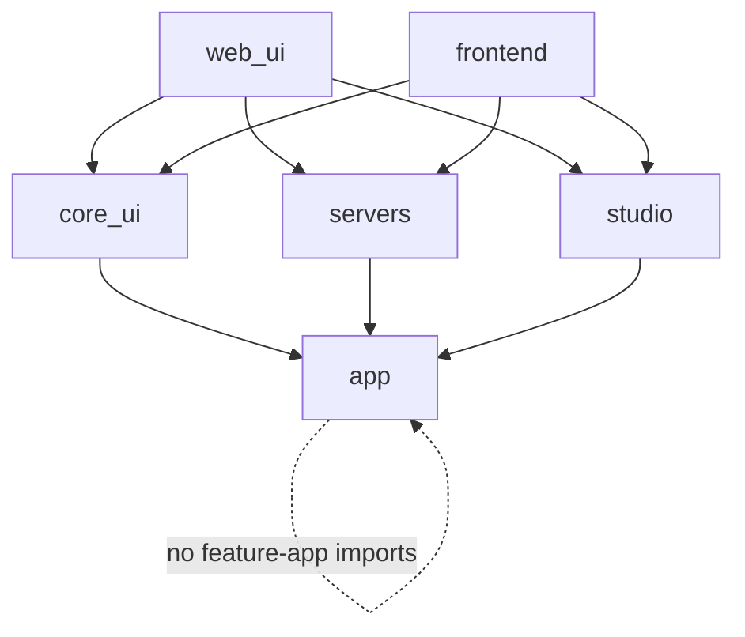

# MARS Architecture Review And Migration Plan

Last reviewed: 2026-06-15

This plan is the current architecture migration map after the MARS refactor work. Older statements about deleted shims or completed splits were rechecked against this checkout.

## Goal

Keep WebTerm modular enough for safe ops automation:

- `core_ui` owns auth, access, settings, admin, and shared UI redirects.
- `servers` owns server inventory, SSH terminal/SFTP/Linux UI, monitoring, alerts, memory, snapshots, and server agents.
- `studio` owns pipelines, triggers, runs, MCP registry, reusable agent configs, skills, templates, and notifications.
- `app` owns shared runtime, LLM, policy, safety, and agent-kernel abstractions.
- `web_ui` wires the Django project, settings, URLs, ASGI/WSGI, Channels, and Celery.
- `frontend` owns the SPA.

## Current Verified Facts

- `servers.mcp_tool_runtime` does not exist.
- `passwords/` does not exist.
- `studio.mcp_tool_runtime` is the concrete MCP runtime owner.
- Server agents depend on `MCPRuntimeProvider`.
- `servers.adapters.memory_store` is the canonical memory store import path.
- Import boundaries pass.
- Architecture size guard currently passes; legacy-large files remain pinned while they shrink.
- MARS CLI subprocess execution supports Windows Selector event loops through `mars/subprocess_compat.py` capture fallback and threaded worker streaming fallback.
- `studio/pipeline_executor.py` remains active production execution logic.
- `studio/executor/` is the target node-registry architecture.

## Target Dependency Direction

Rules:

- `app.core` and `app.agent_kernel` should avoid feature-app dependencies.
- `servers` and `studio` should communicate through explicit app-level ports, services, signals, or API boundaries.
- Cross-context exceptions must be listed in `.importlinter`.
- New files should stay below the architecture standard size limit.

## Current Hotspots

| File/area | Why it matters |
| --- | --- |
| `frontend/src/lib/api.ts` | Large compatibility API surface while domain modules exist. |
| `frontend/src/pages/PipelineEditorPage.tsx` | Large route component with graph/editor/run orchestration. |
| `frontend/src/components/terminal/LinuxUiPanel.tsx` | Large operational UI component. |
| `servers/consumers/ssh_terminal.py` | Smaller than old state but still a large protocol adapter/queue runner. |
| `mars/worker.py` | Current orchestration flow only; process and CLI phase helpers live in `mars/worker_phases.py`. |

## Migration Roadmap

### Phase 0: Keep Green Guardrails

- Run `python scripts/check_architecture_sizes.py --strict-new`.
- Keep import-linter green.

### Phase 1: Keep Studio Executor Thin

- Keep current executable node handlers routed through registry while `studio/pipeline_executor.py` stays below the standard architecture limit.
- Keep compatibility aliases in the executor thin; implementations belong in focused `studio/pipeline_*` modules.
- Keep node-specific execution in `studio/executor/nodes/`.

Acceptance:

- `studio/pipeline_executor.py` stays below the standard architecture limit without re-centralizing node-specific execution logic.
- `tests/test_studio_node_executors.py`, `tests/test_studio_pipeline_v2.py`, and all-node smoke stay green.

### Phase 2: Tighten Execution Policy

- Add one execution policy/audit decision model.
- Apply it to SSH, MCP, files, webhooks, terminal AI, server agents, and pipeline nodes.
- Make redaction mandatory at egress points.

Acceptance:

- Risky operations have consistent plan/approval/apply/verify/audit behavior.

### Phase 3: Capability-Based Server Sharing

- Keep view/connect/execute/file-read/file-write/context/admin capabilities enforced in views, consumers, and tools.
- Add negative tests for shared users when new server operations are introduced.

### Phase 4: Continue Frontend Decomposition

- Finish moving calls out of `frontend/src/lib/api.ts`.
- Extract controller hooks from large route components.
- Keep visual redesign separate from decomposition.

### Phase 5: Production Operability

- Document required worker processes.
- Align `docker-compose.production.yml` and `render.yaml` with background features.
- Add visible worker heartbeat/status where useful.

## Public Interfaces Between Contexts

| Context | Stable interface |
| --- | --- |
| `core_ui` | URL/API endpoints and auth/session/access services. |
| `servers` | `servers/urls.py`, WebSocket consumers, server services, memory adapter. |
| `studio` | `studio/urls.py`, pipeline models, trigger dispatcher, MCP runtime provider. |
| `app` | LLM/runtime/policy/safety abstractions and protocols. |
| `frontend` | API clients under `frontend/src/api/` and route components. |

## Testing Strategy

- Architecture: `python scripts/check_architecture_sizes.py --strict-new`.
- Backend smoke: `python -m pytest tests/test_core_ui_api_smoke.py tests/test_servers_api_smoke.py tests/test_studio_api_smoke.py`.
- Studio runtime: `python -m pytest tests/test_studio_pipeline_v2.py tests/test_studio_node_executors.py tests/test_studio_all_nodes_smoke.py`.
- Frontend: `npm run test`, `npm run build`, and targeted Playwright specs from `frontend/`.

## Definition Of Done

- Architecture guard is green.
- Legacy-large files stop growing.
- Pipeline node behavior is mostly registry-owned.
- Dangerous operations share one policy/audit/redaction contract.
- Server sharing is capability-based.
- Production docs and config identify every required background worker.
