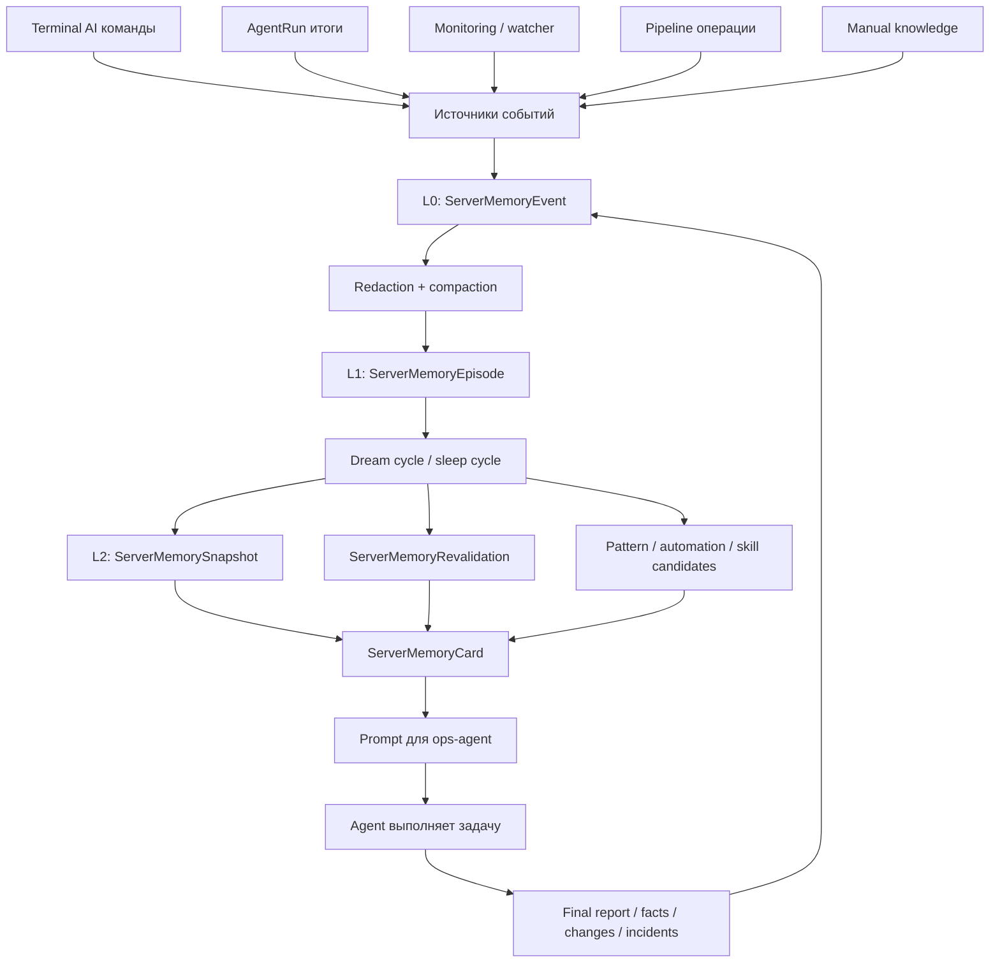
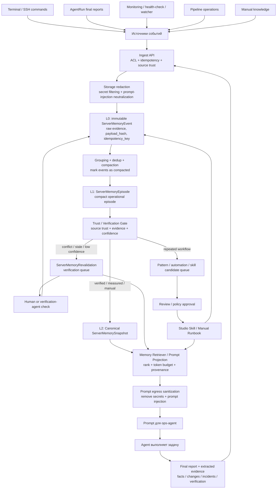

# Отчёт для Codex: проблемы в схеме памяти WebTerm ops-agent

Repo/branch:

```text
https://github.com/LLprod39/WebTerm/tree/test
```

## Кратко

Текущая схема памяти хорошая по идее, но опасная для ops-agent, потому что агент может:

```text
сам написать вывод → этот вывод попадёт в память → потом агент снова получит это в prompt → и начнёт верить собственной ошибке
```

Нужно добавить слой доверия/проверки между `L1 Episode` и `L2 Snapshot`.

Главная цель: **не давать unverified agent/LLM memory становиться canonical memory без evidence/trust gate.**

---

## Текущая схема, которую надо исправить



---

# Главные проблемы

## 1. Нет Trust Gate перед L2

Сейчас `Dream cycle` может превратить episodes/events в canonical snapshots.

Проблема: не всё, что попало в memory events, одинаково достоверно.

Нужно различать:

```text
manual_verified      — подтвердил человек
system_measured      — измерила система, health-check, watcher, monitoring
human_observed       — человек сделал команду/заметку
agent_reported       — агент написал в финальном отчёте
agent_inferred       — агент предположил
llm_distilled        — LLM пересказала/сжала
unverified           — не проверено
stale                — устарело, надо перепроверить
```

`agent_reported`, `agent_inferred`, `llm_distilled`, `unverified` не должны напрямую становиться stable/canonical memory.

---

## 2. Агент может сам себя убедить

Текущий цикл:

```text
Agent final report
  ↓
ServerMemoryEvent
  ↓
Episode
  ↓
Snapshot
  ↓
ServerMemoryCard
  ↓
Prompt
  ↓
Agent
```

Это self-feedback loop.

Нужно сделать так:

```text
Agent final report
  ↓
ServerMemoryEvent
  ↓
Episode
  ↓
Trust / Verification Gate
  ↓
только потом Snapshot
```

---

## 3. `ServerMemoryCard` — это не память, а prompt projection

`ServerMemoryCard` не должен восприниматься как отдельный слой памяти.

Это read-model/retriever, который собирает куски памяти для prompt.

Лучше в схеме назвать его:

```text
Memory Retriever / Prompt Projection
```

Он должен:

```text
выбрать релевантное
обрезать по token budget
показать источник факта
показать confidence
показать last_verified_at
прогнать через prompt sanitizer
```

---

## 4. Automation / skill candidates нельзя напрямую пихать в prompt

`Pattern / automation / skill candidates` — это не готовая память.

Это черновики:

```text
может быть полезный паттерн
может быть automation
может быть skill
```

Они должны идти через review/approval.

Правильный путь:

```text
Pattern candidate
  ↓
Review / policy approval
  ↓
Manual runbook или Studio Skill
  ↓
только потом usable memory / recipes
```

---

## 5. Нет нормальной защиты от дублей

Нужно добавить idempotency на `ServerMemoryEvent`.

Сейчас watcher, monitoring, Celery task, signals и agent events могут случайно записать одно и то же несколько раз.

Добавить в модель:

```python
idempotency_key = models.CharField(max_length=180, blank=True)
payload_hash = models.CharField(max_length=64, blank=True)
```

И constraint:

```python
UniqueConstraint(
    fields=["server", "idempotency_key"],
    condition=~Q(idempotency_key=""),
    name="uniq_server_memory_event_idempotency_key",
)
```

---

## 6. Возможны два активных snapshot на один memory_key

Нужен unique constraint:

```python
UniqueConstraint(
    fields=["server", "memory_key"],
    condition=Q(is_active=True),
    name="uniq_active_memory_snapshot_per_key",
)
```

И желательно per-server lock для dream-cycle, чтобы два dream-cycle не создали две активные версии одновременно.

---

## 7. В prompt теряется provenance

Сейчас агент получает факт примерно так:

```text
nginx падает
```

А должен получать так:

```text
[system_measured][verified][2026-06-29] nginx failed health-check
[agent_inferred][unverified] возможно проблема в конфиге
[manual_verified] nginx работает через reverse proxy
[stale][needs_revalidation] старый docker compose path
```

Нужно, чтобы prompt явно показывал:

```text
source_kind
trust_level
confidence
last_verified_at
source_ref
stale / needs_revalidation
```

---

# Переделанная схема

Новая схема должна быть такой:



---

# Что сделать в коде

## P0 — обязательно

### 1. Добавить trust metadata

В `ServerMemoryEvent`, `ServerMemoryEpisode`, `ServerMemorySnapshot` добавить/использовать поля в metadata:

```python
trust_level: str
verification_status: str
evidence_refs: list[str]
derived_from_event_ids: list[int]
derived_from_episode_ids: list[int]
source_actor_kind: str
source_confidence: float
```

Пример значений:

```python
TRUST_MANUAL_VERIFIED = "manual_verified"
TRUST_SYSTEM_MEASURED = "system_measured"
TRUST_HUMAN_OBSERVED = "human_observed"
TRUST_AGENT_REPORTED = "agent_reported"
TRUST_AGENT_INFERRED = "agent_inferred"
TRUST_LLM_DISTILLED = "llm_distilled"
TRUST_UNVERIFIED = "unverified"
```

---

### 2. Добавить Trust Gate перед `upsert_snapshot`

Перед созданием/обновлением `ServerMemorySnapshot` проверять:

```python
can_promote_to_canonical(candidate) -> bool
```

Пример логики:

```python
def can_promote_to_canonical(candidate):
    trust = candidate.metadata.get("trust_level")
    verification = candidate.metadata.get("verification_status")

    if trust in {"manual_verified", "system_measured"}:
        return True

    if trust == "human_observed" and verification in {"verified", "measured"}:
        return True

    if trust in {"agent_reported", "agent_inferred", "llm_distilled", "unverified"}:
        return False

    return False
```

Если нельзя promote:

```text
создать ServerMemoryRevalidation
или оставить как candidate/unverified snapshot
```

---

### 3. Добавить idempotency для L0

В `ServerMemoryEvent`:

```python
idempotency_key = models.CharField(max_length=180, blank=True)
payload_hash = models.CharField(max_length=64, blank=True)
```

В ingestion:

```python
payload_hash = sha256(normalized_payload).hexdigest()
idempotency_key = f"{server_id}:{source_kind}:{source_ref}:{event_type}:{payload_hash}"
```

Перед create делать get-or-create.

---

### 4. Добавить unique constraint для active snapshots

В `ServerMemorySnapshot`:

```python
UniqueConstraint(
    fields=["server", "memory_key"],
    condition=Q(is_active=True),
    name="uniq_active_server_memory_snapshot",
)
```

---

### 5. В prompt показывать источник факта

В `ServerMemoryCard.as_prompt_block()` или перед ним добавить форматирование:

```text
- [manual_verified][conf=0.92][verified=2026-06-29] ...
- [agent_reported][unverified][conf=0.61] ...
- [stale][needs_revalidation] ...
```

Не давать agent-inferred фактам выглядеть как verified facts.

---

## P1 — важно

### 6. Не отправлять candidates напрямую в prompt

`pattern_candidate`, `automation_candidate`, `skill_draft` должны идти в отдельную очередь review.

Они могут попадать в operational recipes только после:

```text
manual approval
policy approval
promotion to Studio Skill
promotion to ServerKnowledge/manual runbook
```

---

### 7. Исправить `canonical_notes`

Сейчас payload может содержать `canonical_notes`, но ingestion-path должен явно их обработать или удалить.

Нужно выбрать одно:

Вариант A — подключить:

```python
for note in summary.get("canonical_notes", []):
    send_to_trust_gate(note)
```

Вариант B — удалить генерацию `canonical_notes`, если они сейчас не используются.

Лучше вариант A, но только через Trust Gate.

---

### 8. Revalidation не должен auto-resolve как verified

Не закрывать revalidation как `resolved`, если фактической проверки не было.

Добавить статусы:

```text
open
scheduled
verified_true
verified_false
superseded
expired_unverified
ignored_by_human
```

Если прошло 60 дней без проверки:

```text
expired_unverified
```

А не:

```text
resolved
```

---

### 9. Events после compaction надо помечать

Добавить в `ServerMemoryEvent`:

```python
compacted_episode = models.ForeignKey(ServerMemoryEpisode, null=True, blank=True, ...)
compacted_at = models.DateTimeField(null=True, blank=True)
compaction_version = models.IntegerField(default=1)
```

Чтобы один и тот же L0 event не переупаковывался бесконечно.

---

### 10. Не считать unknown success rate как 100%

Если у pattern нет measured exit codes:

```python
success_rate = None
confidence <= 0.55
requires_manual_review = True
```

Не надо считать:

```python
measured_runs == 0 => success_rate = 1.0
```

Это опасно для automation.

---

# Acceptance Criteria

Готово, если:

1. Agent-generated memory не может напрямую стать canonical snapshot без Trust Gate.
2. В prompt виден источник каждого важного факта.
3. `ServerMemoryEvent` не дублируется при повторной доставке Celery/signal.
4. На один `server + memory_key` может быть только один active snapshot.
5. Automation/skill candidates не попадают как verified memory без review.
6. Revalidation не закрывается как resolved без evidence.
7. Prompt проходит egress sanitization перед отправкой агенту.
8. Unknown pattern success не считается 100%.

---

# Самая короткая формулировка задачи

Нужно превратить текущую память из линейного конвейера:

```text
Event -> Episode -> Snapshot -> Prompt -> Agent -> Event
```

в безопасный контур:

```text
Event -> Episode -> Trust Gate -> Snapshot/Retrieval -> Sanitized Prompt -> Agent
```

Главная защита: **агент не должен сам себе создавать “истину” в памяти без проверки.**
